### Introdução
As listas encadeadas (ou linked lists em inglês) são uma estrutura de dados fundamental e versátil
em programação, especialmente útil quando precisamos de uma coleção de elementos que pode crescer
ou diminuir dinamicamente. Diferente dos arrays, que têm tamanho fixo, as listas encadeadas permitem
a alocação dinâmica de memória, o que proporciona flexibilidade ao gerenciar dados em tempo de
execução.

### Por Que Aprender Sobre Listas Encadeadas?
Listas encadeadas são uma das estruturas de dados mais importantes para todo programador
entender. Elas são a base para muitas outras estruturas de dados mais complexas, como pilhas, filas, e
grafos. Além disso, oferecem vantagens significativas em termos de inserção e remoção de elementos
em comparação com arrays, especialmente quando o tamanho da coleção de dados é imprevisível ou
sujeito a mudanças frequentes.

Aprender como funcionam as listas encadeadas e como implementá-las em C é um passo importante
para desenvolver habilidades em manipulação de ponteiros e gerenciamento de memória, habilidades
essenciais para programação de baixo nível.

### O Que Vamos Aprender?
Neste capítulo, vamos explorar os conceitos fundamentais e as várias formas de listas encadeadas.
Abordaremos:

1. Definição e Conceito de Listas Encadeadas: Vamos entender o que é uma lista encadeada,
como ela difere de outras estruturas de dados, e por que seu comportamento dinâmico é tão
poderoso.

2. Tipos de Listas Encadeadas:

- Listas Simplesmente Encadeadas: Onde cada elemento aponta para o próximo, formando
uma sequência linear.
- Listas Duplamente Encadeadas: Onde cada elemento aponta tanto para o próximo
quanto para o anterior, permitindo navegação bidirecional.
- Listas Circulares: Onde o último elemento da lista aponta de volta para o primeiro,
formando um ciclo.

3. Operações Básicas em Listas Encadeadas: Como inserir, remover, pesquisar, e percorrer
elementos em diferentes tipos de listas encadeadas.

4. Implementação de Listas Encadeadas em C: Veremos como implementar cada tipo de lista
encadeada na linguagem C, utilizando estruturas (structs), ponteiros, e alocação dinâmica de
memória.

5. Aplicações Práticas de Listas Encadeadas: Exploraremos onde e como listas encadeadas são
utilizadas no mundo real, desde gerenciamento de memória até a implementação de estruturas de
dados complexas e sistemas de gerenciamento de arquivos.

6. Desafios e Exercícios Práticos: No final do capítulo, você encontrará desafios práticos para
testar sua compreensão e aplicar o que aprendeu em cenários de programação real.

### Preparando-se para Avançar
Antes de avançarmos para a implementação, é fundamental que você esteja confortável com o uso
de ponteiros, alocação dinâmica de memória, e manipulação de structs em C. Essas habilidades serão
essenciais para trabalhar com listas encadeadas, pois cada nó da lista é alocado dinamicamente e
manipulado através de ponteiros.

### Definição e Conceito de Listas Encadeadas
Uma lista encadeada é uma estrutura de dados linear que consiste em uma sequência de elementos
chamados nós. Cada nó contém dois componentes principais: dados (o valor armazenado) e um ponteiro
para o próximo nó na sequência. Diferente dos arrays, onde os elementos são armazenados em blocos de
memória contíguos, os elementos de uma lista encadeada podem estar em qualquer lugar da memória,
ligados entre si por meio de ponteiros. Essa característica torna as listas encadeadas uma escolha ideal
para situações em que a estrutura de dados precisa crescer ou encolher dinamicamente.

### Principais Características das Listas Encadeadas
As listas encadeadas possuem várias características que as tornam úteis em diversas aplicações:

1. Alocação Dinâmica de Memória: Diferente dos arrays, o tamanho de uma lista encadeada
não precisa ser definido antecipadamente. Nós podem ser alocados e desalocados conforme
necessário, permitindo que a lista cresça ou diminua dinamicamente.

2. Inserção e Remoção Eficientes: A inserção e a remoção de elementos em listas encadeadas
são operações eficientes, especialmente no início ou no meio da lista, pois não é necessário deslocar
elementos como em um array.

3. Navegação Sequencial: A lista encadeada é uma estrutura de dados linear, o que significa
que os elementos devem ser percorridos sequencialmente, do início ao fim, para acessar um nó
específico. Isso pode resultar em desempenho inferior quando comparado a estruturas como
arrays para operações de busca.

4. Flexibilidade no Tipo de Dados: Cada nó pode conter qualquer tipo de dado, e a estrutura
da lista pode ser personalizada para armazenar múltiplos tipos de dados ou estruturas de dados
mais complexas.

### Tipos de Listas Encadeadas
Existem várias variantes de listas encadeadas, cada uma com suas características específicas e casos
de uso:
- Listas Simplesmente Encadeadas: A forma mais básica de lista encadeada, onde cada
nó aponta apenas para o próximo nó na sequência. Esta variante permite uma navegação
unidirecional da cabeça até o final da lista.
- Listas Duplamente Encadeadas: Aqui, cada nó possui dois ponteiros — um para o próximo
nó e outro para o nó anterior. Isso permite navegação bidirecional, facilitando operações que
requerem percorrer a lista em ambas as direções.
- Listas Circulares: Uma variação de lista encadeada onde o último nó aponta de volta para o
primeiro nó, formando um ciclo. Essa configuração é útil em sistemas que requerem navegação
cíclica contínua.

### Como Funciona uma Lista Encadeada?
Vamos considerar um exemplo simples de uma lista encadeada para entender melhor seu funciona-
mento. Suponha que queremos criar uma lista simplesmente encadeada para armazenar os números 10,
20, 30 e 40. Cada nó da lista terá um campo de dados para armazenar o valor e um ponteiro para o
próximo nó.


Neste exemplo, a lista encadeada começa com o nó 10, que aponta para o nó 20, que por sua vez
aponta para o nó 30, e assim por diante. O último nó aponta para NULL, indicando o fim da lista. A
cabeça (head) da lista aponta para o primeiro nó, opcionalmente também podemos manter um ponteiro
para a cauda (tail) para facilitar a inserção no final da lista.

Agora, vamos ver o mesmo exemplo utilizando uma lista duplamente encadeada:


Neste caso, cada nó possui um ponteiro adicional para o nó anterior, permitindo a navegação
bidirecional. Isso facilita operações como remoção de elementos e percorrer a lista em ambas as direções.

Finalmente, vamos ver um exemplo de lista circular, onde o último nó aponta de volta para o
primeiro:

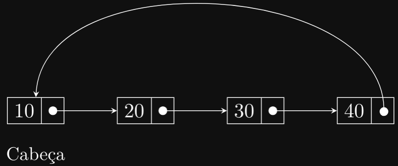

Neste exemplo, o último nó (40) aponta de volta para o primeiro nó (10), formando um ciclo
contínuo. Isso pode ser útil em situações onde a lista precisa ser percorrida repetidamente em um loop
infinito.

### Aplicações de Listas Encadeadas
As listas encadeadas são amplamente utilizadas em diversas aplicações de software, incluindo:

- Gerenciamento de Memória: Muitos sistemas operacionais e linguagens de programação
utilizam listas encadeadas para gerenciar alocações e desalocações de memória dinâmica.
- Implementação de Estruturas de Dados: Pilhas, filas, árvores, e grafos são frequentemente
implementados usando listas encadeadas devido à sua flexibilidade e eficiência.
- Sistemas de Arquivos: Listas encadeadas são usadas em sistemas de arquivos para manter a
estrutura de diretórios e arquivos, permitindo operações como adicionar, remover e renomear
arquivos.
- Aplicações Gráficas: Em aplicações gráficas, listas encadeadas são usadas para representar
objetos conectados, como vértices em um grafo ou segmentos em uma linha.
- Histórico de Comandos: Editores de texto e programas de linha de comando frequentemente
usam listas encadeadas para manter o histórico de comandos e permitir operações de desfazer e
refazer.

### Vantagens e Desvantagens das Listas Encadeadas
As listas encadeadas têm várias vantagens e desvantagens em comparação com outras estruturas de
dados, como arrays:

#### Vantagens:
- Inserção e Remoção Eficientes: Adicionar ou remover elementos em uma lista encadeada
é uma operação eficiente, especialmente no início ou no meio da lista.
- Alocação Dinâmica de Memória: O tamanho da lista pode crescer ou diminuir dinami-
camente, sem a necessidade de definir um tamanho fixo antecipadamente.
- Flexibilidade no Tamanho dos Dados: Cada nó pode armazenar diferentes tipos de
dados, permitindo a criação de estruturas de dados complexas.

#### Desvantagens:
- Navegação Sequencial: A busca por um elemento específico em uma lista encadeada
requer percorrer a lista sequencialmente, o que pode ser menos eficiente do que em arrays.
- Uso de Mais Memória: Cada nó em uma lista encadeada requer espaço adicional para
armazenar o ponteiro para o próximo nó, o que pode aumentar o uso de memória em
comparação com arrays.
- Manipulação de ponteiros: Trabalhar com ponteiros e alocação dinâmica de memória
pode ser mais complexo e propenso a erros do que o uso de arrays.

### Implementação de Listas Encadeadas em C
Agora que entendemos os conceitos básicos das listas encadeadas, vamos ver como implementá-las
em C. Vamos começar com a implementação de uma lista simplesmente encadeada, que é a forma mais
básica de lista encadeada.

### Estrutura de um Nó em uma Lista Encadeada
Cada nó em uma lista encadeada contém dois componentes principais: um campo de dados para
armazenar o valor do nó e um ponteiro para o próximo nó na sequência. Em C, podemos representar
um nó usando uma estrutura (struct) que contém esses dois campos:

```c
typedef struct Node {
    int data; // Dados do nó
    struct Node *next; // Ponteiro para o próximo nó
} Node;
```

Nesta estrutura, data armazena o valor do nó e next é um ponteiro para o próximo nó na sequência.
O tipo struct Node* é um ponteiro para uma estrutura Node, permitindo que cada nó aponte para o
próximo nó na lista.

Na memória teríamos algo assim:

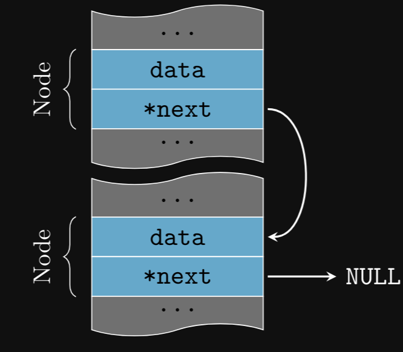

Perceba que os nós estão em partes diferentes da memória, mas o ponteiro next permite que eles
sejam acessados sequencialmente.

No caso de uma lista duplamente encadeada, cada nó teria um ponteiro adicional para o nó anterior:

```c
typedef struct Node {
    int data; // Dados do nó
    struct Node *next; // Ponteiro para o próximo nó
    struct Node *prev; // Ponteiro para o nó anterior
} Node;
```

Neste caso, prev é um ponteiro para o nó anterior na sequência. Isso permite percorrer a lista em
ambas as direções, facilitando a remoção de elementos.

Na memória teríamos algo assim:

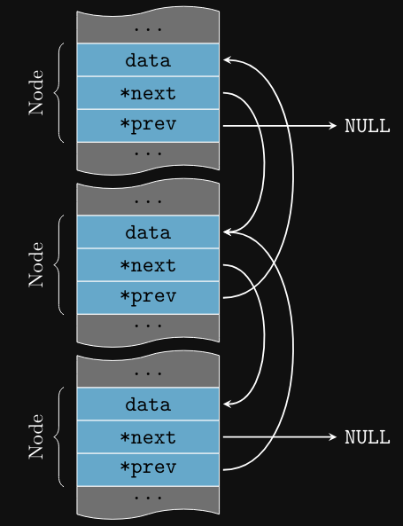

### Criando um Nó

Para criar um dos nós que vimos acima, temos duas formas de fazer isso. A primeira é cria-lo no
stack, ou seja, na pilha:

```c
Node node;
node.data = 42;
node.next = NULL;
```

Podemos simplificar a criação de um nó com uma função que inicializa os campos de dados e
ponteiros:

```c
void createNode(Node *node, int data) {
    node->data = data;
    node->next = NULL;
}

Node node;
createNode(&node, 42);
```

A função createNode recebe um ponteiro para um nó e um valor de dados, e inicializa os campos
de dados e ponteiros do nó.

A segunda forma de criar um nó é alocando memória dinamicamente:

```c
Node *node = malloc(sizeof(Node));
node->data = 42;
node->next = NULL;
```

Neste caso, a função malloc aloca memória para um nó na heap e retorna um ponteiro para o nó
alocado. O nó é inicializado com os campos de dados e ponteiros apropriados.

Da mesma forma, podemos criar uma função para alocar memória para um nó e inicializar seus
campos:

```c
Node* createNode(int data) {
    Node *node = malloc(sizeof(Node));
    node->data = data;
    node->next = NULL;
    return node;
}
Node *node = createNode(42);
```

A função createNode aloca memória para um nó, atribui o valor data ao campo de dados, e
inicializa o ponteiro next para NULL. Em seguida, retorna um ponteiro para o nó alocado.

É importante lembrar que sempre que alocamos memória dinamicamente, devemos liberá-la quando
não for mais necessária para evitar vazamentos de memória:

```c
Node *node = createNode(42);
// Faz algo com o nó
free(node);
```

### Estrutura de uma Lista Encadeada
Para criar uma lista encadeada, precisamos de um ponteiro para o primeiro nó da lista, chamado
de cabeça (head). Inicialmente, a cabeça aponta para NULL, indicando que a lista está vazia. Podemos
simplesmente definir a cabeça como um ponteiro para a estrutura Node:

```c
Node *head = NULL;
```

A variável head é um ponteiro para o primeiro nó da lista. Inicialmente, a cabeça aponta para NULL,
indicando que a lista está vazia. Depois de criar a cabeça, podemos adicionar nós à lista conforme
necessário.

Também podemos definir uma estrutura de uma lista encadeada como:

```c
typedef struct {
    Node *head; // Ponteiro para o primeiro nó
} LinkedList;
```

A estrutura LinkedList contém um ponteiro para o primeiro nó da lista. Inicialmente, a cabeça
aponta para NULL, indicando que a lista está vazia:

```c
LinkedList list;
list.head = NULL;
```

Se tivéssemos uma lista com vários nós, a memória seria algo assim:

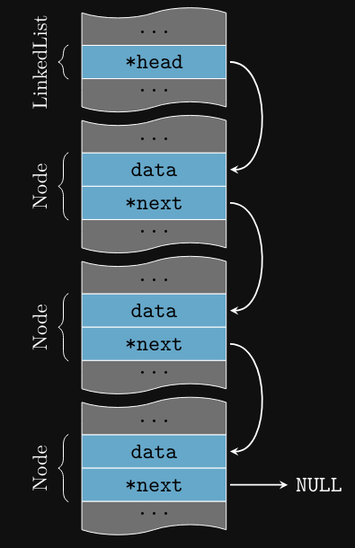

opcionalmente, podemos adicionar um ponteiro para o último nó da lista (cauda) para facilitar a
inserção no final da lista:

```c
typedef struct {
    Node* head; // Ponteiro para o primeiro nó
    Node* tail; // Ponteiro para o último nó
} LinkedList;
```

A cauda (tail) da lista aponta para o último nó, permitindo inserções eficientes no final da lista.

Na memória teríamos algo assim:

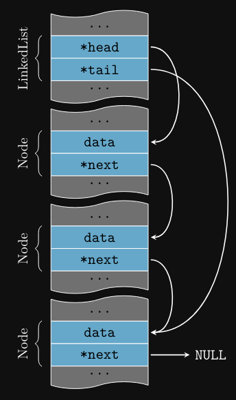

### Criando uma Lista Encadeada
Na hora de criar uma lista encadeada, é importante inicializar a cabeça e a cauda com NULL para
indicar que a lista está vazia, logo, podemos criar uma função para isso:

```c
void createLinkedList(LinkedList *list) {
    list->head = NULL;
    list->tail = NULL;
}
```

A função pode ser chamada da seguinte forma:

```c
int main() {
    LinkedList list;
    createLinkedList(&list);
    return 0;
}
```

Se preferir, podemos alocar memória dinamicamente para a lista:

```c
LinkedList *createLinkedList() {
    LinkedList *list = malloc(sizeof(LinkedList));
    list->head = NULL;
    list->tail = NULL;
    return list;
}
```

A função pode ser chamada da seguinte forma:

```c
int main() {
    LinkedList *list = createLinkedList();
    free(list);
    return 0;
}
```

### Inserindo Elementos em uma Lista Encadeada
Para todos os exemplos a seguir, vamos considerar uma lista simplesmente encadeada com apenas
a cabeça (head) da lista. As operações de inserção, remoção, e pesquisa podem ser adaptadas para
listas duplamente encadeadas ou circulares conforme necessário.

#### Inserindo no Início da Lista
Para inserir um novo elemento em uma lista encadeada, precisamos alocar um novo nó, atribuir o
valor ao campo de dados, e ajustar os ponteiros para manter a sequência correta. Vamos ver como
inserir um novo nó no início da lista:

```c
void insertAtBeginning(LinkedList* list, int data) {
    // Cria um novo nó
    Node *newNode = createNode(data);
    // O novo nó aponta para o nó atual da cabeça
    newNode->next = list->head;
    // Atualiza a cabeça para apontar para o novo nó
    list->head = newNode;
}
```

A função insertAtBeginning aloca um novo nó, atribui o valor data ao campo de dados, e ajusta
o ponteiro next para apontar para o nó atual da cabeça. Em seguida, atualiza a cabeça para apontar
para o novo nó, inserindo-o no início da lista. Vamos ver como isso funciona em um exemplo:

```c
LinkedList* list = createList();
insertAtBeginning(list, 10);
insertAtBeginning(list, 20);
insertAtBeginning(list, 30);
```

Depois de executar o código acima, a lista terá os seguintes elementos:


Perceba que a ordem dos elementos é inversa à ordem de inserção, pois inserimos os elementos no
início da lista. Vamos ver passo a passo como essa operação é realizada, mas dessa vez do ponto de
vista da memória:

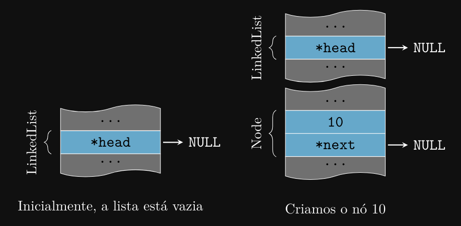

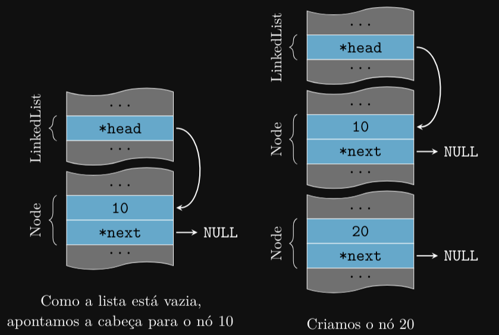

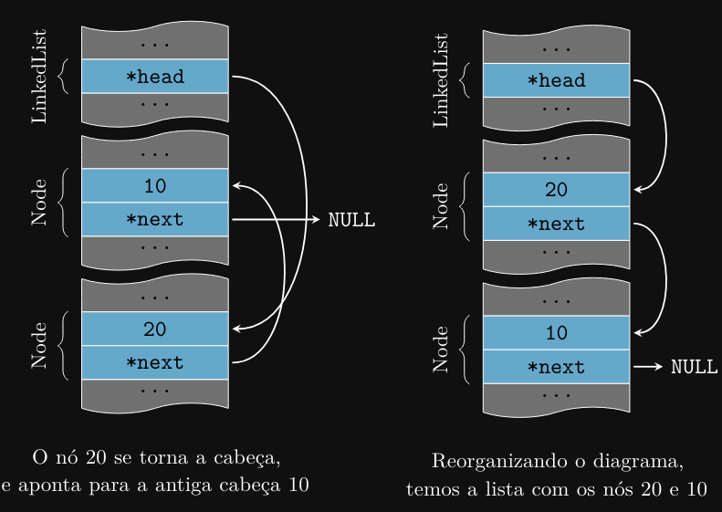

Podemos repetir o processo para adicionar o elemento 30 à lista. O resultado final será o seguinte:

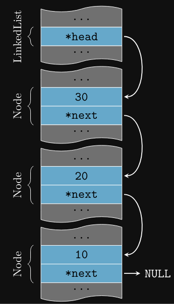

### Inserindo no Final da Lista
Para inserir um novo nó no final da lista, podemos fazer o seguinte:

```c
void insertAtEnd(LinkedList* list, int data) {
    // Cria um novo nó
    Node *newNode = createNode(data);
    // Se a lista estiver vazia, o novo nó será a cabeça
    if (list->head == NULL) {
        list->head = newNode;
    } else {
            // Começa a percorrer a lista a partir da cabeça
            Node *current = list->head;
            // Se o próximo nó for NULL, chegamos ao final da lista
            while (current->next != NULL) {
                current = current->next;
            }
            // Insere o novo nó no final
            current->next = newNode;
        }
}
```

Neste caso, percorremos a lista até o último nó (onde next é NULL) e inserimos o novo nó no final.
Vamos ver um exemplo:

```c
LinkedList* list = createList();
insertAtEnd(list, 10);
insertAtEnd(list, 20);
insertAtEnd(list, 30);
```

Depois de executar o código acima, a lista terá os seguintes elementos:


Perceba que a ordem dos elementos é a mesma da ordem de inserção, pois inserimos os elementos
no final da lista. Vamos ver passo a passo como a lista é construída, mas dessa vez do ponto de vista
da memória:

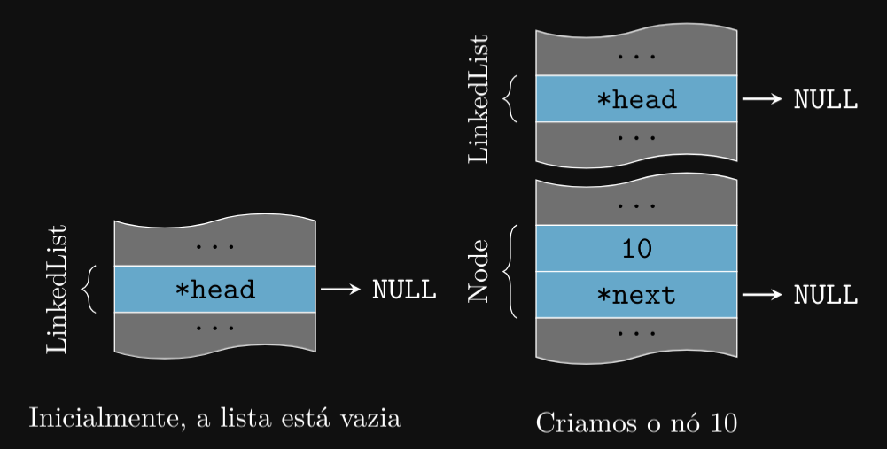

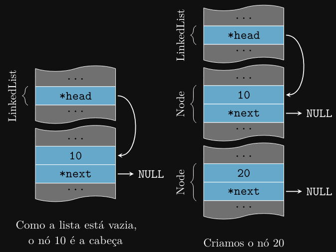

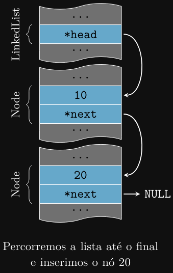

Podemos repetir o processo para inserir o nó 30 no final da lista. O resultado final será:

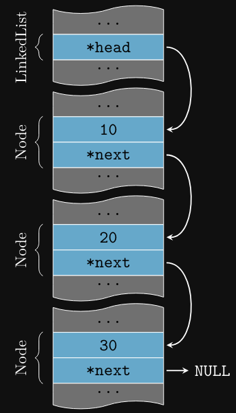

### Removendo Elementos de uma Lista Encadeada
Para remover um elemento de uma lista encadeada, precisamos ajustar os ponteiros para manter a
sequência correta. Vamos ver como remover o primeiro nó da lista:

```c
void removeFromBeginning(LinkedList* list) {
    if (list->head != NULL) {
        Node* temp = list->head;
        list->head = list->head->next;
        free(temp);
    }
}
```

A função removeFromBeginning verifica se a lista não está vazia, armazena o nó atual da cabeça
em temp, atualiza a cabeça para apontar para o próximo nó, e libera a memória alocada para o nó
removido.

Para remover o último nó da lista, podemos fazer o seguinte:

```c
void removeFromEnd(LinkedList* list) {
    // Verifica se a lista não está vazia
    if (list->head != NULL) {
        // Começa pelo primeiro nó
        Node* current = list->head;
        Node* prev = NULL;
        
        // Percorre a lista até o penúltimo nó
        while (current->next != NULL) {
            // Salva o nó atual e avança para o próximo
            prev = current;
            current = current->next;
        }

        if (prev == NULL) { // Se houver apenas um nó na lista
            list->head = NULL;
        } else { // Se houver mais de um nó
            prev->next = NULL;
        }

        // Libera a memória alocada para o último nó
        free(current);
    }
}
```

Neste caso, percorremos a lista até o penúltimo nó, atualizamos o ponteiro next para NULL, e
liberamos a memória alocada para o último nó.

### Pesquisando Elementos em uma Lista Encadeada
Para pesquisar um elemento em uma lista encadeada, precisamos percorrer a lista sequencialmente
até encontrar o valor desejado. Vamos ver como pesquisar um elemento na lista:

```c
Node* search(LinkedList* list, int data) {
    // Começa pelo primeiro nó
    Node* current = list->head;
    
    // Percorre a lista até encontrar o valor
    while (current != NULL) {
        // Se o valor for encontrado, retorna o nó
        if (current->data == data) {
        return current;
    }
    // Avança para o próximo nó
    current = current->next;
    }
    
    // Se o valor não for encontrado, retorna NULL
    return NULL;
}
```

A função search percorre a lista sequencialmente até encontrar um nó com o valor data. Se o nó
for encontrado, a função retorna um ponteiro para o nó; caso contrário, retorna NULL.

### Liberando Memória de uma Lista Encadeada
Para liberar a memória alocada para todos os nós de uma lista encadeada, podemos percorrer a
lista e liberar cada nó individualmente:

```c
void freeLinkedList(LinkedList* list) {
    // Começa pelo primeiro nó
    Node* current = list->head;
    Node* next;
    
    // Percorre a lista e libera cada nó
    while (current != NULL) {
        // Salva o próximo nó
        next = current->next;
        // Libera o nó atual
        free(current);
        // Avança para o próximo nó
        current = next;
    }
    
    // Atualiza a cabeça para NULL (lista vazia)
    list->head = NULL;
}
```
