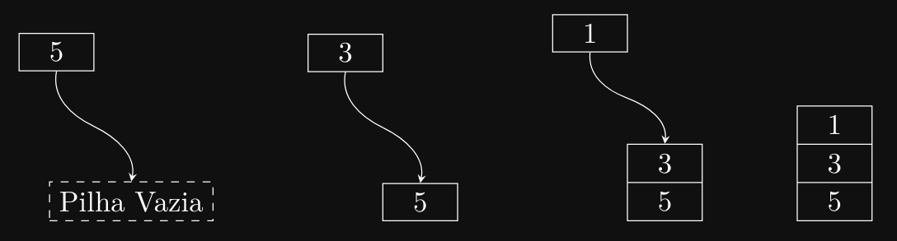
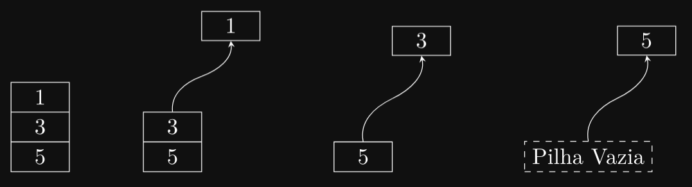
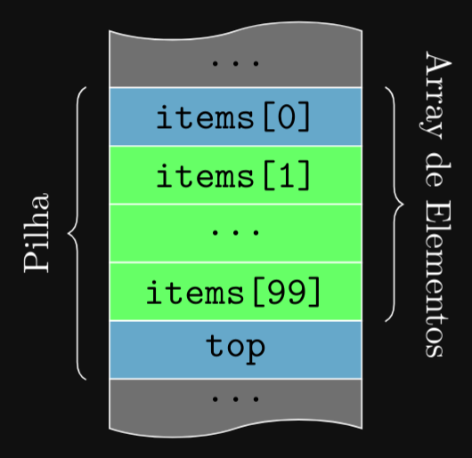
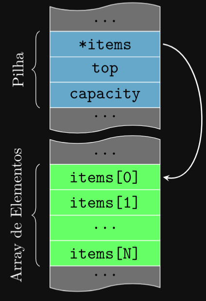
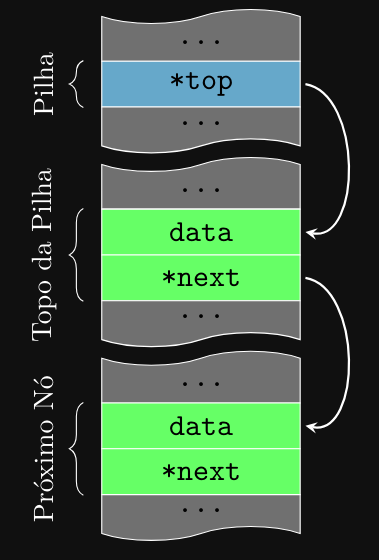

### Introdução
As pilhas (ou stacks em inglês) são uma das estruturas de dados mais fundamentais e amplamente
utilizadas em programação. Elas seguem o princípio LIFO (Last In, First Out), ou seja, o último
elemento que entra é o primeiro a sair. Pense em uma pilha de pratos: você empilha um prato sobre
o outro e, quando precisa de um, remove o que está no topo. Esse conceito simples tem aplicações
poderosas em várias áreas da ciência da computação e da engenharia de software.

### Por Que Aprender Sobre Pilhas?
Pilhas são frequentemente usadas em diversas situações, desde a avaliação de expressões matemáticas
e a navegação pelo histórico do navegador até a execução de algoritmos de recursão e a resolução de
problemas envolvendo chamadas de função. Compreender como funcionam as pilhas e como implementá-
las na linguagem C permitirá que você manipule dados de maneira eficiente e crie algoritmos mais
poderosos.

### O Que Vamos Aprender?
Neste capítulo, exploraremos os seguintes tópicos sobre pilhas:

1. Definição e Conceito de Pilhas: Entenderemos o que é uma pilha e como funciona o princípio
LIFO.

2. Operações Básicas em Pilhas: Aprenderemos sobre as operações fundamentais de uma pilha
— push (inserir um elemento), pop (remover um elemento), peek (visualizar o elemento do topo)
e isEmpty (verificar se a pilha está vazia).

3. Implementação de Pilhas em C: Veremos como implementar uma pilha em C usando arrays
(pilhas estáticas) e ponteiros (pilhas dinâmicas). Analisaremos as vantagens e desvantagens de
cada abordagem.

4. Aplicações Práticas de Pilhas: Exploraremos algumas das muitas aplicações de pilhas no
mundo real, como a verificação de expressões balanceadas (parênteses), a conversão de notações
infixas para pós-fixas, e o controle de chamadas de função.

5. Desafios e Exercícios Práticos: Para consolidar seu aprendizado, apresentaremos exercícios
práticos que desafiarão sua compreensão e ajudarão a reforçar os conceitos aprendidos.

### Preparando-se para Avançar
Antes de começarmos a implementar pilhas em C, é importante que você revise os conceitos de
ponteiros e alocação dinâmica de memória, pois eles desempenham um papel crucial nas implementações
dinâmicas. Além disso, entender como manipular arrays será útil para a implementação de pilhas
estáticas.

### Definição e Conceito de Pilhas
Uma pilha é uma estrutura de dados linear que segue o princípio LIFO (Last In, First Out), que
significa “Último a Entrar, Primeiro a Sair”. Em uma pilha, os elementos são inseridos e removidos
apenas no topo, de forma que o último elemento inserido é o primeiro a ser removido. Imagine uma
pilha de livros: você só pode adicionar ou remover livros do topo da pilha. Esse comportamento simples
é o que define o funcionamento de uma pilha.

### Principais Características de uma Pilha
As pilhas possuem algumas características que as diferenciam de outras estruturas de dados:

1. Acesso Restrito: O acesso aos elementos de uma pilha é restrito ao último elemento inserido (o
topo da pilha). Diferente de arrays ou listas, não é possível acessar elementos diretamente no
meio da estrutura.

2. Operações Limitadas: As pilhas suportam um conjunto limitado de operações, que garantem
seu comportamento LIFO. As operações principais são:

- Push: Adiciona um elemento ao topo da pilha.
- Pop: Remove e retorna o elemento do topo da pilha.
- Peek: Retorna o elemento do topo da pilha sem removê-lo.
- isEmpty: Verifica se a pilha está vazia.

3. Uso de Memória: Pilhas podem ser implementadas usando arrays ou listas encadeadas. A
escolha da implementação afeta o uso de memória e a complexidade das operações.

### Como Funciona uma Pilha?
Para entender melhor o funcionamento de uma pilha, vamos considerar um exemplo prático.
Suponha que você deseja empilhar (push) e desempilhar (pop) uma sequência de números. Suponhamos
que você tenha uma pilha vazia na qual você deseja inserir os números 5, 3 e 1, nessa ordem. Podemos
visualizar esse processo da seguinte maneira:



Como você pode ver, apesar de inserirmos os números 5, 3 e 1 nessa ordem, eles são empilhados de
forma inversa. O número 1, que foi o último a ser inserido, está no topo da pilha, enquanto o número
5, que foi o primeiro a ser inserido, está na base da pilha. Quando desempilhamos os elementos, o
número 1 é o primeiro a ser removido, seguido pelo 3 e, por fim, o 5.



### Aplicações de Pilhas
Pilhas são amplamente utilizadas em várias aplicações computacionais devido à sua natureza simples
e eficiente:

- Navegadores Web: Armazenam o histórico de navegação. Cada nova página visitada é
empilhada, e o botão “voltar” realiza uma operação pop.
- Desfazer/Refazer em Editores de Texto: Ações do usuário são empilhadas para permitir
desfazer (pop) ou refazer ações (push).
- Avaliação de Expressões Matemáticas: Pilhas são usadas na conversão e avaliação de
expressões em diferentes notações.
- Chamada de Funções e Recursão: A pilha de chamadas de função do sistema gerencia a
execução de funções e a memória associada às chamadas aninhadas.

### Vantagens e Desvantagens das Pilhas
#### Vantagens:

- Estrutura simples e fácil de implementar.
- Operações de inserção e remoção eficientes.
- Ótima para resolver problemas que requerem um histórico ou uma ordem específica de
execução.

### Desvantagens:
- Acesso limitado aos elementos (apenas o topo).
- Tamanho fixo em pilhas estáticas.
- Potenciais problemas de overflow (quando uma estrutura de dados está cheia 
e tentamos adicionar um novo elemento) e underflow quando uma estrutura de 
dados está vazia e tentamos remover um elemento), especialmente em 
implementações estáticas.

### Implementação de Pilhas em C
Agora que entendemos o conceito de pilhas e como elas funcionam, vamos aprender como implementá-
las em C. Existem duas abordagens principais para implementar pilhas: usando arrays e usando
ponteiros. Cada abordagem tem suas vantagens e desvantagens, e a escolha depende do problema que
você está tentando resolver.

### Pilhas Estáticas Usando Arrays
Pilhas estáticas são implementadas usando arrays de tamanho fixo. A principal vantagem das
pilhas estáticas é a simplicidade de implementação e a eficiência de acesso aos elementos. No entanto,
a desvantagem é que o tamanho da pilha é limitado e não pode ser alterado dinamicamente.

### Estrutura de Dados
Para implementar uma pilha estática em C, precisamos definir uma estrutura de dados que represente
a pilha. A estrutura de dados básica de uma pilha estática inclui:

- Um array para armazenar os elementos da pilha.
- Um índice que aponta para o topo da pilha.
- Um tamanho máximo que define o número máximo de elementos que a pilha pode conter.

Aqui está a definição da estrutura de dados de uma pilha estática em C:

```c
#define MAX_SIZE 100 // Tamanho máximo da pilha
    typedef struct {
    int items[MAX_SIZE];
    // Array para armazenar os elementos
    int top;
    // Índice do topo da pilha, sempre aponta para o próximo espaço vazio
} Stack;
```

Agora, vamos implementar uma função para inicializar a pilha:

```c
void initStack(Stack *stack) {
    stack->top = 0;
    // Inicializa o topo da pilha
}
```

Vamos ver como essa função funciona:

```c
int main() {
    Stack stack;
    // Declara uma pilha
    initStack(&stack); // Inicializa a pilha
    return 0;
}
```

Primeiro, declaramos uma variável stack do tipo Stack para representar a pilha. Em seguida,
chamamos a função initStack passando o endereço da pilha como argumento. A função initStack
define o topo da pilha como 0, indicando que a pilha está vazia. Na memória, essa pilha estática é
representada da seguinte forma:



### Pilhas Dinâmicas Usando Arrays
Pilhas dinâmicas são implementadas usando arrays de tamanho variável. A principal vantagem das
pilhas dinâmicas é a capacidade de aumentar ou diminuir o tamanho da pilha conforme necessário. No
entanto, a desvantagem é que a alocação e liberação de memória dinâmica podem ser mais complexas
e propensas a erros.

### Estrutura de Dados
Para implementar uma pilha dinâmica em C, precisamos definir uma estrutura de dados que
represente a pilha. A estrutura de dados básica de uma pilha dinâmica inclui:

- Um ponteiro para um array que armazena os elementos da pilha.
- Um índice que aponta para o topo da pilha.
- Um tamanho máximo que define o número máximo de elementos que a pilha pode conter.

Aqui está a definição da estrutura de dados de uma pilha dinâmica em C:

```c
typedef struct {
    int *items;
    // Ponteiro para o array de elementos
    int top;
    // Índice do topo da pilha
    int capacity; // Tamanho máximo da pilha
} Stack;
```

Agora, vamos implementar uma função para inicializar a pilha dinâmica:

```c
void initStack(Stack *stack, int capacity) {
    stack->items = (int *)malloc(capacity * sizeof(int));
    // Aloca memória para o array
    stack->top = 0;
    // Inicializa o topo da pilha
    stack->capacity = capacity;
    // Define o tamanho máximo da pilha
}
```

Como temos que alocar memória dinamicamente, é importante liberar a memória quando a pilha
não for mais necessária. Vamos implementar uma função para liberar a memória alocada:

```c
void freeStack(Stack *stack) {
    free(stack->items);
    // Libera a memória alocada para o array
}
```

Vamos ver como essas funções funcionam:

```c
int main() {
    Stack stack;
    // Declara uma pilha
    initStack(&stack, 100); // Inicializa a pilha com capacidade de 100 elementos
    freeStack(&stack);
    // Libera a memória alocada para a pilha
    return 0;
}
```

Primeiro, declaramos uma variável stack do tipo Stack para representar a pilha. Em seguida,
chamamos a função initStack passando o endereço da pilha e a capacidade como argumentos. A
função initStack aloca memória para o array de elementos, inicializa o topo da pilha e define o
tamanho máximo da pilha. Por fim, chamamos a função freeStack para liberar a memória alocada
para a pilha. Na memória, essa pilha dinâmica é representada da seguinte forma:



Perceba que, diferentemente da pilha estática, o array de elementos está localizado em uma região
de memória separada e é acessado por meio de um ponteiro. Isso permite que a pilha aumente ou
diminua de tamanho conforme necessário.

### Operações Básicas
Agora, vamos implementar as operações básicas de uma pilha: push, pop, peek e isEmpty. Os
exemplos a seguir mostram como realizar cada uma dessas operações em uma pilha dinâmica usando
arrays.

### Adicionando um Elemento (push)
A operação push adiciona um elemento ao topo da pilha. Isso envolve:

1. Verifica se a pilha está cheia.

2. Adiciona o elemento ao array na posição do topo.

3. Incrementa o índice do topo.

```c
void push(Stack *stack, int data) {
    if (stack->top == stack->capacity) {
        // Tratar erro: pilha cheia (overflow)
        return;
    }

    stack->items[stack->top] = data; // Adiciona o elemento
    stack->top++;
    // Incrementa o topo
}
```

### Verificando se a Pilha está Vazia (isEmpty)
Antes de remover ou espiar elementos, precisamos de uma função para verificar se a pilha está vazia.
Ela retorna true (ou 1) se o topo for 0.

```c
int isEmpty(Stack *stack) {
    return stack->top == 0;
}
```

### Removendo um Elemento (pop)
A operação pop remove o elemento do topo da pilha e retorna seu valor.

1. Verifica se a pilha está vazia.
2. Decrementa o índice do topo.
3. Retorna o elemento na nova posição do topo.

```c
int pop(Stack *stack) {
    if (isEmpty(stack)) {
        // Tratar erro: pilha vazia (underflow)
        return -1;
        // Exemplo de valor de erro
    }

    stack->top--;
    // Decrementa o topo
    return stack->items[stack->top]; // Retorna o elemento
}
```

### Espiando o Elemento do Topo (peek)
A operação peek (ou top) retorna o valor do elemento no topo da pilha sem removê-lo.

```c
int peek(Stack *stack) {
    if (isEmpty(stack)) {
        // Tratar erro: pilha vazia
        return -1;
        // Exemplo de valor de erro
    }

    return stack->items[stack->top - 1];
    // Retorna o elemento do topo
}
```

### Pilhas Dinâmicas Usando Ponteiros
Pilhas dinâmicas também podem ser implementadas usando ponteiros para nós encadeados. A
principal vantagem das pilhas dinâmicas com nós encadeados é a capacidade de aumentar ou diminuir
o tamanho da pilha dinamicamente sem a necessidade de realocação de memória. No entanto, a
desvantagem é que a implementação pode ser mais complexa e requer mais memória devido aos
ponteiros adicionais.

### Estrutura de Dados
Para implementar uma pilha dinâmica usando ponteiros, definimos primeiro a estrutura de um
Node (Nó), de forma muito similar à que usamos em listas encadeadas. Cada nó armazenará o dado e
um ponteiro para o próximo nó (que, neste caso, é o nó abaixo dele na pilha).

```c
typedef struct Node {
    int data;
    struct Node *next;
} Node;
```

Em seguida, definimos a estrutura da Stack (Pilha), que conterá apenas um ponteiro para o top
(topo) da pilha.

```c
typedef struct {
    Node *top;
} Stack;
```

Agora, vamos implementar uma função para inicializar a pilha dinâmica usando ponteiros. A função
de inicialização simplesmente define o topo da pilha como NULL, indicando que a pilha está vazia.

```c
void initStack(Stack *stack) {
    stack->top = NULL;
}
```

Quando a pilha não é mais necessária, devemos liberar toda a memória alocada dinamicamente
para evitar vazamentos de memória. Fazemos isso percorrendo a pilha e liberando cada nó, de forma
idêntica à liberação de uma lista encadeada.

```c
void freeStack(Stack *stack) {
    Node *current = stack->top;
    Node *next;
    while (current != NULL) {
        // Salva o próximo nó
        next = current->next;
        // Libera o nó atual
        free(current);
        // Avança para o próximo nó
        current = next;
    }
    
    // Atualiza o topo para NULL
    stack->top = NULL;
}
```

Na memória, essa pilha dinâmica usando ponteiros é representada da seguinte forma:



Perceba que o ponteiro top na estrutura Stack aponta para o nó no topo da pilha. Cada nó contém
um dado e um ponteiro para o próximo nó na pilha. E que o nó no topo da pilha aponta para o nó
abaixo dele, formando uma cadeia de nós que representam a pilha. Cada nó é alocado dinamicamente
quando um novo elemento é adicionado à pilha. Cada nó ocupa uma região separada de memória, e o
ponteiro next em cada nó aponta para o próximo nó na pilha.
Operações Básicas

Agora, vamos implementar as operações básicas de uma pilha: push, pop, peek e isEmpty. Os
exemplos a seguir mostram como realizar cada uma dessas operações em uma pilha dinâmica usando
ponteiros.

### Adicionando um Elemento (push)
A operação push adiciona um elemento ao topo da pilha. Isso envolve:

1. Alocar memória para um novo nó.

2. Atribuir o dado ao novo nó.

3. Fazer o ponteiro next do novo nó apontar para o top atual da pilha.

4. Atualizar o top da pilha para ser o novo nó.

```c
void push(Stack *stack, int data) {
    Node *newNode = (Node *)malloc(sizeof(Node));
    if (newNode == NULL) {
        return;
    }
    
    newNode->data = data;
    newNode->next = stack->top;
    stack->top = newNode;
}
```

### Verificando se a Pilha está Vazia (isEmpty)
Antes de remover ou espiar elementos, precisamos de uma função para verificar se a pilha está vazia.

Ela retorna true (ou 1) se o top for NULL.

```c
int isEmpty(Stack *stack) {
    return stack->top == NULL;
}
```

### Removendo um Elemento (pop)
A operação pop remove o elemento do topo da pilha e retorna seu valor.

1. Verifica se a pilha está vazia.

2. Armazena o nó do topo em um ponteiro temporário.

3. Armazena o dado do nó a ser removido.

4. Atualiza o top da pilha para apontar para o próximo nó (top → next).

5. Libera a memória do nó temporário.

6. Retorna o dado.

```c
int pop(Stack *stack) {
    if (isEmpty(stack)) {
        // Tratar erro: pilha vazia (underflow)
        // Retornar um valor de erro ou sair
        return -1;
        // Exemplo de valor de erro
    }
    
    // Salva o nó do topo
    Node *temp = stack->top;
    int data = temp->data;
    
    // Atualiza o topo para o próximo nó
    stack->top = stack->top->next;
    // Libera a memória do nó removido
    free(temp);
    
    // Retorna o dado
    return data;
}
```

### Espiando o Elemento do Topo (peek)
A operação peek (ou top) retorna o valor do elemento no topo da pilha sem removê-lo.

```c
int peek(Stack *stack) {
    if (isEmpty(stack)) {
        // Tratar erro: pilha vazia
        return -1;
        // Exemplo de valor de erro
    }

    // Retorna o dado do topo
    return stack->top->data;
}
```
