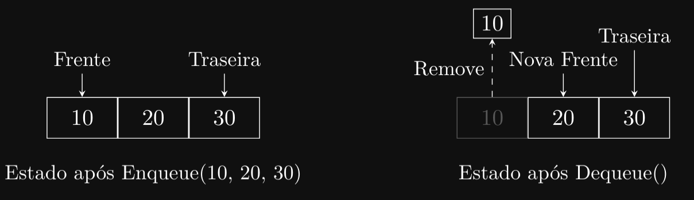
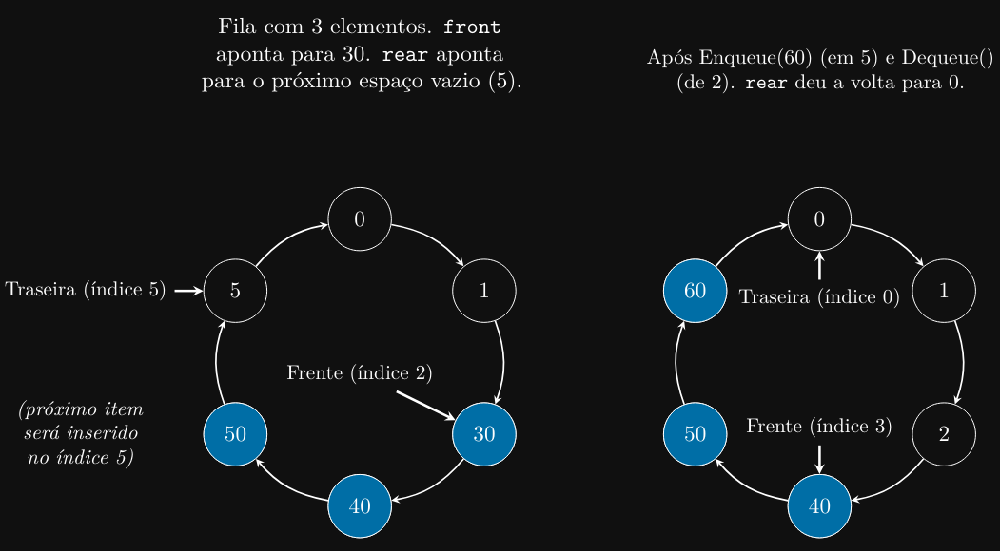

### Introdução
Bem-vindo ao capítulo sobre filas! As filas (ou queues em inglês) são outra estrutura de dados linear
fundamental, muito parecida com as pilhas, mas com um princípio de funcionamento diferente. Elas
são a base de muitos processos computacionais que gerenciam tarefas e recursos de forma ordenada.

### Por Que Aprender Sobre Filas?
As filas são usadas em toda parte em ciência da computação. Elas seguem o princípio FIFO (First
In, First Out), ou “Primeiro a Entrar, Primeiro a Sair”. Pense em uma fila de pessoas esperando para
comprar ingressos: a primeira pessoa que chegou é a primeira a ser atendida. Este conceito é crucial
para sistemas de agendamento, gerenciamento de buffers (como em streaming de vídeo) e algoritmos
de busca em grafos. Entender filas ajudará você a projetar sistemas mais justos e eficientes.

### O Que Vamos Aprender?
Neste capítulo, vamos explorar os conceitos fundamentais das filas. Abordaremos:

1. Definição e Conceito de Filas: Vamos entender o que é uma fila, como ela difere das pilhas, e
o princípio FIFO.

2. Operações Básicas em Filas: Aprenderemos sobre as operações fundamentais de uma fila —
enqueue (enfileirar, ou inserir um elemento), dequeue (desenfileirar, ou remover um elemento),
peek (visualizar o elemento da frente) e isEmpty (verificar se a fila está vazia).

3. Implementação de Filas em C: Veremos como implementar uma fila em C usando arrays
(filas estáticas e circulares) e ponteiros (filas dinâmicas com listas encadeadas).

4. Aplicações Práticas de Filas: Exploraremos onde as filas são usadas, como em escalonadores
de processos de sistemas operacionais, gerenciamento de buffers de impressão e algoritmos de
busca em largura (BFS).

### Definição e Conceito de Filas
Uma fila é uma estrutura de dados linear que segue o princípio FIFO (First In, First Out),
que significa “Primeiro a Entrar, Primeiro a Sair”. Em uma fila, os elementos são inseridos em uma
extremidade (chamada de “traseira” ou “fim”) e removidos da outra extremidade (chamada de “frente”
ou “início”).

Imagine uma fila em um supermercado. Novos clientes entram no final da fila, e o caixa atende
quem está no início da fila. O primeiro cliente a entrar na fila é o primeiro a sair.

### Principais Características de uma Fila
1. Acesso FIFO: O elemento que está na fila há mais tempo é o primeiro a ser acessado ou
removido.

2. Duas Extremidades: As operações ocorrem em extremidades opostas:

- Frente (Front): Onde os elementos são removidos (dequeue).
- Traseira (Rear/Back): Onde os elementos são inseridos (enqueue).

3. Operações Principais:

- Enqueue (Enfileirar): Adiciona um elemento ao final (traseira) da fila.
- Dequeue (Desenfileirar): Remove e retorna o elemento do início (frente) da fila.
- Peek (Espiar): Retorna o elemento da frente da fila sem removê-lo.
- isEmpty: Verifica se a fila está vazia.
- isFull: (Em implementações estáticas) Verifica se a fila está cheia.

### Como Funciona uma Fila?
Vamos visualizar o processo de enfileirar (enqueue) e desenfileirar (dequeue) com números. Começamos
com uma fila vazia.

1. Enqueue(10): A fila agora contém [10]. (Frente: 10, Traseira: 10)
2. Enqueue(20): A fila agora contém [10, 20]. (Frente: 10, Traseira: 20)
3. Enqueue(30): A fila agora contém [10, 20, 30]. (Frente: 10, Traseira: 30)
4. Dequeue(): Remove 10. A fila agora contém [20, 30]. (Frente: 20, Traseira: 30)
5. Enqueue(40): A fila agora contém [20, 30, 40]. (Frente: 20, Traseira: 40)
6. Dequeue(): Remove 20. A fila agora contém [30, 40]. (Frente: 30, Traseira: 40)



### Aplicações de Filas
Filas são essenciais em muitos sistemas computacionais:

- Escalonamento de Processos: Sistemas operacionais usam filas para gerenciar processos que
estão esperando pelo tempo de CPU.
- Buffers de Dados: Usadas em streaming de áudio/vídeo e em comunicação de rede para
armazenar dados temporariamente enquanto são processados.
- Spooling de Impressão: Trabalhos de impressão são colocados em uma fila e impressos na
ordem em que foram recebidos.
- Algoritmos de Busca em Largura (BFS): Um algoritmo fundamental para percorrer árvores
e grafos usa uma fila para rastrear os nós a visitar.

### Vantagens e Desvantagens das Filas
# Vantagens:
- Estrutura simples e intuitiva.
- Garante a ordem de processamento (FIFO), o que é “justo” para muitas aplicações.
- Operações de inserção e remoção são eficientes (geralmente O(1) em implementações bem-
feitas).

# Desvantagens:
- Acesso restrito (só podemos acessar a frente e a traseira).
- Implementações estáticas (com arrays) podem ter tamanho fixo, levando a problemas de
overflow (fila cheia) ou desperdício de espaço.

### Implementação de Filas em C
Assim como as pilhas, as filas podem ser implementadas em C usando arrays ou listas encadeadas.
Vamos explorar ambas as abordagens.

### Filas Estáticas Usando Arrays
Uma implementação simples usa um array de tamanho fixo. Precisamos de dois índices: front
(frente) e rear (traseira).

- rear aponta para o próximo local vazio onde um novo elemento será inserido.
- front aponta para o elemento na frente da fila.

Quando front == rear, a fila está vazia.

```c
#define MAX_SIZE 100

typedef struct {
    int items[MAX_SIZE];
    int front;
    int rear;
} Queue;

// Inicializa a fila
void initQueue(Queue *q) {
    q->front = 0;
    q->rear = 0;
    }

    // Verifica se a fila está vazia
    int isEmpty(Queue *q) {
        return q->front == q->rear;
    }

    // Verifica se a fila está cheia
    int isFull(Queue *q) {
        return q->rear == MAX_SIZE;
    }

    // Adiciona um elemento (enqueue)
    void enqueue(Queue *q, int data) {
    if (isFull(q)) {
        // Tratar erro de fila cheia
        return;
    }
        q->items[q->rear] = data;
        q->rear++;
    }

    // Remove um elemento (dequeue)
    int dequeue(Queue *q) {
        if (isEmpty(q)) {
        // Tratar erro de fila vazia
        return -1; // Valor de erro
    }

    int data = q->items[q->front];
    q->front++;
    return data;
}
```

Problema: Nessa implementação simples, front e rear só avançam. Mesmo depois de desenfileirar
elementos, o espaço no início do array não é reutilizado. Isso é ineficiente.

### Filas Circulares Usando Arrays
Para resolver o problema anterior, usamos uma fila circular. Quando front ou rear atingem o
final do array, eles “dão a volta” para o início (índice 0). Usamos o operador módulo (%) para isso.



```c
typedef struct {
    int items[MAX_SIZE];
    int front;
    int rear;
    int count; // Número de elementos na fila
} CircularQueue;
    
void initCircularQueue(CircularQueue *q) {
    q->front = 0;
    q->rear = 0;
    q->count = 0;
}

int isCircularEmpty(CircularQueue *q) {
    return q->count == 0;
}

int isCircularFull(CircularQueue *q) {
    return q->count == MAX_SIZE;
}

void enqueueCircular(CircularQueue *q, int data) {
    if (isCircularFull(q)) {
        return; // Fila cheia
    }
    q->items[q->rear] = data;
    q->rear = (q->rear + 1) % MAX_SIZE; // Avança circularmente
    q->count++;
}

int dequeueCircular(CircularQueue *q) {
    if (isCircularEmpty(q)) {
        return -1; // Fila vazia
    }
    int data = q->items[q->front];
    q->front = (q->front + 1) % MAX_SIZE; // Avança circularmente
    q->count--;
    return data;
}
```

Ambas as implementações de filas usando arrays são eficientes, mas têm a limitação do tamanho
fixo. Para resolver isso podemos usar arrays dinâmicos (realocação) ou listas encadeadas.

### Filas Dinâmicas Usando Listas Encadeadas
A implementação mais flexível usa uma lista encadeada. Usamos ponteiros head e tail (ou front
e rear) como vimos no capítulo de Listas Encadeadas.

- Enqueue: Adiciona um novo nó no final (tail) da lista. (O(1) se mantivermos ponteiro para
tail).
- Dequeue: Remove o nó do início (head) da lista. (O(1)).

Usaremos a struct Node do capítulo anterior.

```c
typedef struct {
    Node *front; // Ponteiro para o início (head)
    Node *rear; // Ponteiro para o fim (tail)
} LinkedQueue;

void initLinkedQueue(LinkedQueue *q) {
    q->front = NULL;
    q->rear = NULL;
}

int isLinkedQueueEmpty(LinkedQueue *q) {
    return q->front == NULL;
}

void enqueueLinked(LinkedQueue *q, int data) {
    Node *newNode = createNode(data); // createNode aloca e inicializa
    if (newNode == NULL) {
        return; // Falha na alocação
    }

    if (isLinkedQueueEmpty(q)) {
        // Se a fila está vazia, novo nó é frente e traseira
        q->front = newNode;
        q->rear = newNode;
    } else {
        // Se não, adiciona após a traseira atual
        q->rear->next = newNode;
        q->rear = newNode; // Atualiza a traseira
    }
}

int dequeueLinked(LinkedQueue *q) {
    if (isLinkedQueueEmpty(q)) {
        return -1; // Fila vazia
    }
    
    Node *temp = q->front;
    int data = temp->data;
    
    q->front = q->front->next; // Avança a frente
    
    // Se a fila ficou vazia, atualiza a traseira para NULL
    if (q->front == NULL) {
        q->rear = NULL;
    }
    
    free(temp); // Libera o nó removido
        return data;
}
```
