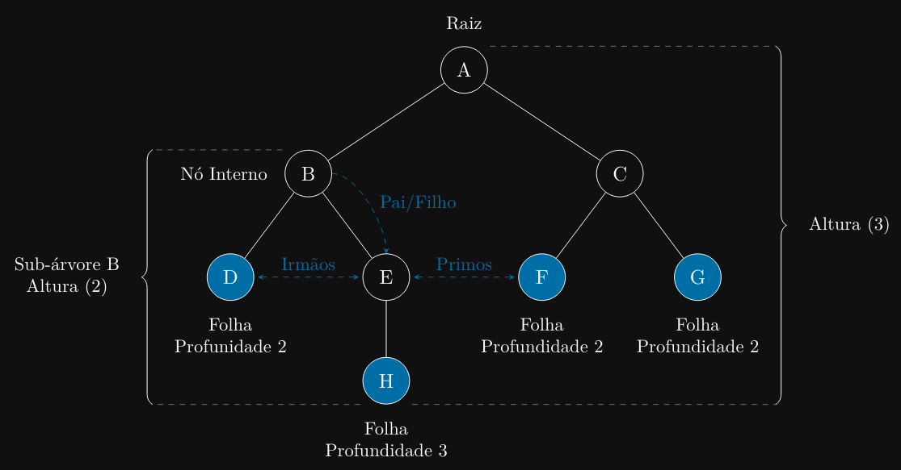

### Introdução
Até agora, exploramos estruturas de dados lineares (listas, pilhas, filas), onde os elementos são
organizados em uma sequência. Agora, vamos entrar no mundo das estruturas de dados não-lineares,
começando pelas árvores.

### Por Que Aprender Sobre Árvores?
Árvores são estruturas de dados hierárquicas. Pense em uma árvore genealógica, na estrutura de
pastas e arquivos do seu computador, ou no organograma de uma empresa. Todas essas são árvores.

Elas são incrivelmente eficientes para armazenar dados que precisam ser pesquisados ou mantidos em
ordem. Por exemplo, uma Árvore Binária de Busca (BST) permite inserção e busca de dados
muito mais rapidamente (em média) do que uma lista encadeada

### O Que Vamos Aprender?
Este capítulo focará nos fundamentos das árvores, com ênfase especial em Árvores Binárias.
Abordaremos:

1. Definição e Terminologia: Entenderemos o que é uma árvore e aprenderemos o vocabulário
essencial (raiz, nó, folha, aresta, pai, filho, sub-árvore).

2. Árvores Binárias: Focaremos no tipo mais comum de árvore, onde cada nó tem no máximo
dois filhos (esquerdo e direito).

3. Árvores Binárias de Busca (BST): Aprenderemos sobre essa variação especial da árvore
binária, que mantém os elementos ordenados para permitir buscas eficientes.

4. Percursos em Árvores: Veremos os três principais algoritmos para “visitar” todos os nós de
uma árvore: Pré-ordem (Pre-order), Em-ordem (In-order) e Pós-ordem (Post-order).

5. Implementação em C: Implementaremos as estruturas e operações básicas de uma Árvore
Binária de Busca em C.

### Definição e Conceito de Árvores
Uma árvore é uma estrutura de dados não-linear que simula uma hierarquia. Ela consiste em um
conjunto de elementos chamados nós (nodes) conectados por arestas (edges).



Terminologia de Árvores
Para entender as árvores, precisamos de um vocabulário comum:

- Raiz (Root): O nó do topo da árvore. É o único nó que não tem “pai”. Toda árvore (não-vazia)
tem exatamente uma raiz.
- Nó (Node): Qualquer elemento da árvore. Contém dados e pode ter links para seus “filhos”.
- Aresta (Edge): A conexão entre dois nós.
- Pai (Parent): O nó diretamente acima de outro nó. Um nó tem no máximo um pai.
- Filho (Child): Um nó diretamente abaixo de outro nó.
- Irmãos (Siblings): Nós que compartilham o mesmo pai.
- Folha (Leaf): Um nó que não tem filhos. É um nó terminal.
- Nó Interno (Internal Node): Um nó que tem pelo menos um filho (ou seja, não é folha).
- Sub-árvore (Subtree): Uma árvore formada por um nó e todos os seus descendentes.
- Altura (Height): O comprimento do caminho mais longo da raiz até uma folha.
- Profundidade (Depth): O comprimento do caminho da raiz até um nó específico.

### Árvores Binárias
Uma Árvore Binária é um tipo especial de árvore onde cada nó pode ter no máximo dois filhos:
um filho à esquerda e um filho à direita.

### Árvores Binárias de Busca (BST)
Uma Árvore Binária de Busca (BST) (Binary Search Tree) é uma árvore binária que obedece
a uma propriedade específica:

Para qualquer nó N :

- Todos os valores na sub-árvore esquerda de N são menores que o valor de N.
- Todos os valores na sub-árvore direita de N são maiores que o valor de N.

Essa propriedade torna a busca por elementos muito eficiente. Se você está procurando o número
25 e o nó atual é 30, você sabe que (se 25 existir) ele deve estar na sub-árvore esquerda.

### Percursos (Traversals)
“Percorrer” uma árvore significa visitar cada nó exatamente uma vez. Existem três formas principais
de fazer isso em profundidade (Depth-First Search):

1. Pré-ordem (Pre-order): Visita o nó Raiz primeiro, depois a sub-árvore Esquerda, e por
último a sub-árvore Direita. (Raiz, Esquerda, Direita)

2. Em-ordem (In-order): Visita a sub-árvore Esquerda primeiro, depois o nó Raiz, e por último
a sub-árvore Direita. (Esquerda, Raiz, Direita)

- Em uma BST, o percurso Em-ordem visita os nós em ordem crescente (ordenada).

3. Pós-ordem (Post-order): Visita a sub-árvore Esquerda primeiro, depois a sub-árvore Direita,
e por último o nó Raiz. (Esquerda, Direita, Raiz)

### Implementação de Árvores em C
Vamos focar na implementação de uma Árvore Binária de Busca (BST) em C, pois ela é uma das
mais úteis.

### Estrutura do Nó
Assim como na lista encadeada, começamos definindo a estrutura do nó. Em uma árvore binária,
cada nó precisa de ponteiros para a esquerda e para a direita.

```c
typedef struct Node {
    int data;
    struct Node *left; // Ponteiro para o filho esquerdo
    struct Node *right; // Ponteiro para o filho direito
} Node;
```

A “árvore” em si é apenas um ponteiro para o nó raiz, que inicializamos como NULL.

```c
Node *root = NULL;
```

### Criando um Nó
Precisamos de uma função auxiliar para criar (alocar) um novo nó, similar ao que fizemos em listas
encadeadas.

```c
Node* createNode(int data) {
    Node *newNode = (Node*)malloc(sizeof(Node));
    if (newNode == NULL) {
        // Tratar erro de alocação
        return NULL;
    }
    newNode->data = data;
    newNode->left = NULL;
    newNode->right = NULL;
    return newNode;
}
```

### Inserindo Elementos (BST)
A inserção em uma BST é uma operação recursiva. Começamos pela raiz e decidimos se o novo nó
vai para a esquerda ou direita, com base na propriedade da BST.

```c
Node* insertNode(Node *node, int data) {
    // 1. Caso base: Se a árvore/sub-árvore está vazia,
    // cria o novo nó e o retorna (ele se torna a nova raiz)
    if (node == NULL) {
        return createNode(data);
    }
    
    // 2. Caso recursivo: Decide para onde ir
    if (data < node->data) {
        // Vai para a esquerda
        node->left = insertNode(node->left, data);
    } else if (data > node->data) {
        // Vai para a direita
        node->right = insertNode(node->right, data);
    }
    // (Se data == node->data, não fazemos nada - não permitimos repetições)
    
    // Retorna o ponteiro do nó (inalterado)
        return node;
    }

// Para usar:
// root = insertNode(root, 50);
// root = insertNode(root, 30);
```

### Pesquisando Elementos (BST)
A pesquisa também é recursiva e tira proveito da ordenação da BST.

```c
Node* search(Node *node, int data) {
    // 1. Caso base 1: Nó não encontrado (chegou em NULL)
    if (node == NULL) {
        return NULL;
    }
    // 2. Caso base 2: Nó encontrado
    if (node->data == data) {
        return node;
    }
    
    // 3. Caso recursivo: Decide para onde ir
    if (data < node->data) {
        return search(node->left, data); // Busca na esquerda
    } else {
        return search(node->right, data); // Busca na direita
    }
}
```

### Implementando Percursos
Os percursos são implementações recursivas clássicas.

```c
// Percurso Em-ordem (Esquerda, Raiz, Direita)
// Imprime os valores em ordem crescente
void inorderTraversal(Node *node) {
    if (node == NULL) {
        return;
    }
    inorderTraversal(node->left);
    printf("%d ", node->data); // Visita a Raiz
    inorderTraversal(node->right);
}
    
// Percurso Pré-ordem (Raiz, Esquerda, Direita)
void preorderTraversal(Node *node) {
    if (node == NULL) {
        return;
    }
    printf("%d ", node->data); // Visita a Raiz
    preorderTraversal(node->left);
    preorderTraversal(node->right);
}
    
// Percurso Pós-ordem (Esquerda, Direita, Raiz)
void postorderTraversal(Node *node) {
    if (node == NULL) {
        return;
    }
    postorderTraversal(node->left);
    postorderTraversal(node->right);
    printf("%d ", node->data); // Visita a Raiz
}
```

### Liberando Memória da Árvore
Para liberar a memória de uma árvore, devemos usar um percurso Pós-ordem. Isso garante que
liberamos os filhos (esquerda e direita) antes de liberar o pai (raiz).

```c
void freeTree(Node *node) {
    if (node == NULL) {
        return;
    }
    // Libera sub-árvores filhas primeiro
    freeTree(node->left);
    freeTree(node->right);
    // Libera o nó atual (Raiz)
    free(node);
}
```
