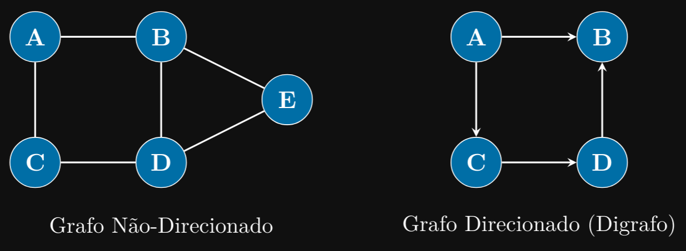
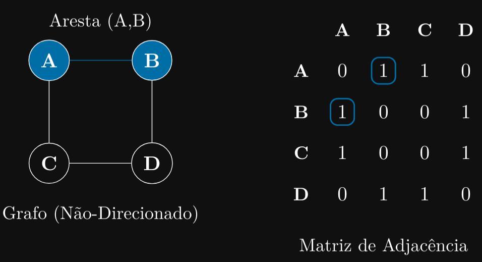
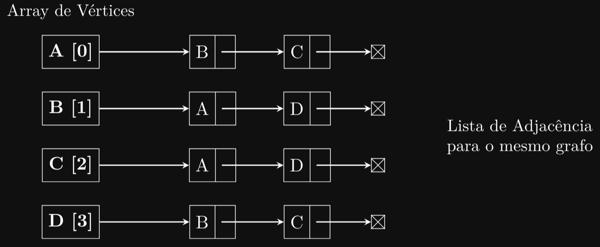

### Introdução
Chegamos à estrutura de dados final deste livreto: os grafos. Os grafos são a estrutura de dados
mais genérica e poderosa que estudaremos. Enquanto listas, pilhas e filas são lineares, e árvores são
hierárquicas, os grafos representam redes complexas de conexões.

### Por Que Aprender Sobre Grafos?
Grafos estão em toda parte. Redes sociais (amigos conectados a amigos), sistemas de GPS (cidades
conectadas por estradas), a própria internet (páginas web conectadas por links), e redes de logística
são todos modelados como grafos. Entender grafos permite resolver problemas complexos como “Qual
o caminho mais curto entre A e B?” ou “Este usuário está conectado a este outro?”

### O Que Vamos Aprender?
Este capítulo será uma breve introdução ao vasto mundo dos grafos. Abordaremos:

1. Definição e Terminologia: Entenderemos o que é um grafo (Vértices e Arestas) e os diferentes
tipos (Direcionados, Não-Direcionados, Ponderados).

2. Representações de Grafos: Veremos as duas formas principais de armazenar um grafo em C:
Matriz de Adjacência e Lista de Adjacência.

3. Algoritmos de Percurso: Aprenderemos os dois principais métodos para explorar um grafo:

- Busca em Largura (BFS - Breadth-First Search)
- Busca em Profundidade (DFS - Depth-First Search)

4. Implementação em C: Focaremos na implementação de um grafo usando Listas de Adjacência
e o algoritmo de Busca em Profundidade (DFS).

### Definição e Conceito de Grafos
Um grafo é um par de conjuntos (V, E), onde:

- V é um conjunto de Vértices (ou Nós).
- E é um conjunto de Arestas, que são conexões entre pares de vértices.

Pense nos vértices como “pontos” (cidades, pessoas) e nas arestas como “linhas” que os conectam
(estradas, amizades).



### Tipos de Grafos
- Grafo Não-Direcionado (Undirected): As arestas não têm direção. Uma aresta (A, B) é o
mesmo que (B, A). Ex: Amizade no Facebook.
- Grafo Direcionado (Directed ou Digraph): As arestas têm uma direção. Uma aresta (A,
B) vai de A para B, mas não necessariamente de B para A. Ex: Seguir alguém no Twitter (você
segue A, mas A pode não seguir você).
- Grafo Ponderado (Weighted): Cada aresta tem um “peso” ou “custo” associado. Ex: Um
mapa onde o peso da aresta (estrada) é a distância em quilômetros.

### Representações de Grafos
Como armazenamos um grafo na memória? Existem duas formas principais:

#### 1. Matriz de Adjacência
Usamos uma matriz (array 2D) NxN, onde N é o número de vértices. Se matrix[i][j] == 1,
significa que existe uma aresta do vértice i para o vértice j. Se for 0, não há aresta. (Em grafos
ponderados, matrix[i][j] armazena o peso da aresta).




- Vantagem: Rápido para verificar se existe uma aresta entre i e j (acesso O(1)).
- Desvantagem: Gasta muita memória (O(N2)), mesmo que o grafo tenha poucas arestas (um
grafo “esparso”)

#### 2. Lista de Adjacência
Usamos um array de listas encadeadas. O índice i do array aponta para uma lista encadeada
contendo todos os vértices j para os quais existe uma aresta (i, j).



- Vantagem: Eficiente em termos de memória para grafos esparsos. Ocupa espaço proporcional
ao número de vértices e arestas.
- Desvantagem: Mais lento para verificar se uma aresta específica (i, j) existe (precisa percorrer
a lista do vértice i).

### Percursos em Grafos
Como visitamos todos os vértices de um grafo? Diferente das árvores, grafos podem ter ciclos
(caminhos que voltam ao início, ex: A → B → C → A). Precisamos de um mecanismo (ex: um array
visited) para não ficarmos presos em loops infinitos.

- Busca em Largura (BFS - Breadth-First Search): Começa em um vértice, visita todos os
seus vizinhos diretos, depois os vizinhos dos vizinhos, e assim por diante. Ele explora “camada
por camada”. Usa uma Fila (Queue) para gerenciar quais nós visitar.
- Busca em Profundidade (DFS - Depth-First Search): Começa em um vértice e explora o
mais fundo possível por um caminho antes de fazer “backtrack” (voltar) e tentar outro caminho,
usa uma Pilha (Stack).

### Implementação de Grafos em C
Implementar grafos em C pode ser complexo. Vamos focar em uma implementação de Lista de
Adjacência para um grafo não-direcionado e não-ponderado.

### Estrutura de Dados (Lista de Adjacência)
Precisamos de duas estruturas: 

1. Um Node para a lista encadeada (igual ao do capítulo de Listas).

2. Uma estrutura Graph que contém o array de listas (nossas listas de adjacência) e o número de
vértices.

```c
// Nó da lista de adjacência (igual ao Node da Lista Encadeada)
typedef struct Node {
    int data; // O vértice de destino da aresta
    struct Node *next;
} Node;

// Estrutura do Grafo
typedef struct {
    int numVertices;
    Node **adjLists; // Array de ponteiros para Nós (o array de listas)
} Graph;

// Função createNode (igual à do capítulo de Árvores/Listas)
Node* createNode(int data) {
    Node *newNode = malloc(sizeof(Node));
    newNode->data = data;
    newNode->next = NULL;
    return newNode;
}

// Cria um grafo com 'V' vértices
Graph* createGraph(int V) {
    Graph *graph = malloc(sizeof(Graph));
    graph->numVertices = V;
    
    // Aloca o array de listas de adjacência
    graph->adjLists = malloc(V * sizeof(Node*));
    
    // Inicializa cada lista de adjacência como vazia (NULL)
    for (int i = 0; i < V; i++) {
        graph->adjLists[i] = NULL;
    }
    return graph;
}
```

### Adicionando Arestas
Para adicionar uma aresta (u, v) em um grafo não-direcionado, precisamos adicionar v na lista de
u E adicionar u na lista de v.

```c
// Adiciona uma aresta (v1, v2)
void addEdge(Graph *graph, int v1, int v2) {
    // Adiciona aresta de v1 para v2 (insere no início da lista de v1)
    Node *newNodeV2 = createNode(v2);
    newNodeV2->next = graph->adjLists[v1];
    graph->adjLists[v1] = newNodeV2;
    
    // Adiciona aresta de v2 para v1 (insere no início da lista de v2)
    Node *newNodeV1 = createNode(v1);
    newNodeV1->next = graph->adjLists[v2];
    graph->adjLists[v2] = newNodeV1;
}
```

### Busca em Largura (BFS)
A BFS usa uma fila para explorar o grafo camada por camada.

```c
// Função para realizar a BFS
void BFS(Graph *graph, int startVertex) {
    // 1. Cria e inicializa o array 'visited' (0 = não visitado)
    int *visited = calloc(graph->numVertices, sizeof(int));
    if (visited == NULL) {
    return; // Falha na alocação
}

// 2. Cria a fila
LinkedQueue queue;
initLinkedQueue(&queue);

// 3. Marca o vértice inicial como visitado e o enfileira
visited[startVertex] = 1;
enqueueLinked(&queue, startVertex);
printf("Visitou %d\n", startVertex);

// 4. Enquanto a fila não estiver vazia...
while (!isLinkedQueueEmpty(&queue)) {
    // 4a. Dequeue um vértice da fila
    int currentVertex = dequeueLinked(&queue);
    // 4b. Para todos os vizinhos (adjacentes) deste vértice...
    Node *temp = graph->adjLists[currentVertex];
    while (temp != NULL) {
        int adjVertex = temp->data;
        // 4c. ...se o vizinho não foi visitado, marca como visitado e enfileira
        if (!visited[adjVertex]) {
            visited[adjVertex] = 1;
            enqueueLinked(&queue, adjVertex);
            printf("Visitou %d\n", adjVertex);
        }
        temp = temp->next;
        }
    }
    
    // 5. Libera a memória do array 'visited'
    free(visited);
    }
```

### Busca em Profundidade (DFS)
A DFS é mais fácil de implementar usando recursão. Precisamos de uma função auxiliar e um array
visited para marcar os vértices já visitados.

```c
// Função auxiliar recursiva para a DFS
void DFSUtil(Graph *graph, int vertex, int visited[]) {
    // 1. Marca o vértice atual como visitado e o imprime
    visited[vertex] = 1;
    printf("Visitou %d\n", vertex);
    
    // 2. Para todos os vizinhos (adjacentes) deste vértice...
    Node *temp = graph->adjLists[vertex];
    while (temp != NULL) {
        int adjVertex = temp->data;
        
        // 3. ...se o vizinho não foi visitado, chama a DFS recursivamente
        if (!visited[adjVertex]) {
            DFSUtil(graph, adjVertex, visited);
        }
        temp = temp->next;
    }
}

// Função principal da DFS
void DFS(Graph *graph, int startVertex) {
    // 1. Cria e inicializa o array 'visited' (0 = não visitado)
    int *visited = calloc(graph->numVertices, sizeof(int));
    if (visited == NULL) {
        return; // Falha na alocação
    }

    // 2. Chama a função auxiliar recursiva
    DFSUtil(graph, startVertex, visited);
    // 3. Libera a memória do array 'visited'
    free(visited);
}
```
