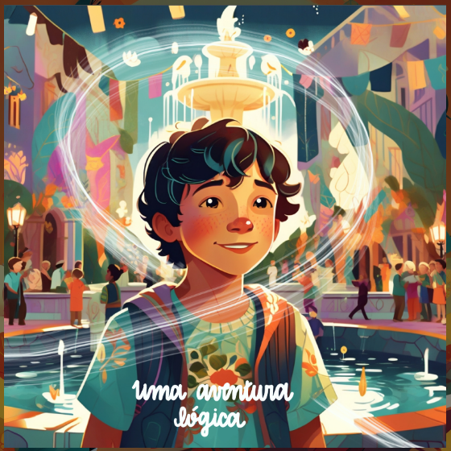
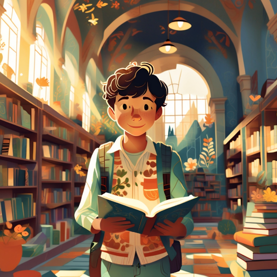
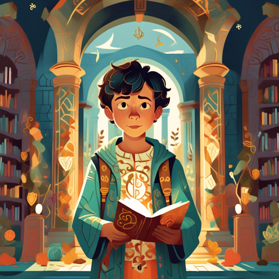
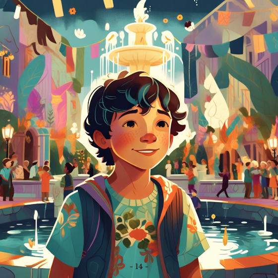

Na pacata cidade de Sapiência, Luís, um jovem curioso e amante de enigmas, explorava a antiga biblioteca municipal. Em um canto esquecido, ele encontrou um livro antigo e peculiar, intitulado "A Chave da Lógica". Assim que abriu o volume, ele notou um brilho inesperado nas páginas. Antes que pudesse fechar o livro, o brilho se intensificou e o envolveu completamente.

Quando recuperou os sentidos, Luís percebeu que estava em um mundo diferente. O céu tinha tons vibrantes de azul e dourado, e os campos eram cobertos por padrões geométricos que mudavam ao piscar dos olhos. Ele logo percebeu que estava em Lógica, uma terra onde tudo era regido por princípios lógicos.

Luís foi recebido por uma mulher chamada Ada, uma habitante de Lógica que parecia preocupada. Ela explicou que a Fonte da Sabedoria, o coração de Lógica, havia secado misteriosamente.

— Sem a Fonte, nossa terra perde seu equilíbrio. Todos aqui dependem de sua sabedoria para guiar suas decisões e manter a ordem. Algo a está drenando, mas ninguém conseguiu descobrir o quê — disse Ada.

Luís, movido por seu senso de justiça e curiosidade, decidiu ajudar a resolver o mistério. Mas para resolver o mistério, ele precisaria enfrentar desafios que testariam sua habilidade de pensar logicamente.

Ao tentar sair da praça principal, Luís foi confrontado pelo Guardião da Certeza, que bloqueava a saída com um olhar sério.

— Para prosseguir, deve resolver este enigma lógico:

"Há três caixas à sua frente. Uma contém apenas maçãs, outra contém apenas laranjas e a última contém uma mistura de maçãs e laranjas. Todas as caixas estão rotuladas, mas os rótulos estão incorretos. Com um único movimento — retirando apenas uma fruta de uma das caixas — como você determina o conteúdo correto de todas as caixas?"

Luís pensou por um momento e então respondeu:

— Eu pegaria uma fruta da caixa rotulada como "maçãs e laranjas". Como todos os rótulos estão incorretos, essa caixa não pode conter uma mistura, pois está rotulada incorretamente. Portanto, esta caixa conterá apenas maçãs ou apenas laranjas. Se eu retirar uma fruta e ela for, por exemplo, uma maçã, sei que essa caixa contém apenas maçãs.

Agora, os rótulos das outras caixas se tornam óbvios: A caixa rotulada como "maçãs" não pode conter apenas maçãs (porque os rótulos estão incorretos). Então, ela deve conter a mistura de maçãs e laranjas.

A última caixa, rotulada como "laranjas", não pode conter apenas laranjas (também por causa do erro nos rótulos). Então, ela conterá apenas laranjas. 

Luís finalizou com confiança:

— Ao retirar apenas uma fruta, consigo identificar o conteúdo correto de todas as caixas, pois a lógica elimina todas as outras possibilidades.

O Guardião da Certeza abriu um sorriso, satisfeito com a resposta.

— Muito bem, jovem. Sua lógica é impecável. Pode passar.

O portão se abriu, e Luís seguiu adiante, confiante de que estava no caminho certo para resolver o mistério.

Ao entrar na Floresta das Falácias, Luís foi cercado por criaturas que usavam argumentos enganadores. Uma criatura chamada Generalização Apressada atacou Luís com frases como:

— Eu conheço três pessoas de Lógica que são desonestas. Logo, todos os habitantes de Lógica são desonestos!

Luís rebateu:

— Isso é uma generalização precipitada. Você está usando uma amostra pequena para tirar uma conclusão ampla. É uma falácia!

A criatura se desfez em fumaça.

Enquanto caminhava pela floresta, Luís encontrou um caminho inclinado e cheio de pedregulhos, onde uma criatura de aparência escorregadia se aproximou, gesticulando exageradamente.

— Se você continuar por este caminho, primeiro escorregará. Então, perderá o controle, cairá em um abismo e nunca mais conseguirá voltar! — alertou o Declive Escorregadio, tentando assustar Luís.

Luís parou, respirou fundo e analisou a afirmação.

— Espere um pouco. O que você está dizendo não é garantido. Só porque o caminho é inclinado, isso não significa que vou inevitavelmente cair no abismo. É uma sequência hipotética sem evidências concretas — respondeu Luís. — O que importa é eu tomar cuidado e observar o caminho.

Ele olhou ao redor e percebeu que podia evitar os pedregulhos simplesmente caminhando com atenção. Assim que Luís começou a descer o caminho com segurança, o Declive Escorregadio se desfez em fumaça, derrotado.

Enquanto explorava a floresta, Luís encontrou uma criatura peculiar no meio de uma bifurcação. Era o Falso Dilema, que tinha dois rostos, cada um apontando para um lado do caminho.

— Chegou a um ponto crítico, jovem! — gritou o Falso Dilema. — Você só tem duas escolhas: ou segue pela trilha à direita e enfrenta um monstro terrível, ou segue pela trilha à esquerda e se perde para sempre! Não há outra saída.

Luís, intrigado, franziu a testa. Ele começou a refletir sobre a afirmação da criatura, percebendo que algo estava errado.

— Espere aí — disse Luís. — Você está me apresentando apenas duas opções como se fossem as corretas. únicas possibilidades, mas isso não é verdade. Nada me garante que esses são os únicos caminhos possíveis ou que as suas afirmações sobre o destino de cada trilha estão corretas. 

Luís decidiu examinar o local com mais atenção. Ele notou marcas sutis no chão entre as trilhas e pensou logicamente: "Se a criatura quisesse esconder algo, faria isso fora da visão direta." Ele começou a investigar a área central, entre as duas trilhas. Após alguns minutos de busca, encontrou um terceiro caminho, oculto atrás de galhos e folhas.

— Como eu pensei! Havia uma terceira opção — declarou Luís.

O Falso Dilema começou a gritar:

— Isso não pode ser! Você só tinha duas escolhas!

Mas antes que a criatura pudesse continuar, Luís explicou:

— Sua falácia foi desmascarada. Você tentou limitar minhas escolhas, mas eu usei observação e lógica para descobrir uma alternativa. Isso prova que as opções que você apresentou não eram exaustivas. Assim que Luís entrou no caminho oculto, o Falso Dilema desabou como uma estátua de areia, derrotado.

Luís encontrou um mapa que o levou a um sistema de canais subterrâneos conectados à fonte. No caminho, encontrou outro desafio:

— Um túnel se bifurca em dois caminhos. Um leva à fonte, o outro a um beco sem saída. Há dois guardiões, um que sempre mente e outro que sempre diz a verdade. Você pode fazer uma única pergunta a um deles. Qual pergunta você faz?

Luís sorriu, lembrando-se de um quebra-cabeça similar.

— Pergunto a qualquer um dos guardiões: "Se eu perguntasse ao outro guardião qual é o caminho para a fonte, o que ele diria?" Assim, posso tomar o caminho oposto, porque a resposta será sempre incorreta. Com isso, Luís encontrou o caminho certo.

No coração do labirinto, Luís chegou a uma sala ampla e escura, onde uma máquina antiga bloqueava o fluxo da Fonte da Sabedoria. A máquina era composta por uma fila de alavancas interconectadas, com engrenagens complexas que tilintavam levemente, como se esperassem ação. No centro da estrutura, havia uma mensagem gravada em uma placa metálica:

"Para restaurar o fluxo, ajuste os interruptores de modo que cada alavanca represente o oposto de seu vizinho."

Luís leu a mensagem atentamente. Ele reconheceu que o problema envolvia criar um padrão de alternância binária, onde cada alavanca deveria estar em um estado (ligado ou desligado) oposto à alavanca adjacente.

Luís começou observando as alavancas. Algumas estavam na posição "para cima" e outras "para baixo", mas ele percebeu que o estado inicial não seguia nenhuma lógica aparente. Ele pensou:

Definir o padrão correto: Se uma alavanca estiver "para cima", a próxima deverá estar "para baixo" e assim por diante. Isso criaria um padrão alternado como cima-baixo-cima-baixo, ou o inverso: baixo-cima-baixo-cima.

Identificar pontos de conflito: Luís verificou cada par de alavancas consecutivas. Sempre que encontrava duas alavancas adjacentes no mesmo estado (ambas "para cima" ou ambas "para baixo"), ele sabia que uma delas precisava ser ajustada.

Para resolver o problema, Luís decidiu seguir uma abordagem sistemática: 

Ele começou pela primeira alavanca à esquerda e definiu seu estado como "para cima". Em seguida, ajustou a segunda alavanca para estar no estado oposto à primeira, ou seja, "para baixo". Continuou avançando de alavanca em alavanca, verificando e ajustando cada uma para garantir que fosse oposta à anterior

Quando chegou ao final da fila, Luís revisou todo o conjunto para garantir que o padrão estava correto.

Após ajustar todas as alavancas, a máquina começou a emitir sons de engrenagens girando. Uma luz suave começou a brilhar no centro, e a água da Fonte da Sabedoria começou a fluir novamente. Luís observou com satisfação enquanto o fluxo se intensificava, até que finalmente jorrou com força total.

Ele sorriu, satisfeito por ter aplicado seu raciocínio lógico para resolver o enigma.

— Está feito! — disse ele para si mesmo.

Com a fonte restaurada, Luís sabia que havia dado um grande passo para salvar o mundo de Lógica. Mais uma vez, a lógica e a paciência haviam prevalecido.

Ao retornar à superfície, Luís foi saudado como herói pelos habitantes de Lógica. Ada, com um sorriso, entregou-lhe uma cópia simbólica de "A Chave da Lógica", dizendo:

— Que esta sabedoria permaneça com você, onde quer que vá.

De repente, Luís sentiu o mesmo brilho que o trouxera a Lógica. Em instantes, ele estava de volta à biblioteca de Sapiência, segurando o antigo livro.

Agora, mais sábio e confiante, Luís sabia que as lições de Lógica seriam úteis para enfrentar os desafios do mundo real.

