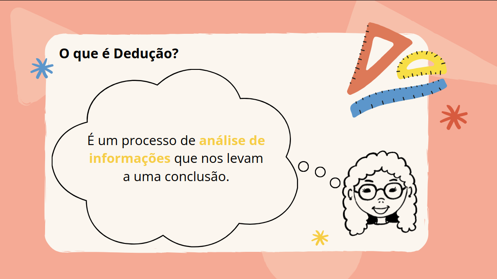
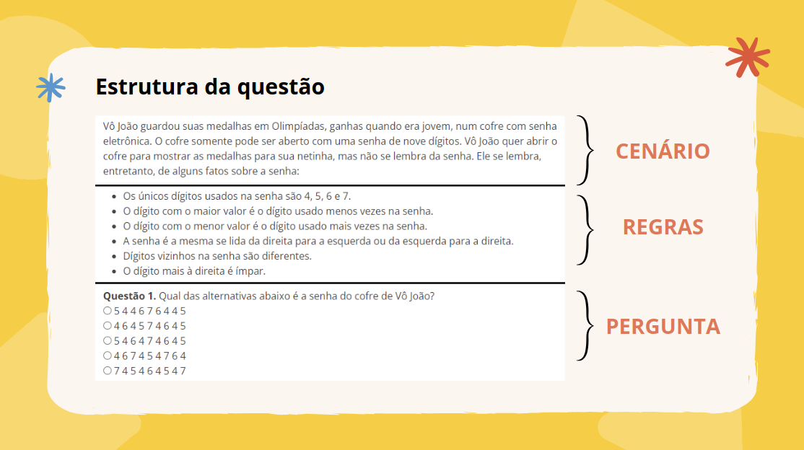

Exemplo: Cofre de Medalhas
Descubra a senha de 9 dígitos do cofre, siga as regras abaixo:

- Os únicos dígitos usados na senha são 4, 5, 6 e 7.
- O dígito com o maior valor é o dígito usado menos vezes na senha.
- O dígito com o menor valor é o dígito usado mais vezes na senha.
- A senha é a mesma se lida da direita para a esquerda ou da esquerda para a direita.
- Dígitos vizinhos na senha são diferentes.
- O dígito mais à direita é ímpar.

A) 5 4 6 4 7 4 6 4 5

B) 4 6 4 5 7 4 6 4 5

C) 5 4 4 6 7 6 4 4 5

D) 4 6 7 4 5 4 7 6 4

F) 7 4 5 4 6 4 5 4 7

- DICA
    - Faça o descarte das opções de acordo com as regras dadas pelo próprio exercício!

- **"Os únicos dígitos usados na senha são 4, 5, 6 e 7."**
- Nessa regra não realizamos o descarte de nenhuma opção já que todas utilizam apenas os números 4, 5, 6 e 7

- **"O dígito com o maior valor é o dígito usado menos vezes na senha."**
- O dígito de maior valor é o 7. Opções descartadas:
    - Opção D, pois o 5 aparece menos vezes que o 7
    - Opção E, pois o 6 aparece menos vezes que o 7

- **"O dígito com o menor valor é o dígito usado mais vezes na senha."**
- Nessa regra não realizamos o descarte de nenhuma opção já que em A, B e C o 4 é o dígito mais utilizado

- **"A senha é a mesma se lida da direita para a esquerda ou da esquerda para a direita."**
- Nessa regra conseguimos descartar a opção B, pois se a lermos ao contrário ela fica diferente

**"Dígitos vizinhos na senha são diferentes."**
- Nessa regra, descartamos a opção C, pois ela possui números vizinhos iguais:
    - 5 4 4
    - 4 4 5

- **"O dígito mais à direita é ímpar."**
- Fazendo a verificação da opção A, verificamos que ela é a correta, já que o número mais a direita é o 5, que é ímpar.
