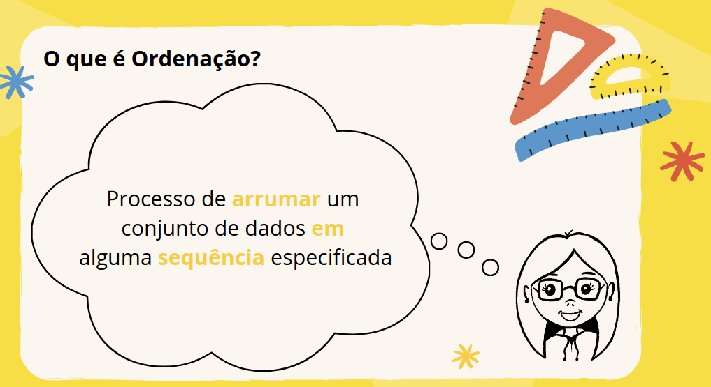
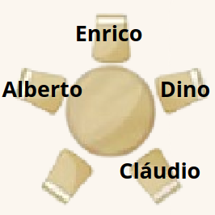
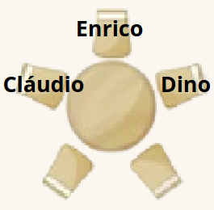
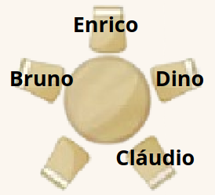
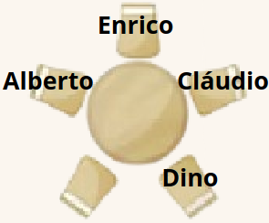

**Exemplo: Almoço**
Para comemorar o aniversário de Cláudio, ele e mais quatro amigos -- Alberto, Bruno, Dino e Eurico -- foram almoçar juntos no restaurante da escola. As mesas são redondas e acomodam exatamente cinco pessoas. Cláudio e Dino sentam-se um ao lado do outro. Alberto e Bruno não sentam-se um ao lado do outro. Os dois amigos sentados ao lado de Eurico são:
A) Alberto e Dino
B) Cláudio e Dino
C) Dino e Bruno
D) Cláudio e Alberto
E) Alberto e Bruno

**DICA**
Faça o descarte das opções de acordo com as regras dadas pelo próprio exercício e caso necessário, **DESENHE!**

**Vamos desenhar as opções**

A) Alberto e Dino

Sobram 2 cadeiras, mas o Cláudio deve sempre sentar ao lado de Dino! Cláudio Após colocar o Cláudio, só sobra ao Bruno a cadeira ao lado de Alberto, mas ele não pode sentar ali, então essa **não é a opção correta.**

B) Cláudio e Dino

O Cláudio e o Dino devem se sentar um ao lado do outro, então essa **não é a opção correta.**

C) Dino e Bruno

Sobram 2 cadeiras, mas o Cláudio deve sempre sentar ao lado de Dino! Após colocar o Cláudio, só sobra ao Alberto a cadeira ao lado de Bruno, mas ele não pode sentar ali, então essa **não é a opção correta.**

D) Cláudio e Alberto

Sobram 2 cadeiras, mas o Dino deve sempre sentar ao lado de Cláudio! Cláudio Após colocar o Dino, só sobra ao bruno a cadeira ao lado de Alberto, mas ele não pode sentar ali, então essa **não é a opção correta.**

E) Alberto e Bruno

O Cláudio e o Dino poderão se sentar um ao lado do outro, além de o Alberto e Bruno sentarem separados!
**Essa é a opção correta!**

