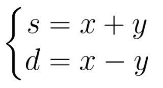

## C – Beat the Spread! (UVA – 10812)

- **Problema**: calcular, se possível, o placar de dois times a partir da soma `s` das pontuações e da diferença absoluta `d`.
- É garantido que os valores de entrada `s` e `d` são inteiros não negativos.

Considerando `x` como sendo a maior pontuação, e `y` a menor, podemos dizer que:


Resolvendo este sistema obtemos que:


Analisando estas equações, e sabendo que a pontuação de cada time é sempre um inteiro positivo, podemos dizer que só é possível calcular `x` e `y` quando:
- `𝑠 + 𝑑` e `𝑠 − 𝑑` são números pares.
- `𝑠 − 𝑑 ≥ 0` ou, de forma equivalente, `𝑠 ≥ 𝑑`.

```cpp
/*
Problema: Beat the Spread!
Categorias:
	adhoc
Dificuldade: muito facil
Descricao:
Dica:
Autor: Paiola
*/
#include<bits/stdc++.h>

using namespace std;

int main(){
    int t;
    int s, d, x, y;
    cin >> t;
    while(t--){
        cin >> s >> d;
        if ((s - d) >= 0 && ((s + d) % 2 == 0)) {
            x = (s + d) / 2;
            y = (s - d) / 2;
            cout << x << " " << y << endl;
        }
        else
        {
            cout << "impossible" << endl;
        }
        
    }
}
```

## D – Peter’s Smokes (UVA – 10346)

- **Problema**: determinar quantos cigarros Peter pode possuir, sendo que ele começa com `n` cigarros e a cada `k` bitucas ele consegue enrolar um novo cigarro.

Este exercício pode ser resolvido apenas simulando o problema descrito:

```cpp
#include<iostream>

using namespace std;

int main()
{
	int n, k, soma, bitucas;
	while(cin >> n >> k)
	{
		soma = n;
		bitucas = n;
		while(bitucas >= k)
		{
			n = bitucas/k;
			soma += n;
			bitucas = bitucas % k + n;
		}
		cout << soma << endl;
	}
}
```
