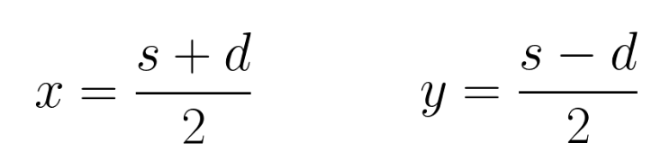

## C – Beat the Spread! (UVA – 10812)

- **Problema**: calcular, se possível, o placar de dois times a partir da soma `s` das pontuações e da diferença absoluta `d`.
- É garantido que os valores de entrada `s` e `d` são inteiros não negativos.

Considerando `x` como sendo a maior pontuação, e `y` a menor, podemos dizer que:


Resolvendo este sistema obtemos que:


Analisando estas equações, e sabendo que a pontuação de cada time é sempre um inteiro positivo, podemos dizer que só é possível calcular `x` e `y` quando:
- `𝑠 + 𝑑` e `𝑠 − 𝑑` são números pares.
- `𝑠 − 𝑑 ≥ 0` ou, de forma equivalente, `𝑠 ≥ 𝑑`.

## D – Peter’s Smokes (UVA – 10346)

- **Problema**: determinar quantos cigarros Peter pode possuir, sendo que ele começa com `n` cigarros e a cada `k` bitucas ele consegue enrolar um novo cigarro.

Este exercício pode ser resolvido apenas simulando o problema descrito:

```cpp
soma = n;
bitucas = n;
while (bitucas >= k) {
    n = bitucas / k;
    soma += n;
    bitucas = bitucas % k + n;
}
cout << soma << endl;
