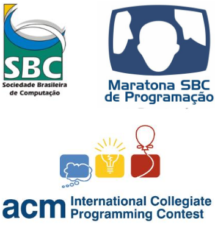
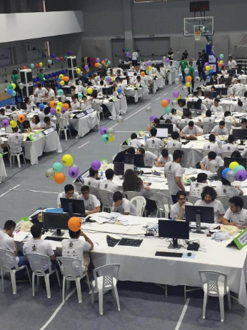

- Competições de Programação são provas com duração pré-determinada onde os participantes são desafiados a resolver uma série de problemas, usando linguagens de programação específicas.
- Os problemas são de entrada e saída textuais, em que o formato de ambas é bem definido.
- Os códigos são julgados automaticamente por um software juiz. Basicamente o juiz irá comparar a saída gerada por seu programa com a saída esperada.

Possíveis respostas do juiz:
- AC – Accepted
- WA – Wrong Answer
- PE – Presentation Error
- TLE – Time Limit Exceeded
- RE – Runtime Error
- CE – Compilation Error

### Maratona SBC de Programação
- Evento da Sociedade Brasileira de Computação (SBC), realizado desde 1996.
- Destinada a alunos e alunos de cursos de graduação e início de pós na área de Computação e afins.
- Classificatória para as finais mundiais do concurso de programação, o International Collegiate Programming Contest.

- Ocorre em duas fases:
- Fase Regional: normalmente em setembro
- Final Brasileira: normalmente em novembro
    - Times de 3 pessoas
    - 1 computador por grupo
    - Permitido consulta de material impresso
    - 5 horas de contest
    - Em torno de 13 problemas a serem resolvidos

### Por quê?
1. Conhecimento e resolução de problemas
- Você é confrontado com diversos problemas, todo muito diferentes, envolvendo diversas técnicas e estruturas de dados específicas.
- A maioria dos problemas vão além do óbvio, requisitando o domínio de diversos conhecimentos e criatividade para combiná-los e aplicá-los adequadamente.
- Estudando programação competitiva você irá aprender assuntos, de forma prática e aplicada, que o curso de graduação só irá oferecer mais tarde (ou nem iráoferecer).
2. Trabalho em equipe
- A Maratona de Programação é obrigatoriamente feita em grupos de três pessoas.
- O grupo terá que aprender a lidar com a escassez de recursos e tempo para resolver o maior número de problemas durante a competição.
- Uma boa dinâmica de grupo é tão essencial quanto o conhecimento técnico dos competidores individuais.
3. Mercado de Trabalho
- Grandes empresas valorizam a participação em competições de programação.
- As últimas Fases Nacionais da Maratona, por exemplo, foram patrocinadas por empresas como Google, Microsoft e B2W.
- A Google organiza sua própria competição de programação, a Google Code Jam, voltada para identificar talentos para um potencial emprego na mesma.
4. Viagens
- Passeios
- Comida
5. Networking
6. Brindes
7. Balões

*"Observe que ser bem versado em programação competitiva não é objetivo final, apenas o meio. A verdadeira meta é produzir programadores/cientistas da computação versáteis, que estejam muito mais preparados para produzir softwares melhores ou para enfrentar complicados problemas de pesquisa de Ciência da Computação no futuro"*
(Steven & Felix Halim, tradução nossa)

### Ferramentas e linguagem de programação
- Sistema operacional Linux
- VS Code
- Linguagem C++
- Compilador G++
- Sites:
- uDebug
- Codeforces
- Beecrowd
- Vjudge

### Bibliografia
- Felix Halim, Steven Halim. Competitive Programming 3.
- Steven Skiena. Programming Challenges: The Programming Contest Training Manual.
- Antti Laaksonen. Guide to Competitive Programming: Learning and Improving Algorithms Through Contests
- Steven Skiena. The Algorithm Design Manual.

Outros recursos
- [CP-Algorithms](https://cp-algorithms.com/): uma enciclopédia de diversos algoritmos em C++, com tópicos bem explicados.
- [Geeks for Geeks](https://geeksforgeeks.org/): diversos artigos sobre programação e computação como um todo.
- [Neps Academy](https://neps.academy/br/login): contém cursos, problemas e plataformas para discussão. Diversos conteúdos possuem acesso gratuito, outros necessitam a realização de uma assinatura.

- Canais do YouTube:
- [Programação Competitiva UNESP](https://www.youtube.com/@protiva_unesp): nosso canal no YouTube, com as gravações das aulas de 2020 e 2021.
- [GEMA ICMC](https://www.youtube.com/c/GEMAICMC/videos): canal do Grupo de Estudos para a Maratona de Programação (GEMA) do ICMC – USP São Carlos.
- [MaratonUSP](https://www.youtube.com/channel/UCB_SQAulqgmQ0Vfww9wzfWA): canal do grupo de estudos do IME-USP.
