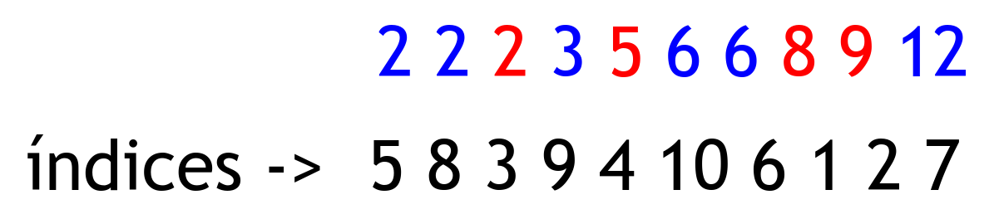
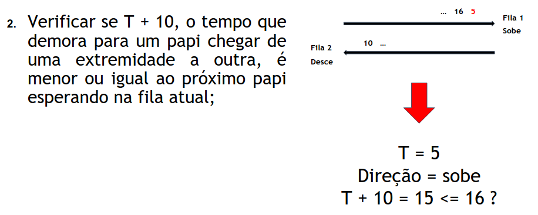
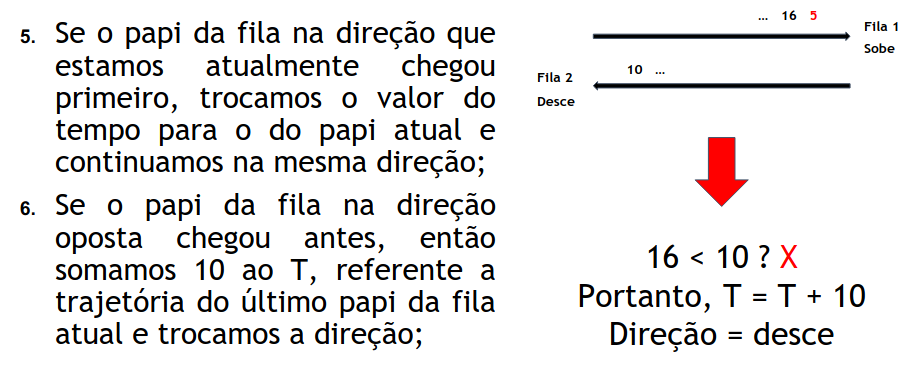

## Resolução dos Exercícios
## Exercícios D, F, G, H

### Larger Score
• É dado um vetor não necessariamente ordenado  
• Observa-se que o vetor é dividido em duas partes:  
1a Parte -> (v[0], v[1], ... , v[k-1])  
2a Parte -> (v[k], v[k+1], ... , v[n-1])  
Objetivo -> Seja S = v[0] + v[1] + … + v[k-1], trocar um valor dessa soma SS, por um valor da segunda parte, de forma que se tenha uma nova soma S' >= S+1.`

Como eu posso fazer isso?  
As trocas podem ser feitas entre elementos adjacentes.  
Ex:

Nesse exemplo o resultado é 3, isto é, houveram três trocas.  
Como resolver?  
O exercício quer que sejam realizadas o mínimo de trocas possíveis.

Minha Solução:  
Talvez seja overkill, mas... vamos lá.  
1º Passo: Ordenar o vetor, guardando seus índices.

2º Passo: Passar todos os elementos do vetor ordenado.

Nesse passo se o número pertencer à primeira parte do vetor (número vermelho) adiciona o índice em uma priority queue.  
Ex: Ao passarmos pelo 2, por exemplo, adicionamos o índice 3 na priority, ao passarmos pelo elemento 5, adicionamos o índice 4 na priority e assim sucessivamente.  
Se o número pertencer à segunda parte do vetor (número azul), a gente verifica se tem algum item na priority, se tiver, a gente encontrou um par que pode ser trocado.  
Dessa forma, pode-se verificar qual é a mínima distância entre todos esses pares, e essa é nossa resposta final.  
E porquê usar a priority?  
Porque ela vai guardar os elementos de índice mais alto, ou seja, os mais próximos à sua posição atual.  
Observe que como os elementos estão ordenados, eu vou achar somente elementos maiores do que aqueles que eu já coloquei na priority, e isso traz a solução ótima do exercício.

### Escalator
* Descrição: uma escada rolante permite o deslocamento em ambas suas direções. O percurso para ir de uma ponta da escada até a outra leva 10 segundos, isto é, se uma pessoa entrar no tempo T, ela deixa a escada no tempo T + 10. As seguintes regras se aplicam:  
* a escada está inicialmente parada;  
* quando uma pessoa chega em uma de suas extremidades, a escada inicia o movimento na direção desejada;  
* se a escada já estiver em movimento, a pessoa pode entrar imediatamente nela;  
* caso contrário, é preciso esperar ela parar e iniciar o movimento contrário.

* Problema: simular o tempo de funcionamento da esteira, dadas informações sobre N pessoas, incluindo o tempo de chegada de cada um e a direção de sua locomoção.

* Solução: primeiramente, precisamos pensar em uma forma de guardar as informações dos N papis de maneira a manter a ordem de chegada de cada um e seguí-la, para cada uma das direções possíveis.  
* Mas, como podemos fazer isso?  
* Um vetor seria uma possibilidade, porém, dado o problema, podemos pensar que o problema pede para que o primeiro papi que entrar em qualquer um dos lados também deve ser o primeiro a sair, portanto…

* O algoritmo se repete até que ambas as filas estejam vazias e tenhamos simulado todas as viagens de cada papi;  
* Ao final das trajetórias, basta somar 10 ao T obtido, contabilizando a última viagem feita pelo último papi.

### Brackets balanceados
* Caracteres delimitadores como (, ), {, }, [ e ] podem ser chamados de brackets.  
* Dois brackets são considerados um par se um bracket de abertura ocorre à esquerda de um de fechamento e se eles são exatamente do mesmo tipo: (), [], {}.

* Uma certa expressão é bem definida ou balanceada se atende uma das seguintes propriedades:  
* Ela é uma cadeia de caracteres vazia.  
* Ela é formada por uma cadeia bem definida envolvida por brackets. Ou seja, se S é balanceada, então as cadeias (S), [S] e {S} também são.  
* Ela é formada pela concatenação de duas cadeias balanceadas. Portanto, se X e Y são balanceadas, então XY também é.

#### Exemplos  
* Expressões balanceadas  
()  
({})  
{}()[]  
({}[])  

* Expressões não balanceadas  
* Problema: Para uma expressão qualquer formada apenas por brackets, como determinar se ela é balanceada ou não?  
* Uma forma de resolver isto é utilizando uma pilha de apoio.  
* Percorremos a expressão da esquerda para direita:  
* Se o caractere atual é um bracket de abertura: empilhamos o bracket  
* Se o caractere atual é um bracket de fechamento  
    * Se a pilha está vazia, a expressão não está balanceada  
    * Se o caractere corresponde ao topo da pilha, desempilhamos  
    * Caso contrário, a expressão não está balanceada  
* Terminando de percorrer a expressão, se a pilha ainda contiver algum elemento, então algum bracket não foi fechado.

#### Sugestões de exercícios
[EXPRESS11 – Expressões (SPOJ BR)](https://br.spoj.com/problems/EXPRES11/)  
[Balanced Brackets (HackerRank)](https://www.hackerrank.com/challenges/balanced-brackets/problem)  
[Desafio: 224C – Bracket Sequence (CodeForces)](https://codeforces.com/contest/224/problem/C)
