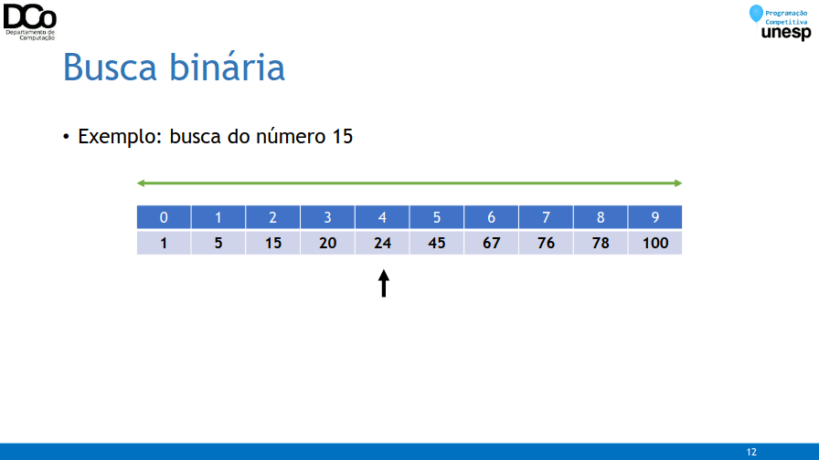
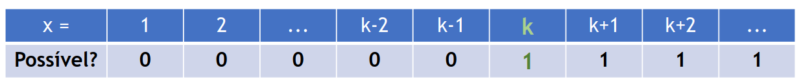
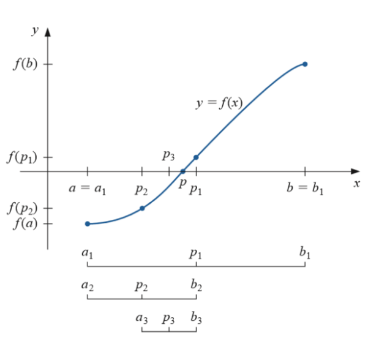

## Problema da busca
- Dada uma coleção de n elementos, determinar se um determinado elemento (valor) está presente nessa coleção e, se sim, qual a posição desse elemento.
- Exemplo: busca em vetor de inteiros

```
vet = {2, 5, 7, 8, 10}
buscar(vet, 7) = 2 //o elemento 7 está na posição 2 do vetor
buscar(vet, 2) = 0 //o elemento 2 está na posição 0 do vetor
buscar(vet, 3) = -1 //o elemento 3 não se encontra no vetor
```

- Generalização: dada uma relação R(x, y), o problema da busca consiste em, para um certo valor y, determinar se há um possível valor de x que satisfaça R(x, y), e se sim, retornar este valor.

### Busca linear
- 1ª solução: busca linear ou sequencial – percorrer o vetor desde a primeira posição até a última em busca de um elemento x:
    - Se o elemento for encontrado, retornamos a posição;
    - Senão, retornamos -1 (por exemplo) para indicar que o elemento não foi encontrado.
- Exemplo de implementação
``` cpp
int buscaLinear(vector<int> vet, int x)
    {
    for(int i = 0; i < vet.size(); i++)
    {
        if (vet[i] == x)
        return i;
    }
    return -1;
}
```

- Análise da complexidade: no pior caso, em que o elemento não está no
vetor, teremos que percorrer todas as n posições do vetor.
- Sendo assim, esse algoritmo tem complexidade O(n).

### Busca linear com dados ordenados
- Agora suponha que os dados do vetor foram previamente ordenados.
- Com isso conseguimos melhorar um pouco o algoritmo, pois ao buscar um elemento x, se passarmos por um y | y > x, podemos encerrar a busca.
- Exemplo
``` cpp
vet = {0, 4, 6, 9, 10, … }
/*Se buscarmos o número 7 nesse vetor (sabendo que ele está ordenado),
assim que passarmos pela posição 3 vamos saber que ele não se encontra no
vetor, mesmo que ele tenha mais 100000 elementos*/
```
- Exemplo de implementação
``` cpp
int buscaLinearOrd(vector<int> vet, int x)
{
    for(int i = 0; i < vet.size(); i++)
    {
        if (vet[i] == x)
        return i;
    if (vet[i] > x)
        break;
    }
    return -1;
}
```

- Análise da complexidade: apesar desse algoritmo ser mais “esperto”, se saindo melhor em alguns casos específicos, sua complexidade no pior caso ainda é O(n).
- Pior caso: o número procurado não está no vetor e é maior que o último elemento do vetor.
### Busca binária
- Porém, ainda partindo do fato que temos o vetor ordenado, imagine que verificamos inicialmente a posição do meio do vetor (e não a primeira posição, como na busca linear)
- O que podemos concluir disso?
```
centro = (inicio + fim) / 2
Se vet[centro] == x, então o elemento está na posição “centro”
Se vet[centro] > x, então x só pode estar entre vet[inicio] e vet[centro - 1]
Se vet[centro] < x, então x só pode estar entre vet[centro + 1] e vet[fim]
```
- E qual a vantagem disso? Em uma única verificação eliminamos a necessidade de comparar o elemento buscado com metade do vetor.
- Para a metade onde o elemento x pode estar, aplicamos a mesma ideia, comparando com a posição do meio desse intervalo.
- Confira na GIF abaixo:


- Exemplo de implementação – versão recursiva:
``` cpp
int buscaBinaria(int vet[], int esq, int dir, int x)
{
    if (esq > dir)
        return -1;
    int meio = (esq + dir)/2;
    if (vet[meio] > x)
        return buscaBinaria(vet, esq, meio-1, x);
    if (vet[meio] < x)
        return buscaBinaria(vet, meio+1, dir, x);
        return meio;
}
```

- Exemplo de implementação – versão iterativa:
``` cpp
int buscaBinaria2(int vet[], int n, int x)
{
    int esq = 0, dir = n - 1, meio;
    while(esq <= dir) {
        meio = (esq + dir)/2;
        if (vet[meio] == x) return meio;
        if (vet[meio] > x) dir = meio - 1;
        else esq = meio + 1;
    }
    return -1;
}
```

- Análise da complexidade: não iremos fazer a demonstração formal, mas o fato de dividirmos o intervalo de busca sempre pela metade faz com que a complexidade no algoritmo, no pior caso, seja O(log n). Sendo assim, mais eficiente que a busca linear.
- OBS: NÃO ESQUEÇA que o vetor deve estar ordenado, e um algoritmo assintoticamente ótimo de ordenação tem complexidade O(n.log n).

### Busca binária “generalizada”
- A busca binária não se aplica somente a busca em vetores, podendo ser generalizada para diversas aplicações.
- Em Programação Competitiva, em especial, encontraremos diversos problemas que podem ser resolvidos utilizando busca binária.

### Fase Regional da Maratona 2019
- Problema M: Maratona Brasileira de Comedores de pipocas
- A competição consiste em N sacos de pipocas colocados lado a lado, onde cada saco possui uma quantidade arbitrária de pipoca.
- A competição ocorrem em equipes, cada uma composta por C competidores, e cada competidor pode comer, no máximo, até T pipocas por segundos.
- Cada competidor da equipe deverá comer uma sequência contígua de sacos de pipocas. É perfeitamente válido que um competidor não coma nenhuma pipoca.
- Todas as pipocas de um mesmo saco devem ser comidas por um único competidor.
- O objetivo da competição é comer todas as pipocas no menor tempo possível, dado que os C competidores podem comer em paralelo e eles respeitarão todas as regras impostas.

- Entrada
```
N = quantidade de sacos de pipocas (<= 105)
C = quantidade de competidores de uma mesma equipe
T = quantidade máxima de pipoca/s que um competidor pode comer
Pi = quantidade de pipocas no saco i
```

- Solução: vamos partir de um problema mais simples:
- Dado um tempo x, determinar se a equipe é capaz de comer todas as pipocas neste tempo. Por motivos de simplificação, vamos supor T = 1
- Para isso, basta percorrer o vetor e tentar atribuir o máximo de sacos de pipocas para um competidor (enquanto < x). Quando não for possível fazer isso, passamos para o próximo competidor.
- Se conseguirmos chegar no final do vetor, respeitando o limite de competidores da equipe, então é possível comer as pipocas no tempo x.
- Esse processo tem complexidade O(N)
``` cpp
bool ehPossivel(vector<int> &pip, int c, int x){
    int soma = 0, competidorAtual = 0;
    for(int i = 0; i < pip.size(); i++){
        soma += pip[i];
    if (soma > x){
        competidorAtual++;
        if (competidorAtual == c)
            return false;
            soma = pip[i];
        }
    }
    return true;
}
```
- Em que isso ajuda? Intuitivamente é possível perceber que até um certo valor k (o tempo mínimo que almejamos) a equipe não conseguirá comer todas as pipocas, e a partir deste tempo ela sempre conseguirá.
- Se tentássemos representar esse comportamento em um vetor, teríamos algo assim:



- Esse caráter monotônico, ou monótono, da função permite que apliquemos uma busca binária para encontrar o tempo k.
- Quando pensamos nos resultados da função compondo um vetor, é fácil ver que ela é não decrescente (f(x) <= f(x+1)).
- Em suma, iremos aplicar uma busca binária com esq = 0 e dir = MAX, buscando o primeiro caso em que é possível comer todas as pipocas.
- Complexidade: O(n.log MAX)
``` cpp
int solve(vector<int> &pip, int c, int t_ini, int t_fim){
    int x, k = t_fim;
    while(t_ini <= t_fim){
        x = (t_ini + t_fim)/2;
        if (ehPossivel(pip, c, x)){
        k = x;
        t_fim = x - 1;
    } else {
        t_ini = x + 1;
        }
    }
    return k;
}
```
- Como identificar se um problema pode ser resolvido por busca binária?
- É difícil determinar uma regra geral, além de que depende muito da modelagem e da forma que você está representando o problema.
- Mas uma dica importante é determinar se o problema possui um caráter monotônico como o exercício anterior.
- Pode ser descrito por uma função crescente ou decrescente.

- Exemplo de problema recorrente: determinar o menor x tal que f(x) >= k.
    - Se vale que f(x) <= f(x+1) para todo x, então o problema pode ser resolvido utilizando busca binária.
    - Exemplo, com k = 20

img10.png

### Método da bisseção
- Até agora trabalhamos com funções no domínio dos inteiros.
- Esse problema pode ser generalizado para funções definida nos reais. Neste caso temos o chamado método da bisseção ou bissecção.



- Exemplo: cálculo de raiz quadrada
``` cpp
double raiz(double x, double eps=1e-3){
    double l = 0, r = x;
    double m;
    while (r-l > eps){
        m = (l+r)/2;
        //cout << m << endl;
    if (m*m < x)
        l = m;
    else
        r = m;
    }
    return (l+r)/2;
}
```
- Exemplo: cálculo de raiz quadrada
``` cpp
sqrt(2) = 1.41421
    1 1.5 1.25 1.375 1.4375 1.40625 1.42188 1.41406 1.41797
    1.41602 1.41504 1.41455
raiz(2) = 1.41455
```
### Função unimodal
- Em alguns problemas também podemos lidar com funções unimodais.
- Funções que possuem apenas um ponto de mínimo ou máximo.
- Ou ainda, funções que apresentam apenas dois comportamentos: é crescente em um determinado intervalo e decrescente em outra.
- Neste caso é mais interessante aplicar uma busca ternária. Normalmente estamos procurando justamente o mínimo/máximo da função.

Referências

http://www.ic.unicamp.br/~zanoni/mc102/2013-1s/aulas/aula15.pdf

http://www.dcc.fc.up.pt/~pribeiro/aulas/daa1617/slides/2_ordenacao_07102016.pdf

https://www.ic.unicamp.br/~ripolito/peds/mc102z/material/aula13.pdf

https://www.youtube.com/watch?v=GU7DpgHINWQ

https://codeforces.com/blog/entry/76686

https://sites.google.com/site/calcnum10/home/lista-2/metodos/metodo-da-bisseccao

https://noic.com.br/materiais-informatica/curso/techniques-01/

