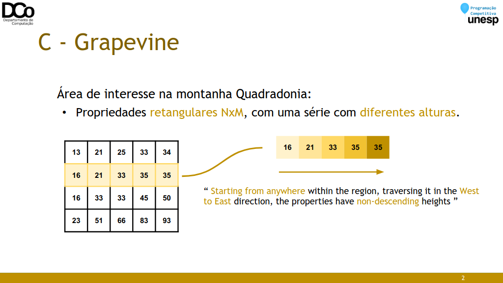
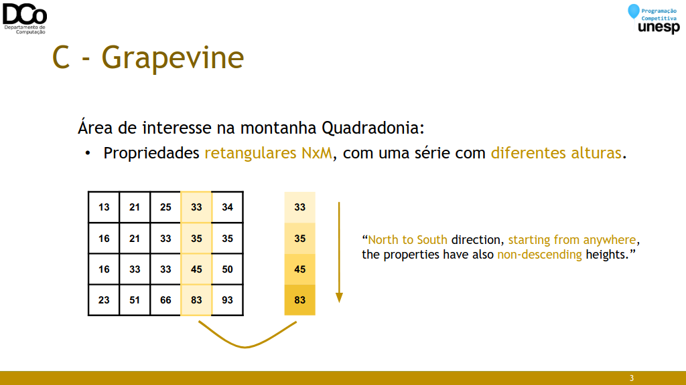
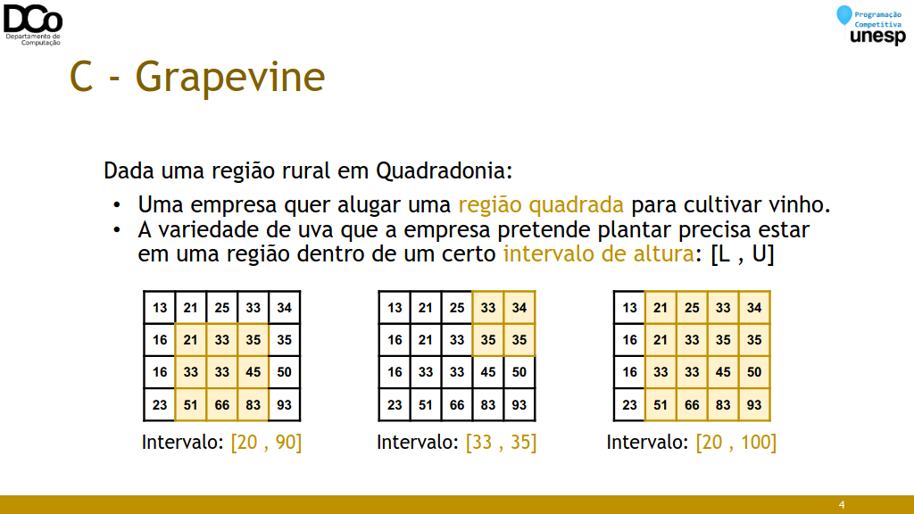
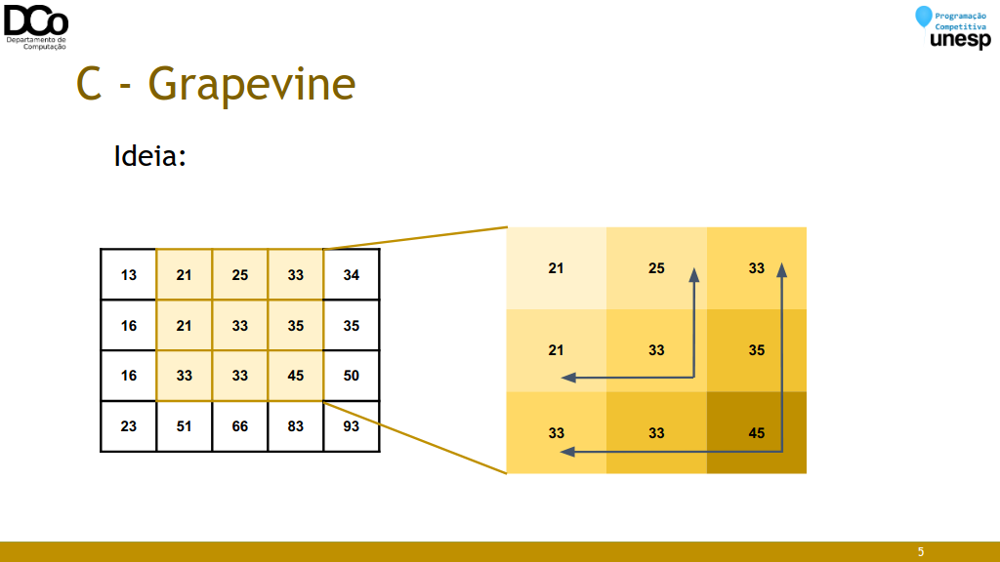
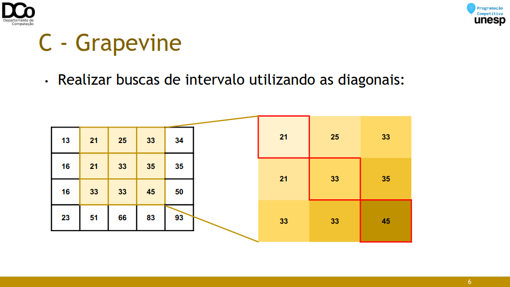

## Resolução dos Exercícios
### Exercícios: C e E

### C - Grapevine







- Solução: O(q*n*log^2(min(n,m)))
``` C++
while (cin >> n >> m){
    if (n == 0 && m == 0) break;
    v = vector<vector<ll>>(n, vector<ll>(m));
    for (int i = 0; i < n; i++)
        for (int j = 0; j < m; j++)
            cin >> v[i][j];
        ll q,l,u;
        cin >> q;
        while (q--){
            cin >> l >> u;
            cout << busca_binaria(l, u) << "\n";
        }
    cout << "-\n";
}

ll busca_binaria(ll &l, ll &u)
{
    ll ini = 1, fim = min(n, m), ans =0;
    while (ini <= fim){
        ll mid = (ini + fim) / 2;
        bool possivel = false;
        for (int i = 0; i < n; i++){
            //Encontra a posicao j na linha i em que v[i][j] é >= l
            int j = lower_bound(v[i].begin(), v[i].end(), l) - v[i].begin();
            //Verifica se para dado tamanho de quadrado 
            // existe essa posicao na matriz
            if (verifica(i + mid - 1, (j + mid - 1))){
                possivel = 1;
                if (v[i][j] > u) possivel = 0;
                else if (v[i][j] >= l && v[i][j] <= u)
                    if (v[i + mid - 1][j + mid - 1] > u)
                    possivel = 0;
                else
                possivel = 0;
                if (possivel) break;
            }
        }
        if (possivel){
            ans = mid;
            ini = mid + 1;
        } else fim = mid - 1;
    }
    return ans;
}
```

• Solução: O(q * n * log(min(n,m)))
``` C++
ll u = max(n, m);
vector<vector<ll>> v (n, vector<ll> (m));
vector<vector<ll>> diag (2*u + 1);
for(int i = 0; i < n; i++){
    for(int j = 0; j < m; j++){
    cin >> v[i][j];
    diag[u + (i - j)].push_back(v[i][j]);
    }
}
while(q--){
    cin >> a >> b;
    tam = 0;
    if(a > b)swap(a, b);
    for(int i = 0; i < n; i++){
        ll indd = lower_bound(v[i].begin(), v[i].end(), a) - v[i].begin();
        ll indu = upper_bound(v[i].begin(), v[i].end(), b) - v[i].begin();
        xma = indu - indd;
        indu--;
        if(indu >= 0)
            yma = upper_bound(diag[u + (i - indu)].begin(), 
                diag[u + (i - indu)].end(), b)
            lower_bound(diag[u + (i - indu)].begin(), 
                diag[u + (i - indu)].end(), a);
        else yma = 0;
        tam = max(tam, min(xma, yma));
    }
    cout << tam << "\n";
}

sort(begin(v), end(v));
ll tempo = abs(a-b);
vector<ll> res;
ll cont = 0;
ll tempof = tempo;
if(a < b) tempof += a-1;
else tempof += n-a;
for(int i = m-1; i >= 0; i--){
    if(cont == tempo-1)break;
    if(v[i] + cont + 1 <= tempof){
        cont++;
    }
}
cout << cont << "\n";
```
