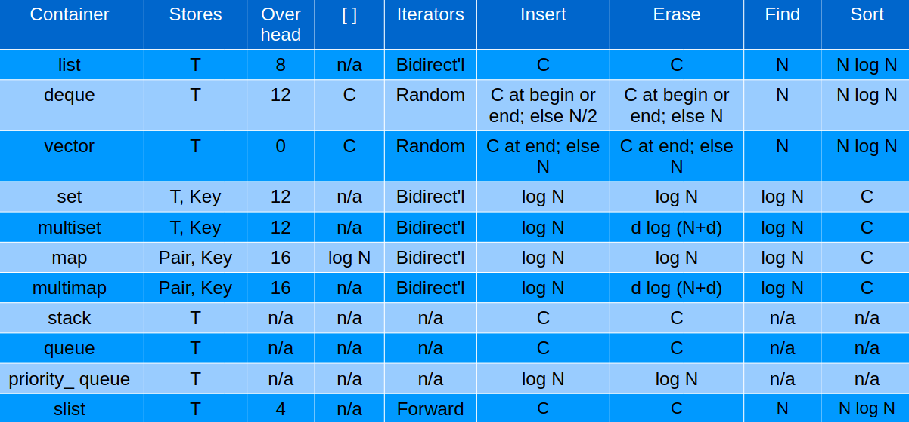

## Sequenciais e Adaptadores
### Introdução
- O STL é uma biblioteca frequentemente incluída nos compiladores cpp.
- Ela fornece elementos do tipo containers, iteradores, algoritmos e functores (funções objetos)
- Eles podem ser usados com praticamente qualquer tipo de dado

### Containers
#### Sequenciais
-  vector
-  list
-  deque 

#### Adaptadores
-  queue
-  stack
-  priority_queue

### Associativos
-  set, multiset,
-  map e multimap
-  hash_set, hash_multiset
-  hash_map e hash_multimap

### Como escolher um container?
- A escolha de um container depende das características específicas desejadas
- operações disponíveis
- complexidade de cada operação
- Tabela comparativa em http://www.cplusplus.com/reference/stl/

### Containers



C = amortized constant time
http://www.tantalon.com/pete/cppopt/appendix.htm

### vector
- Sequência contígua de dados com tamanho variável.
```cpp
#include <cstdio>
#include <vector>
using namespace std;
int main() {
    vector<float> vf;
    vf.push_back(1.23);
    vf.push_back(9.87);
    vf.push_back(6.45);
    printf("%f, %f, %f, %f, %d\n", 
    vf[0], vf[1], vf[2], vf[10], vf.size());
    printf("%f\n", vf.back());
    vf.pop_back();
    printf("%f, %f, %f, %d\n", vf[0], vf[1], vf[2], vf.size());
    return 0;
}
```
Obtém-se:
```
1.230000, 9.870000, 6.450000, 0.000000 (lixo), 3
6.450000
1.230000, 9.870000, 6.450000 (lixo), 2
```

### list
- Lista sequencial de dados com tamanho variável.
``` cpp
#include <cstdio>
#include <list>
using namespace std;
    struct Ponto {
    float x, y;
    Ponto(float X, float Y) {
        x = X;
        y = Y;
    }
};

// Obs: o operador [ ] não pode ser usado em list

int main() {
    list<Ponto> lPt;
    Ponto p(1.2, 2.3);
    lPt.push_back(p);
    lPt.push_front(Ponto(4.5, 5.6));
    lPt.push_back(Ponto(6.7, 7.8));
    int n = lPt.size();
    for (int i = 0; i < n; i++) {
        printf("(%f, %f)\n", lPt.front().x, lPt.front().y);
        lPt.pop_front();
    }
    return 0;
}
```

Obtém-se:
```
(4.500000, 5.600000)
(1.200000, 2.300000)
(6.700000, 7.800000)
```

### Ordenação (estável) em list
- list pode se ordenar usando a função membro sort()
``` cpp
#include <cstdio>
#include <list>
using namespace std;
struct Ponto {
    float x, y;
    Ponto(float X, float Y) {
        x = X;
        y = Y;
    }
};
    bool ordem(Ponto &p1, Ponto &p2) {
    return p1.x < p2.x;
}

int main() {
    list<Ponto> lPt;
    lPt.push_back(Ponto(1.2, 2.3));
    lPt.push_front(Ponto(4.5, 5.6));
    lPt.push_back(Ponto(6.7, 7.8));
    lPt.sort(ordem);
    int n = lPt.size();
    for (int i = 0; i < n; i++) {
        printf("(%f, %f)\n", lPt.front().x, lPt.front().y);
        lPt.pop_front();
    }
    return 0;
}
```

Obtém-se:
```
(1.200000, 2.300000)
(4.500000, 5.600000)
(6.700000, 7.800000)
```

- list pode se ordenar usando a ordem natural
``` cpp
#include <cstdio>
#include <list>
using namespace std;
struct Ponto {
    float x, y;
    Ponto(float X, float Y) {
        x = X;
        y = Y;
    }
    bool operator<(Ponto &p) {
        return x < p.x;
    }
};

// O “operator<” determina a ordem natural dos Ponto’s

int main() {
    list<Ponto> lPt;
    lPt.push_back(Ponto(1.2, 2.3));
    lPt.push_front(Ponto(4.5, 5.6));
    lPt.push_back(Ponto(6.7, 7.8));
    lPt.sort();
    int n = lPt.size();
    for (int i = 0; i < n; i++) {
        printf("(%f, %f)\n", lPt.front().x,
        lPt.front().y);
        lPt.pop_front();
    }
    return 0;
}
```

Obtém-se:
```
(1.200000, 2.300000)
(4.500000, 5.600000)
(6.700000, 7.800000)
```

### Exercício usando list
- Resolva o problema URI 1244
- Recomendações
    - Use `list<string>` para definir a lista.
    - Use a função membro sort() da list pois, após a ordenação, o problema precisa que os elementos de mesmo comprimento permaneçam na ordem original, ou seja, a ordenação deve ser estável.

### Outras operações em list
- Funções membros
    - `splice` Move elementos de uma lista para outra
    - `remove` Remove elementos com valor específico
    - `remove_if` Remove elementos com condição
    - `merge` Junta listas ordenadas
    - `sort` Ordena elementos no container
    - `reverse` Inverte a ordem dos elementos

### Deque - Double-Ended QUEue
- Semelhante à vector
    - permite inserir e remover do início e fim da sequência
    - operador `[]`
    - sem as operações de list

### Stack - Last In First Out - Pilha
- Funções membros
    - `empty` testa se o container está vazio
    - `size` retorna o tamanho
    - `top` faz acesso ao próximo elemento
    - `push` adiciona um elemento ao topo
    - `pop` remove o elemento do topo

### Exercício usando pilha
- Resolva o problema Plug-in do Codeforces
    - https://codeforces.com/contest/81/problem/A
- Recomendações
    - Use stack<char> para definir uma pilha.
    - Quando o último caractere lido for igual ao do topo da pilha, o caractere deve ser ignorado e também retirado do topo da pilha.

### Queue (Fila) - First In First Out
- Funções membros
    - `empty` Testa se o container está vazio
    - `size` Retorna o tamanho
    - `front` Faz acesso ao primeiro elemento
    - `back` Faz acesso ao último elemento
    - `push` Insere um elemento no final da fila
    - ``pop` Apaga o primeiro elemento da fila

### Uso de queue
``` cpp
#include <cstdio>
#include <queue>
#include <cstring>
using namespace std;
struct Pessoa {
    char nome[30];
    float salario;
    Pessoa(char nome[],
    float sal) {
    strcpy(this->nome, nome);
    salario = sal;
    }
};

int main () {
    queue<Pessoa> fila;
    fila.push(Pessoa("Rene", 10.00));
    fila.push(Pessoa("Maria", 80.00));
    fila.push(Pessoa("Jose", 50.00));
    while (!fila.empty()) {
        printf("%s ", fila.front().nome);
        fila.pop();
    }
    return 0;
}

int main () {
    queue<Pessoa> fila;
    fila.push(Pessoa("Rene", 10.00));
    fila.push(Pessoa("Maria", 80.00));
    fila.push(Pessoa("Jose", 50.00));
    while (!fila.empty()) {
        printf("%s ", fila.front().nome);
        fila.pop();
    }
    return 0;
}
```

### priority_queue – Fila com Prioridade
- Fila com critério de prioridade
    - se o critério for igual, vale a ordem de entrada
``` cpp
#include <cstdio>
#include <queue>
#include <string>
using namespace std;
struct Pessoa {
    string nome; float sal;
    Pessoa(string nome, float sal) {
        this->nome = nome;
        this->sal = sal;
    }
    bool operator<(Pessoa &p) {
        return sal < p.sal;
    }
};

int main () {
    priority_queue<Pessoa> fila;
    fila.push(Pessoa("Pedro", 10.00));
    fila.push(Pessoa("Maria", 80.00));
    fila.push(Pessoa("Jose", 50.00));
    while (!fila.empty()) {
        printf("%s ", fila.top().nome.c_str());
        fila.pop();
    }
    return 0;
}
```

Obtém-se:
```
Maria Jose Pedro
```

### Exercício usando priority_queue
- Resolva o problema URI 1244 agora usando priority_queue
- Recomendações
    - Use `priority_queue<string>` para definir a lista.
    - Coloque como critério de prioridade o número de caracteres da palavra, quando terminar de inserir todas as palavras a ordem já estará como exigida no problema.
