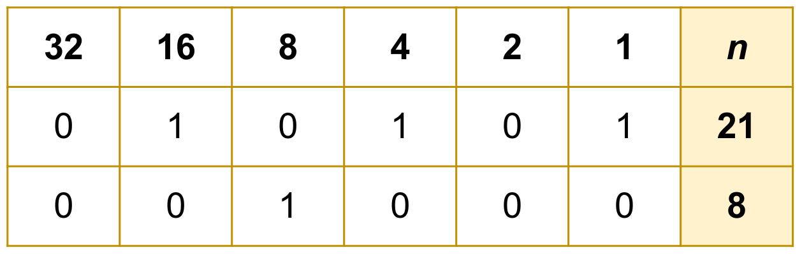
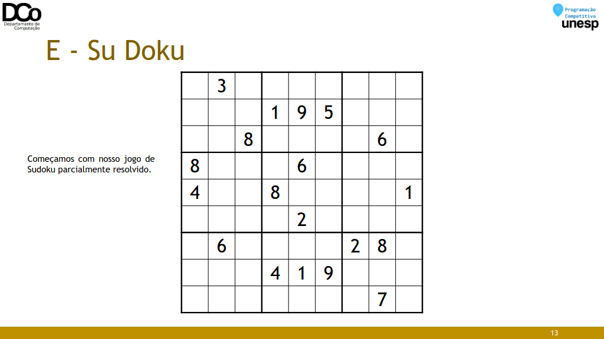

## Resolução dos Exercícios
### Exercícios: E e F

### F - Factorials and Powers of Two
- Um número é considerado powerful se:
    - Potência de dois ou,
    - Fatorial
- ou seja, o número m é powerful se existe um inteiro d não negativo:
    - m = 2^d ou,
    - m = d!

- Dado um valor n, encontre o mínimo número k tal que n possa ser representado como a soma de k números distintos que são powerful.
- Exemplos:

240 = 24 + 32 + 64 + 120 (k = 4)

240 = 120 + 120 (INVÁLIDO)

7 = 1 + 2 + 4 (k = 3)
7 = 1 + 6 (k = 2)
Solução: 2

- Se n não pode ser representado pela soma de distintos números powerful, print -1
- Essa situação nunca irá acontecer pois qualquer número inteiro pode ser representado pela soma de potências de dois.



- Sendo assim, a quantidade de bits ativos no número n como o mínimo valor para k.

- A solução ótima pode ser formada por uma das seguintes situações:

- Situação 1:
    - Soma somente de valores potências de dois.

- Situação 2:
    - Soma somente de valores que são fatoriais.

- Situação 3:
    - Soma de potências de dois com soma de fatoriais.

- Situação 1: Soma somente de valores potências de dois.
    - Esse é nosso limite inferior de k, podemos calcular contando quais são os bits ativos de n.
``` cpp
ll bits_ativos(ll n){
    ll x = 0, pot = 1, k = 0;
    while (n > x){
        if (num & (pot)){
            x += (pot);
            k++;
        }
        pot *= 2;
    }
    return k;
}
```

- Equivalente com complexidade O(numero_de_bits) :
``` cpp
ll bits_ativos(ll n){
return __builtin_popcountll(n);
}
``` 
[Builtin functions of GCC compiler](https://www.geeksforgeeks.org/builtin-functions-gcc-compiler/)

- Situação 2: Soma somente de valores que são fatoriais.
 - Primeiro, precisamos saber quais são os fatoriais possíveis. No problema é descrito que n <= 10¹² , logo, precisamos apenas pré-calcular até o fatorial 14!, já que 15! = 1.307.674.368.000 > 10¹².
``` cpp
#define MAX_FAC 14
fac = vector<ll>(MAX_FAC + 1);
void pre_processar_fatoriais(){
    ll x = 1;
    for (int i = 1; i <= MAX_FAC; i++){
        x *= i;
        fac[i] = x;
    }
}
``` 
- Todos fatoriais que podem ser usados no problema:

Fatoriais (14) = {1, 2, 6, 24, 120, 720, 5040,
40320, 362880, 3628800, 39916800,
479001600, 6227020800, 87178291200}

- Situação 2: Soma somente de valores que são fatoriais.
    - Como o número de fatoriais possíveis é 14, conseguimos pré-calcular todas as somas possíveis entre esses fatoriais. Ou seja, gerar todos subsets de soma possíveis para os 14 números. O(2¹⁴ ), como 2¹⁴ = 16.384, passa tranquilo no problema.
``` cpp
void subset_sum_fac(ll x){
if (x == MAX_FAC+1){
    ll sum = 0;
    for (int i = 0; i < subset.size(); i++){
        sum += fac[subset[i]];
    }
    if(fac_sub[sum]!=0)
        fac_sub[sum] = min(fac_sub[sum],subset.size());
    else
        fac_sub[sum] = subset.size();
}
else{
    subset.push_back(x);
    subset_sum_fac(x + 1);
    subset.pop_back();
    subset_sum_fac(x + 1);
    }
}
``` 

- Situação 3: Soma de potências de dois com soma de fatoriais
    - Como todas as somas de todos possíveis fatoriais podem ser salvas em um map, podemos passar por cada uma das somas que encontramos na Situação 2 e calcular um número x que diz quanto falta para a soma da Situação 2 chegar em n. Assim, conseguimos calcular para x a Situação 1.
``` cpp
for (map<ll, ll>:: iterator itr =
fac_sub.begin();itr!=fac_sub.end();++itr)
{
    ll a = itr->first;
    if (a > n) break;
    ll x = n - a; //Quanto falta para a soma 'a' chegar em 'n'
    minimo = min(minimo, bits_ativos(x) + fac_sub[a]);
}

Sit_1 = bits_ativos();

Sit_2 = todas_somas_possiveis_dos_fatoriais
    for(i=0;i<=Sit_2.size();i++)
    Sit_3 = min(Sit_3, Sit_2 [i] + Sit_1 (n - Sit_2 [i]))
k_minimo = min (Sit_1(n) , Sit_3 )
``` 

### E - Su Doku
- Dado um valor N e uma grade N 2 xN 2 de um Sudoku parcialmente resolvida, o objetivo é completar o quebra-cabeças, inserindo números de 1 até N 2 nas células vazias de modo que:

- todos os números que compõem uma linha sejam distintos;
- todos os números que compõem uma coluna sejam distintos;
- todos os números que componham uma subgrade de tamanho NxN sejam distintos.

- Confira na GIF abaixo:


``` cpp
int main() {
    // leitura do tamanho do tabuleiro e alocação da matriz do Sudoku
    while (cin >> n) {
        n *= n;
        sudoku = vector<vector<int>>(n, vector<int>(n));
        // leitura do Sudoku
        for (int i = 0; i < n; i++)
            for (int j = 0; j < n; j++)
                cin >> sudoku[i][j];
        // se o tabuleiro apresentar solução
        if (solve(0, 0)) {
            // imprime a solução
            for (int i = 0; i < n; i++) {
                for (int j = 0; j < n; j++)
                    cout << sudoku[i][j] << " ";
            cout << "\n";
            }
        } else
            // caso contrário, imprime que não há solução viável
        cout << "NO SOLUTION\n";
        }
    return 0;
}

bool solve(int row, int col) {
    // verifica se chegou ao final da coluna atual
    if (col == n) {
        // se sim, pula para a linha de baixo e volta para primeira coluna
        col = 0;
        row++;
        // caso passe da última linha, o quebra-cabeças tem solução e 
        // retorna verdadeiro
        if (row == n)
            return true;
    }
    // verifica se a célula atual é uma célula vazia
    if (sudoku[row][col] == 0) {
        // sendo uma célula vazia, vamos tentar inserir valores de 1 
        // até n^2 nela
        for (int i = 1; i <= n; i++) {
            // verificamos se é possível inserir o valor i, respeitando as 
            // regras do jogo
            if (verify(row, col, i)) {
                // em caso afirmativo, alteramos o valor da célula
                sudoku[row][col] = i;
                // e tentamos resolver a próxima casa
                if (solve(row, col + 1))
                    return true;
            }
        }
        // se nenhum valor retornar uma solução válida, esvaziamos a casa
        sudoku[row][col] = 0;
    } else
        // se já é uma célula com valor, avançamos para a próxima 
        // coluna apenas
        return solve(row, col + 1);
    // se o código chegar até aqui, quer dizer que, para o tabuleiro no 
    // estado atual, não tem solução
    // assim, retornamos na recursão, e tentamos achar uma solução para 
    // próxima configuração
    return false;
}

bool verify(int row, int col, int elem) {
    for (int i = 0; i < n; i++) {
        // verifica se existem elementos repetidos na linha
        // caso exista elemento repetido, retorna falso
        if (sudoku[i][col] == elem)
            return false;
        // verifica se existem elementos repetidos na coluna
        else if (sudoku[row][i] == elem)
            return false;
    }
    // determina o inicio da linha e da coluna do subquadrado atual
    int sq, sub_row, sub_col;
    sq = sqrt(n);
    sub_row = row / sq * sq;
    sub_col = col / sq * sq;
    // verificar se existem elementos repetidos no subquadrado
    for (int i = sub_row; i < sub_row + sq; i++) {
        for (int j = sub_col; j < sub_col + sq; j++) {
        // caso exista elemento repetido, retorna falso
            if (sudoku[i][j] == elem)
                return false;
        }
    }
    // se chegou até aqui, todas as especificações foram atendidas e retorna 
    // verdadeiro
    return true;
}
``` 

- Complexidade: O(N^M), onde N é quantidade de números possíveis de serem inseridos em cada célula do Sudoku e M a quantidade de células vazias. Ex: Sudoku resolvido, 9x9 com 63 casas vazias, teria complexidade O(9⁶³ ).
