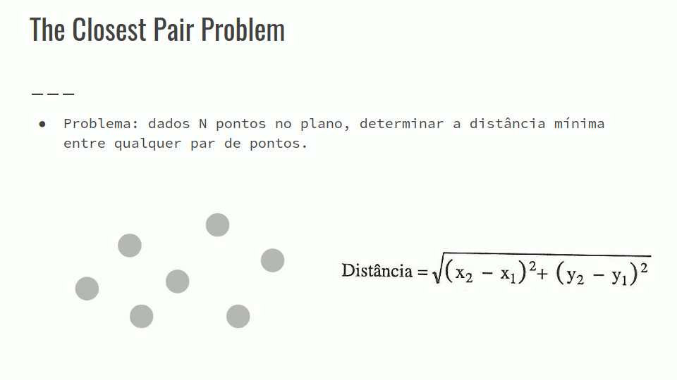
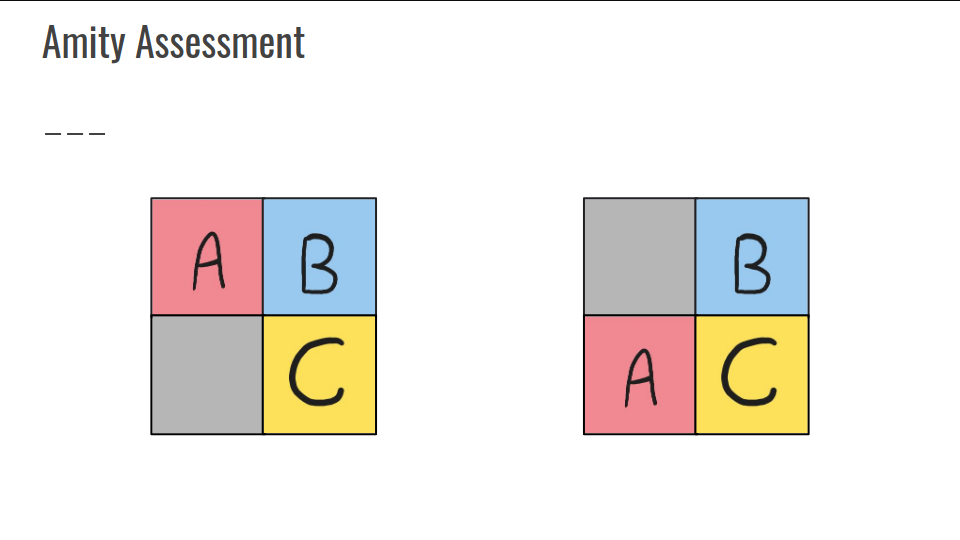
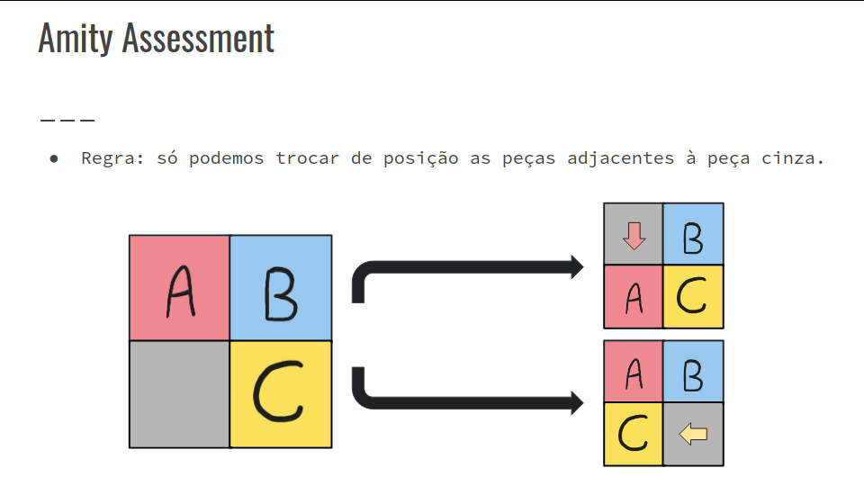
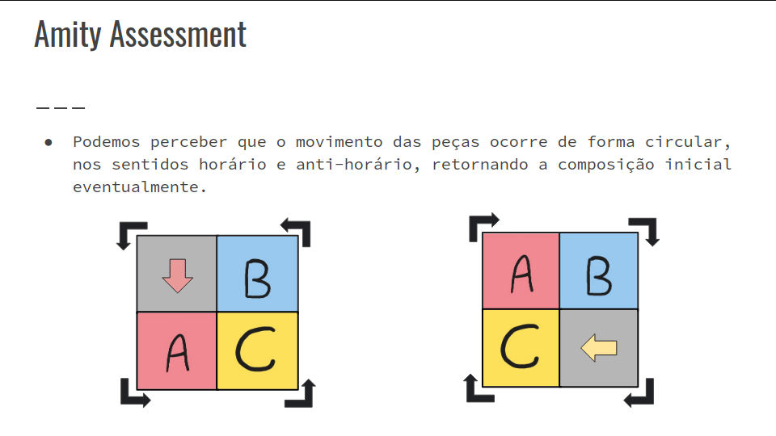
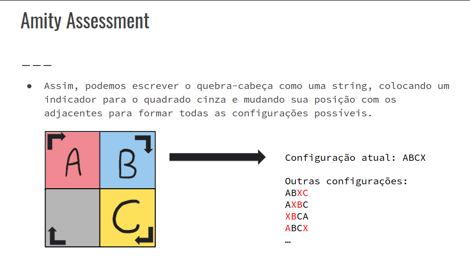
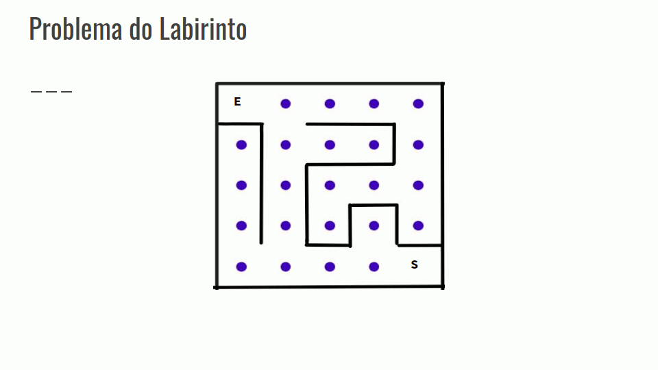

## Paradigmas de Projeto de Algoritmos
- Determinados problemas requerem abordagens adequadas em suas resoluções;
- Dependendo da estratégia adotada, o desempenho do algoritmo pode ser ineficiente, resultando em TLE;
- Os paradigmas são como estratégias de como abordar e modelar uma solução de maneira eficiente quando aplicados corretamente.

### Exemplos
- Indução Matemática
- Força Bruta
- Recursividade
- Backtracking (Tentativa e Erro)
- Algoritmos Gananciosos
- Divisão e Conquista
- Programação Dinâmica
- Algoritmos Aproximados (Heurísticas)

### Força Bruta
- Algoritmos simples;
- Percorrem o espaço de busca do problema, procurando todas as possíveis soluções candidatas, verificando quais satisfazem a questão inicial;
- Varredura “cega”;
- Útil para pequenos problemas;
- Fácil implementação;
- Sempre que existir uma solução, o algoritmo irá encontrá-la.
- Exigem grande esforço computacional, seu custo tende a crescer exponencialmente.

#### The Closest Pair Problem
- Confira a GIF abaixo:


``` C++
double euclidean(double x1, double y1, double x2, double y2) {
    return (x1 - x2) * (x1 - x2) + (y1 - y2) * (y1 - y2);
}

int main() {
    int n;
    cin >> n;

    vector<double> x(n), y(n);

    for (int i = 0; i < n; i++)
        cin >> x[i] >> y[i];

    double mi = INF;

    for (int i = 0; i < n; i++) {
        for (int j = i + 1; j < n; j++) {
            double dist = sqrt(euclidean(x[i], y[i], x[j], y[j]));
            mi = min(mi, dist);
        }
    }

    cout << dist << "\n";

    return 0
}
```

#### Amity Assessment








#### Sugestão de Problemas
- [The Closest Pair Problem](https://onlinejudge.org/index.php?option=onlinejudge&page=show_problem&problem=1186) - UVa
- [Amity Assessment](https://onlinejudge.org/index.php?option=onlinejudge&page=show_problem&problem=1186) - Codeforces

### Recursividade
- Mecanismo no qual a definição de uma função ou de um objeto se refere ao próprio objeto definido;
- Permite descrever problemas que utilizam estruturas recursivas de forma clara e concisa;
- Um procedimento que opera em termos de si mesmo é dito ser recursivo.

#### Gerando Subconjuntos
- Nossa primeira aplicação da recursão será gerar todos os subconjuntos de um conjunto de N elementos;

#### Gerando Permutações
- A segunda aplicação de recursão que veremos será gerar todas as permutações de um conjunto de N elementos;

#### Desafio
- [Amity Assessment](https://codeforces.com/problemset/problem/645/A) - Codeforces
    - Generalizar a solução do problema para 2 ≤ N ≤ 10, elencando todas as possíveis soluções do quebra-cabeças com um algoritmo recursivo.

### Backtracking
- Aperfeiçoamento do algoritmo de força bruta;
- Várias soluções da força bruta são eliminadas, visto que não são testadas;
- Inicialmente se tem uma solução vazia e vamos estendendo ela passo apasso, incrementalmente.

#### Problema das Rainhas
- Calcular o número de maneiras de se colocar N rainhas em um tabuleiro NxN.
- Em um problema de backtracking inicia-se com uma solução vazia, nesse caso com o tabuleiro vazio.
- A partir do tabuleiro vazio a solução é estendida passo a passo até que se consiga colocar todas as N rainhas.

- Confira a GIF abaixo:


``` C++
#include <bits/stdc++.h>
using namespace std;

typedef long long ll;

vector<bool> diagonal, diagonal2, coluna, linha;

ll n;

ll cont = 0;

void colocar_rainha(ll lin, ll col) {
    if (lin == n+1) {
        cont++;
        return;
    }
    
    if (col == n+1) return;

    if (diagonal[n + (lin - col)] || diagonal2[lin+col] 
        || coluna[col] || linha[lin]) {
        colocar_rainha(lin, col+1);
    }

    else {
        colocar_rainha(lin+1, 0);
    }

    return;
}
```

#### Sugestão de Problemas
- [Chessboard and Queens](https://cses.fi/problemset/task/1624) - CSES
- [MKJUMPS](https://www.spoj.com/problems/MKJUMPS/) - SPOJ

#### Problema do Labirinto
- Encontrar um caminho da entrada do labirinto até a saída.
- Gerar a solução por partes, e quando encontrarmos em um beco sem saída, retornar os passos até que se possa ter acesso à outro caminho.
- Confira na GIF abaixo:



``` C++
#include <bits/stdc++.h>
using namespace std;

typedef long long ll;

vector<pair<ll,ll>> mov = {{0, 1}, {1, 0}, {-1, 0}, {0, -1}};
vector<vector<bool>> vis;
ll linha_final = 5, coluna_final = 5;

bool flag = false;

void andar(ll lin, ll col) {
    if (flag) return;

    if (lin == linha_final && col == coluna_final) {
        flag = true;
        return;
    }

    if (vis[lin][col]) return;
    vis[lin][col] = true;

    for (int i = 0; i < mov.size(); i++) {
        ll nova_linha, nova_coluna;
        nova_linha = lin + mov[i].first;
        nova_coluna = col + mov[i].second;
        andar(nova_linha, nova_colunar);
    }

    return;
}
```

#### Sugestão de Problemas
- Grid Paths - CSES - Difícil
- Labyrinth - CSES

#### Problema do Sudoku
- Problema: dado um Sudoku parcialmente resolvido, determinar se existe solução para aquele problema;
- [Vídeo de explicação do problema do Sudoku](https://www.youtube.com/watch?v=JzONv5kaPJM)
