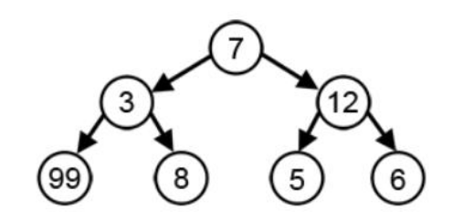
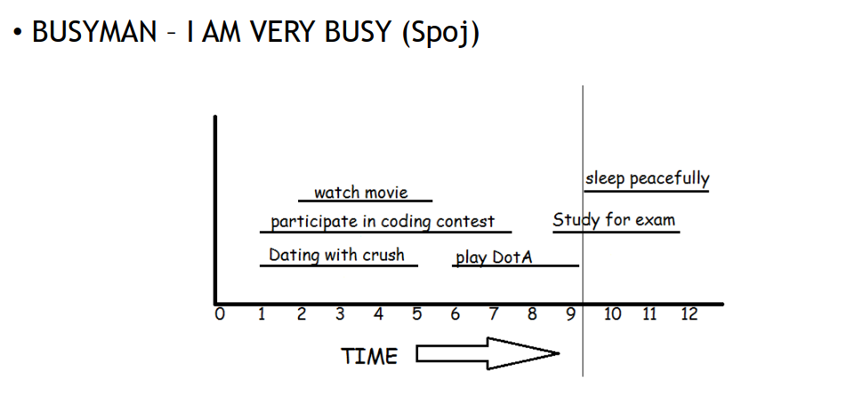
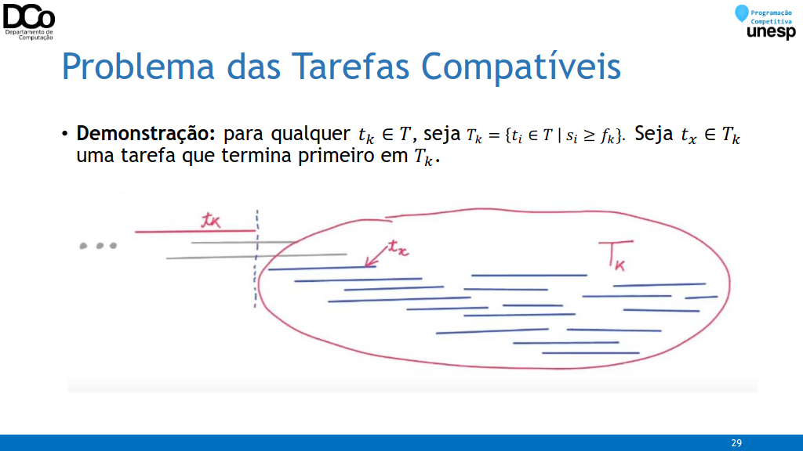
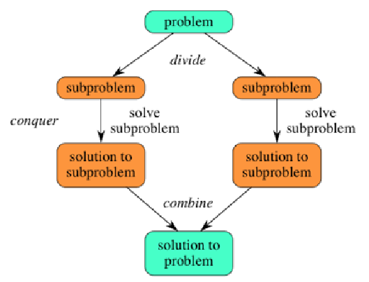
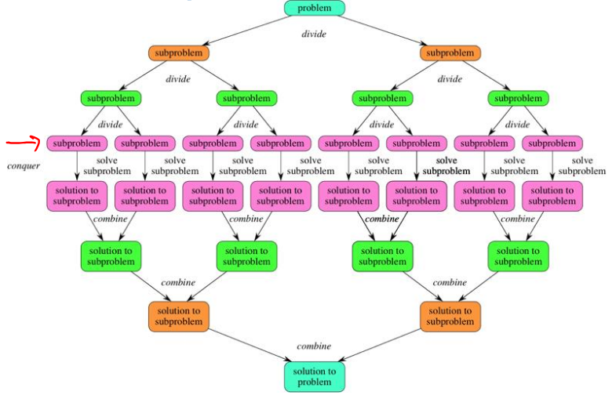
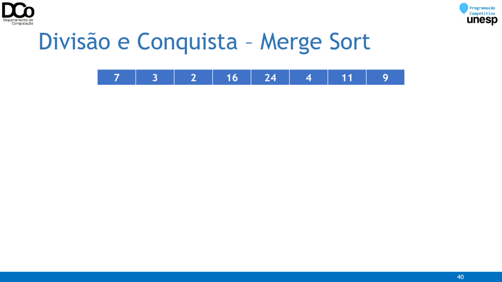
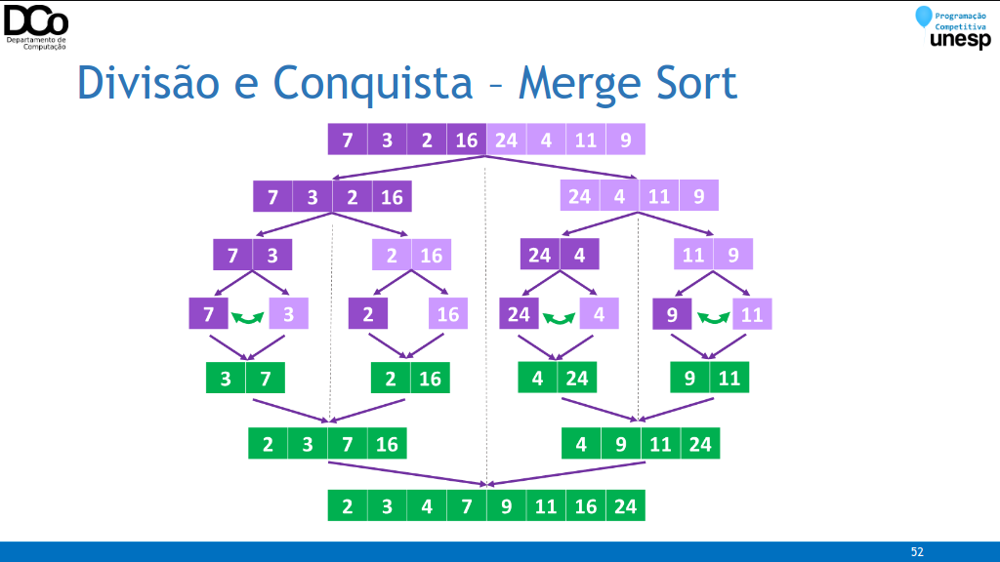
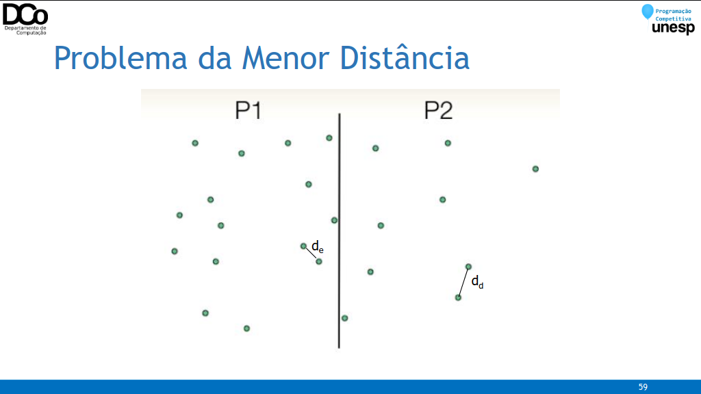
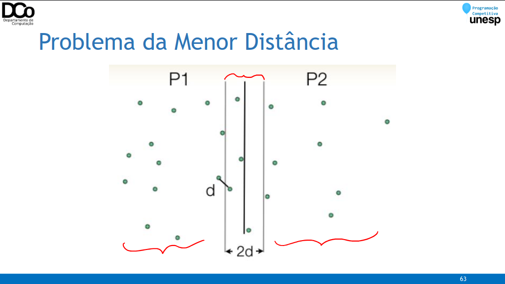

### Algoritmos Gulosos
• Um algoritmo guloso (ou ganancioso, greedy algorithm) é um algoritmo
que constrói uma solução para um problema, passo-a-passo, sempre
fazendo as escolhas que parecem mais vantajosas naquele momento.
• Um algoritmo guloso nunca se arrepende, não desfaz escolhas já feitas
• É um algoritmo “míope”, ele toma decisões com base nas informações
disponíveis na iteração corrente, sem olhar as consequências que essas
decisões terão no futuro.
• Vantagens:
• Implementações simples, normalmente
• Algoritmos eficientes
• Desvantagens:
• Nem sempre conduz a soluções ótimas globais
• Quando conduz, a prova costuma ser difícil

![img1}(img1.png)

• Problema do caminho de maior soma



### Problema do Troco
• Problema: dar troco de um valor x com o menor número de moedas
possíveis.
• Solução por backtracking: Serão testadas diversas combinações de
moedas, adicionando uma moeda à solução, até encontrar uma solução
que resulte em x. Além disso, esse método admite algumas melhorias:
• Podemos tentar adicionar na solução parcial sempre a moeda de maior valor
possível. Com isso caminharemos mais rapidamente para a solução que usa o menor
número de moedas.
• Já tendo encontrado uma solução que utiliza k moedas, qualquer solução parcial
que utilize mais que k moedas pode ser cortada.
``` C++
vector<int> moedas = {50, 25, 10, 5, 1};
vector<int> melhorSolucao;
int qtdeMoedas = INT_MAX;
void troco(int x, vector<int> &solucaoAtual){
    if (solucaoAtual.size() >= qtdeMoedas)
        return;
    if (x == 0){
        melhorSolucao = solucaoAtual;
        qtdeMoedas = solucaoAtual.size();
    }
    for(int m : moedas){
        if (m > x)
            continue;
        solucaoAtual.push_back(m);
        troco(x-m, solucaoAtual);
        solucaoAtual.pop_back();
    }
}
``` 

• Problema: dar troco de um valor x com o menor número de moedas
possíveis.
• Já vimos a solução utilizando backtracking.
• Nesta solução, vimos que era uma boa estratégia escolher sempre a
maior moeda possível, pois isso levaria a solução que utiliza menos
moedas mais rapidamente.
• Porém, não tínhamos certeza se isso levaria a solução diretamente,
por isso diversas outras possibilidades ainda eram avaliadas.
• Utilizando uma abordagem gulosa, vamos tentar considerar sempre
uma única opção: escolher a moeda de maior valor possível

• Exemplos: Suponha que temos disponíveis moedas de 1, 5, 10 e 25
centavos.
41 centavos
41 - 25 = 16
16 - 10 = 6
6 - 5 = 1
1 - 1 = 0
41 = 25 + 10 + 5 + 1

 Exemplos: Suponha que temos disponíveis moedas de 1, 5, 10 e 25
centavos.
59 centavos
59 - 25 = 34
34 - 25 = 9
9 - 5 = 4
4 - 1 = 3
3 - 1 = 2
2 - 1 = 1
1 - 1 = 0
59 = 25 + 25 + 5 + 1 + 1 + 1 + 1

• Contra-exemplo: Suponha que estamos em um país onde existem apenas
as moedas de 1, 5 e 8 centavos.
11 centavos
11 - 8 = 3
3 - 1 = 2
2 - 1 = 1
1 - 1 = 0
11 = 8 + 1 + 1 +1
• PORÉM, poderíamos obter um troco com 3 moedas: 11 = 5 + 5 + 1

• Quando o algoritmo guloso falha para o problema do troco?
• Quando existem moedas x, y tal que x < y e 2x > y.
• Moedas: 1, 5, 10, 25, 50 OK
• Moedas: 1, 5, 8 Falha

### Maximum product subset of an array
• Problema: encontrar o maior produto possível de um subconjunto de elementos
de um vetor de inteiros.
• Exemplos
Entrada: a[] = {-5, 0, 2, 5, 5}
Saída: 50 = 2 * 5 * 5
Entrada: a[] = {-1, 0}
Saída: 0
Entrada: a[] = {-1, -1, -2, 4, 3}
Saída: 24 = (-1) * (-2) * 4 * 3

Algoritmo por força bruta ou backtracking: testar todos os subconjuntos
possíveis. O(2^n)
• Algoritmo guloso: para o algoritmo guloso temos que nos basear nos seguintes fatos:
a) Se temos números positivos: selecionamos todos eles.
b) Se temos uma quantidade par de números negativos: selecionamos todos eles.
c) Se temos uma quantidade ímpar de números negativos: selecionamos todos, com exceção do maior (com menor valor absoluto).
d) Não escolhemos nenhum zero, a não ser que só tenhamos zeros, com no máximo um número negativo O(n)

Entrada: a[] = {-5, 0, 2, 5, 5}
Saída: 50 = 2 * 5 * 5
Entrada: a[] = {-1, 0}
Saída: 0 = 0
Entrada: a[] = {-1, -1, -2, 4, 3}
Saída: 24 = (-1) * (-2) * 4 * 3
Entrada: a[] = {-4, -5, 0, 2, 3}
Saída: 120 = (-4) * (-5) * 2 * 3

### Problema das Tarefas Compatíveis
• Problema: suponha um conjunto T = {t1, t2, ..., tn} de n tarefas
propostas que desejam um recurso (como uma sala de conferências), o
qual só pode ser utilizado por uma única tarefa de cada vez.
• Cada tarefa ti tem um tempo de início si e um tempo de término fi,
em que si < fi.
• As tarefas ti e tj são compatíveis sse os intervalos [si, fi) e [sj, fj) não
se sobrepõem (si >= fj ou sj >= fi)
• Objetivo: selecionar um subconjunto de tamanho máximo de tarefas
mutuamente compatíveis.



 Solução por força bruta ou backtracking: testar todos os possíveis
subconjuntos.
• Estratégia gulosa: vamos tentar pensar em critérios simples de seleção
de tarefas, e verificar o que acontece:
• Selecionar a tarefa de menor duração
• Selecionar a tarefa de menor si
• Selecionar a tarefa de menor fi

• De fato, este problema pode ser resolvido utilizando um algoritmo guloso
em que a próxima atividade i selecionada é a que possui menor tempo fi
e é compatível com a última tarefa j selecionada (si >= fj)
``` 
Escalona(T, s, f, n)
    Ordene as tarefas em ordem crescente de tempo final
    S = {t1}
    k = 1
    para i = 2 até n faça
        se si >= fk então
            S = S ∪ {ti}
            k = i
    retorna S
``` 

• Teorema: dado um conjunto T = {t1, t2, ..., tn} com n tarefas onde cada
ti é realizado no intervalo [si, fi), o algoritmo Escalona(T, s, f, n) devolve
uma solução ótima para o problema de tarefas compatíveis.
• Para demonstrar este teorema, tentaremos mostrar que qualquer tarefa
escolhida por este algoritmo está em uma solução ótima. Sendo assim,
por indução, ele sempre levará a uma solução ótima.



• Demonstração: vamos supor que 𝑡𝑥 não está em uma solução ótima. Seja
então 𝑆𝑘 ⊆ 𝑇𝑘 uma solução ótima para 𝑇𝑘 e assuma que 𝑡𝑥 ∉ 𝑆𝑘.
• Seja 𝑡𝑦 ∈ 𝑆𝑘 uma tarefa que termina primeiro em 𝑆𝑘. Podemos definir
então o conjunto 𝑆𝑘′ = 𝑆𝑘 − 𝑡𝑦 ∪ {𝑡𝑥}.
• Como 𝑆𝑘 é solução viável, 𝑓𝑦 ≤ 𝑠𝑧 para toda 𝑡𝑧 ∈ 𝑆𝑘.
• Então, 𝑆𝑘′ é solução viável também.
• Como 𝑆𝑘 = |𝑆𝑘′ | , então 𝑆𝑘′ é ótima também. Chegamos em uma contradição, pois havíamos suposto que 𝑡𝑥 não fazia parte de uma solução ótima.

Divisão e Conquista
• Ideia geral:
1. DIVIDIR: Dividir a instância do problema em duas ou mais instâncias menores;
2. CONQUISTAR: Resolver as instâncias menores (geralmente recursivamente);
3. COMBINAR: Obter a solução para as instâncias originais (maiores) através da
combinação destas soluções
• Exemplos:
• Mergesort
• Quicksort
• Busca binária





• Algoritmos baseados em divisão e conquista são, em geral, recursivos.
• A maioria dos algoritmos de divisão e conquista divide o problema em
subproblemas da mesma natureza, de tamanho n/b.
• Existem três condições que indicam que a estratégia de divisão e
conquista pode ser utilizada com sucesso:
• Deve ser possível decompor uma instância em sub-instâncias
• A combinação dos resultados deve ser eficiente (trivial se possível)
• As sub-instâncias devem ser mais ou menos do mesmo tamanho

• Vantagens
• Resolução de problemas difíceis
• Pode gerar algoritmos eficientes (forte tendência a complexidade logarítmica)
• Facilmente paralelizável na fase da conquista (Em LPC isso não fará diferença)
• Desvantagens
• Número de chamadas recursivas
• Dificuldade na seleção dos casos bases
• Repetição de sub-problemas (pode ser resolvido com Programação Dinâmica)

img9 - img20 (montar gif)




### Divisão e Conquista - Exponenciação
• Exponenciação por força bruta em O(n):
``` C++
int potencia(int x, int n) {
    int y = 1;
    for(int i = 0; i < n; i++)
        y *= x;
    return y;
}
```


Problema da Menor Distância
• Dados n pontos no plano, determinar a distância mínima entre qualquer
par de pontos.


• Solução por força bruta
• Testar todos os possíveis pares de pontos. O(n²)
• Como aplicar Divisão e Conquista?
1. Vamos ordenar os pontos pela coordenada x.
2. Dividir o problema em duas partes: esquerda e direita
3. Resolver recursivamente os dois subproblemas gerados
4. Combinar os subproblemas para obter a solução do problema inicial




• Resolvendo os subproblemas P1 e P2 teremos a menor distância entre
dois pontos nesses dois setores. Vamos chamar essas distâncias de de e
dd.
• Com isso, podemos obter d = min(de, dd)
• Mas ainda falta analisar a distância entre pontos de sub-problemas
distintos, ou seja, de pontos que estão no setor P1 com pontos que estão
no setor P2.
• Devemos analisar TODOS os casos?
• Não! Somente os pontos que se encontram em uma faixa 2d em torno da linha
divisória, pontos além dessa linha não nos interessam, pois irão resultar em
distâncias maiores que d.
• Complexidade: O(n.log n)



### Divisão e Conquista
• Outros problemas clássicos:
• Multiplicação de Inteiros Grandes (Algorito de Karatsuba)
• Multiplicação de Matrizes (Algoritmo de Strassen)
• Sugestão: CodeForces 768B – Code For 1

### Referências
Aulas de Técnicas de Programação do Prof. Dr. Renê Pegoraro.
LAAKSONEN, A. Competitive Programmer’s Handbook.
Vídeo “Algoritmos gulosos e Problema das tarefas Compatíveis” da Profª. Drª. Carla Negri
Lintzmayer. https://www.youtube.com/watch?v=PCMcGPknMwk
https://www.ime.usp.br/~pf/analise_de_algoritmos/aulas/guloso.html
https://www.geeksforgeeks.org/greedy-algorithms/
http://www3.decom.ufop.br/toffolo/site_media/uploads/2011-
1/bcc402/slides/09._algoritmos_gulosos.pdf
https://docs.google.com/presentation/d/1rd4sxi2U6v3YNEJ0NRocFnVR64YBdJ2RsPffzjs9Q
FU/htmlpresent
https://pt.khanacademy.org/computing/computer-science/algorithms/merge-
sort/a/divide-and-conquer-algorithms
http://www3.decom.ufop.br/toffolo/site_media/uploads/2011-
1/bcc402/slides/08._divisao_e_conquista.pdf
http://www.dsc.ufcg.edu.br/~abrantes/CursosAnteriores/ATAL051/DivConq.pdf
