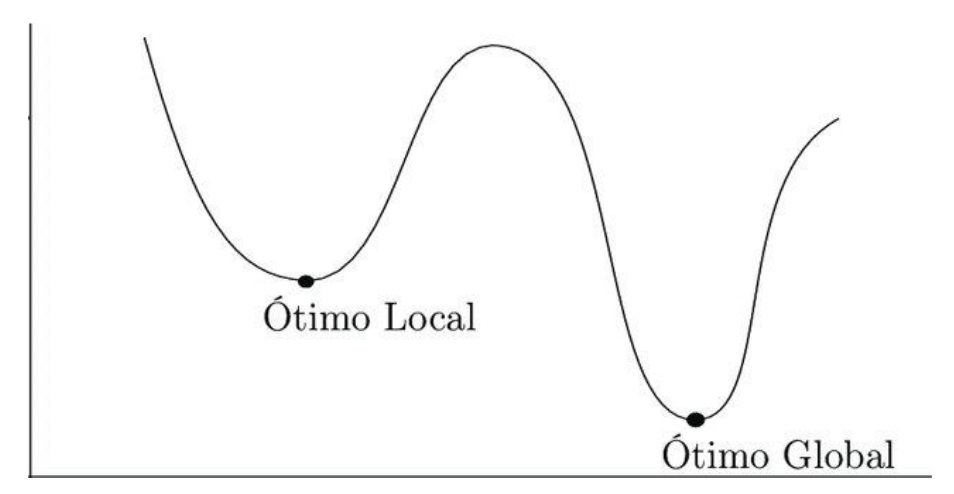
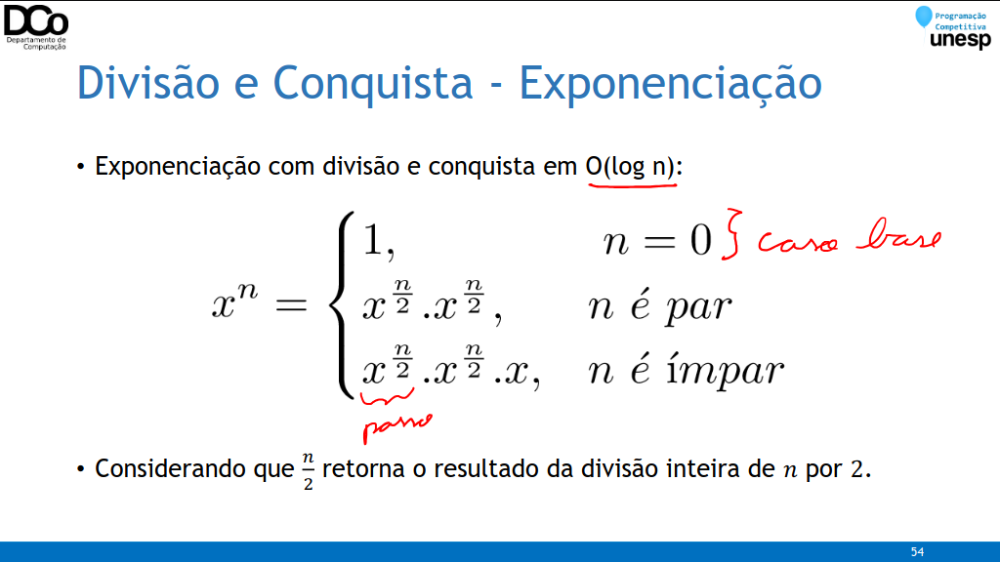
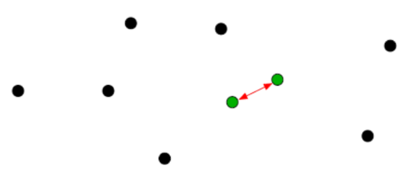

### Algoritmos Gulosos
- Um algoritmo guloso (ou ganancioso, greedy algorithm) é um algoritmo que constrói uma solução para um problema, passo-a-passo, sempre fazendo as escolhas que parecem mais vantajosas naquele momento.
- Um algoritmo guloso nunca se arrepende, não desfaz escolhas já feitas
- É um algoritmo “míope”, ele toma decisões com base nas informações disponíveis na iteração corrente, sem olhar as consequências que essas decisões terão no futuro.
    - Vantagens:
    - Implementações simples, normalmente
    - Algoritmos eficientes
    - Desvantagens:
    - Nem sempre conduz a soluções ótimas globais
    - Quando conduz, a prova costuma ser difícil



- Problema do caminho de maior soma


### Problema do Troco
- Problema: dar troco de um valor x com o menor número de moedas possíveis.
- Solução por backtracking: Serão testadas diversas combinações de moedas, adicionando uma moeda à solução, até encontrar uma solução que resulte em x. Além disso, esse método admite algumas melhorias:
- Podemos tentar adicionar na solução parcial sempre a moeda de maior valor possível. Com isso caminharemos mais rapidamente para a solução que usa o menor número de moedas.
- Já tendo encontrado uma solução que utiliza k moedas, qualquer solução parcial que utilize mais que k moedas pode ser cortada.

``` cpp
vector<int> moedas = {50, 25, 10, 5, 1};
vector<int> melhorSolucao;
int qtdeMoedas = INT_MAX;
void troco(int x, vector<int> &solucaoAtual){
    if (solucaoAtual.size() >= qtdeMoedas)
        return;
    if (x == 0){
        melhorSolucao = solucaoAtual;
        qtdeMoedas = solucaoAtual.size();
    }
    for(int m : moedas){
        if (m > x)
            continue;
        solucaoAtual.push_back(m);
        troco(x-m, solucaoAtual);
        solucaoAtual.pop_back();
    }
}
``` 

- Problema: dar troco de um valor x com o menor número de moedas possíveis.
- Já vimos a solução utilizando backtracking.
- Nesta solução, vimos que era uma boa estratégia escolher sempre a maior moeda possível, pois isso levaria a solução que utiliza menos moedas mais rapidamente.
- Porém, não tínhamos certeza se isso levaria a solução diretamente, por isso diversas outras possibilidades ainda eram avaliadas.
- Utilizando uma abordagem gulosa, vamos tentar considerar sempre uma única opção: escolher a moeda de maior valor possível

- Exemplos: Suponha que temos disponíveis moedas de 1, 5, 10 e 25 centavos.

41 centavos

41 - 25 = 16

16 - 10 = 6

6 - 5 = 1

1 - 1 = 0

41 = 25 + 10 + 5 + 1

- Exemplos: Suponha que temos disponíveis moedas de 1, 5, 10 e 25 centavos.

59 centavos

59 - 25 = 34

34 - 25 = 9

9 - 5 = 4

4 - 1 = 3

3 - 1 = 2

2 - 1 = 1

1 - 1 = 0

59 = 25 + 25 + 5 + 1 + 1 + 1 + 1

- Contra-exemplo: Suponha que estamos em um país onde existem apenas as moedas de 1, 5 e 8 centavos.

11 centavos

11 - 8 = 3

3 - 1 = 2

2 - 1 = 1

1 - 1 = 0

11 = 8 + 1 + 1 +1

- PORÉM, poderíamos obter um troco com 3 moedas: 11 = 5 + 5 + 1

- Quando o algoritmo guloso falha para o problema do troco?
- Quando existem moedas x, y tal que x < y e 2x > y.
- Moedas: 1, 5, 10, 25, 50 OK
- Moedas: 1, 5, 8 Falha

### Maximum product subset of an array
- Problema: encontrar o maior produto possível de um subconjunto de elementos de um vetor de inteiros.
- Exemplos

```
Entrada: a[] = {-5, 0, 2, 5, 5}

Saída: 50 = 2 * 5 * 5

Entrada: a[] = {-1, 0}

Saída: 0

Entrada: a[] = {-1, -1, -2, 4, 3}

Saída: 24 = (-1) * (-2) * 4 * 3
```

- Algoritmo por força bruta ou backtracking: testar todos os subconjuntos possíveis. O(2^n)

- Algoritmo guloso: para o algoritmo guloso temos que nos basear nos seguintes fatos:

a) Se temos números positivos: selecionamos todos eles.

b) Se temos uma quantidade par de números negativos: selecionamos todos eles.

c) Se temos uma quantidade ímpar de números negativos: selecionamos todos, com exceção do maior (com menor valor absoluto).

d) Não escolhemos nenhum zero, a não ser que só tenhamos zeros, com no máximo um número negativo O(n)

```
Entrada: a[] = {-5, 0, 2, 5, 5}

Saída: 50 = 2 * 5 * 5

Entrada: a[] = {-1, 0}

Saída: 0 = 0

Entrada: a[] = {-1, -1, -2, 4, 3}

Saída: 24 = (-1) * (-2) * 4 * 3

Entrada: a[] = {-4, -5, 0, 2, 3}

Saída: 120 = (-4) * (-5) * 2 * 3
```

### Problema das Tarefas Compatíveis
- Problema: suponha um conjunto T = {t1, t2, ..., tn} de n tarefas propostas que desejam um recurso (como uma sala de conferências), o qual só pode ser utilizado por uma única tarefa de cada vez.
- Cada tarefa ti tem um tempo de início si e um tempo de término fi, em que si < fi.
- As tarefas ti e tj são compatíveis sse os intervalos [si, fi) e [sj, fj) não se sobrepõem (si >= fj ou sj >= fi)
- Objetivo: selecionar um subconjunto de tamanho máximo de tarefas mutuamente compatíveis.


- Solução por força bruta ou backtracking: testar todos os possíveis subconjuntos.
- Estratégia gulosa: vamos tentar pensar em critérios simples de seleção de tarefas, e verificar o que acontece:
    - Selecionar a tarefa de menor duração
    - Selecionar a tarefa de menor si
    - Selecionar a tarefa de menor fi

- De fato, este problema pode ser resolvido utilizando um algoritmo guloso em que a próxima atividade i selecionada é a que possui menor tempo fi e é compatível com a última tarefa j selecionada (si >= fj)

``` 
Escalona(T, s, f, n)
    Ordene as tarefas em ordem crescente de tempo final
    S = {t1}
    k = 1
    para i = 2 até n faça
        se si >= fk então
            S = S ∪ {ti}
            k = i
    retorna S
``` 

- Teorema: dado um conjunto T = {t1, t2, ..., tn} com n tarefas onde cada ti é realizado no intervalo [si, fi), o algoritmo Escalona(T, s, f, n) devolve uma solução ótima para o problema de tarefas compatíveis.
- Para demonstrar este teorema, tentaremos mostrar que qualquer tarefa escolhida por este algoritmo está em uma solução ótima. Sendo assim, por indução, ele sempre levará a uma solução ótima.


- Demonstração: vamos supor que 𝑡𝑥 não está em uma solução ótima. Seja então 𝑆𝑘 ⊆ 𝑇𝑘 uma solução ótima para 𝑇𝑘 e assuma que 𝑡𝑥 ∉ 𝑆𝑘.
- Seja 𝑡𝑦 ∈ 𝑆𝑘 uma tarefa que termina primeiro em 𝑆𝑘. Podemos definir então o conjunto 𝑆𝑘′ = 𝑆𝑘 − 𝑡𝑦 ∪ {𝑡𝑥}.
- Como 𝑆𝑘 é solução viável, 𝑓𝑦 ≤ 𝑠𝑧 para toda 𝑡𝑧 ∈ 𝑆𝑘.
- Então, 𝑆𝑘′ é solução viável também.
- Como 𝑆𝑘 = |𝑆𝑘′ | , então 𝑆𝑘′ é ótima também. Chegamos em uma contradição, pois havíamos suposto que 𝑡𝑥 não fazia parte de uma solução ótima.

### Divisão e Conquista
- Ideia geral:

1. DIVIDIR: Dividir a instância do problema em duas ou mais instâncias menores;

2. CONQUISTAR: Resolver as instâncias menores (geralmente recursivamente);

3. COMBINAR: Obter a solução para as instâncias originais (maiores) através da

#### Combinação destas soluções
- Exemplos:
    - Mergesort
    - Quicksort
    - Busca binária


- Algoritmos baseados em divisão e conquista são, em geral, recursivos.
- A maioria dos algoritmos de divisão e conquista divide o problema em subproblemas da mesma natureza, de tamanho n/b.
- Existem três condições que indicam que a estratégia de divisão e conquista pode ser utilizada com sucesso:
- Deve ser possível decompor uma instância em sub-instâncias
- A combinação dos resultados deve ser eficiente (trivial se possível)
- As sub-instâncias devem ser mais ou menos do mesmo tamanho

#### Vantagens
- Resolução de problemas difíceis
- Pode gerar algoritmos eficientes (forte tendência a complexidade logarítmica)
- Facilmente paralelizável na fase da conquista (Em LPC isso não fará diferença)
- Desvantagens
- Número de chamadas recursivas
- Dificuldade na seleção dos casos bases
- Repetição de sub-problemas (pode ser resolvido com Programação Dinâmica)

- Confira na GIF abaixo:


### Divisão e Conquista - Exponenciação
- Exponenciação por força bruta em O(n):
``` cpp
int potencia(int x, int n) {
    int y = 1;
    for(int i = 0; i < n; i++)
        y *= x;
    return y;
}
```



#### Problema da Menor Distância
- Dados n pontos no plano, determinar a distância mínima entre qualquer par de pontos.



- Solução por força bruta
- Testar todos os possíveis pares de pontos. O(n²)

#### Como aplicar Divisão e Conquista?
1. Vamos ordenar os pontos pela coordenada x.
2. Dividir o problema em duas partes: esquerda e direita
3. Resolver recursivamente os dois subproblemas gerados
4. Combinar os subproblemas para obter a solução do problema inicial


- Resolvendo os subproblemas P1 e P2 teremos a menor distância entre dois pontos nesses dois setores. Vamos chamar essas distâncias de de e dd.
- Com isso, podemos obter d = min(de, dd)
- Mas ainda falta analisar a distância entre pontos de sub-problemas distintos, ou seja, de pontos que estão no setor P1 com pontos que estão no setor P2.
- Devemos analisar TODOS os casos?
- Não! Somente os pontos que se encontram em uma faixa 2d em torno da linha divisória, pontos além dessa linha não nos interessam, pois irão resultar em distâncias maiores que d.
- Complexidade: O(n.log n)


### Divisão e Conquista
- Outros problemas clássicos:
- Multiplicação de Inteiros Grandes (Algorito de Karatsuba)
- Multiplicação de Matrizes (Algoritmo de Strassen)
- Sugestão: CodeForces 768B – Code For 1

### Referências

Aulas de Técnicas de Programação do Prof. Dr. Renê Pegoraro.

LAAKSONEN, A. Competitive Programmer’s Handbook.

Vídeo “Algoritmos gulosos e Problema das tarefas Compatíveis” da Profª. Drª. Carla Negri

Lintzmayer. https://www.youtube.com/watch?v=PCMcGPknMwk

https://www.ime.usp.br/~pf/analise_de_algoritmos/aulas/guloso.html

https://www.geeksforgeeks.org/greedy-algorithms/

http://www3.decom.ufop.br/toffolo/site_media/uploads/2011-1/bcc402/slides/09._algoritmos_gulosos.pdf

https://docs.google.com/presentation/d/1rd4sxi2U6v3YNEJ0NRocFnVR64YBdJ2RsPffzjs9QFU/htmlpresent

https://pt.khanacademy.org/computing/computer-science/algorithms/merge-sort/a/divide-and-conquer-algorithms

http://www3.decom.ufop.br/toffolo/site_media/uploads/2011-1/bcc402/slides/08._divisao_e_conquista.pdf

http://www.dsc.ufcg.edu.br/~abrantes/CursosAnteriores/ATAL051/DivConq.pdf
