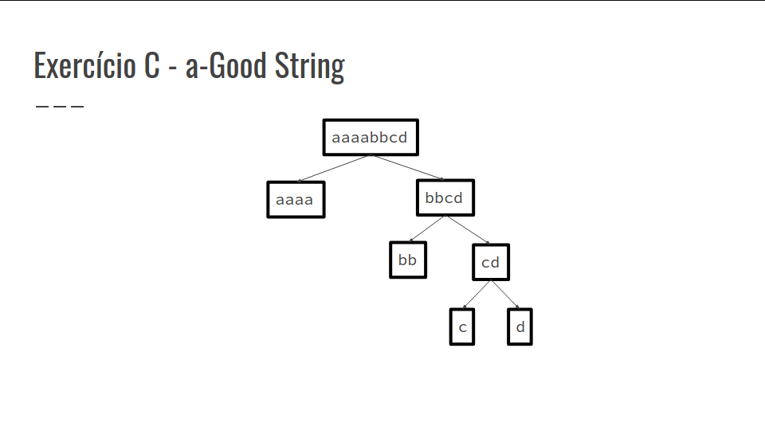
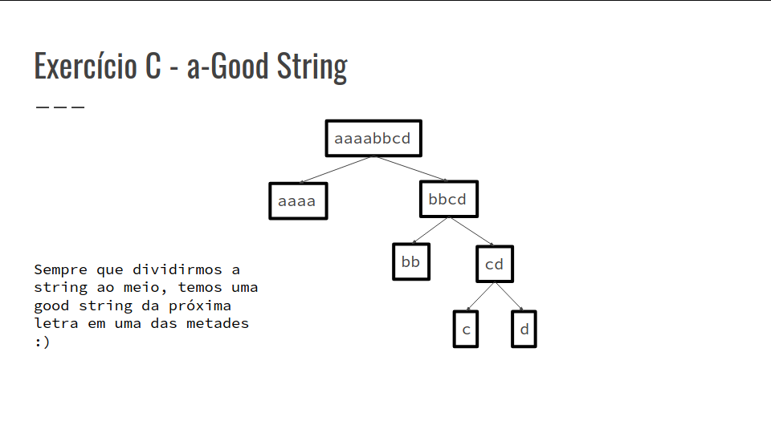
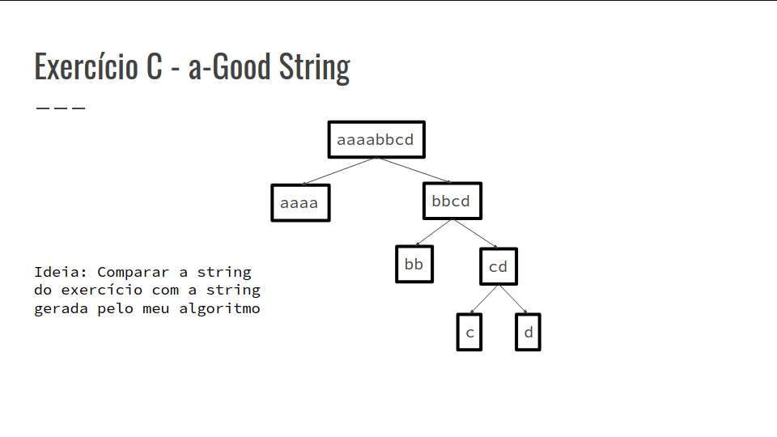
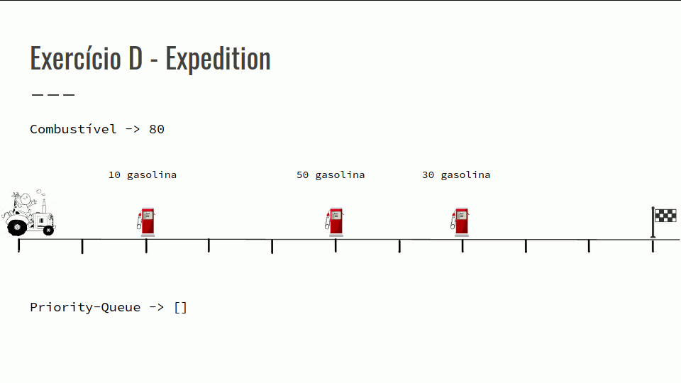
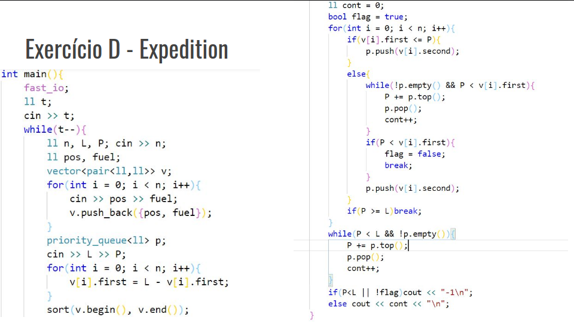
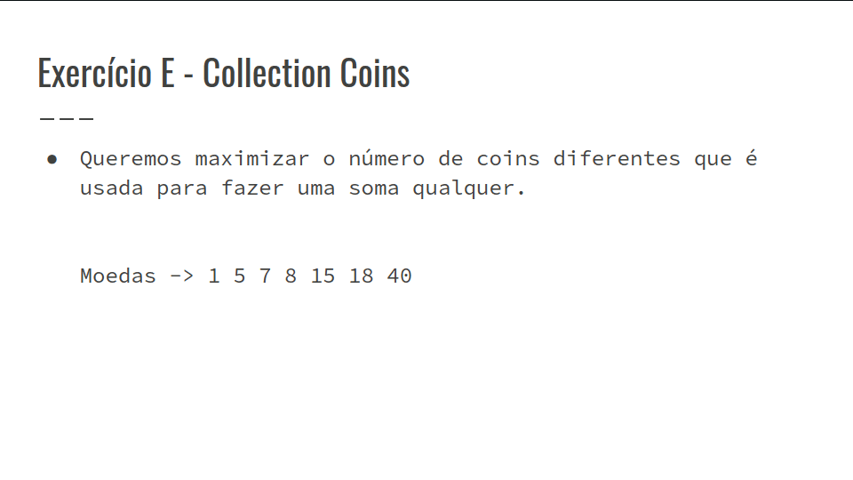
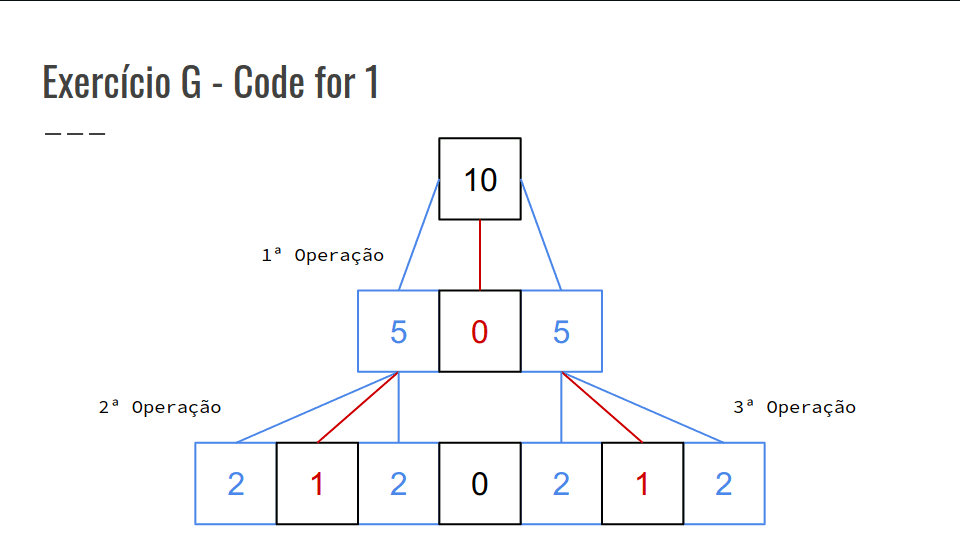
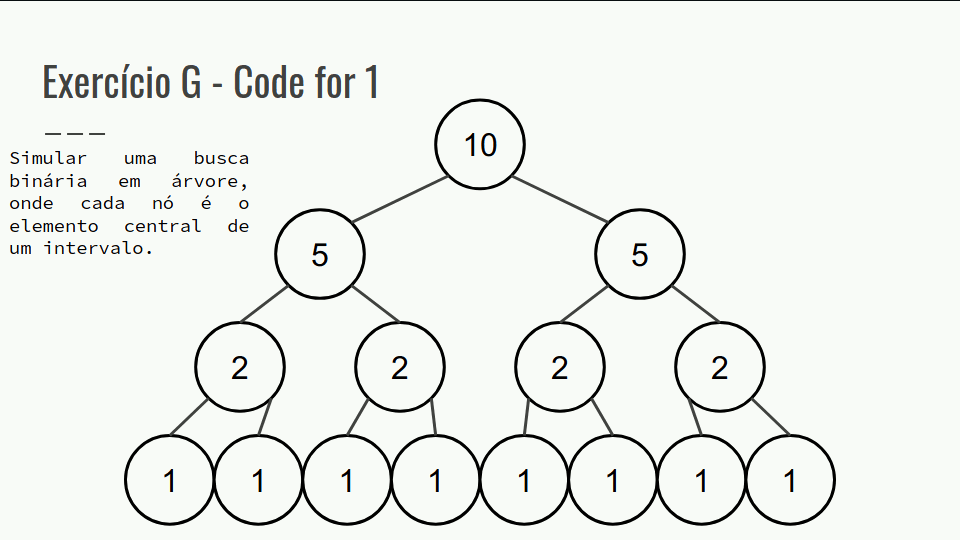

## Resolução dos Exercícios
### Exercícios C, D, E e G

### Exercício C - a-Good String
- Objetivo -> Contar quantas modificações precisam ser feitas para transformar a string dada em uma a-Good String.
- (É garantido que o tamanho da string é uma potência de 2)
- O que é uma a-Good String ?

aaaabbcd

aaaacdbb

bbcdaaaa

cdbbaaaa

- Como fazer essas strings? O problema fica mais fácil se eu dividir a string ao meio ?
- Ex: aaaabbcd -> aaaa bbcd
- A string bbcd seria uma b-Good_String
- Isto é, podemos dividir a string bbcd ao meio também :)





``` cpp
ll merge(string &s, char a, ll ini, ll fim){
    if(ini == fim){
        if(s[ini] != a)return 1;
            else return 0;
    }
    ll meio = (ini + fim)/2;
    ll res = 1e17;
    ll changes = 0;
    for(int i = ini; i <= meio; i++){
        if(s[i] != a)changes++;
    }
    changes += merge(s, a+1, meio+1, fim);
    res = min(res, changes);
    changes = 0;
    for(int i = meio+1; i <= fim; i++){
        if(s[i] != a) changes++;
    }
    changes += merge(s, a+1, ini, meio);
    res = min(res, changes);
    return res;
}
```

### Exercício D - Expedition
- Um grupo de vaquinhas têm um caminhãozinho com o tanque furado, e este perde um litro de gasolina a cada metro de distância que ele anda.
- O objetivo é chegar até o ponto final para consertar o caminhão, abastecendo o mínimo número de vezes possíveis.
- São dadas a distância de todos os postos para a última cidade e quantidade de combustível que cada poço possui.
- O objetivo é abastecer o mínimo de vezes possível, ou seja colocar combustível só quando precisar e do maior posto possível até o momento.
- Quando o combustível acabar precisamos olhar de todos os postos que já passamos, aquele que tem a maior quantidade de combustível para colocar.
- Confira a GIF abaixo:





### Exercício E - Collection Coins
- É dado uma quantidade de moedas n, tal que n >= 0 e n <= 10^4
- O número de casos de testes pode ir até 100 Portanto, precisamos pensar em algo que funcione em tempo linear para esse exercício
- O rei pode pegar qualquer soma em valor do banco.
- O banco sempre irá pagar o valor pela maior moeda disponível enquanto, este for maior que ela.

- Ex:

Moedas -> 1 5 7 8 15 18 40

Valor que o rei quer -> 82

O banco irá usar duas moedas de 40 e duas de 2

40 + 40 + 1 + 1 = 82

- Confira a GIF abaixo:



``` cpp
while(t--){
    ll n; cin >> n;
    vector<ll> v(n);
    for(int i = 0; i < n; i++){
        cin >> v[i];
    }
    cout << "Case #" << cas++ << ": ";
    if(n == 0){
        cout << "0\n";
        continue;
    }
sort(v.begin(), v.end());
ll cont = 0, val = 0;
for(int i = 0; i < n-1; i++){
    if(val + v[i] < v[i+1]){
        val += v[i];
        cont++;
    }
}
    cout << cont + 1 << "\n";
}
```

### Exercício G - Code for 1
- Jon Snow e Sam, após uma árdua batalha contra os white-walkers, retornam para o castelo negro;
- Quando chegam, Sam decide viajar para a Cidadela, com o intuito de se tornar um maester;
- Para testar sua aptidão, eles recebem um problema, que deve ser resolvido para atingirem seu objetivo.
- Inicialmente, temos umas lista composta por um único elemento de valor N;
- Enquanto a lista não for composta apenas por 0’s e 1’s, eles escolhem um elemento da lista;
- Inserimos na lista, à direita e à esquerda do elemento escolhido, os resultados de sua divisão por 2 e substituímos o elemento pelo resto de sua divisão por 2.
- Para dificultar a tarefa e torná-la um verdadeiro desafio capaz de decidir a dignidade de Sam em se tornar maester, uma última etapa é adicionada;
- Após montada a lista, dado um intervalo [L : R], sendo L seu limite inferior e R o limite superior, os maesters querem saber a quantidade de 1’s contidos dentro dele.
- Confira a GIF abaixo:

img26 - img37 (montar gif)


- O algoritmo para definir o elemento na posição X se assemelha a uma busca binária, segmentando nosso vetor em vetores menores e acessando o elemento central;
- No entanto, como podemos montar nosso vetor para aplicar essa busca? Também, como podemos recuperar o número de 1’s em determinado intervalo sem precisar
- Confira a GIF abaixo:


``` cpp
int main(){
    ll n;
    cin >> n >> l >> r;
    ll i = 1;
    ll cont = 0;
    while(i <= n){
        i*= 2;
        cont++;
    }
    ll fim = ( 1LL << cont) - 1LL;
    ll ini = 1LL;
    cout << func((fim+1)/2, ini, fim, n) <<
    "\n";
    return 0;
}

ll func(ll pos, ll ini, ll fim, ll val){
    if(ini > r || fim < l || val == 0)return 0;
    if(val == 1){
        if(pos < l || pos > r) return 0;
            return 1;
    }
    ll pos1 = (pos+ini-1LL)/2LL;
    ll pos2 = (fim+pos+1LL)/2LL;
    ll soma = 0;
    if(val&1 && pos >= l && pos <= r)soma++;
    soma += func(pos1, ini, pos-1LL, val/2LL)
    + func(pos2, pos+1LL, fim, val/2LL);
    return soma;
}
```
