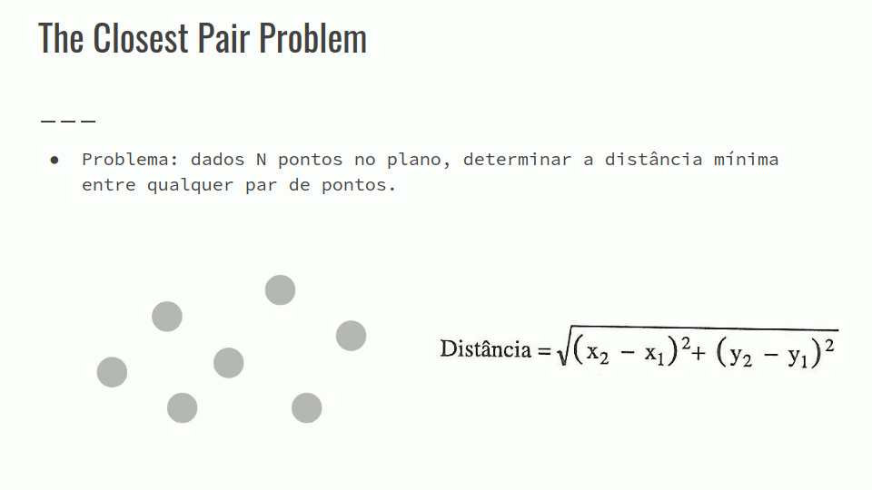
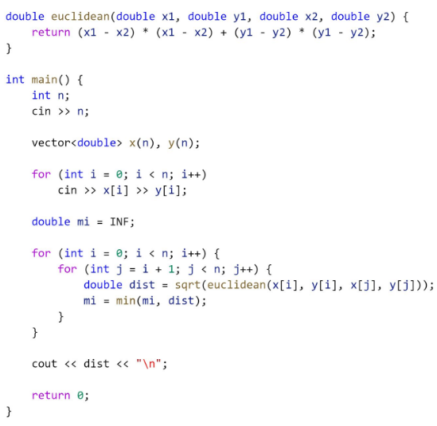
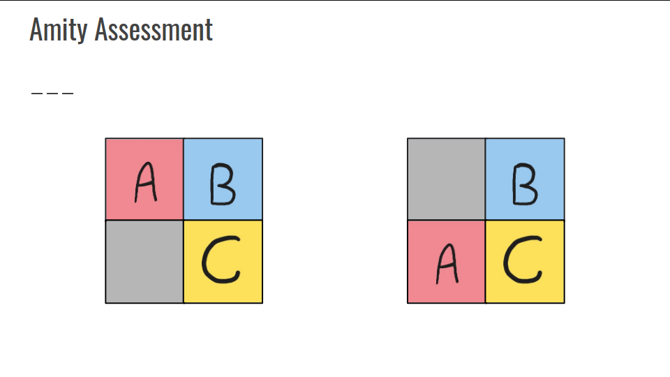
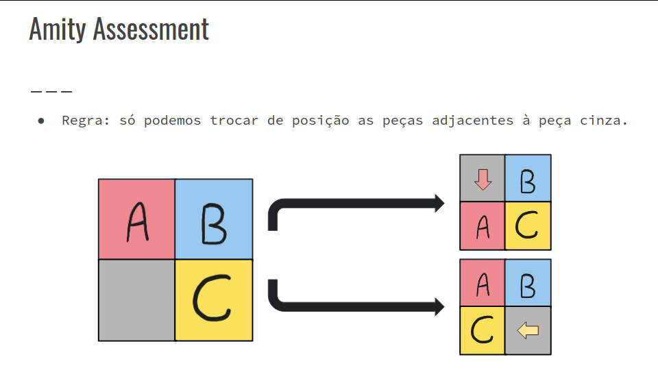
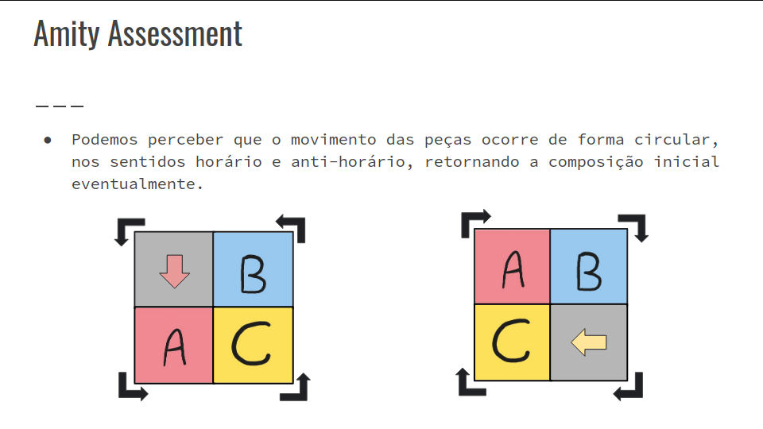
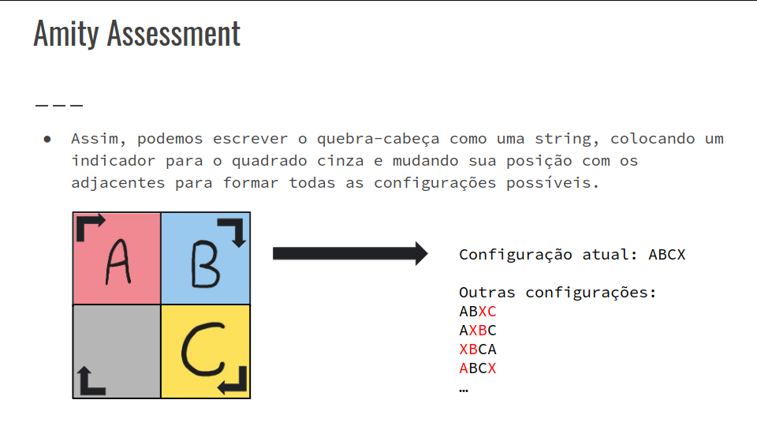
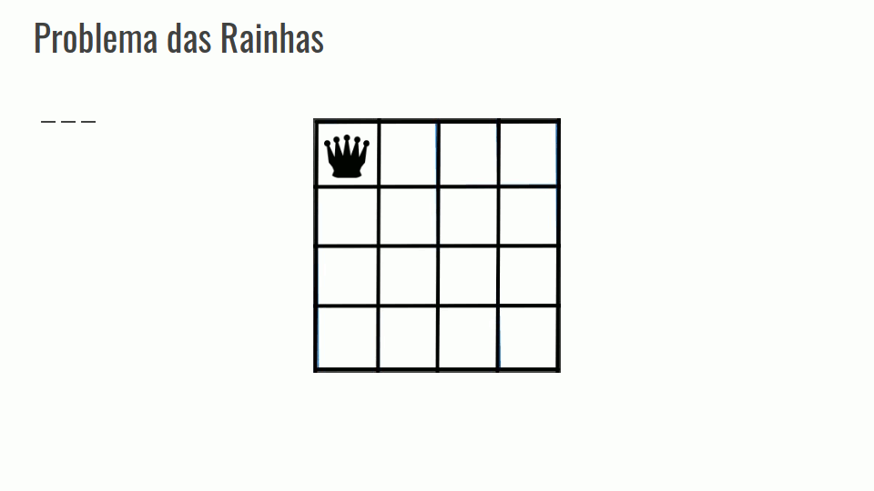
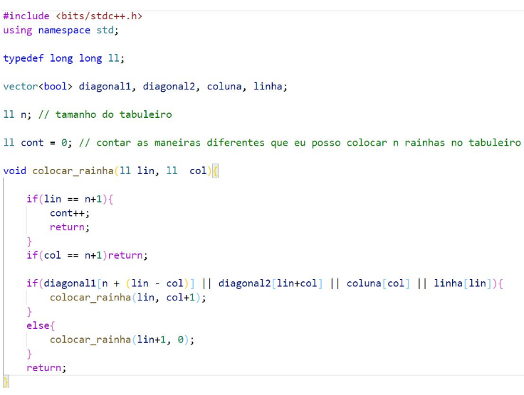
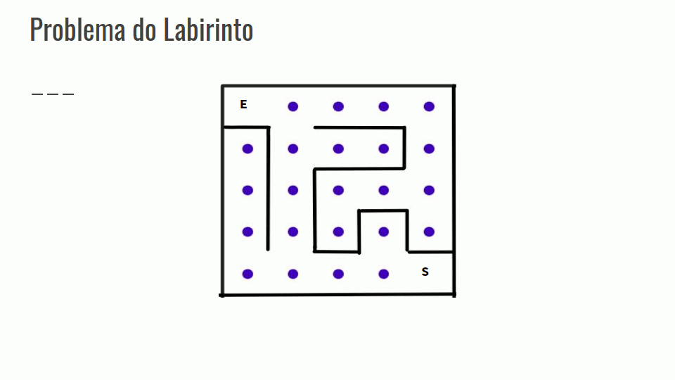
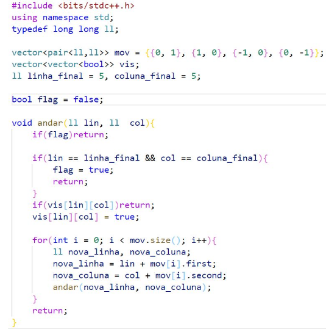

## Paradigmas de Projeto de Algoritmos
● Determinados problemas requerem abordagens adequadas em suas
resoluções;
● Dependendo da estratégia adotada, o desempenho do algoritmo pode ser
ineficiente, resultando em TLE;
● Os paradigmas são como estratégias de como abordar e modelar uma
solução de maneira eficiente quando aplicados corretamente.

● Indução Matemática
● Força Bruta
● Recursividade
● Backtracking (Tentativa e Erro)
● Algoritmos Gananciosos
● Divisão e Conquista
● Programação Dinâmica
● Algoritmos Aproximados (Heurísticas)

### Força Bruta
● Algoritmos simples;
● Percorrem o espaço de busca do problema, procurando todas as
possíveis soluções candidatas, verificando quais satisfazem a questão
inicial;
● Varredura “cega”;
● Útil para pequenos problemas;
● Fácil implementação;
● Sempre que existir uma solução, o algoritmo irá encontrá-la.
● Exigem grande esforço computacional, seu custo tende a crescer
exponencialmente.

#### The Closest Pair Problem
img1.png - img4

#### Amity Assessment

#### Sugestão de Problemas
● [The Closest Pair Problem](https://onlinejudge.org/index.php?option=onlinejudge&page=show_problem&problem=1186) - UVa
● [Amity Assessment](https://onlinejudge.org/index.php?option=onlinejudge&page=show_problem&problem=1186) - Codeforces

### Recursividade
● Mecanismo no qual a definição de uma função ou de um objeto se
refere ao próprio objeto definido;
● Permite descrever problemas que utilizam estruturas recursivas de
forma clara e concisa;
● Um procedimento que opera em termos de si mesmo é dito ser
recursivo.

#### Gerando Subconjuntos
● Nossa primeira aplicação da recursão será gerar todos os subconjuntos
de um conjunto de N elementos;
#### Gerando Permutações
● A segunda aplicação de recursão que veremos será gerar todas as
permutações de um conjunto de N elementos;

#### Desafio
● [Amity Assessment](https://codeforces.com/problemset/problem/645/A) - Codeforces
○ Generalizar a solução do problema para 2 ≤ N ≤ 10, elencando
todas as possíveis soluções do quebra-cabeças com um algoritmo
recursivo.

### Backtracking
● Aperfeiçoamento do algoritmo de força bruta;
● Várias soluções da força bruta são eliminadas, visto que não são
testadas;
● Inicialmente se tem uma solução vazia e vamos estendendo ela passo a
passo, incrementalmente.
#### Problema das Rainhas
● Calcular o número de maneiras de se colocar N rainhas em um tabuleiro
NxN.
● Em um problema de backtracking inicia-se com uma solução vazia, nesse
caso com o tabuleiro vazio.
● A partir do tabuleiro vazio a solução é estendida passo a passo até
que se consiga colocar todas as N rainhas.

img13 - img42 (montar gif)

#### Sugestão de Problemas
● [Chessboard and Queens](https://cses.fi/problemset/task/1624) - CSES
● [MKJUMPS](https://www.spoj.com/problems/MKJUMPS/) - SPOJ

#### Problema do Labirinto
● Encontrar um caminho da entrada do labirinto até a saída.
● Gerar a solução por partes, e quando encontrarmos em um beco sem
saída, retornar os passos até que se possa ter acesso à outro
caminho.

img45 - img72 (montar gif)

img73

#### Sugestão de Problemas
● Grid Paths - CSES - Difícil
● Labyrinth - CSES

#### Problema do Sudoku
● Problema: dado um Sudoku parcialmente resolvido, determinar se existe
solução para aquele problema;
● [Vídeo de explicação do problema do Sudoku](https://www.youtube.com/watch?v=JzONv5kaPJM)
