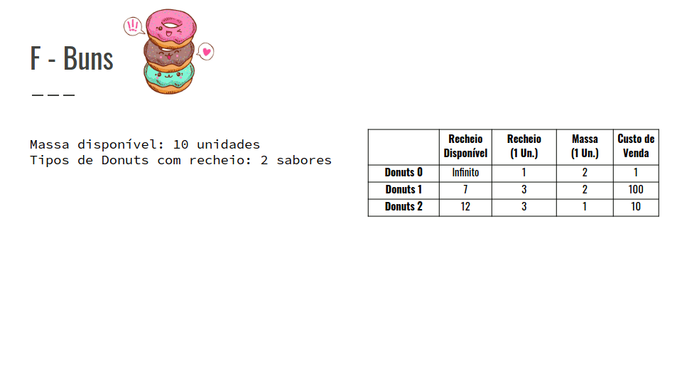
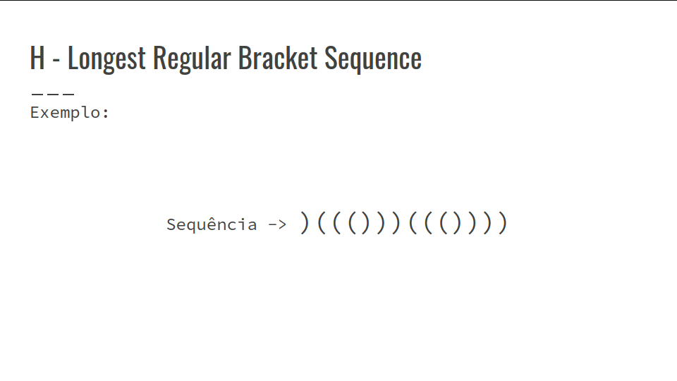

## Resolução dos Exercícios
## Exercícios F, H, I

### F - Buns
- TokiDeBuns, uma chefe de renome, vai fazer vários pãezinhos doces com diferentes recheios;
- Vamos chamar esses pãezinhos doces de donuts;
- Dada uma quantidade de massa N, qual é o valor máximo de lucro que ela consegue com a venda deles ?
- Ela vai produzir M donuts, cada uma com recheio diferente;
- Para cada donut i, ela tem ai de recheio disponível, ela precisa de bi unidades de recheio e ci unidades de massa e pode vendê-los pelo valor di;
- Ela também pode fazer donuts sem recheio, com c0 unidades de massa e vender por d0.
- Massa disponível: 10 unidades
- Tipos de Donuts com recheio: 2 sabores
- Confira a GIF abaixo:



- Podemos observar a seguinte recorrência:
```
dp[i] = max(dp[i], dp[i - w[j] * k] + c[j] * k);

c[j] * k <= i;

k variando de 0 até a[j] / b[j].
```

- Onde o índice i são todos as possíveis quantidades de massa até N, j são todos os tipos de donuts e k a quantidade de donuts i que podem ser feitas com o recheio disponível.
``` C++
int main() {
    int c0, d0;
    cin >> n >> m >> c0 >> d0;
    a = b = c = d = vi(m + 1);
    a[0] = INF;
    b[0] = 1;
    c[0] = c0;
    d[0] = d0;
    for (int i = 1; i <= m; i++)
        cin >> a[i] >> b[i] >> c[i] >> d[i];
    cout << knapsack() << "\n";
    return 0;
}
```
``` C++
a[0] = INF;
b[0] = 1;
```
- Essas duas linhas permitem que sejam criadas grandes quantidades de donuts sem recheio.
``` C++
int knapsack() {
    vi dp(n + 1);
    for (int j = 0; j <= m; j++) {
        for (int i = n; i >= 0; i--) {
            for (int k = 0; b[j] * k <= a[j]; k++) {
                if (c[j] * k <= i)
                    dp[i] = max(dp[i],
                        dp[i - c[j] * k] + d[j] * k);
            }
        }
    }
    return dp[n];
}
```

- Complexidade: O(N * M * A)

N -> total de massa

M -> total de donuts

A -> recheio disponível

### H - Longest Regular Bracket Sequence
- Objetivo: Contar o tamanho da maior sequência correta de parênteses.

-> Devemos contar quantas sequências desse tamanho máximo existem.

-> Se não houver nenhuma sequência correta printar “0 1”.

- Confira a GIF abaixo:



``` C++
#include <bits/stdc++.h>
using namespace std;
typedef long long ll;
int main(){
    string s;
    cin >> s;
    s = "+" + s;
    ll tam = s.size();
    vector<ll> dp (tam+1, 0);
    stack<ll> pq;
    ll ma = 0;
}

for(int i = 1; i <= tam; i++){
    if(s[i] == ')'){
        if(pq.empty())continue;
        ll val = pq.top(); pq.pop();
        ll range = i - val + 1;
        dp[i] = range + dp[val-1];
        ma = max(ma, dp[i]);
    }
    else{
        pq.push(i);
    }
}
ll cont = 0;
for(int i = 1; i <= tam; i++){
    if(ma == dp[i])cont++;
}
if(ma == 0)cout << "0 1\n";
else cout << ma << " " << cont << "\n";
```

### I - Road Optimization
- O Governo de Marte está interessado em otimizar o sistema de rodovia!
- Dado o sistema de uma rodovia de tamanho l, que possui uma sequência de n placas sendo di sua posição e ai o limite de velocidade (min), sendo possível remover até k placas, qual o tempo mínimo para se deslocar do ponto 0 até l.
``` C++
d.push_back(l);
a.push_back(0);
dp[0][0] = 0;
for (int i = 1; i <= n; i++){
    for (int j = 0; j <= k; j++){
        for (int m = 0; m < i; m++){
            ll removed = j - (i - m - 1);
            if (removed >= 0)
            {
                dp[i][j] = min(dp[i][j], dp[m][removed] + (d[i] - d[m]) * a[m]);
            }
        }
    }
}
```
