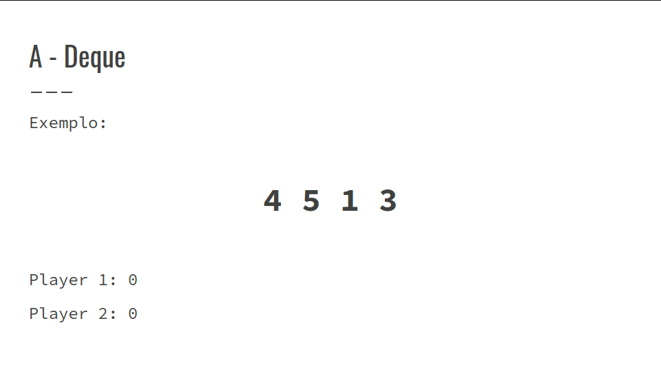
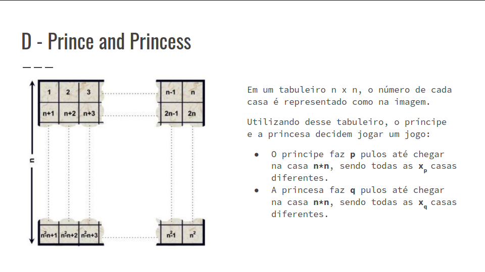
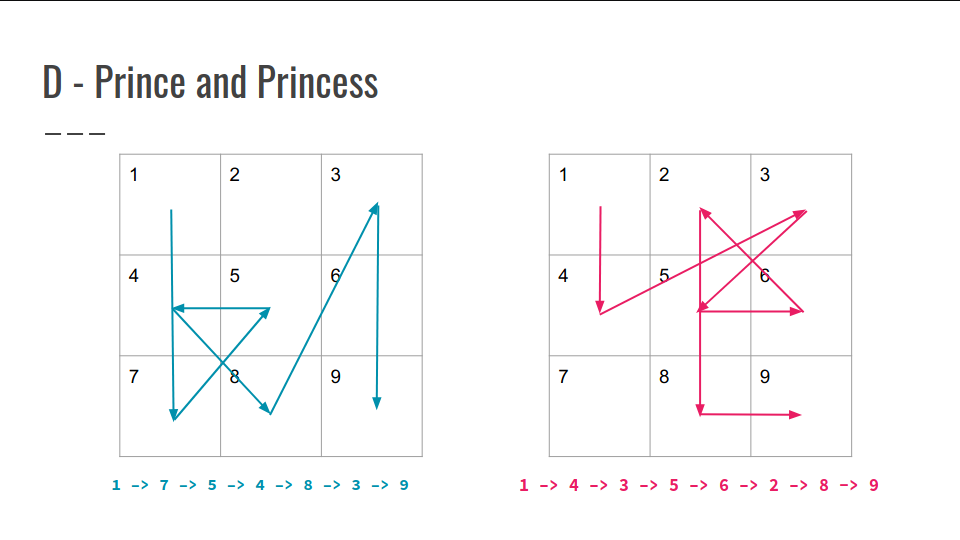
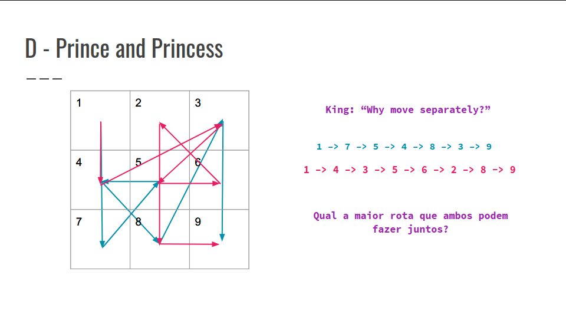
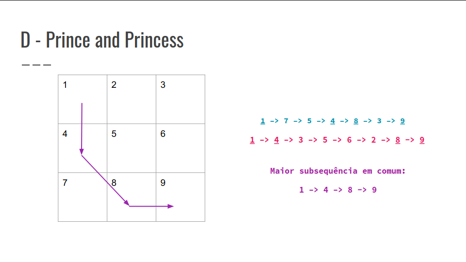

## Resolução dos Exercícios
## Exercícios A e D

### A - Deque
- É dada uma sequência com n valores.
- Existem dois jogadores que sempre vão jogar de maneira a maximizar seus pontos
- Um jogador ganha pontos quando retira uma das pontas do conjunto dado.
- O objetivo é fazer o primeiro jogador ter o máximo de pontos possíveis



- Temos duas escolhas:
    - Tirar o elemento da ponta esquerda
    - Tirar o elemento da ponta direita
- Recursão
    - Quando o player 1 joga eu tenho o máximo daquela jogada.
    - Quando o player 2 joga eu fico com o mínimo dessa jogada.
``` C++
// Jogada do Player 1:
max(
    item[início] + Recursiva(inicio+1, fim, !flag),
    item[fim] + Recursiva(inicio, fim-1, !flag)
)

// Jogada do Player 2:
min(
    Recursiva(inicio+1, fim, !flag),
    Recursiva(inicio, fim-1, !flag)
)

int brute(int ini, int fim, bool flag){
    if(ini > fim){
        return 0;
    }
    if(dp[ini][fim][flag] != -1)return dp[ini][fim][flag];
    int chamada1 = brute(ini + 1, fim, !flag);
    int chamada2 = brute(ini, fim - 1, !flag);
    if(flag)return dp[ini][fim][flag] = max(v[ini] + chamada1, v[fim] + chamada2);
    return dp[ini][fim][flag] = min(chamada1, chamada2);
}
``` 

- No final só precisa imprimir a soma dos itens menos o resultado da recursão.

Resultado final = Soma_Total - Resultado_Recursão

#### Sugestões:
- Removal Game - CSES
- Cards - Online Judge (UVA)

### D - Prince and Princess






#### Algoritmo LCS?
- Para conseguirmos utilizar o Algoritmo de LCS, precisamos ter disponível para o problema uma complexidade que permita realizar O(tam_sequencia1*tam_sequencia2).
- Pela entrada do problema conseguimos perceber que a para cada sequência podemos ter no pior caso:
```
tam_sequencia1 = tam_sequecia2 = 250*250 = 62500
```
- Caso utilizemos LCS, teremos complexidade:
```
O(62500*62500)= 3.906.250.000 = 3*10⁹
```
No enunciado é informado que nas rotas de ambos, nenhuma posição se repete, sendo assim, podemos ordenar uma das sequências e fazer uma busca binária em relação às posições que ambas são iguais:

```
Seq_1 = 1 –> 7 –> 5 –> 4 –> 8 –> 3 –> 9, ordenando e salvando suas posições 
relativas:
Seq_1 = (1,1) -> (3,6) -> (4,4) -> (5,3) -> (7,2) -> (8,5) -> (9,7)
Seq_1 = (1,1) -> (3,6) -> (4,4) -> (5,3) -> (7,2) -> (8,5) -> (9,7)
Seq_2 = 1 –> 4 –> 3 –> 5 –> 6 –> 2 –> 8 -> 9
Seq_nova = 1, 4, 6, 3, 5, 7
```

- Utilizando a ordem inicial da Seq_2, realiza uma busca binária da sequência ordenada e salva a posição em relação à posição inicial da Seq_1
- Podemos então perceber que através da nova sequência gerada, podemos calcular a maior rota que ambos podem fazer utilizando o algoritmos de LIS (Longest Increasing Subsequence)

``` C++
vector<ll>seq_1(p),seq_2(q),seq_3;
map<int,int>posicao_inicial;
cin >> seq_1 >> seq_2;
posicao_inicial[seq_1[i]] = i;
//Salva em posicao_inicial as posicoes de seq_1 antes da ordenação
sort(seq_1)
for(i=0;i<seq_2.size(),i++){
    if(binary_search(seq_1.begin(),seq_1.end(),seq_2[i])
        seq_3.push_back(posicao_inicial[seq_2[i]]);
}
cout << LIS(seq_3) << "\n";
```
