### Origem
- Introduzido por Richard Bellman da década de 50, em um projeto militar na RAND Corporation.
- O termo foi utilizado para encobrir o propósito do projeto, pois o Secretário de Defesa da época abominava pesquisa matemática.

*"A década de 1950 não foi boa para a pesquisa em matemática. Tivemos um cavalheiro
muito interessante em Washington chamado Wilson. Ele foi secretário de Defesa, e
realmente tinha um medo patológico e ódio da palavra 'pesquisa'. Não estou usando o
termo levemente; eu estou usando-o precisamente. Seu rosto ficava vermelho, e ele
ficava violento se as pessoas usassem o termo 'pesquisa' em sua presença. Você pode
imaginar como ele se sentia então, sobre o termo 'matemática'."* (Richard Bellman)

### Programação Dinâmica
- Tomemos como exemplo um algoritmo recursivo para solucionar o problema de encontrar o i-ésimo termo da sequência de Fibonacci.
``` cpp
int fib(int i) {
    if (i == 0 || i == 1)
        return 1;
    return fib(i-1) + fib(i-2);
}
```

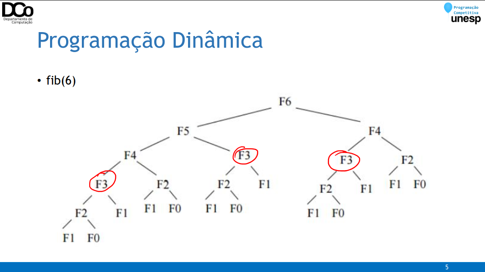

- “Quem não se lembra do passado é condenado a repeti-lo”
- Em algoritmos que usam a estratégia da divisão e conquista é comum haver a repetição de subproblemas (overlapping subproblems), como exemplificado no algoritmo para calcular termos da sequência de Fibonacci.
- Isso pode acabar gerando muito recálculo.
- A PD vem para tentar resolver este problema.
- A ideia básica da Programação Dinâmica é armazenar a solução dos subproblemas para serem utilizados no futuro.
- Isso pode ser feito por duas abordagens:
- Top Down (Memoization)
- Bottom Up (Tabulation)
- É importante ressaltar: para que esse paradigma possa ser aplicado, é preciso que o problema tenha uma estrutura recursiva, a solução de toda instância do problema deve “conter” soluções de subinstâncias dessa instância.

### Memoization (Top Down)
- Do geral para o específico, de cima para baixo.
- Normalmente essa abordagem é a mais simples de se aplicar, pois ainda faz o uso de algoritmos recursivos.
- Visita apenas os estados requisitados.
- Método:
    - O problema é dividido em subproblemas.
    - Cada subproblema é resolvido recursivamente.
    - Quando um subproblema é resolvido, o resultado é armazenado para possíveis utilizações no futuro (memoization).

- Fibonacci:
``` cpp
int memo[] = {1, 1, -1, -1, -1, -1, …} //-1 = não calculado
int fib(int i){
    if (memo[i] == -1)
        memo[i] = fib(i-1) + fib(i-2);
    return memo[i];
}
```
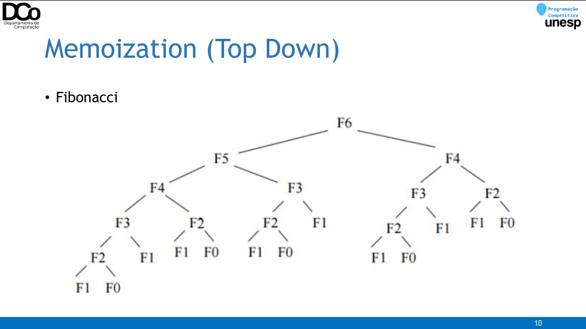
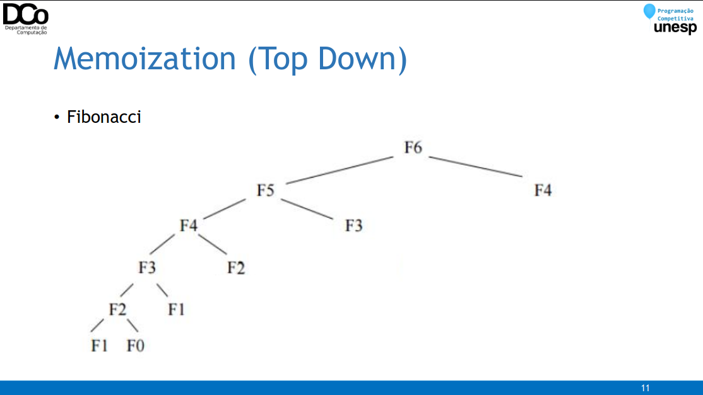

### Tabulation (Bottom Up)
- Do específico para o geral, de baixo para cima.
- Visita todos os estados.
- Método:
    - O problema é dividido em subproblemas.
    - Cada subproblema é resolvido, se iniciando pelos que são base para a solução dos seguintes (de forma geral, isso é feito iterativamente).
    - Quando um subproblema é resolvido, o resultado é armazenado para resolver subproblemas futuros, até alcançar o problema original.

- Fibonacci
``` cpp
int memo[MAXN];
void preprocess(int n){
    memo[0] = memo[1] = 1;
    for(int i = 2; i < n; i++)
        memo[i] = memo[i-1] + memo[i-2];
}
int fib(int i){
    return memo[i];
}
```
### Propriedades necessárias
- Subestrutura ótima:
- A solução ótima do problema é composta pela solução ótima de partes menores e mais simples do problema.
- Exemplo:
```
fib(n) = fib(n-1) + fib(n-2)
```
- Lembrando que, nem sempre é fácil ou intuitivo ver como as soluções dos subproblemas devem ser combinadas para obter a solução do problema original.
- Exemplo: par de pontos de menor distância
- Sobreposição de subproblemas:
    - É necessário haver a repetição de subproblemas, do contrário, não faz muito sentido armazenar a solução de um subproblema que nunca mais será necessária
    - Exemplos:
    - fib(5) = fib(4) + fib(3)
    - fib(4) = fib(3) + fib(2)
    - ...
    - fib(3) = fib(2) + fib(1)
    - ...
- O problema do par de pontos mais próximos, apesar de apresentar subestrutura ótima, não apresenta sobreposição de subproblemas.

### PD x Outros paradigmas
- Algoritmo Guloso
    - Melhor solução local
- Backtracking
    - Busca exaustiva
    - Complexidade fatorial/exponencial
- Programação Dinâmica
    - Melhor solução global/solução ótima
    - Busca exaustiva “inteligente”
    - Evita recalcular problemas que já ocorreram
    - Complexidade polinomial

### Estratégia geral
- A ideia básica da Programação Dinâmica é simples, o desafio é aplicar isso em diferentes problemas.
- Não existe uma “receita de bolo” para fazer isso, mas existem dicas e estratégias.
- Em especial, temos que nos focam em encontrar padrões de recorrência no nosso problema
- Usos convencionais:
- Encontrar uma solução ótima
- Contar o número de soluções possíveis

1. Definir os subproblemas
2. Escrever a recorrência que relaciona os subproblemas
3. Reconhecer e solucionar os casos base

- Aplicando à Sequência de Fibonacci
1. Definir os subproblemas
```
fib(i) -> subproblemas: fib(i-1) e fib(i-2)
```
2. Escrever a recorrência que relaciona os subproblemas
```
fib(i) = fib(i-1) + fib(i-2)
```
3. Reconhecer e solucionar os casos base
```
fib(0) = 1 e fib(1) = 1
```

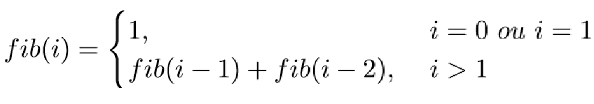

- Dicas do Thiago Alexandre de como estudar programação dinâmica:
- Decorar algoritmos não adianta, entenda a lógica e as diferentes técnicas;
- Estudar, entender e treinar problemas recursivos;
- Estudar, entender e treinar problemas clássicos de PD;
- Resolva problemas e compare com outras soluções;
- O que outras soluções têm de melhor ou pior?

### Problema da Escada
- Quantas formas há de subir uma escada de n degraus, sendo que em cada passo pode-se subir 1 ou 2 degraus por vez?

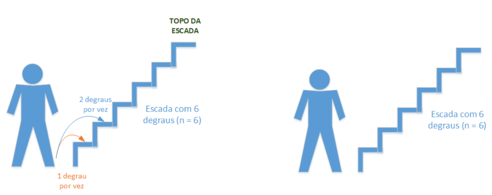

- Quantas formas há de subir uma escada de n degraus, sendo que em cada passo pode-se subir 1 ou 2 degraus por vez?
- Exemplos de possibilidades para n = 6:

1, 1, 1, 1, 1, 1

2, 1, 1, 1, 1

2, 2, 2

2, 1, 1, 2

1, 1, 1, 1, 2

- Vamos considerar que nosso problema será resolvido por uma função 𝒇(𝒏), onde 𝒏 é o número de degraus.
- Considerando que já estamos no degrau 𝒏, em quais degraus poderíamos estar no passo anterior?
- 𝑛 − 1
- 𝑛 − 2
- Dessa forma, o número de possibilidades de chegar no degrau 𝒏 é a soma do número de possibilidade de chegar no degrau 𝒏 − 𝟏 com o número de possibilidades de chegar no degrau
𝒏 − 𝟐.

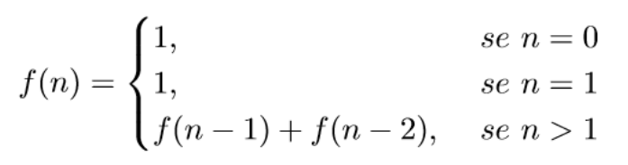

### Problema do Troco
- Problema: dar troco de um valor x com o menor número de moedas possíveis.
- Já vimos a solução utilizando backtracking e algoritmo guloso.
- Embora a solução gulosa seja bastante eficiente, ela nem sempre leva a uma solução ótima (dependendo das moedas disponíveis)
- A solução por PD irá se basear na solução por backtracking, mas memorizando as respostas para lidar com a sobreposição de subproblemas.

- Para moedas = {1, 5, 10, 25} e troco = 26 temos a seguinte árvore de recursão:

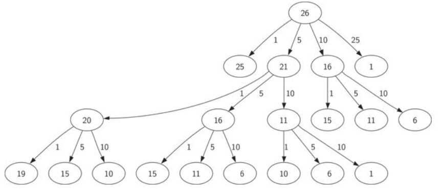

- Relação de recorrência

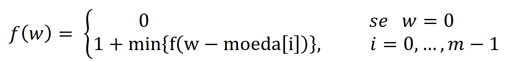

- Implementação (Top-down):
``` cpp
int troco(int x){
    if (x == 0)
        return 0;
    if (memo.count(x))
        return memo[x];
    memo[x] = INT_MAX;
    for(int m : moedas){
        if (m > x)
            continue;
        memo[x] = min(memo[x], 1 + troco(x-m));
    }
    return memo[x];
}
```

- Implementação (Bottom-up):
``` 
// Complexidade de tempo: O(N*W)
int minCoins(vector<int>& moedas, int w) {
    int n = moedas.size();
    vector<int> dp(w+1, INT_MAX);
    dp[0] = 0;
    for (int i = 1; i <= w; i++)
        for (int j = 0; j < n; j++)
            if (moedas[j] <= i)
                dp[i] = min(dp[i], dp[i-moedas[j]]+1);
    return dp[w];
}
```

### Corte do bastão (rod cutting)
- Dado um bastão de madeira de comprimento 𝑛 e uma tabela p de preços (venda) de cortes de 𝑛.
- Objetivo: determinar o valor máximo obtido cortando o bastão e vendendo os pedaços (cortes) ou o bastão inteiro

|Tamanho (cortes)|Preço| 
| -- | -- |
| 1 | R$ 1,00| 
| 2 | R$ 5,00|
| 3 | R$ 8,00|
| 4 | R$ 9,00|

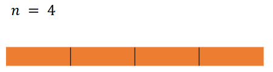
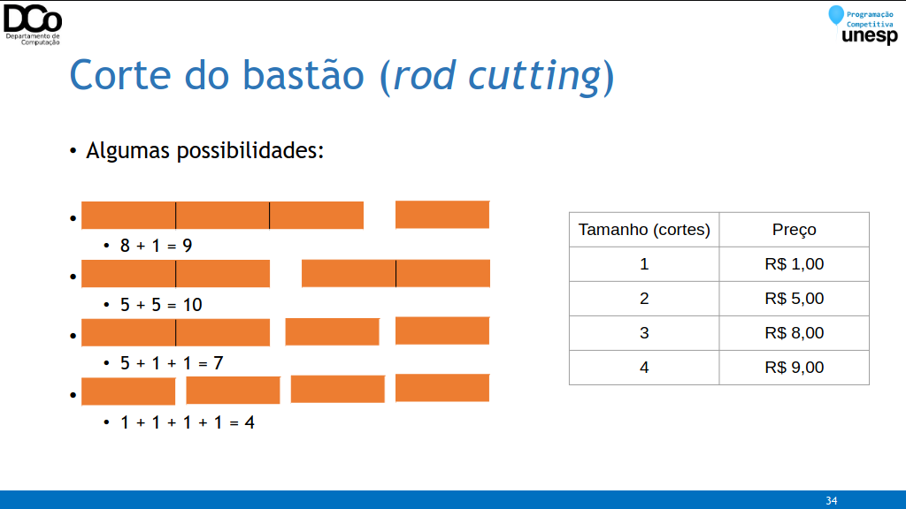

- Tentando encontrar a recorrência do problema:
- Nosso objetivo é maximizar o valor obtido de um bastão de tamanho 𝒏, vamos considerar que isso seja o resultado da função 𝒓𝒐𝒅(𝒏)
- Se fizermos um corte de tamanho 𝒊 nesse bastão, vamos obter um bastão de tamanho 𝒊 e um novo bastão de tamanho 𝒏 − 𝒊

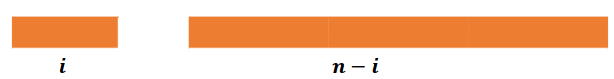

- Vamos considerar que não podemos mais fazer cortes no bastão de tamanho 𝒊, apenas no bastão de tamanho 𝒏 − 𝒊.
- Nesse caso, a solução seria p[i] + rod(n - i)
- A base da nossa solução será fazer isso para todos os possíveis cortes 𝒊, então podemos generalizar o problema da seguinte forma:

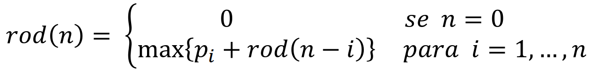
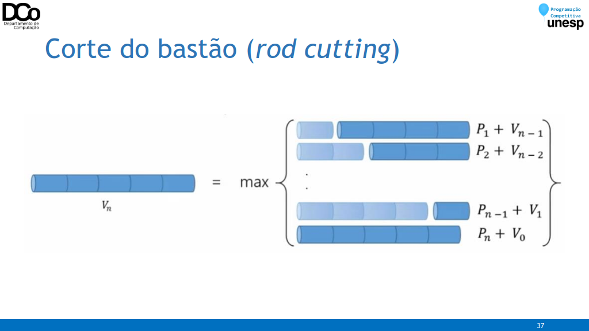

``` cpp
int rodCutter(int p[], int n){
    int rod[n+1];
    rod[0] = 0;
    for(int i = 1; i <= n; i++){
        int max_val = -INF;
        for(int j = 1; j <= i; j++)
            max_val = max( max_val, p[j] + rod[i-j] );
        rod[i] = max_val;
    }
    return rod[n];
}
```

### Prefix Sum
- Uma possibilidade é utilizar um vetor de soma de prefixos.
- Basicamente, uma posição i desse vetor armazena a soma de todos os valores entre 0 e i.

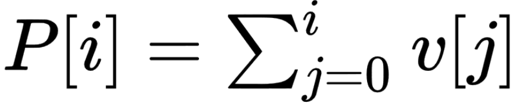

- Com essas informações, podemos responder uma consulta (l,r) muito facilmente, como veremos a seguir:
- Dados o vetor v e seu vetor de soma de prefixos P subjacente:
- Confira na GIF abaixo:

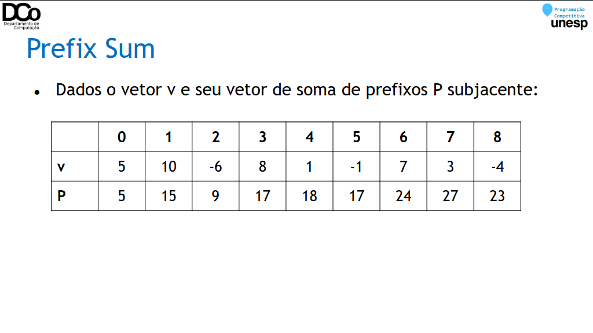

- Assim, podemos generalizar uma consulta q como sendo:
    - 𝑞(𝑙, 𝑟) = 𝑃[𝑟] − 𝑃[𝑙 − 1]
- Por este método, temos as seguintes complexidades:
    - Alteração: 𝑂(𝑛)
    - Consulta: 𝑂(1)
- Esta é uma ED muito interessante para quando não há (ou há poucas) atualizações nos valores do vetor.

### Prefix Sum - Aplicações
- Encontrar o índice de equilíbrio:
    - Encontrar o índice i para qual: v[0...i-1] = v[i+1...n-1]
    - Solução: buscar i para qual vale que P[i-1] == P[n-1] - P[i]

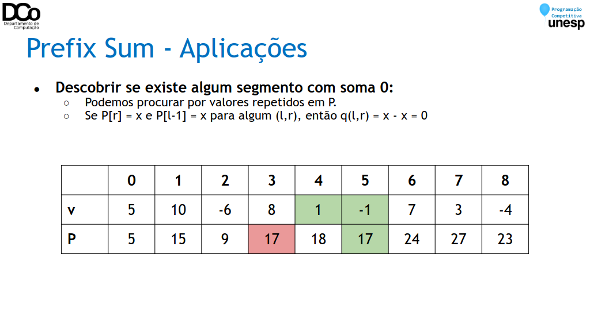

### Sugestões
Seminário sobre Programação Dinâmica da equipe UnespRPM: https://youtu.be/xYDOE8hG7Uk

DP Tutorial and Problem List: https://codeforces.com/blog/entry/67679

### Referências

Rene Pegoraro. Aulas de Técnicas de Programação.

Rene Pegoraro e Wilson M. Yonezawa. Aulas de Algoritmos Avançados.

Thiago Alexandre Domingues de Souza. Palestra sobre Programação Dinâmica.

Giulia Moura, João Pedro Comini e Pedro H. Paiola. Aulas de Programação Competitiva I.

Bruno Papa, Maurício Scarelli e Rodrigo Rosseti. Seminário sobre Programação Dinâmica.

LAAKSONEN, A. Competitive Programmer’s Handbook.

https://www.ime.usp.br/~pf/analise_de_algoritmos/aulas/dynamic-programming.html

http://www.decom.ufop.br/anderson/2_2012/BCC241/ProgramacaoDinamica.pdf

https://www.geeksforgeeks.org/tabulation-vs-memoizatation/

https://www.geeksforgeeks.org/solve-dynamic-programming-problem/

https://github.com/UnBalloon/programacao-competitiva/tree/master/Preffix%20sums%20(Somas%20de%20prefixos)
