### Revisando
- Algoritmos com estrutura recursiva, divisão e conquista
- Ideia: armazenar a solução de subproblemas para a resolução de problemas futuros
- Ideia é simples, o desafio é aplicar isso em diferentes problemas.
- Estratégias e dicas

- Ou, de forma análoga, podemos considerar os seguintes passos para resolver um problema de PD:

1. Identificar se é um problema de PD
2. Definir os estados do problema
3. Definir a relação entre os estados
4. Implementar a solução usando tabulation ou memoization

### Identificando o problema
- Na aula passada trabalhamos este passo com mais detalhes.
- Para podermos aplicar PD, o problema deve ter uma estrutura recursiva e apresentar as seguintes propriedades:
- Subestrutura ótima
- Sobreposição de subproblemas
- Problemas típicos:
- Encontrar a solução ótima de um problema, que maximize ou minimize um determinado valor.
- Contar o número de soluções possíveis.

### Definir os estados do problema
- Problemas de PD podem ser caracterizados por estados e transições
- Corte do bastão
- Estado: bastões resultantes dos cortes
- Transição: novo corte
- Troco
- Estado: moedas utilizadas até o momento e valor que falta a ser trocado
- Transição: adição de uma nova moeda
- A representação dos estados do problema devem ser feitos com um certo cuidado, pois isso vai afetar diretamente a próxima etapa, de definir a relação entre os estados, as transições
- Estado: um estado pode ser definido como um conjunto de parâmetros que identifica, unicamente, uma posição ou “situação” de um dado problema.
- Esse conjunto de parâmetros deve ser o menor possível, especialmente para reduzir o espaço necessário para armazenar as soluções dos subproblemas.
- Exemplos:
    - Fibonacci: i (i-ésimo termo)
    - Troco: valor a ser trocado
    - Bastões: tamanho do bastão ou pedaço a ser cortado
    - Se o estado que define uma certa instância (ou subinstância) do seu problema apresenta muitos parâmetros, sua solução deve ser ineficiente.
    - A solução pode também ser ineficiente em relação ao tempo, mas principalmente em relação ao espaço, demandando muita memória para armazenar as soluções de subproblemas.
    - Definir o melhor estado possível para as instâncias do problema é um passo primordial da aplicação de PD.
    - Atente-se a parâmetros redundantes ou inúteis.

### Definir a relação entre os estados
- Provavelmente a parte mais difícil na resolução de um problema de PD.
- Dependendo do problema, requer bastante intuição, observação e prática.
- Como ocorrem as transições entre estados? Quais são as decisões possíveis?
- Como definir a solução de um problema em função dos seus subproblemas?
- Encare o problema como sendo um problema de decisão: a partir de um certo estado, há um conjunto de decisões (ações, transições) possíveis, e deve-se determinar qual decisão leva a solução ótima.
- Cada transição leva a um determinado estado. Supondo que se conhece a solução de todos os estados para quais podemos avançar, como posso combinar essas informações para obter a solução do estado atual?

- Problema do troco:
    - Estado: valor a ser trocado
    - Decisões possíveis: moedas disponíveis
    - Para cada moeda adicionada, temos um novo valor a ser trocado. Como estamos adicionando apenas uma moeda, a melhor decisão é aquela que leva ao valor que precisa do menor número de moedas para ser trocado.

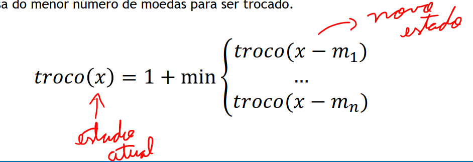

- Problema do corte do bastão:
    - Estado: tamanho do bastão
    - Decisões possíveis: cortes
    - Vamos considerar que em cada passo realizamos apenas um corte. A melhor decisão é o corte obtém o maior valor total, ou seja, considerando o preço do corte atual, com o maior valor possível de ser obtido com o bastão que sobrou.

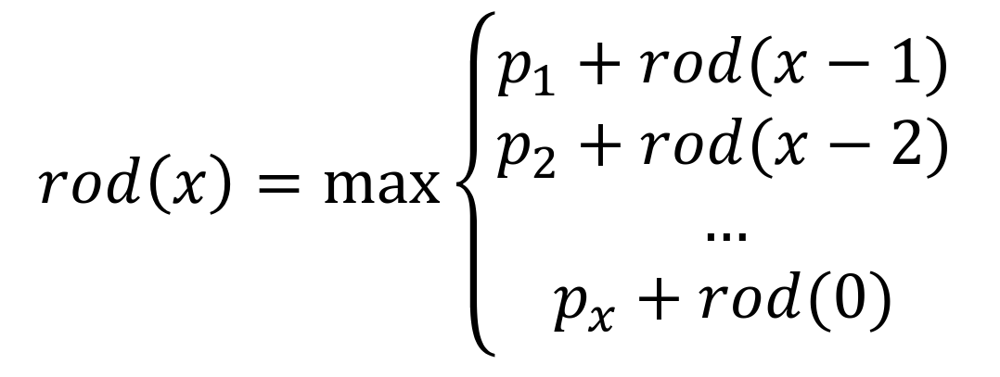

- Em alguns casos, tentar elaborar um diagrama de como o problema se comporta, buscando estabelecer relações entre os estados, pode ajudar a obter insights de como solucionar o problema.

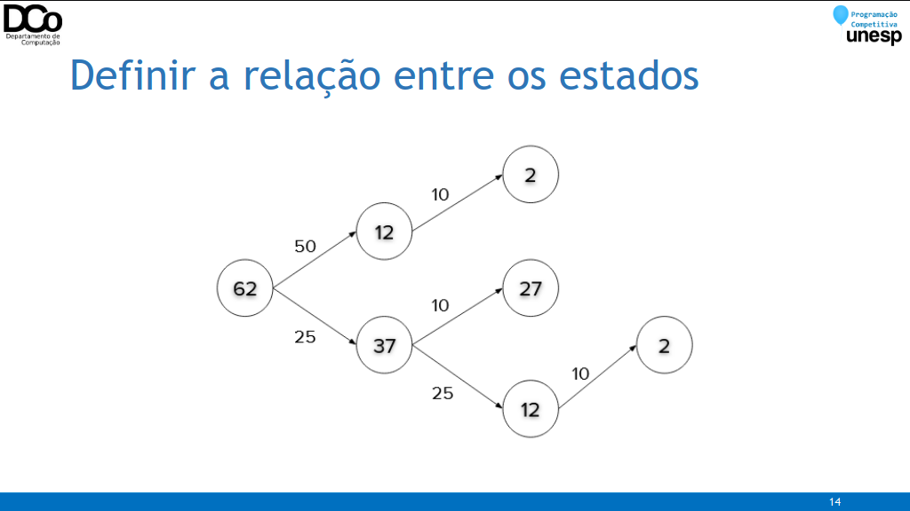


### Aplicar tabulation ou memoization
- Realizar a implementação da solução em si, considerando as abordagens apresentadas na aula anterior: Top Down e Bottom Up.
- As soluções dos subproblemas devem ser armazenadas de alguma forma, no caso mais geral temos:
```
memo[estado] = solução do estado
```

### Maior subsequência crescente (LIS)
- Subsequência: uma subsequência de uma sequência de elementos 𝑿 é uma sequência 𝑿’ com zero ou mais elementos de 𝑿 removidos.
- É uma sequência de elementos de 𝑿 não necessariamente contíguos.
- Exemplo:

𝑋 = {𝑨, 𝐵, 𝑪, 𝐵, 𝑫, 𝑪, 𝐵}

𝑋’ = {𝐴, 𝐶, 𝐷, 𝐶}

### Maior subsequência crescente (LIS)
- Maior subsequência crescente: dado uma sequência de números, determinar a maior subsequência de valores crescentes.

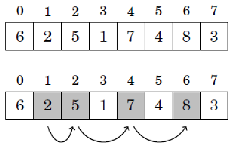

### Maior subsequência crescente (LIS)
- Inicialmente, vamos tentar verificar se este é um problema de PD, definindo a relação de recorrência mais intuitiva possível, sem nos preocupar com a eficiência da solução ainda.
- Se pensarmos um pouco, não é tão difícil perceber que a subsequência máxima de um vetor 𝑣[0 … 𝑛 − 1] pode ser definida a partir das subsequências máximas dos vetores 𝑣[0 … 𝑛 − 2] , 𝑣[0 … 𝑛 − 3] , ... .
- Confira a GIF abaixo:

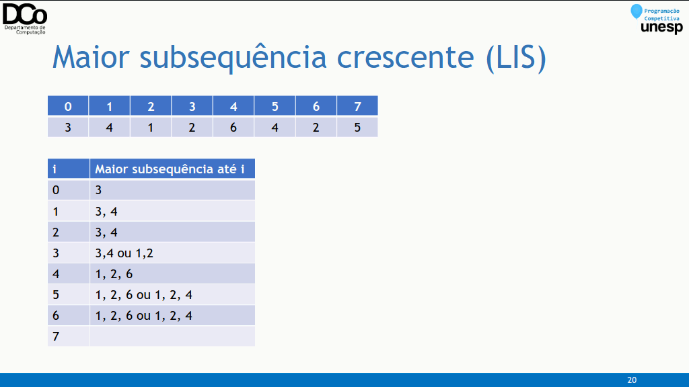

- Agora que já sabemos que podemos aplicar PD neste problema, vamos utilizar a estratégia apresentada anteriormente para modelá-los da melhor forma possível, visando uma implementação eficiente.
- Definição dos estados
- No passo anterior, concluímos que podemos determinar a subsequência máxima do vetor 𝒗[𝟎 … 𝒏 − 𝟏] a partir das subsequências máximas dos vetores 𝒗[𝟎 … 𝒏 − 𝟐], 𝒗[𝟎 … 𝒏 − 𝟑] ...
- A partir disso, parece interessante definir o estado do nosso problema como o índice em que acaba nosso vetor.
- Subsequência máxima que TERMINA na posição i; lis(i)
- Subsequência máxima do vetor inteiro: max(lis(i)), 0 <= i < n

#### Relação entre os estados
- Agora temos que definir/encontrar uma relação de recorrência.
- Problema base: lis(0) , nesse caso estamos considerando apenas o primeiro elemento do vetor, obviamente a maior subsequência crescente possível é 1 (considerando o único elemento possível)
- lis(0) = 𝟏
- E o passo da recursão?
- Para lis(i) queremos encontrar a subsequência máxima que termina e contém a posição i.
- Para isso, vamos considerar as posições i | i < i
- Se a[𝒋] > a[𝒊], não vamos considerar a lis(i), pois o elemento a[𝒊] não pode ser inserida nela.
- Se a[𝒋] <= a[𝒊], então a[𝒊] pode ser inserido na lis(i), gerando uma subsequência de tamanho lis(i + 1).

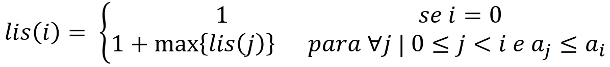
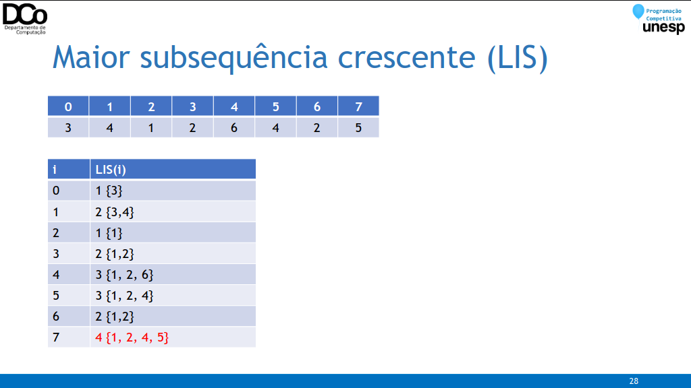
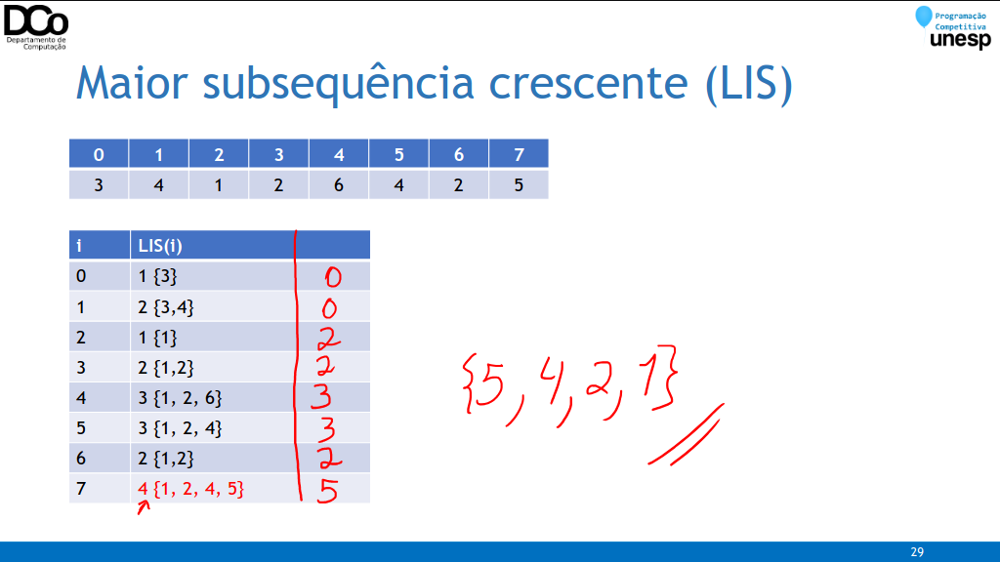

- Implementação (Top-down):
``` cpp
memo[] = {1, -1, -1, -1, …}
int lis(int i){ //retorna a LIS que termina em a[i]
    if (memo[i] != -1)
        return memo[i];
    memo[i] = 1;
    for(int j = 0; j < i; j++)
        if (a[j] <= a[i])
            memo[i] = max(memo[i], lis(j) + 1);
    return memo[i];
}
```

- Implementação (Bottom-up):
``` cpp
int lis(int n){
    int memo[n], lisMax = 0;
    for(int i = 0; i < n; i++){
        memo[i] = 1;
        for(int j = 0; j < i; j++){
            if (a[j] <= a[i])
            memo[i] = max(memo[i], memo[j] + 1);
        }
        lisMax = max(lisMax, memo[i]);
    }
    return lisMax;
}
```
- Esta solução do problema tem complexidade O(n²).
- Por força bruta, teríamos complexidade exponencial (testando todas as possíveis subsequências)
- Existem outras possíveis soluções, utilizando Programação Dinâmica e Busca Binária ou alguma estrutura de dados que trabalhe com range queries. Estas soluções atingem complexidade O (nlog(n)).
- Para mais detalhes:

https://cp-algorithms.com/sequences/longest_increasing_subsequence.html

### Maior subsequência comum (LCS)
- Problema: dadas as sequências 𝑋[0. . 𝑚 − 1] e 𝑌[0. . 𝑛 − 1], encontrar uma sequência 𝑍 tal que 𝑍 é subsequência de 𝑋 e de 𝑌 e tem comprimento máximo.
- Exemplo:

𝑋 = {𝐴, 𝑩, 𝑪, 𝑩, 𝐷, 𝑨, 𝐵}
𝑌 = {𝑩, 𝐷, 𝑪, 𝐴, 𝑩, 𝑨}
𝑍 = 𝐿𝐶𝑆(𝑋, 𝑌) = {𝐵, 𝐶, 𝐵, 𝐴}

- Força bruta: testar todas as subsequências se 𝑋 para ver se ela também é uma subsequência de 𝑌.
- Há 2𝑚 subsequências de 𝑋 para serem verificadas
- Cada subsequência gasta tempo 𝑂(𝑛) para ser verificada.
- Complexidade total: 𝑂(𝑛. 2𝑚)
- Como dito anteriormente, uma subsequência de 𝑋 é uma sequência 𝑋’ com zero ou mais elementos de 𝑋 removidos.
- Pensando nisso, nosso objetivo pode ser visto como minimizar o número de elementos removidos de duas sequências para que elas se tornem iguais (ou, de forma equivalente, maximizar o número de elementos inseridos).
- Teorema: Seja 𝑍[1. . 𝑘] uma LCS de 𝑋[1. . 𝑚] e 𝑌[1. . 𝑛]
    - Se 𝑥𝑚 = 𝑦𝑛 então 𝑧𝑘 = 𝑦𝑛 = 𝑥𝑚 e 𝑍[1. . 𝑘 − 1] é uma LCS de 𝑋[1. . 𝑚 − 1] e 𝑌[1. . 𝑛 − 1]
    - Se 𝑥𝑚 ≠ 𝑦𝑛 então 𝑧𝑘 ≠ 𝑥𝑚, sendo assim 𝑍[1. . 𝑘] é uma LCS de 𝑋[1. . 𝑚 − 1] e 𝑌[1. . 𝑛]
    - Se 𝑥𝑚 ≠ 𝑦𝑛 então 𝑧𝑘 ≠ 𝑦𝑛, sendo assim 𝑍[1. . 𝑘] é uma LCS de 𝑋[1. . 𝑚] e 𝑌[1. . 𝑛 − 1]
    - Esse teorema mostra que este problema atende a propriedade da Subestrutura Ótima.

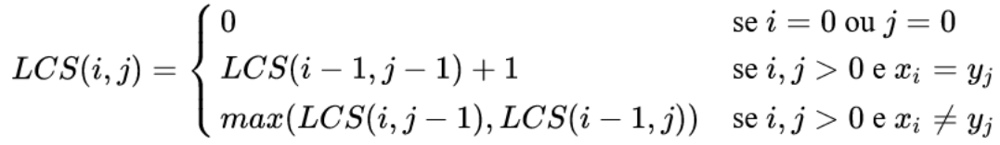

- Confira a GIF abaixo:

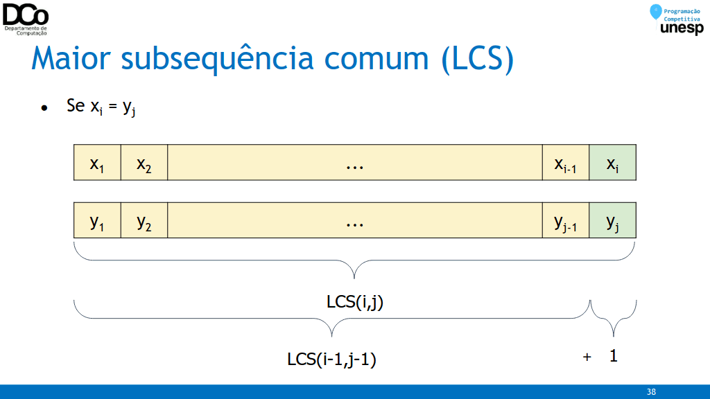

### Problema da Mochila
- Problema:
    - Uma mochila suporta até 𝑊 quilos
    - Itens devem ser adicionados à mochila
    - Cada item tem um peso 𝑤𝑖 e um valor 𝑣𝑖
    - 𝑤𝑖 e 𝑣𝑖 são inteiros
- Objetivo:
    - Qual o valor máximo que não ultrapassa o limite da mochila?


- Caso base:
    - Se a capacidade da mochila ou a quantidade de itens for zero, então o valor máximo é zero.
    - Passo da recursão
    - Senão, há duas opções: incluir ou não incluir (considerando o problema da mochila binária, onde não há repetições de itens)
    - Queremos maximizar o valor total carregado sem ultrapassar a capacidade da mochila.

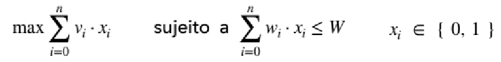

w = capacidade disponível, i = item atual

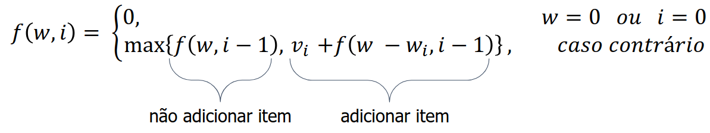

- Confira a GIF abaixo:

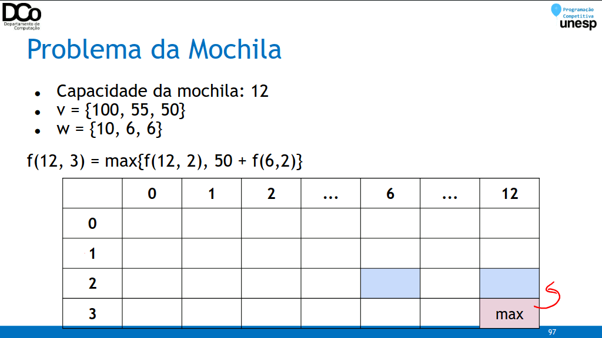

### Problema da Mochila – Top Down
``` cpp
int knapsack(int w, int n){
    if(memo[w][n] != -1)
        return memo[w][n];
    if(w == 0 || n == 0)
        return memo[w][n] = 0;
    if(weight[n-1] > w)
        return memo[w][n] = knapsack(w, n-1);
    return memo[w][n] = max(knapsack(w, n-1), value[n-1] +
    knapsack(w - weight[n-1], n-1));
}
```

### Problema da Mochila – Bottom Up
``` cpp
for(int i=0; i<=n; i++)
    dp[i][0] = 0;
for(int j=0; j<=w; j++)
    dp[0][j] = 0;
for(int i=1; i<=n; i++){
    for(int j=1; j<=w; j++){
    if(weight[i-1] > j)
        dp[i][j] = dp[i-1][j];
    else
        dp[i][j] = max(dp[i-1][j], dp[i-1][j-weight[i-1]] + value[i-1]);
    }
}
```

### Mochila: otimizando espaço
- Em nossa solução, estamos utilizando uma matriz 𝑑𝑝[𝑀𝐴𝑋_𝑊, 𝑀𝐴𝑋_𝑁].
- Dependendo do problema, isso pode ocasionar estouro de memória.
- Existem algumas formas de otimizar nossa solução para não precisarmos de uma matriz tão grande. Veja algumas delas nos seguintes links:

https://www.geeksforgeeks.org/space-optimized-dp-solution-0-1-knapsack-problem

https://codeforces.com/blog/entry/47247?#comment-316200

https://medium.com/@ThatOneKevin/knapsack-problems-part-1-8465fb2d53e9

### Mochila ilimitada (com repetição)
- Uma variação comum do Problema da Mochila.
- Neste caso podemos considerar que temos uma quantidade ilimitada de cada item. Sendo assim, um mesmo item pode ser colocado mais de uma vez dentro da mochila.

### Mochila ilimitada (com repetição)
- A ideia da nossa solução não irá se alterar muito. De certa forma, será até mais simples.
- Para uma certa capacidade 𝑖 da mochila, verificamos todos os itens 𝑗 que podem ser colocados nela (𝑤[𝑗] <= 𝑖) e qual resulta em maior valor (𝑣[𝑗] + 𝑑𝑝[𝑖 − 𝑤[𝑗]])


### Mochila ilimitada (com repetição)
``` cpp
int knapsack(int n, int w){
    memset(dp, 0, sizeof(dp));
    for(int j=1; j<=w; j++){
        for(int i=1; i<=n; i++){
        if(weight[i-1] <= j)
            dp[j] = max(dp[j], dp[j-weight[i-1]] + v[i-1]);
        }
    }
    return dp[w];
}
```

### Diving for Gold (UVA - 990)
- Problema: Dado 𝑛 tesouros representados por pares (profundidade, quantidade de ouro)
- Para pegar um tesouro, leva-se 3 ∗ 𝑤 ∗ 𝑝𝑟𝑜𝑓𝑢𝑛𝑑𝑖𝑑𝑎𝑑𝑒 segundos (sendo 𝑤 uma constante dada pela entrada)
- Temos um cilindro de ar que nos permite ficar 𝑡 segundos submersos.
- Objetivo: determinar o máximo de tesouros que podemos pegar, e quais são estes tesouros.

### Referências
Rene Pegoraro. Aulas de Técnicas de Programação.

Rene Pegoraro e Wilson M. Yonezawa. Aulas de Algoritmos Avançados.

Thiago Alexandre Domingues de Souza. Palestra sobre Programação Dinâmica.

Giulia Moura, João Pedro Comini e Pedro H. Paiola. Aulas de Programação Competitiva I.

Bruno Papa, Maurício Scarelli e Rodrigo Rosseti. Seminário sobre Programação Dinâmica.

LAAKSONEN, A. Competitive Programmer’s Handbook.

https://www.ime.usp.br/~pf/analise_de_algoritmos/aulas/dynamic-programming.html

http://www.decom.ufop.br/anderson/2_2012/BCC241/ProgramacaoDinamica.pdf

https://www.geeksforgeeks.org/tabulation-vs-memoizatation/

https://www.geeksforgeeks.org/solve-dynamic-programming-problem/

https://sites.google.com/site/ldsicufal/disciplinas/programacao-avancada/notas-de-aula---programao-dinmica

https://www.geeksforgeeks.org/longest-common-subsequence-dp-4/

https://www.tutorialspoint.com/design_and_analysis_of_algorithms/design_and_analysis_of_algorithms_longest_common_subsequence.htm

https://neps.academy/lesson/164

http://www.facom.ufms.br/~marco/analise2007/aula12_4.pdf

https://github.com/icmcgema/gema/blob/master/09-Programacao_Dinamica.ipynb

https://www.ime.usp.br/~pf/analise_de_algoritmos/aulas/mochila-bool.html

https://www.geeksforgeeks.org/space-optimized-dp-solution-0-1-knapsack-problem

https://www.geeksforgeeks.org/unbounded-knapsack-repetition-items-allowed
