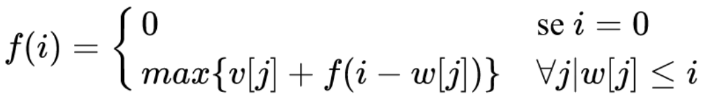

### Revisando
• Algoritmos com estrutura recursiva, divisão e conquista
• Ideia: armazenar a solução de subproblemas para a resolução de
problemas futuros
• Ideia é simples, o desafio é aplicar isso em diferentes problemas.
• Estratégias e dicas

• Ou, de forma análoga, podemos considerar os seguintes passos para
resolver um problema de PD:
1. Identificar se é um problema de PD
2. Definir os estados do problema
3. Definir a relação entre os estados
4. Implementar a solução usando tabulation ou memoization

### Identificando o problema
• Na aula passada trabalhamos este passo com mais detalhes.
• Para podermos aplicar PD, o problema deve ter uma estrutura recursiva
e apresentar as seguintes propriedades:
• Subestrutura ótima
• Sobreposição de subproblemas
• Problemas típicos:
• Encontrar a solução ótima de um problema, que maximize ou minimize um
determinado valor.
• Contar o número de soluções possíveis.

### Definir os estados do problema
• Problemas de PD podem ser caracterizados por estados e transições
• Corte do bastão
• Estado: bastões resultantes dos cortes
• Transição: novo corte
• Troco
• Estado: moedas utilizadas até o momento e valor que falta a ser trocado
• Transição: adição de uma nova moeda
• A representação dos estados do problema devem ser feitos com um certo
cuidado, pois isso vai afetar diretamente a próxima etapa, de definir a
relação entre os estados, as transições
• Estado: um estado pode ser definido como um conjunto de parâmetros
que identifica, unicamente, uma posição ou “situação” de um dado
problema.
• Esse conjunto de parâmetros deve ser o menor possível, especialmente
para reduzir o espaço necessário para armazenar as soluções dos
subproblemas.
• Exemplos:
• Fibonacci: i (i-ésimo termo)
• Troco: valor a ser trocado
• Bastões: tamanho do bastão ou pedaço a ser cortado
• Se o estado que define uma certa instância (ou subinstância) do seu
problema apresenta muitos parâmetros, sua solução deve ser ineficiente.
• A solução pode também ser ineficiente em relação ao tempo, mas principalmente
em relação ao espaço, demandando muita memória para armazenar as soluções de
subproblemas.
• Definir o melhor estado possível para as instâncias do problema é um
passo primordial da aplicação de PD.
• Atente-se a parâmetros redundantes ou inúteis.

### Definir a relação entre os estados
• Provavelmente a parte mais difícil na resolução de um problema de PD.
• Dependendo do problema, requer bastante intuição, observação e
prática.
• Como ocorrem as transições entre estados? Quais são as decisões
possíveis?
• Como definir a solução de um problema em função dos seus
subproblemas?
• Encare o problema como sendo um problema de decisão: a partir de um
certo estado, há um conjunto de decisões (ações, transições) possíveis, e
deve-se determinar qual decisão leva a solução ótima.
• Cada transição leva a um determinado estado. Supondo que se conhece a
solução de todos os estados para quais podemos avançar, como posso
combinar essas informações para obter a solução do estado atual?

• Problema do troco:
• Estado: valor a ser trocado
• Decisões possíveis: moedas disponíveis
• Para cada moeda adicionada, temos um novo valor a ser trocado. Como estamos
adicionando apenas uma moeda, a melhor decisão é aquela que leva ao valor que
precisa do menor número de moedas para ser trocado.


• Problema do corte do bastão:
• Estado: tamanho do bastão
• Decisões possíveis: cortes
• Vamos considerar que em cada passo realizamos apenas um corte. A melhor decisão
é o corte obtém o maior valor total, ou seja, considerando o preço do corte atual,
com o maior valor possível de ser obtido com o bastão que sobrou.


• Em alguns casos, tentar elaborar um diagrama de como o problema se
comporta, buscando estabelecer relações entre os estados, pode ajudar
a obter insights de como solucionar o problema.


### Aplicar tabulation ou memoization
• Realizar a implementação da solução em si, considerando as abordagens
apresentadas na aula anterior: Top Down e Bottom Up.
• As soluções dos subproblemas devem ser armazenadas de alguma forma,
no caso mais geral temos:
memo[estado] = solução do estado

### Maior subsequência crescente (LIS)
• Subsequência: uma subsequência de uma sequência de elementos 𝑿 é
uma sequência 𝑿’ com zero ou mais elementos de 𝑿 removidos.
• É uma sequência de elementos de 𝑿 não necessariamente contíguos.
• Exemplo:

𝑋 = {𝑨, 𝐵, 𝑪, 𝐵, 𝑫, 𝑪, 𝐵}
𝑋’ = {𝐴, 𝐶, 𝐷, 𝐶}

### Maior subsequência crescente (LIS)
• Maior subsequência crescente: dado uma sequência de números,
determinar a maior subsequência de valores crescentes.


### Maior subsequência crescente (LIS)
• Inicialmente, vamos tentar verificar se este é um problema de PD,
definindo a relação de recorrência mais intuitiva possível, sem nos
preocupar com a eficiência da solução ainda.
• Se pensarmos um pouco, não é tão difícil perceber que a subsequência
máxima de um vetor 𝑣[0 … 𝑛 − 1] pode ser definida a partir das
subsequências máximas dos vetores 𝑣[0 … 𝑛 − 2] , 𝑣[0 … 𝑛 − 3] , ... .

img6 - img8


• Agora que já sabemos que podemos aplicar PD neste problema, vamos
utilizar a estratégia apresentada anteriormente para modelá-los da
melhor forma possível, visando uma implementação eficiente.
• Definição dos estados
• No passo anterior, concluímos que podemos determinar a subsequência máxima do
vetor 𝒗[𝟎 … 𝒏 − 𝟏] a partir das subsequências máximas dos vetores 𝒗[𝟎 … 𝒏 −
𝟐], 𝒗[𝟎 … 𝒏 − 𝟑] …
• A partir disso, parece interessante definir o estado do nosso problema como o índice em que acaba nosso vetor.
• Subsequência máxima que TERMINA na posição 𝒊: 𝒍𝒊𝒔(𝒊)
• Subsequência máxima do vetor inteiro: 𝒎𝒂𝒙(𝒍𝒊𝒔(𝒊)), 𝟎 <= 𝒊 < 𝒏

• Relação entre os estados
• Agora temos que definir/encontrar uma relação de recorrência.
• Problema base: 𝒍𝒊𝒔(𝟎) , nesse caso estamos considerando apenas o primeiro
elemento do vetor, obviamente a maior subsequência crescente possível é 1
(considerando o único elemento possível)
• 𝒍𝒊𝒔(𝟎) = 𝟏
• E o passo da recursão?
• Para 𝒍𝒊𝒔(𝒊) queremos encontrar a subsequência máxima que termina e contém a
posição i.
• Para isso, vamos considerar as posições 𝒋 | 𝒋 < 𝒊
• Se 𝒂[𝒋] > 𝒂[𝒊], não vamos considerar a 𝒍𝒊𝒔(𝒋), pois o elemento 𝒂[𝒊] não pode ser
inserida nela.
• Se 𝒂[𝒋] <= 𝒂[𝒊], então 𝒂[𝒊] pode ser inserido na 𝒍𝒊𝒔(𝒋), gerando uma subsequência
de tamanho 𝒍𝒊𝒔 𝒋 + 𝟏.


• Implementação (Top-down):
``` C++
memo[] = {1, -1, -1, -1, …}
int lis(int i){ //retorna a LIS que termina em a[i]
    if (memo[i] != -1)
        return memo[i];
    memo[i] = 1;
    for(int j = 0; j < i; j++)
        if (a[j] <= a[i])
            memo[i] = max(memo[i], lis(j) + 1);
    return memo[i];
}
```

• Implementação (Bottom-up):
``` C++
int lis(int n){
    int memo[n], lisMax = 0;
    for(int i = 0; i < n; i++){
        memo[i] = 1;
        for(int j = 0; j < i; j++){
            if (a[j] <= a[i])
            memo[i] = max(memo[i], memo[j] + 1);
        }
        lisMax = max(lisMax, memo[i]);
    }
    return lisMax;
}
```
• Esta solução do problema tem complexidade 𝑂(𝑛²).
• Por força bruta, teríamos complexidade exponencial (testando todas as
possíveis subsequências)
• Existem outras possíveis soluções, utilizando Programação Dinâmica e
Busca Binária ou alguma estrutura de dados que trabalhe com range
queries. Estas soluções atingem complexidade 𝑂 𝑛. log 𝑛 .
• Para mais detalhes:
https://cp-algorithms.com/sequences/longest_increasing_subsequence.html

### Maior subsequência comum (LCS)
• Problema: dadas as sequências 𝑋[0. . 𝑚 − 1] e 𝑌[0. . 𝑛 − 1], encontrar uma
sequência 𝑍 tal que 𝑍 é subsequência de 𝑋 e de 𝑌 e tem comprimento
máximo.
• Exemplo:

𝑋 = {𝐴, 𝑩, 𝑪, 𝑩, 𝐷, 𝑨, 𝐵}
𝑌 = {𝑩, 𝐷, 𝑪, 𝐴, 𝑩, 𝑨}
𝑍 = 𝐿𝐶𝑆(𝑋, 𝑌) = {𝐵, 𝐶, 𝐵, 𝐴}

• Força bruta: testar todas as subsequências se 𝑋 para ver se ela também
é uma subsequência de 𝑌.
• Há 2𝑚 subsequências de 𝑋 para serem verificadas
• Cada subsequência gasta tempo 𝑂(𝑛) para ser verificada.
• Complexidade total: 𝑂(𝑛. 2𝑚)
• Como dito anteriormente, uma subsequência de 𝑋 é uma sequência 𝑋’
com zero ou mais elementos de 𝑋 removidos.
• Pensando nisso, nosso objetivo pode ser visto como minimizar o número
de elementos removidos de duas sequências para que elas se tornem
iguais (ou, de forma equivalente, maximizar o número de elementos
inseridos).
• Teorema: Seja 𝑍[1. . 𝑘] uma LCS de 𝑋[1. . 𝑚] e 𝑌[1. . 𝑛]
• Se 𝑥𝑚 = 𝑦𝑛 então 𝑧𝑘 = 𝑦𝑛 = 𝑥𝑚 e 𝑍[1. . 𝑘 − 1] é uma LCS de 𝑋[1. . 𝑚 − 1] e 𝑌[1. . 𝑛 − 1]
• Se 𝑥𝑚 ≠ 𝑦𝑛 então 𝑧𝑘 ≠ 𝑥𝑚, sendo assim 𝑍[1. . 𝑘] é uma LCS de 𝑋[1. . 𝑚 − 1] e 𝑌[1. . 𝑛]
• Se 𝑥𝑚 ≠ 𝑦𝑛 então 𝑧𝑘 ≠ 𝑦𝑛, sendo assim 𝑍[1. . 𝑘] é uma LCS de 𝑋[1. . 𝑚] e 𝑌[1. . 𝑛 − 1]
• Esse teorema mostra que este problema atende a propriedade da
Subestrutura Ótima.


img13-img68 (montar gif)


### Problema da Mochila
• Problema:
• Uma mochila suporta até 𝑊 quilos
• Itens devem ser adicionados à mochila
• Cada item tem um peso 𝑤𝑖 e um valor 𝑣𝑖
• 𝑤𝑖 e 𝑣𝑖 são inteiros
• Objetivo:
• Qual o valor máximo que não ultrapassa o
limite da mochila?


• Caso base:
• Se a capacidade da mochila ou a quantidade de itens for zero, então o valor
máximo é zero.
• Passo da recursão
• Senão, há duas opções: incluir ou não incluir (considerando o problema da mochila
binária, onde não há repetições de itens)
• Queremos maximizar o valor total carregado sem ultrapassar a
capacidade da mochila.


w = capacidade disponível, i = item atual


img72 - img83


### Problema da Mochila – Top Down
``` C++
int knapsack(int w, int n){
    if(memo[w][n] != -1)
        return memo[w][n];
    if(w == 0 || n == 0)
        return memo[w][n] = 0;
    if(weight[n-1] > w)
        return memo[w][n] = knapsack(w, n-1);
    return memo[w][n] = max(knapsack(w, n-1), value[n-1] +
    knapsack(w - weight[n-1], n-1));
}
```

Problema da Mochila – Bottom Up
``` C++
for(int i=0; i<=n; i++)
    dp[i][0] = 0;
for(int j=0; j<=w; j++)
    dp[0][j] = 0;
for(int i=1; i<=n; i++){
    for(int j=1; j<=w; j++){
    if(weight[i-1] > j)
        dp[i][j] = dp[i-1][j];
    else
        dp[i][j] = max(dp[i-1][j], dp[i-1][j-weight[i-1]] + value[i-1]);
    }
}
```

### Mochila: otimizando espaço
• Em nossa solução, estamos utilizando uma matriz 𝑑𝑝[𝑀𝐴𝑋_𝑊, 𝑀𝐴𝑋_𝑁].
• Dependendo do problema, isso pode ocasionar estouro de memória.
• Existem algumas formas de otimizar nossa solução para não precisarmos
de uma matriz tão grande. Veja algumas delas nos seguintes links:
https://www.geeksforgeeks.org/space-optimized-dp-solution-0-1-knapsack-problem
https://codeforces.com/blog/entry/47247?#comment-316200
https://medium.com/@ThatOneKevin/knapsack-problems-part-1-8465fb2d53e9

### Mochila ilimitada (com repetição)
• Uma variação comum do Problema da Mochila.
• Neste caso podemos considerar que temos uma quantidade ilimitada de
cada item. Sendo assim, um mesmo item pode ser colocado mais de uma
vez dentro da mochila.

### Mochila ilimitada (com repetição)
• A ideia da nossa solução não irá se alterar muito. De certa forma, será
até mais simples.
• Para uma certa capacidade 𝑖 da mochila, verificamos todos os itens 𝑗 que
podem ser colocados nela (𝑤[𝑗] <= 𝑖) e qual resulta em maior valor
(𝑣[𝑗] + 𝑑𝑝[𝑖 − 𝑤[𝑗]])



### Mochila ilimitada (com repetição)
``` C++
int knapsack(int n, int w){
    memset(dp, 0, sizeof(dp));
    for(int j=1; j<=w; j++){
        for(int i=1; i<=n; i++){
        if(weight[i-1] <= j)
            dp[j] = max(dp[j], dp[j-weight[i-1]] + v[i-1]);
        }
    }
    return dp[w];
}
```

### Diving for Gold (UVA - 990)
• Problema: Dado 𝑛 tesouros representados por pares (profundidade,
quantidade de ouro)
• Para pegar um tesouro, leva-se 3 ∗ 𝑤 ∗ 𝑝𝑟𝑜𝑓𝑢𝑛𝑑𝑖𝑑𝑎𝑑𝑒 segundos (sendo
𝑤 uma constante dada pela entrada)
• Temos um cilindro de ar que nos permite ficar 𝑡 segundos submersos.
• Objetivo: determinar o máximo de tesouros que podemos pegar, e quais
são estes tesouros.

### Referências
Rene Pegoraro. Aulas de Técnicas de Programação.
Rene Pegoraro e Wilson M. Yonezawa. Aulas de Algoritmos Avançados.
Thiago Alexandre Domingues de Souza. Palestra sobre Programação Dinâmica.
Giulia Moura, João Pedro Comini e Pedro H. Paiola. Aulas de Programação Competitiva I.
Bruno Papa, Maurício Scarelli e Rodrigo Rosseti. Seminário sobre Programação Dinâmica.
LAAKSONEN, A. Competitive Programmer’s Handbook.
https://www.ime.usp.br/~pf/analise_de_algoritmos/aulas/dynamic-programming.html
http://www.decom.ufop.br/anderson/2_2012/BCC241/ProgramacaoDinamica.pdf
https://www.geeksforgeeks.org/tabulation-vs-memoizatation/
https://www.geeksforgeeks.org/solve-dynamic-programming-problem/
https://sites.google.com/site/ldsicufal/disciplinas/programacao-avancada/notas-de-
aula---programao-dinmica
https://www.geeksforgeeks.org/longest-common-subsequence-dp-4/
https://www.tutorialspoint.com/design_and_analysis_of_algorithms/design_and_analysis
_of_algorithms_longest_common_subsequence.htm
https://neps.academy/lesson/164
http://www.facom.ufms.br/~marco/analise2007/aula12_4.pdf
https://github.com/icmcgema/gema/blob/master/09-Programacao_Dinamica.ipynb
https://www.ime.usp.br/~pf/analise_de_algoritmos/aulas/mochila-bool.html
https://www.geeksforgeeks.org/space-optimized-dp-solution-0-1-knapsack-problem
https://www.geeksforgeeks.org/unbounded-knapsack-repetition-items-allowed
