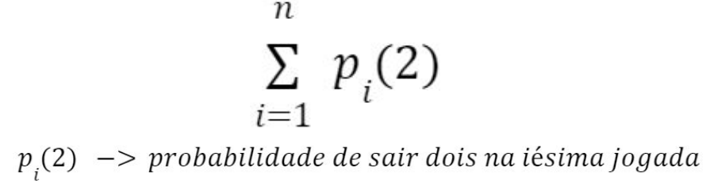
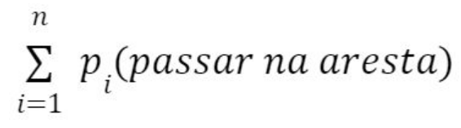
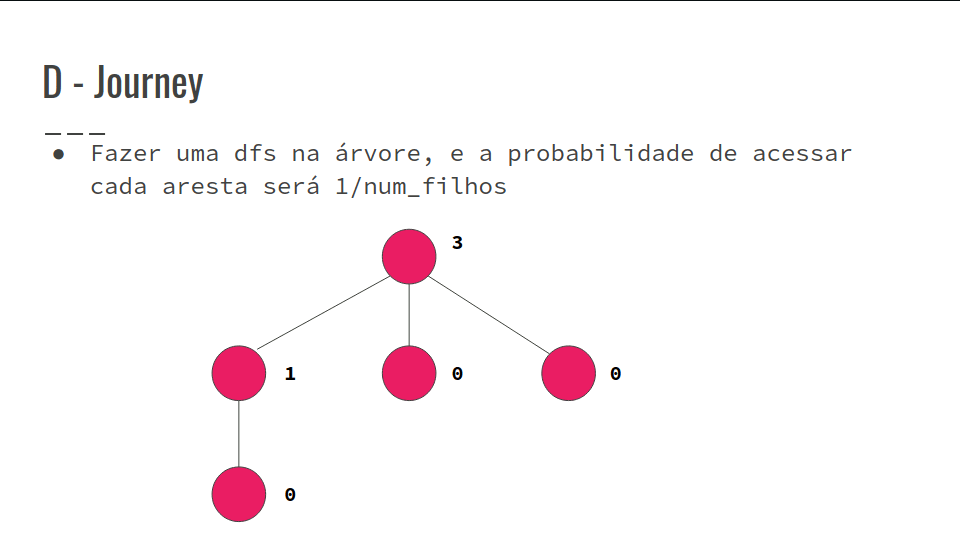
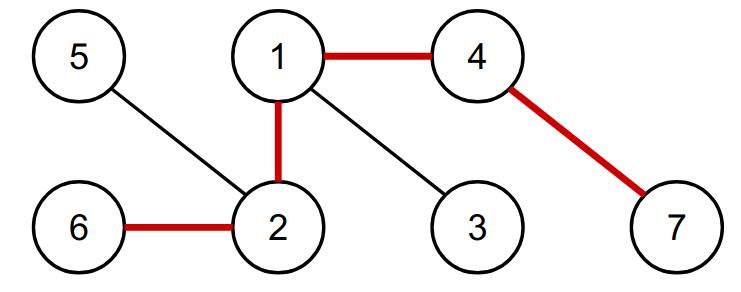
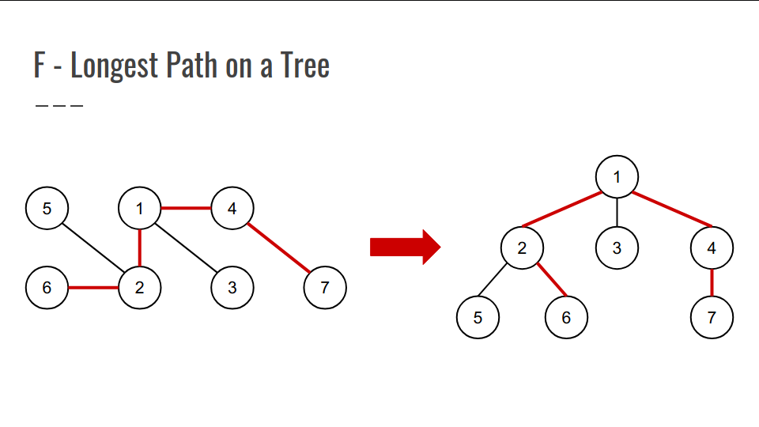
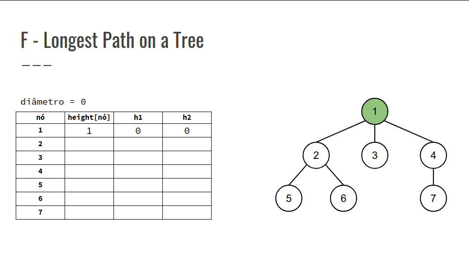
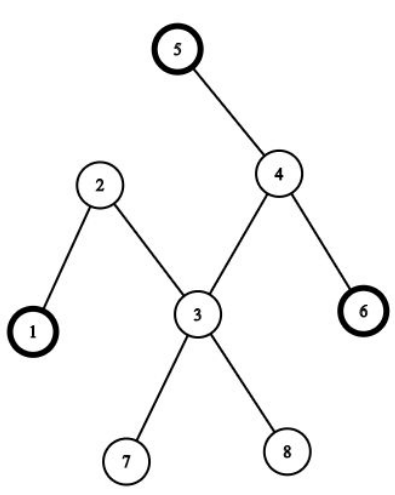

## Resolução dos Exercícios
### Exercícios A, D, F, E

### A - Cthulhu
- Vamos supor que um Cthulhu consiga ser representado no espaço como sendo:
    - Um grafo não direcionado que pode ser representado como um conjunto de uma árvore ou mais árvores que estão conectadas por um círculo simples Na entrada é garantido que não existem múltiplas arestas nem self-loops

Solução:
``` cpp
if (conexo == true && num_arestas == num_vertices)
    cout << “FHTAGN !”;
else
    cout << “NO”;
   ```

### D - Journey
- Encontrar o valor esperado de chegar à última cidade.
- N nós e N-1 arestas com todos os nós conectados
- O valor esperado tem relação com a probabilidade de se alcançar um nó.
- A definição de valor esperado vem da estatística
- Por exemplo, a probabilidade de tirar o número 2 em um dado é 1/6.
- Se fizermos 30 jogadas é esperado que tire o número 2 cinco vezes
- Se fizermos 40 jogadas o valor esperado para sair o dois no dado são 6.67 vezes.



- O exercício quer o valor esperado para a distância percorrida durante a viagem
- Portanto, a esperança da distância da viagem é a soma das probabilidades de passar em cada aresta



- Confira na GIF abaixo:



### F - Longest Path on a Tree
- Dada uma árvore não direcionada, queremos saber o tamanho do maior caminho entre quaisquer dois nós dela;
- Este tamanho é o número de arestas percorridas no caminho que sai de um nó u e chega em um nó v;
- Isto configura um problema de cálculo de diâmetro na árvore.
- O diâmetro de uma árvore é o maior comprimento de um caminho entre dois nós;
- A árvore ao lado possui diâmetro 4, compreendendo o caminho 6 -> 2 -> 1 -> 4 -> 7.



- Mas como podemos calcular esse diâmetro máximo?
- Vamos utilizar Programação Dinâmica!
- Para tal, escolhemos uma raiz para a árvore a partir de um nó arbitrário e resolvemos o problema separadamente para cada sub-árvore.



- Com a configuração atual da árvore, podemos perceber que, para cada caminho em nossa árvore enraizada, temos um nó que é o ponto mais alto, as raízes das sub-árvores;
- Assim, podemos calcular, para cada nó u, o comprimento do maior caminho que tem como ponto mais alto o nó u.
- Portanto, a estratégia é, sabendo a altura das sub- árvores de cada filho, basta selecionar as duas maiores alturas, somá-las e guardar a soma máxima, representando o diâmetro máximo;
- Nossa PD será um vetor das alturas, height[n], com height[u] = altura da sub-árvore u, ou seja, o comprimento máximo do nó u para qualquer folha.

- Recorrência:
    - Se u é nó folha:
        - height[u] = 1;
    - Senão, ∀ v | v é nó filho de u:
        - height[u] = max(height[u], height[v] + 1)

- Confira na GIF abaixo:


``` cpp
int main() {
    cin >> n;
    adj = vector<vi>(n + 1);
    for (ll i = 0; i < n - 1; i++) {
        ll u, v;
        cin >> u >> v;
        add_edge(u, v);
    }
    height = vi(n + 1, 1);
    diameter = 0;
    dfs(1, -1);
    cout << diameter << "\n";
    return 0;
}

ll dfs(ll u, ll parent) {
    ll h1, h2;
    h1 = h2 = 0;
    for (auto v : adj[u]) {
        if (v != parent) {
            height[u] = max(height[u], dfs(v, u) +
            1);
            if (height[v] > h2) {
                h2 = height[v];
                if (h2 > h1)
                    swap(h1, h2);
            }
        }
    }
    diameter = max(diameter, h1 + h2);
    return height[u];
}
```

### E - Three Paths on a Tree
- Dada uma árvore, queremos encontrar três caminhos de forma a conseguir passar pelo maior número de vértices possíveis.



- Pseudocódigo:
```
1. Calcular o diâmetro da árvore salvando as posições que fazer parte do 
mesmo

a. Se o diâmetro for igual ao tamanho da árvore:
	cout << diâmetro << diam[0] << diam[1] << diam.back();

b. Senão, passamos por cada um dos nós pertencentes ao diâmetro e 
calculamos a distância de cada uma delas em relação aos seus filhos, ou seja 
até a folha, salvando a folha
	cout << diametro + max_dist << diam[0] << max_folha << diam.back();
```
