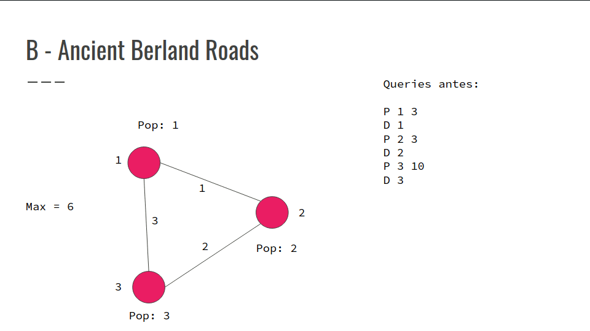
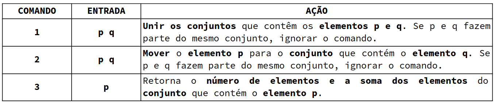
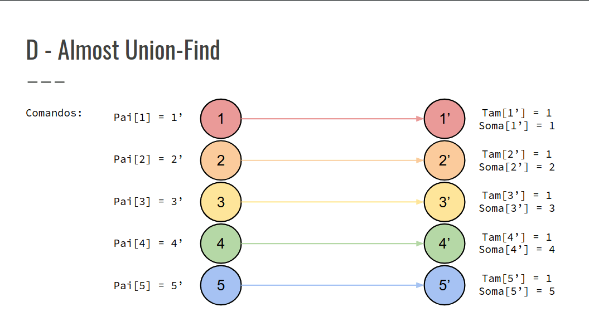

## Resolução dos Exercícios
### B e D

### B - Ancient Berland Roads
- São dadas N cidades e M rotas bidirecionais
- Com o passar do tempo existem queries que tiram estradas
- E também queries que mudam a população de uma cidade
- Em cada querie printar a máxima população de um grupo de cidades
- Problema off querie
- Cada mudança de população salvar nas queries a pop_antiga - pop_nova
- Se tenho uma população 3 na cidade e mudar para 5
- Salvar 3 - 5 = - 2 na querie de mudança de população
- Usar um multiset pra escolher a cidade com maior população
- Se aparecer uma querie P tem que retirar a população daquele conjunto de cidades do multiset
- Colocar a população de novo com o valor atualizado
- Em cada querie printar o valor mais alto no multiseto

- Confira na GIF abaixo:



### D - Almost Union-Find
- Implementar uma estrutura de dados que permite as seguintes operações:



- São dados N elementos, com valores de 1 até N, e M comandos;
- Inicialmente, cada Ni elemento pertence a um subconjunto distinto;
- Para cada comando Mi, modificar a estrutura conforme as ações de cada comando na tabela.

- Confira na GIF abaixo:



``` cpp
int main() {
    int n, m;
    while (cin >> n >> m) {
        init();
        while (m--) {
            int c, p, q;
            cin >> c >> p;
            if (c != 3) {
                cin >> q;
                c == 1 ? unite(p, q) : move(p, q);
            } else {
                p = find(p);
                cout << len[p] << " " << sum[p] << "\n";
            }
        }
    }
    return 0;
}
void init() {
    parent = len = sum = vi(2 * n + 1);
    for (int u = 1; u <= n; u++) {
        parent[u] = parent[u + n] = u + n;
        len[u + n] = 1;
        sum[u + n] = u;
    }
}
int find(int u) {
    if (u == parent[u])
        return u;
    return parent[u] = find(parent[u]);
}
void unite(int u, int v) {
    u = find(u);
    v = find(v);
    if (u != v) {
        if (len[u] < len[v])
            swap(u, v);
        parent[v] = u;
        len[u] += len[v];
        sum[u] += sum[v];
    }
}
void move(int u, int v) {
    int p;
    p = find(u);
    v = find(v);
    if (p != v) {
        parent[u] = v;
        len[p]--;
        sum[p] -= u;
        len[v]++;
        sum[v] += u;
    }
}
```
