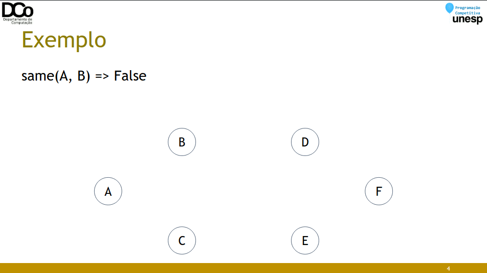
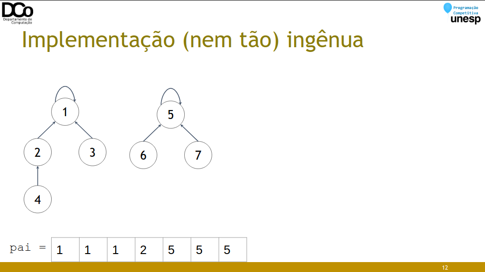
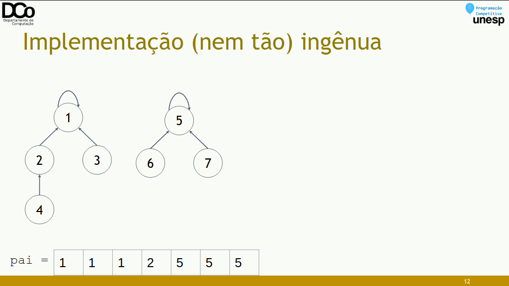
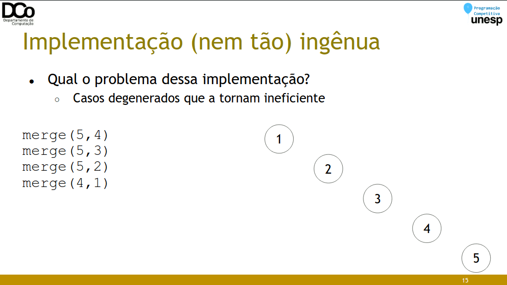
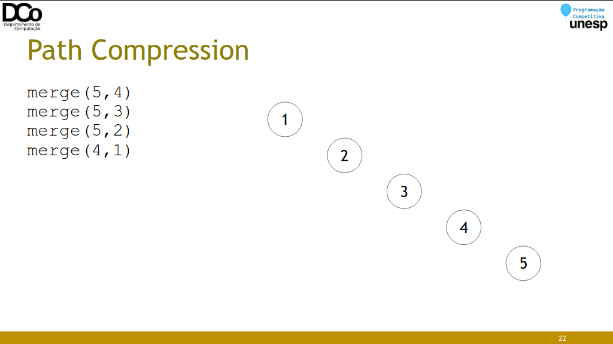
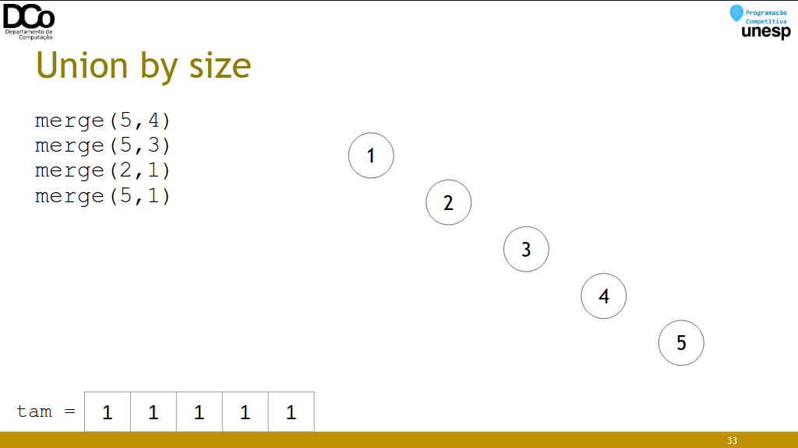
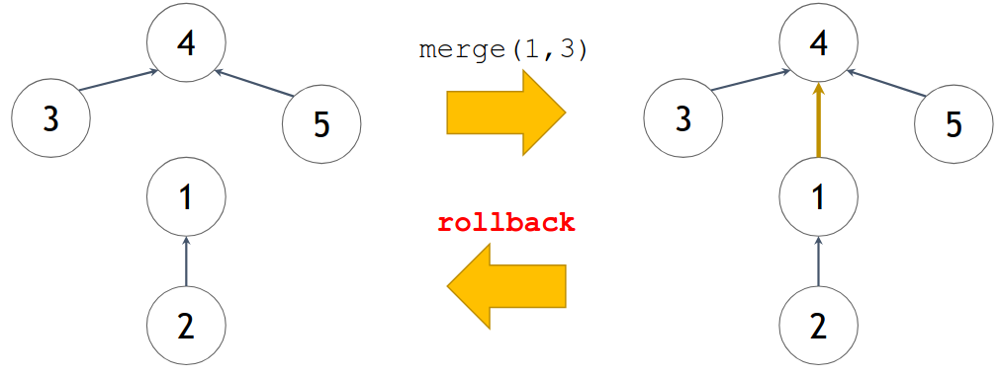
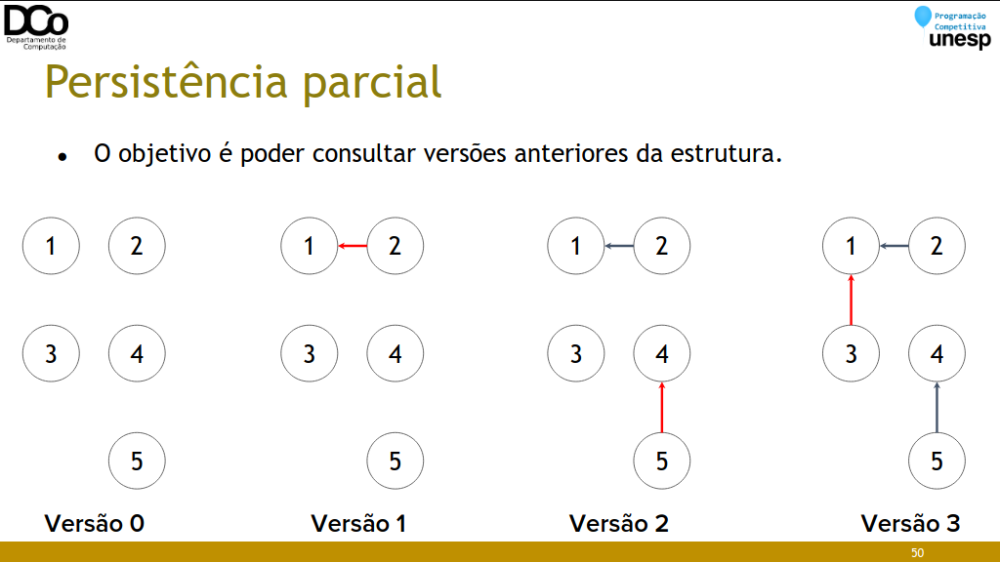
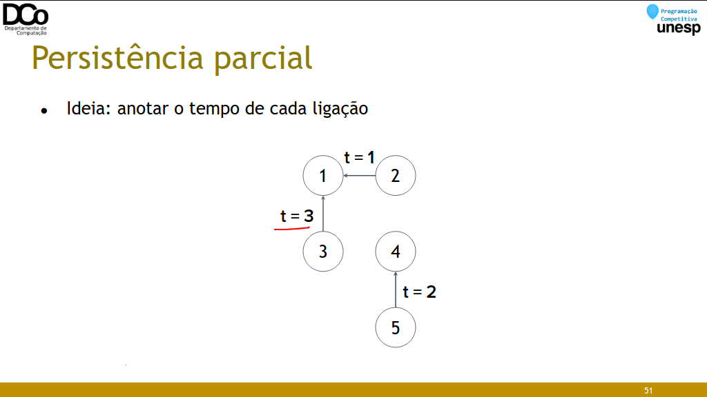

## Introdução
- Disjoint Set Union (DSU), também chamada de Union-find, devido as operações que esta estrutura de dados permite
- Esta estrutura armazena vários conjuntos disjuntos de elementos
    - Inicialmente, cada conjunto contém precisamente um elemento
- Permite a realização de duas operações:
    - merge(a, b): une os conjuntos aos quais a e b pertencem.
    - find(a): determina a qual conjunto o elemento a pertence.
- A partir do find, normalmente define-se a função same:
    - same(a, b): determina se a e b pertencem ao mesmo conjunto.

- Confira a GIF abaixo:



### Estruturando a solução
- Para implementar uma DSU, cada conjunto será representado por uma árvore, onde a raiz da árvore será o representante/líder do conjunto.



### Implementação (nem tão) ingênua
- find(x): retorna o líder do conjunto a que x pertence

- merge(x, y): conecta os líderes. Supondo que X seja líder de x e Y líder de y, vamos “eleger” Y como líder de X.

``` cpp
int pai[MAX_N + 1];
void init(){
    for(int i = 1; i <= MAX_N; i++)
        pai[i] = i;
}
int find(int x){
    if (pai[x] == x)
        return x;
    return find(pai[x]);
}
bool same(int x, int y){
    return find(x) == find(y);
}
void merge(int u, int v){
    int a = find(u);
    int b = find(v);
    pai[a] = b;
}
```

- Confira a GIF abaixo:


- Confira a GIF abaixo:


### Path Compression
- Ideia: comprimir os caminhos, fazendo todos os elementos do conjunto apontarem para o líder diretamente.
- Uma espécie de Programação Dinâmica.
- Tempo por operação: O(log n) amortizado

``` cpp
int pai[MAX_N + 1];
void init(){
    for(int i = 1; i <= MAX_N; i++)
        pai[i] = i;
}
int find(int x){
    if (pai[x] == x)
    return x;
    return pai[x] = find(pai[x]);
}
void merge(int u, int v){
    int a = find(u);
    int b = find(v);
    pai[a] = b;
}
```

- Confira a GIF abaixo:


### Union by size
- Ideia: unir os conjuntos do menor para o maior, minimizando a profundidade dos conjuntos.
- Estratégia “small-to-large”
- Tempo por operação: O(log n)

``` cpp
int pai[MAX_N + 1];
int tam[MAX_N + 1];

void init()
{
    for(int i = 1; i <= MAX_N; i++)
    {
        pai[i] = i;
        tam[i] = 1;
    }
}

int find(int x)
{
    if (pai[x] == x)
        return x;
    return find(pai[x]);
}
void merge(int u, int v)
{
    int a = find(u);
    int b = find(v);
    if (tam[a] > tam[b])
        swap(a,b);
    pai[a] = b;
    tam[b] += tam[a];
}
```

- Confira a GIF abaixo:


### Path Compression + Union by size
- Unindo ambas as técnicas garante-se complexidade quase constante, sendo a implementação mais recomendada.
- Outras técnicas de melhorias (na união dos conjuntos)
    - Union by rank
    - Linking by index
    - Coin-flip linking

### Problema: WAR (UVa - 10158)
- Conjunto n de pessoas de diferentes países.
- Duas pessoas são consideradas amigas se são do mesmo país, ou inimigas se são diferentes países.
- Neste problema, podem ser feitas 4 tipos de operações:
    - setFriends(x, y)
    - setEnemies(x, y)
    - areFriends(x, y)
    - areEnemies(x,y)
- Se uma operação contradizer alguma anterior, ela não é realizada e imprimimos -1 na tela

- Propriedades da amizade ~:
    - Se 𝑥 ~ 𝑦 e 𝑦 ~ 𝑧, então 𝑥 ~ 𝑧
    - Se 𝑥 ~ 𝑦 então 𝑦 ~ 𝑥
    - 𝑥 ~ 𝑥

- Propriedades da inimizade ∗:
    - Se 𝑥 ∗ 𝑦 então 𝑦 ∗ 𝑥
    - Não acontece 𝑥 ∗ 𝑥

- E também
    - Se 𝑥 ∗ 𝑦 e 𝑦 ∗ 𝑧, então 𝑥 ~ 𝑧 (o inimigo do meu inimigo é meu amigo)
    - Se 𝑥 ~ 𝑦 e 𝑦 ∗ 𝑧, então 𝑥 ∗ 𝑧 (o inimigo do meu amigo é meu inimigo)

- A partir dessas propriedades, podemos modelar o problema utilizando disjoint-sets. Cada pessoa 𝑥 possui dois conjuntos associados, o conjunto amigos(𝑥) e o conjunto inimigos(𝑥). E estes conjuntos devem satisfazer as propriedades anteriores.

- Detalhe de implementação: nos exemplos que vimos até agora, criamos um vetor pai de tamanho N, de forma que cada elemento começa associado a um conjunto. Neste exercício vamos criar um vetor de tamanho 2 * N, onde a primeira metade são os conjuntos de amigos e a segunda de inimigos

- Inicializando os conjuntos:
    - Toda pessoa é amiga dela mesma (𝑥 ~ 𝑥)
        ```
        pai[amigos(x)] = x;
        ```
    - Ninguém é inimigo de si mesmo (Não 𝑥 ∗ 𝑥)
        ```
        pai[inimigos(x)] = 0; //Considerando as pessoas numeradas de 1 a n
        ```

- setFriends(x, y)
    - Primeiro, precisamos verificar se x e y não são inimigos, o que iria gerar uma contradição
    - Caso não, então fazemos
        ```
        - merge(amigos(x), amigos(y))
        - merge(inimigos(x), inimigos(y))
        ```

- setEnemies(x, y)
    - Primeiro, precisamos verificar se x e y não são amigos, o que iria gerar uma contradição
    - Caso não, então fazemos
        ```
        merge(amigos(x), inimigos(y))
        merge(inimigos(x), amigos(y))
        ```

- areFriends(x, y)
```
same(amigos(x), amigos(y))
```

areEnemies(x, y)
```
same(amigos(x), inimigos(y))
```

### Rollback
- Em alguns problemas, pode ser necessário realizar um rollback, desfazendo uniões imediatamente anteriores.



- A cada operação merge, são feitas duas atribuições:
```
pai[i] = x;
tam[j] = y;
```
- Sendo assim, basta salvar os valores antigos em uma pilha, para restaurar se for necessário.
    - Uma pilha para o vetor pai: < i, pai[i] >
    - Uma pilha para o vetor tam: < j, tam[j] >
- Não permite usar path compression.

``` cpp
int pai[MAX_N + 1];
int tam[MAX_N + 1];
stack<pair<int, int> > old_pai;
stack<pair<int, int> > old_tam;
void init()
{
    for(int i = 1; i <= MAX_N; i++)
    {
        pai[i] = i;
        tam[i] = 1;
    }
}
int find(int x)
{
    if (pai[x] == x)
    return x;
    return find(pai[x]);
}
void merge(int u, int v)
{
    int a = find(u);
    int b = find(v);
    if (tam[a] > tam[b])
        swap(a,b);
    old_pai.emplace(a, pai[a]);
    old_tam.emplace(b, tam[b]);
    pai[a] = b;
    tam[b] += tam[a];
}
void rollback()
{
    auto paiAnt = old_pai.top();
    auto tamAnt = old_tam.top();
    pai[paiAnt.first] = paiAnt.second();
    tam[tamAnt.first] = tamAnt.second();
    old_pai.pop();
    old_tam.pop();
}
```

### Persistência parcial





- Operações básicas:
    - merge(x, y): conecta os conjuntos de x e y (criando uma nova “versão”)
    - find(x, t): retorna a qual conjunto x pertence no momento t
    - same(x, y, t): verifica se x e y pertencem ao mesmo conjunto no momento t

``` cpp
int pai[MAX_N + 1];
int tam[MAX_N + 1];
int his[MAX_N + 1];
int tempo;
void init()
{
    tempo = 0;
    for(int i = 1; i <= MAX_N; i++)
    {
        pai[i] = i;
        tam[i] = 1;
        his[i] = 0;
    }
}
int find(int x, int t)
{
    if (pai[x] == x) return x;
    if (his[x] > t) return x;
    return find(pai[x]);
}
void merge(int u, int v)
{
    tempo++;
    int a = find(u, tempo);
    int b = find(v, tempo);
    if (tam[a] > tam[b])
        swap(a,b);
    pai[a] = b;
    his[a] = tempo;
    tam[b] += tam[a];
}
```

### Pictionary (Gym - 102078A)
- Neste problema, temos um conjunto de N cidades, inicialmente todas desconectadas.
- Rodovias são construídas entre a cidades em M dias. Em um dia i, é construída uma estrada entre a e b se gcd(a, b) = M - i + 1.
- São feitas Q queries, constituídas por pares de cidades. O resultado de cada query é o número mínimo de dias necessários para conectar o par de cidades (direta ou indiretamente)
- Usaremos disjoint-sets com persistência parcial para unir as cidades marcando o momento em que as uniões foram feitas.
    - Para cada dia d, vamos conectar as cidades com gcd(a, b) = M - d + 1, que vamos chamar de x. Iterando sobre d, vamos realizar um merge de x com todos os seus múltiplos (até n).
    - Mas e se duas cidades (x, k * x) já tiverem sido conectadas indiretamente antes? Sem problemas, o merge vai verificar que as cidades já foram unidas em um momento anterior e não vai fazer nada.
- Para realizar as queries, executaremos uma busca binária para descobrir o número mínimo de dias necessários para conectar as cidades "a" e "b".

### Solução Offline
- Quando lidamos com problemas em que a entrada consiste em uma sequência de queries, temos dois tipos de soluções possíveis:
    - Online: cada query é processada no momento em que é lida, antes da leitura da próxima.
    - Offline: todas as queries são lidas para só depois serem processadas. E este processamento pode ser realizado em uma ordem conveniente, não necessariamente na ordem de entrada.
        - Ajuda a resolver certos problemas de forma mais eficiente

### Consecutive Letters (SPOJ – CONSEC)
- Problema: considere uma string S apenas com letras maiúsculas. São dadas Q queries, e cada query pode ser de dois tipos:
    - 1 i: encontre o tamanho máximo do segmento [b, e] em que a substring S[b...e] contenha apenas a letra S[i].
    - 2 i: Troque o caractere no índice i por ‘#’
- |𝑆| ≤ 200000
- 𝑄 ≤ 100000
- Uma forma de modelar este problema é utilizando uma DSU, de forma que uma sequência contígua de caracteres iguais estejam em um mesmo conjunto.
- O problema é que a segunda query representa uma possível cisão de um destes conjuntos, e a DSU permite realizar uniões de conjuntos, mas não separações.
- Porém, uma solução offline pode resolver este problema.
- Basta ler todas as queries e processá-las na ordem inversa. Dessa forma iniciamos com a string já alterada, com todas as substituições por ‘#’ já realizadas, e vamos realizando as operações de trás para frente.
    - 1 i: imprimimos o tamanho do conjunto a qual a posição i faz parte
    - 2 i: voltamos o caractere original da posição i, e então:
        ```
        S[i] == S[i-1] → merge(i, i-1)
        S[i] == S[i+1] → merge(i, i+1)
        ```

### Referências

https://files.johnjq.com/slides/summer/union-find.pdf

https://github.com/icmcgema/gema/blob/master/XX-Union_Find.md

https://cp-algorithms.com/data_structures/disjoint_set_union.html

https://www.youtube.com/watch?v=E33jZUw2l9Q
