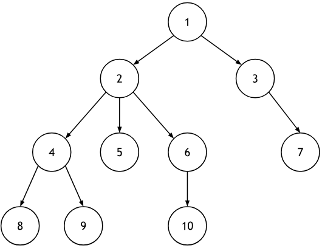
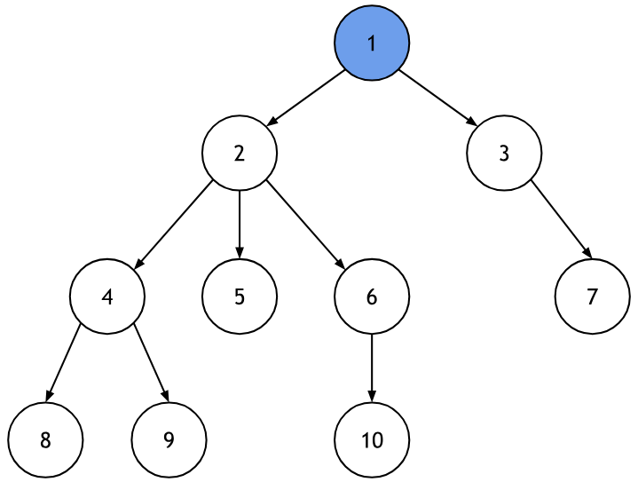
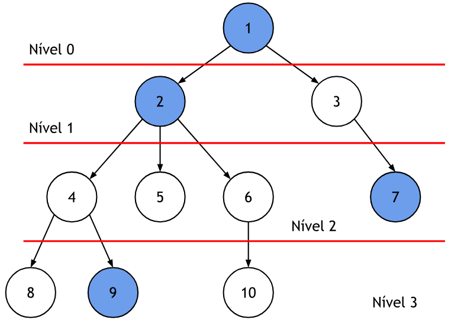
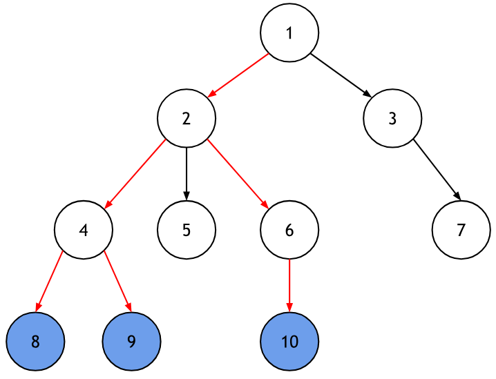
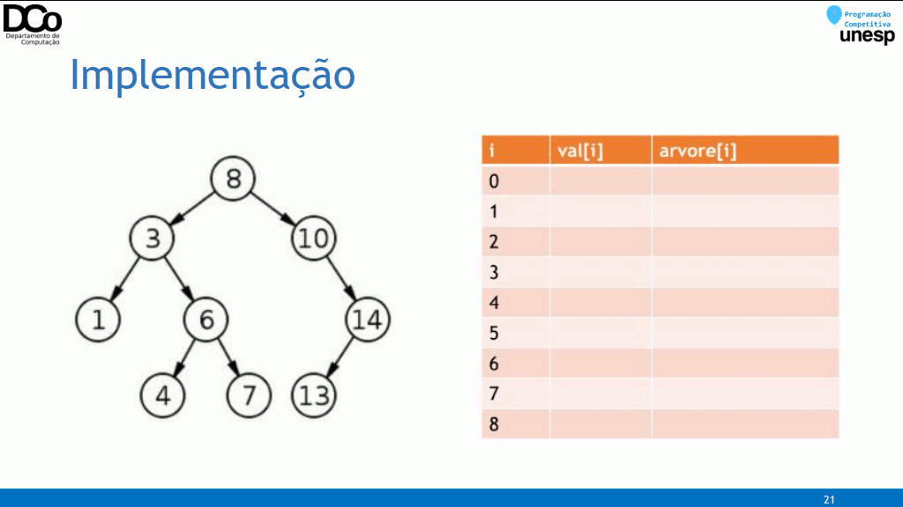
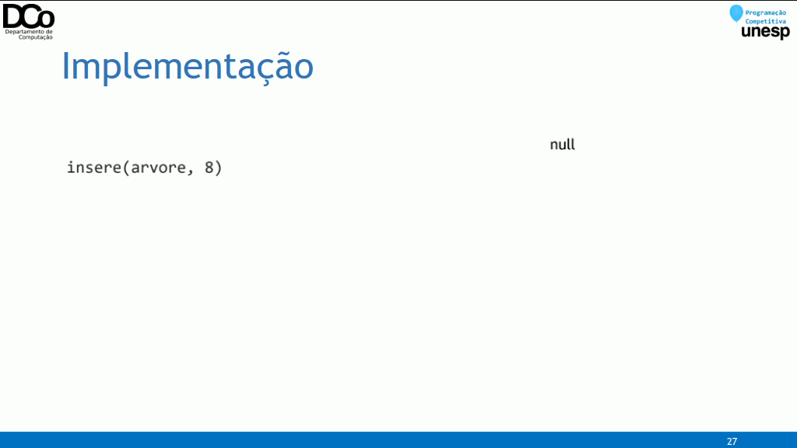
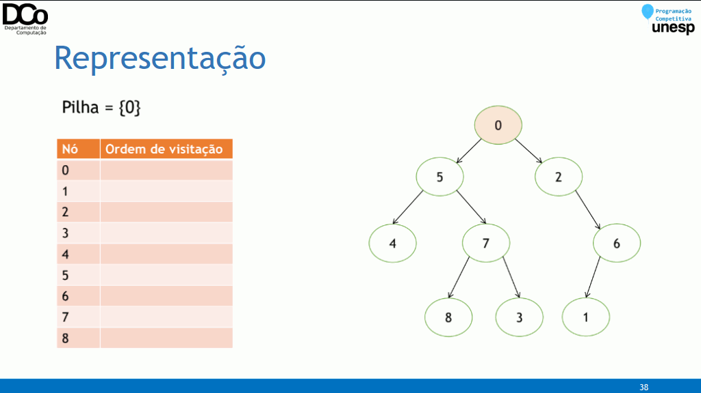
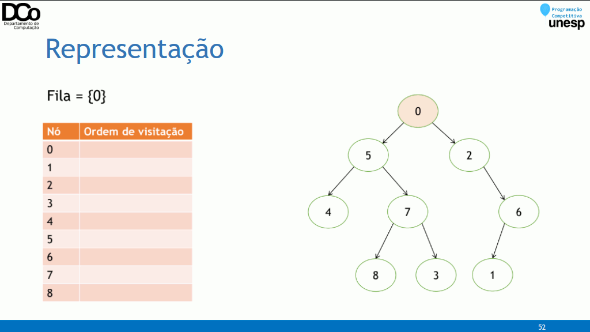
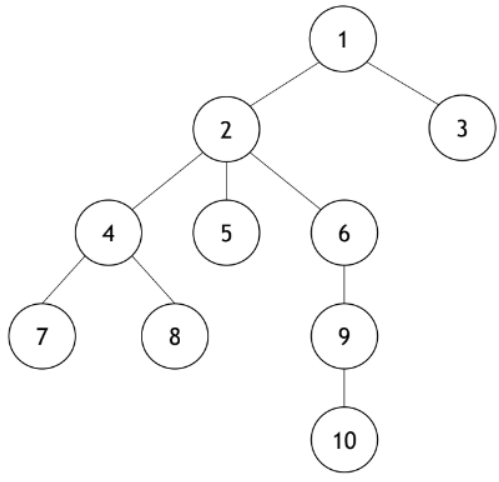
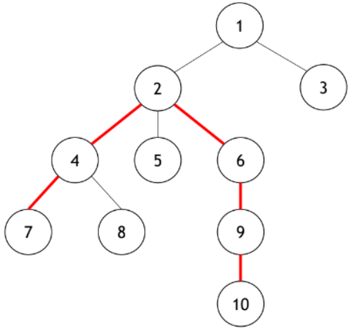

## Introdução
### Fundamentos
• Um grafo é um estrutura de dados que consiste em um conjunto de nós
(também denominados vértices) conectados entre si aos pares por
arestas;
• As árvores são um subconjunto dos grafos que apresentam
características específicas.
• Essas propriedades especiais permitem criar algoritmos especializados
mais eficientes que os aplicados aos grafos gerais.

### Definição
• Uma árvore é um grafo formado por N vértices indexados, ligados
entre si por N – 1 arestas;
• Ambas as características acima garantem que a árvore seja:
• Acíclica: não possuem ciclos, assim, só acessamos cada nó na
árvore uma única vez;
• Conexa: entre quaisquer dois nós pertencentes a árvore existe um
caminho.



## Terminologia
### Conceitos
• Pai: nó antecessor de um
determinado nó. Cada nó possui
apenas um único pai.
• Filho: nó sucessor de
um determinado nó. Um nó pai
pode ter vários filhos.
• Raiz: "O pai de todos". Primeiro
nó da árvore, aquele que dá
origem aos demais, portanto, o
único que não possui antecessor.



• Nível de um nó: distância que
um nó tem em relação a raiz, ou
seja, a quantidade de arestas
entre eles.
• Exemplos:
• Nível[1] = 0
• Nível[2] = 1
• Nível[7] = 2
• Nível[9] = 3



• Altura da árvore: quantidade de
níveis, a partir da raiz, até o nó
mais distante.
• Na árvore ao lado, altura = 3.



• Folha: nó que não possui filhos.

!{img5](img5.png)

• Grau de um nó: número de
ramificações, ou seja, de filhos
de determinado nó.
• Exemplos:
• Grau[1] = 2
• Grau[2] = 3
• Grau[6] = 1

!{img6](img6.png)

• Grau de uma árvore: número
máximo de ramificações de um
nó da árvore.
• Na árvore ao lado, grau =
max{grau[nó] | ∀ nó da árvore},
portanto, grau da árvore = 3.
• Sub-árvore: qualquer árvore
contida na árvore original.

### Tipos de Árvores
### Árvore Enraizada
• Uma árvore é enraizada quando há um nó especial, denominado de
raiz;
• Com exceção da raiz, todo nó é ligado por uma aresta a um, e apenas
um, nó;
• Há um caminho único da raiz a cada nó.
### Implementação
• Existem várias formas de se implementar uma árvore, tanto com
estruturas estáticas quanto dinâmicas;
• Qual a melhor representação depende muito do contexto em que a
árvore será aplicada;
• Para as árvores enraizadas, a implementação é feita através de uma
lista de adjacência, semelhante a implementação de grafos e aplicável
na maioria dos casos.
``` C++
vector<vector<int>> adj(qtd_vertices);
vector<int> parent(qtd_vertices);

void add_edge(int u, int v) {
    // nó u pai é pai de v
    adj[u].push_back(v);
    parent[u] = v;
}
```

img7 - img10 (montar gif)


### Árvore Binária de Busca
• Uma Árvore Binária de Busca é uma árvore enraizada com as
seguintes propriedades:

1. Deve ter grau de árvore de, no máximo, 2;
2. Para cada nó u, todos os nós da sub-árvore esquerda possuem valores menores que u, enquanto todos os nós da sub-árvore direita, valores maiores que u.
3. 
• Para sua implementação, utilizamos de ponteiros e alocação dinâmica
de memória;

Implementação:
``` C++
struct Node {
    int val;
    Node *left, *right;

    Node(const int &val) {
        this->val = val;
        left = right = null;
    }
};

typedef Node *Tree;

void insert(Tree &tree, const int &val) {
    if (tree != NULL) {
        if (val < tree->val) {
            insert(tree->left, val);
        } else {
             insert(tree->right, val);
        }
    } else {
        tree = new Node(val);
    }
}
```

img11 - img18 (montar gif)


## Algoritmos
### Algoritmos de Busca
• Um algoritmo de busca (ou de varredura) é um algoritmo que visita
todos os nós de um grafo ou árvore, andando pelas aresta de um
vértice a outro;
• Uma varredura por si só não resolve um problema específico, mas serve
de base para a resolução eficiente de vários problemas concretos.

### Busca em Profundidade (DFS)
• Na busca em profundidade (depth-first search), o algoritmo começa na
raiz da árvore e explora tanto quanto possível cada um dos seus ramos
antes de retroceder, representando uma ideia semelhante ao
backtracking.
• Pode ser implementada tanto da maneira iterativa quanto da maneira
recursiva;

img19 - img27 (montar gif)


Implementação Recursiva:
``` C++
void dfs(int u, int parent) {
    // processa o nó atual
    for (int i = 0; i < adj[u].size(); i++) {
        int v = adj[u][i];

        if (v != parent)
            dfs(u, v);
    }
}

void dfs(int u, int parent) {
    for (auto v: adj[u])
        if (v != parent)
            dfs(v, u);
}

void dfs(Tree tree) {
    if (tree == NULL)
        return;

    // processa o nó atual

    dfs(tree->left);
    dfs(tree->right);
}
```

Implementação Iterativa:
``` C++
void dfs(int root) {
    stack<int> s;
    s.push(root);

    while(!s.empty()) {
        int u = s.top();
        s.pop();

        // processa o nó atual

        for(auto v : adj[u])
            s.push(v);
    }
}
```

### Busca em Largura (BFS)
• Na busca em largura (breadth-first search), o algoritmo começa na raiz
da árvore e explora nível a nível, isto é, inicialmente, a raiz é
processada (nível 0), a seguir, todos os seus filhos (nível 1), então
todos os filhos dos seus filhos (nível 2) e assim por diante;
• A implementação da BFS é muito semelhante a versão iterativa da DFS,
mas utilizando uma fila ao invés de uma pilha.

img28 - img36 (montar gif)


Implementação:
``` C++
void bfs(int root) {
    queue<int> q;
    q.push(root);

    while(!q.empty()){
        int u = q.front();
        q.pop();

        // processa o nó atual

        for(auto v : adj[u])
            q.push(v);
    }
}
```
### Percurso em Árvore Binária
• Ao aplicar uma busca em profundidade em uma árvore binária, temos
três opções de percurso, considerando a ordem de visitação da raiz (R),
da sub-árvore da esquerda (E) e da sub-árvore da direita (D):
• Pré-ordem ou prefixo: R, E, D
• Em-ordem ou infixo: E, R, D
• Pós-ordem ou posfixo: E, D, R


## Programação Dinâmica em Árvores
### Árvores + Programação Dinâmica
• É comum a utilização de programação dinâmica para calcular certas
informações durante uma varredura em uma árvore.
• Exemplo:
• Determinar a quantidade de nós em cada sub-árvore.


Quantidade de nós na sub-árvore u:
``` C++
int dfs(int u) {
    counter[u] = 1;

    for(auto v : adj[u])
        counter[u] += dfs(v);

    return counter[u];
}
```
### PT07Z - Longest path in a tree
• O diâmetro de uma árvore é o maior comprimento de um caminho entre dois nós da árvore.
• Diâmetro da árvore ao lado: 5




### Referências
LAAKSONEN, A. Competitive Programmer’s Handbook.
https://www.ime.usp.br/~pf/analise_de_algoritmos/aulas/dynamic-programming.html
http://www.decom.ufop.br/anderson/2_2012/BCC241/ProgramacaoDinamica.pdf
https://www.geeksforgeeks.org/tabulation-vs-memoizatation/
https://www.geeksforgeeks.org/solve-dynamic-programming-problem/
