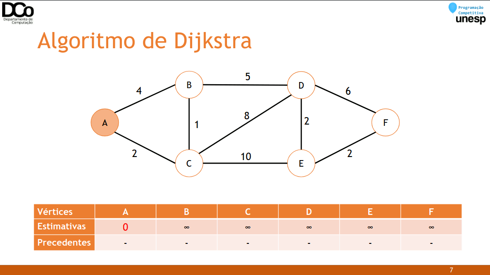
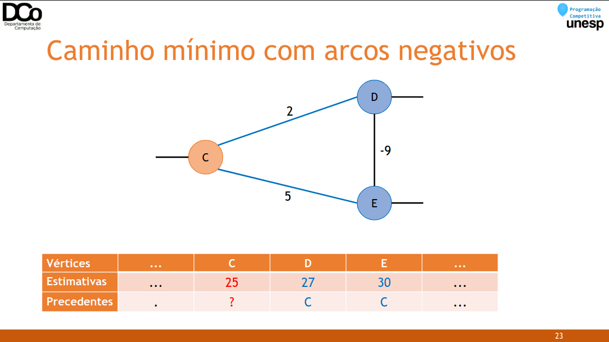
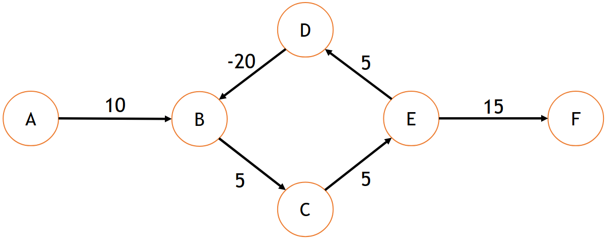
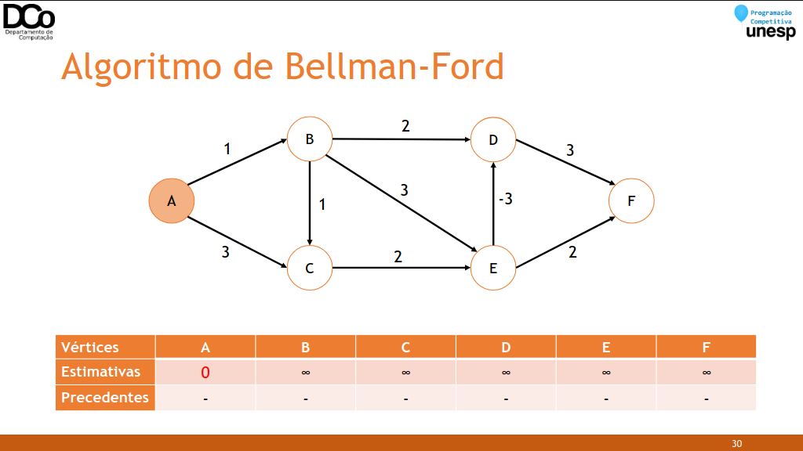
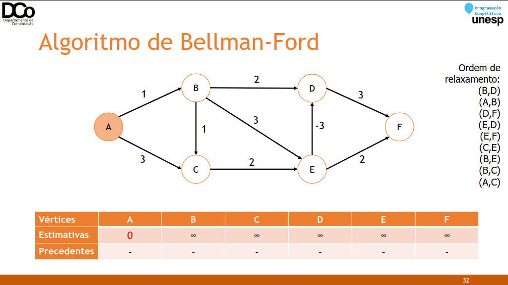
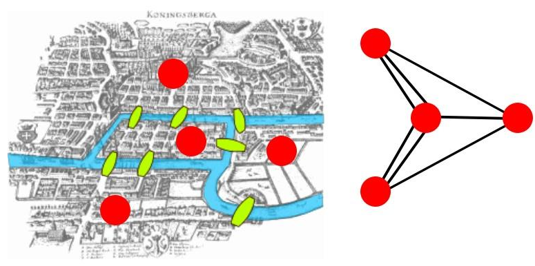
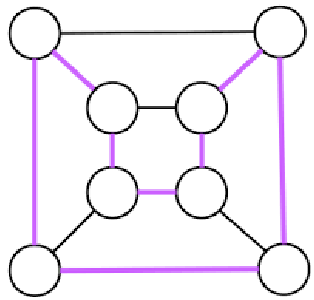

### Problema do Caminho Mínimo
- Imagine o seguinte problema: dado um mapa de cidades, contendo o comprimento das estradas entre as cidades, qual o menor caminho entre quaisquer cidades A e B?
- Esse problema pode ser modelado através de um grafo:
- Cidades: vértices;
- Estradas entre cidades: arestas ponderadas com peso que indicam a distância entre as cidades.
- Generalizando, o nosso problema é encontrar o caminho de menor custo em um grafo de um vértice A até um vértice B.
- Chamamos de custo de um caminho a soma dos pesos das arestas pertencentes a esse caminho.

### Tipos de algoritmos utilizados para caminhos mínimos
- Existem alguns algoritmos clássicos que resolvem tal problema:
- Dijkstra
    - Para pesos não negativos
    - Complexidade: O(V + A log V)
- Bellman-Ford
    - Permite lidar com pesos negativos
    - Complexidade: 𝑂(𝑉. 𝐴)
- Floyd-Warshall
    - Permite lidar com pesos negativos
    - Encontra o menor caminho entre todo os pares de vértices (𝑢, 𝑣)
    - Complexidade: 𝑂(𝑉3)

### Algoritmo de Dijkstra
- Este algoritmo parte de uma estimativa inicial para o custo mínimo e vai, iterativamente, ajustando esta estimativa.
- A busca se inicia a partir de um vértice, a qual denominamos origem.
- Ele considera que um vértice estará fechado quando já tiver sido obtido um caminho de custo mínimo da origem até ele. Caso contrário, ele é dito aberto.

- Pseudocódigo: seja G(V, A) um grafo e 𝑠 um vértice de G(origem):
```
1. Atribua valor zero à estimativa de custo mínimo do vértice 𝑠 e ∞ às demais.
2. Enquanto houver vértice aberto:
	A. Seja 𝑘 um vértice ainda aberto cuja estimativa seja a menor entre 
    todos os vértices abertos: fechar o vértice 𝑘
	B. Para todo o vértice 𝑗 ainda aberto que seja adjacente à 𝑘 faça:
		i. Soma a estimativa do vértice 𝑘 com o custo da aresta 𝑘, 𝑗
		ii. Caso essa estimativa seja melhor que a anterior para 𝑗, 
        substitua e anote 𝑘 como precedente (“pai”) de 𝑗
```

- Confira a GIF abaixo:



``` cpp
int d[MAX_V]; //d[i] armazena a distância até o vértice i, e as
//estimativas durante as iterações
int p[MAX_V]; //armazena o predecessor de cada vértice
void dijkstra(int inicial, int vertices){
    priority_queue< pair<int, int> > heap; //distância, vértice
    int s, t, peso;
    for(int i = 0; i < vertices; i++)
    d[i] = INT_MAX;
    memset(p, -1, sizeof(p));
    heap.push(make_pair(d[inicial] = 0, inicial));
    while(!heap.empty()){
        s = heap.top().second;
        heap.pop();
        for(int i = 0; i < grau[s]; i++){
            t = adj[s][i].v;
            peso = adj[s][i].w;
            if (d[s] + peso < d[t]){
            d[t] = d[s] + peso;
            p[t] = s;
            heap.push(make_pair(-d[t], t));
            }
        }
    }
}
```

- Analisando a complexidade desse algoritmo de forma intuitiva, temos que (pensando no pior caso):
    -  Todos os vértices são fechados: |𝑉| operações
    -  Cada vez que um vértice é fechado, é porque ele foi extraído de uma heap: custo O(1) => O(|𝑉|)
    -  Para cada vértice, todas as suas arestas são acessadas. No total, acessaremos |𝐴| arestas ⇒ 𝑂(|𝑉| + |𝐴|)
    -  Cada vez que uma aresta é acessada, podemos inserir um elemento na heap: custo 𝑂(log |𝑉|) ⇒ 𝑂((|𝑉| + |𝐴|) ∗ log |𝑉|)
    -  Complexidade: 𝑂( (|𝑉| + |𝐴|) . log |𝑉|)

### Caminho mínimo com arcos negativos
- O algoritmo de Dijkstra se baseia em uma estratégia gulosa, e esta falha quando temos arestas com pesos negativos.
- Quando fechamos o vértice aberto com menor distância até ele, estamos supondo que nenhum outro caminho até ele é menor.
- Quando os pesos são não negativos, isso é verdade porque qualquer outro caminho irá utilizar arestas com peso maior ou igual a zero.
- Porém, se existem arcos negativos, podemos ter caminhos que no momento apresentam um custo maior, mas posteriormente terão este custo reduzido pela adição de um arco negativo.

- Confira a GIF abaixo:



- Quando pode aparecer arcos negativos em problemas de caminho mínimo?
- Parece não fazer muito sentido falar em “distância” com arcos negativos, mas podemos ter diversos tipos de outros problemas em que esta situação se apresente.
- Por exemplo: problemas envolvendo dinheiro, onde arcos positivos representam gastos e arcos negativos representam lucro. Nesse caso, um caminho mínimo maximiza o lucro.
- Situação análoga: jogo em que os vértices representam estados, arcos positivos são transições que diminuem a pontuação do jogador, e arcos negativos são transições que aumentam a pontuação.
- Caso insolúvel: presença de ciclos negativos
- “Dar uma volta” em um ciclo de custo negativo sempre diminui o custo final.



### Algoritmo de Bellman-Ford
- Para encontrar um caminho mínimo em um grafo com a presença de arcos negativos, podemos utilizar o algoritmo de Bellman-Ford.
- Se houver ciclos negativos, ele irá detectar.
- O algoritmo de Bellman-Ford é dividido em três etapas:
- Inicialização: padronização das distâncias
- Relaxamento: cálculo efetivo dos caminhos mínimos
- Verificação de ciclos negativos
- Inicialização: como no Dijkstra, a distância até a origem é inicializada com 0 e as outras como infinito.



- Relaxamento: a técnica do relaxamento consiste em verificar se pode ser encontrado um caminho mais curto para 𝑣 passando por um certo vértice 𝑢:
```
se d[u] + peso(u, v) < d[v] então
d[v] = d[u] + peso(u,v)
p[v] = u
```
- De forma semelhante ao Dijkstra, isso será feito 𝑉 − 1 vezes, porém considerando TODAS as arestas, e não apenas as incidentes no último vértice “fechado”.

- Confira a GIF abaixo:



- Checagem de ciclos negativos: o relaxamento é aplicado mais uma vez.
- Se houver alguma situação em que se encontre caminho melhor, é por que temos a presença de um ciclo negativo.
- Caso em que sempre pode-se encontrar um caminho menor, ao “andar” mais uma vez pelo ciclo.

```
BellmanFord(G, origem)
    d[v] = infinito, para todo v
    p[v] = -1, para todo v
    d[origem] = 0
    para i de 1 até |V(G)| - 1 faça
        para cada aresta (u,v) de G faça
            relax(u, v, w)
    para cada aresta (u,v) de G faça
        se d[v] > d[u] + peso(u,v)
            retorna FALSE
    retorna TRUE
```

``` cpp
bool bellmanFord(int inicial, int n){
    memset(p, -1, sizeof(p));
    for(int i=0; i<n; i++)
        d[i] = INF;
    d[inicial] = 0;
    for(int i = 0; i < n-1; i++){ //|V|-1 passos
        for(int j = 0; j < n; j++){ //para todas as
            if (d[j] == INF)
                continue;
            for(int k = 0; k < grau[j]; k++){ //arestas (j, k)
                if(d[j] + adj[j][k].w < d[adj[j][k].v])
                {
                    d[adj[j][k].v] = d[j] + adj[j][k].w;
                    p[adj[j][k].v] = j;
                }
            }
        }
    }
    //Verificando se há ciclo negativo
    for(int i=0; i<n; i++){
        if (d[i] == INF)
            continue;
        for(int j = 0; j < grau[i]; j++){
            if (d[adj[i][j].v] > d[i] + adj[i][j].w)
                return false;
        }
    }
    return true;
}
```

### Caminho Euleriano
- Um caminho euleriano é um caminho que percorre cada aresta de um grafo exatamente uma vez.
- Um circuito ou ciclo euleriano é um caminho euleriano que começa e termina no mesmo vértice.
- As sete pontes de Königsberg



- Ao resolver o problema das sete pontes de Königsberg, Euler descobriu que existem critérios simples para determinar se um multigrafo tem um caminho ou ciclo euleriano:
- Um multigrafo conexo com, pelo menos, dois vértices tem um ciclo euleriano se, e somente se, cada um de seus vértices tiver grau par.
- Um multigrafo conexo tem um caminho euleriano (que não seja um ciclo) se, e somente se, tiver exatamente dois vértices de grau ímpar.
- Aplicações em problemas práticos:
- Problema do carteiro chinês: encontrar um caminho de menor custo que visite cada aresta do grafo ao menos uma vez.
- Desenho de circuitos.
- Redes de computadores de distribuição múltipla de dados.
- Sequenciamento de DNA.
- Problemas:
- CodeForces 508D - Tanya and Password
- URI 1671 - Código
- URI 1053 - Desenho Contínuo

### Caminho Hamiltoniano
- Um caminho hamiltoniano de um grafo 𝐺 é um caminho que passa por todos os vértices de 𝐺 exatamente uma vez.
- Um ciclo hamiltoniano é um caminho hamiltoniano que começa e termina no mesmo vértice.



- A solução desse problema é mais complexa do que o problema do caminho euleriano. Já foram encontradas algumas condições suficientes para dizer se um grafo possui um caminho hamiltoniano, mas nenhuma condição necessária e suficiente.
- O melhor algoritmo conhecido para encontrar um ciclo hamiltoniano (ou determinar se existe) tem complexidade exponencial.
- Problema do Caixeiro Viajante: encontrar a menor rota que um caixeiro-viajante deveria tomar para visitar um conjunto de cidades.
- Esse problema se reduz a encontrar um ciclo hamiltoniano em um grafo com o menor custo possível (custo = soma dos pesos das arestas do caminho).

### Referências
Aulas de Estrutura de Dados II da Profª Drª Marcia Aparecida Zanoli Meira e Silva.

Matemática Discreta e Suas Aplicações. Kenneth H. Rosen.

Seminário sobre Introdução a Teoria dos Grafos. Davi Neves, Giovani Candido, Luis Morelli e Luiz Sementille.

Biblioteca de códigos de Thiago Alexandre Domingues de Souza.

https://www.ime.usp.br/~pf/algoritmos_para_grafos/aulas/graphs.html

http://www.inf.ufsc.br/grafos/definicoes/definicao.html

https://www.ime.usp.br/~pf/algoritmos_para_grafos/aulas/shortestpaths.html

https://www.ime.usp.br/~pf/algoritmos_para_grafos/aulas/cheapestpaths.html

http://professor.ufabc.edu.br/~leticia.bueno/classes/aa/materiais/caminhominimo.pdf

http://www.inf.ufsc.br/grafos/temas/custo-minimo/dijkstra.html

https://www.ime.usp.br/~pf/algoritmos_para_grafos/aulas/dijkstra.html

http://www.deinf.ufma.br/~portela/ed211_Dijkstra.pdf

http://www.facom.ufu.br/~madriana/ED2/6-AlgDijkstra.pdf

https://www.ime.usp.br/~pf/algoritmos_para_grafos/aulas/bellman-ford.html

https://www.ic.unicamp.br/~rezende/ensino/mo417/2010s2/Slides/Aula23.pdf

http://www.dt.fee.unicamp.br/~ricfow/IA881/caminhoMinimo.pdf

https://pt.slideshare.net/jackocap/anlise-de-algoritmos-problemas-em-grafos-caminho-mnimo-algoritmo-de-bellmanford
