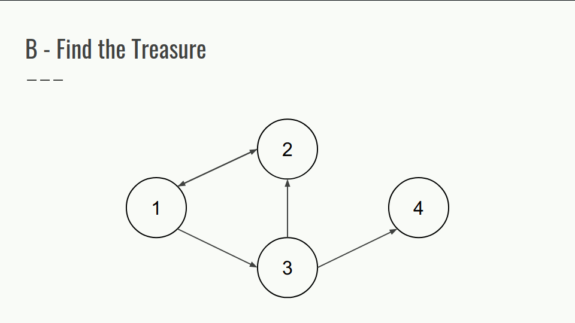
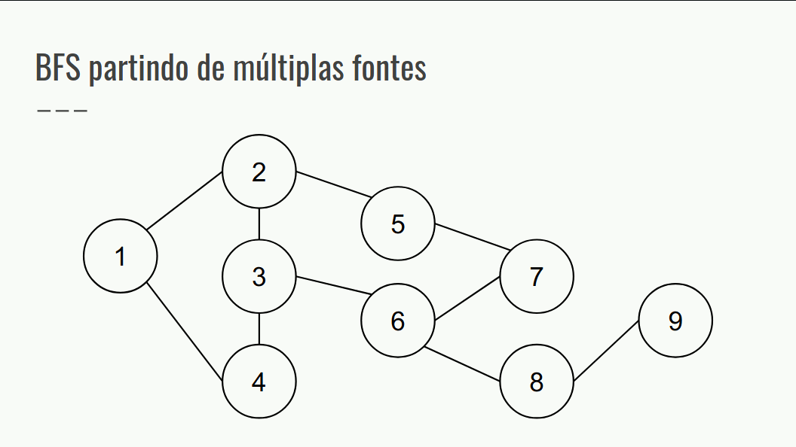
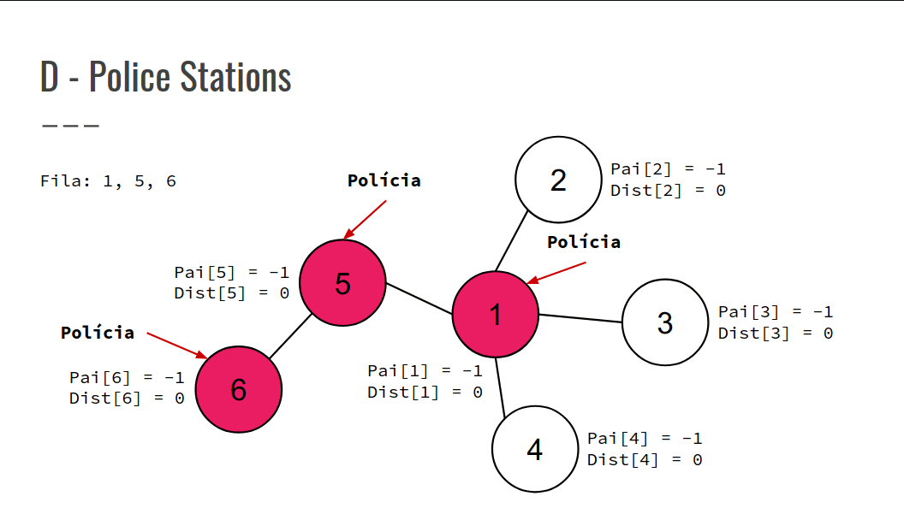
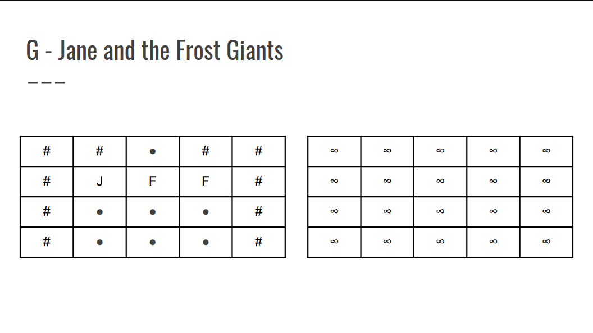

## Explicação dos Exercícios de Grafo
### Exercícios B, D e G

### B - Find the Treasure

- Confira a GIF abaixo


### BFS partindo de múltiplas fontes
- Seu funcionamento é exatamente igual ao da BFS.
- No entanto, ao invés de começar em um único nó, todos os vértices que considerarmos como ínicio serão inseridos na fila de processamento.
- Útil para resolução de problemas que requerem o cálculo da mínima distância ou custo para se chegar a um vértice.



``` cpp
void bfs(const vector<int> &sources) {
    queue<int> q;
    vector<int> dist;
    for (auto s : sources) {
        dist[s] = 0;
        q.push(s);
    }
    while (!q.empty()) {
        int u = q.front();
        q.pop();
        for (auto v : adj[u]) {
            if (dist[u] + 1 < dist[v]) {
                dist[v] = dist[u] + 1;
                q.push(v);
            }
        }
    }
}
```

### D - Police Stations

img19 - img33 (montar gif)


### G - Jane and the Frost Giants
- Jane está presa em um labirinto que contém armadilhas de fogo, espalhando uma célula para o lado, nas direções vertical e horizontal, a cada minuto.
- Jane leva um minuto para andar para uma célula adjacente.
- Determinar o tempo mínimo para Jane escapar por uma das bordas do labirinto, se possível.
- Estratégia: computar o tempo mínimo que demora para uma célula pegar fogo a partir de cada armadilha.
- Após isso, computar o tempo mínimo que leva para Jane alcançar uma célula adjacente e se é possível alcançá-la antes do fogo.
- Verificar se ela consegue chegar em alguma borda.

- Confira a GIF abaixo


``` cpp
int main() {
    int T;
    cin >> T;
    for (int t = 1; t <= T; t++) {
        cin >> r >> c;
        grid = vector <string >(r + 1);
        for (int i = 0; i < r; i++)
            cin >> grid[i];
        vii fire, jane;
        for (int i = 0; i < r; i++) {
            for (int j = 0; j < c; j++) {
                if (grid[i][j] == 'F')
                    fire.push_back ({i, j});
                else if (grid[i][j] == 'J')
                jane.push_back ({i, j});
            }
        }
        int minutes;
        dist = vector <vi>(r + 1, vi(c + 1, INF));
        bfs(fire, false);
        minutes = bfs(jane, true);
        cout << "Case " << t << ": ";
        if (minutes != INF)
            cout << minutes + 1 << "\n";
        else
            cout << "IMPOSSIBLE \n";
    }
    return 0;
}
int bfs(const vii &sources , bool jane) {
    int minutes = INF;
    queue<ii> q;
    for (auto [i, j] : sources) {
        dist[i][j] = 0;
        q.push({i, j});
    }
    while (!q.empty()) {
        int i, j;
        tie(i, j) = q.front();
        q.pop();
        if (jane && (i == 0 || i == r - 1 || j == 0 || j == c -
        1))
            minutes = min(dist[i][j], minutes);
        for (auto [x, y] : dir) {
            int a, b;
            a = i + x;
            b = j + y;
            if (a >= 0 && a < r && b >= 0 && b < c && grid[a][b]
            == '.' && dist[i][j] + 1 < dist[a][b]) {
                dist[a][b] = dist[i][j] + 1;
                q.push({a, b});
            }
        }
    }
    return minutes;
}
```
