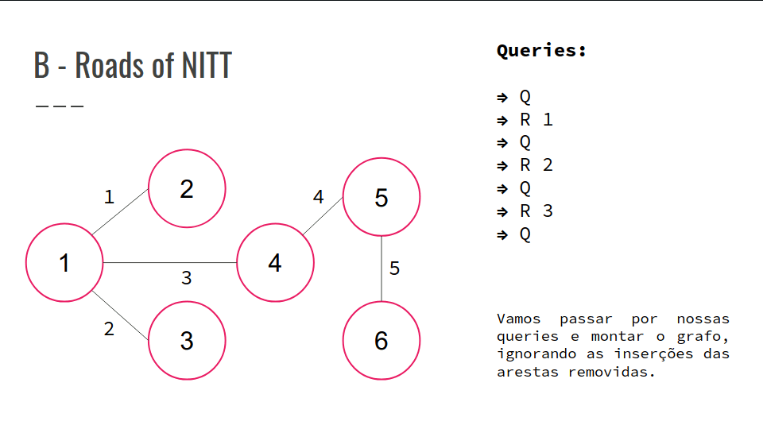
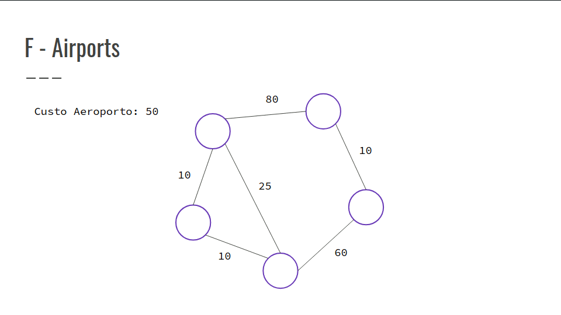

## Explicação dos Exercícios de Grafo
### Exercícios B, D, E e F

### B - Roads of NITT
- Existem N hotels conectados entre si por N - 1 arestas.
- No início, sempre existe um caminho entre dois pares de hotéis, mas, com o tempo, algumas rotas se tornam inutilizáveis.
- Dadas Q consultas, determinar quantos pares de hotéis (X, Y) não tem uma rota entre si.
- As consultas podem ser de 2 tipos:
    - R X -> remove a estrada X. É garantido que ela não foi removida anteriormente.
    - Q -> retorna o resultado do número de pares de hotéis (X, Y) que não possuem rota entre si.

- Confira a GIF abaixo:



``` cpp
ll q;
cin >> q;
vector<bool> used(n);
vi queries(q);
for (ll i = 0; i < q; i++) {
    char op;
    ll id = -1;
    cin >> op;
    if (op == 'R') {
        cin >> id;
        used[id] = true;
    }
    queries[i] = id;
}
ll conn = 0;
for (ll i = 1; i < n; i++) {
    if (!used[i]) {
        int u, v;
        tie(u, v) = edges[i];
        u = find(u);
        v = find(v);
        if (u != v) {
            conn += len[u] * len[v];
            unite(u, v);
        }
    }
}
for (int i = 1; i <= n; i++) {
    find(i);
}
ll tot = n * (n - 1) / 2 - conn;
stack<ll> ans;
for (ll i = q - 1; i >= 0; i--) {
    ll id = queries[i];
    if (id != -1) {
        ll u, v;
        tie(u, v) = edges[id];
        u = find(u);
        v = find(v);
        if (u != v) {
            tot -= len[u] * len[v];
            unite(u, v);
        }
    } else {
    ans.push(tot);
    }
}
while (!ans.empty()) {
    cout << ans.top() << "\n";
    ans.pop();
}
cout << "\n";
```

### E - Spanning Tree Fraction
- Temos um grafo conexo G com N vértices, indexados de 0 até N - 1, e M arestas.
- Cada aresta desse grafo é uma quádrupla (U, V, a, b), sendo U o vértice de origem, V o vértice de destino, a e b pesos da nossa aresta.
- Achar uma árvore geradora T que contém um subconjunto das M arestas e maximize a expressão ∑i∈T ai / ∑i∈T bi, sendo i o índice da aresta inserida em T.
- Escrever o termo resultante no formato de uma fração irredutível p / q.

``` cpp
bool cmp(tuple<ii, ll, ll> a, tuple<ii, ll, ll> b) {
    ii p, q;
    p = get<0>(a);
    q = get<0>(b);
    return (p.first - p.second * x) > (q.first - q.second * x);
}
int main() {
    ll n, m;
    cin >> n >> m;
    parent = len = vi(n + 1);
    for (ll i = 0; i < m; i++) {
        ll u, v, a, b;
        cin >> u >> v >> a >> b;
        add_edge(u, v, a, b);
    }
    ll p, q, gcd;
    double left = 0., right = 1e7;
    while (fabs(right - left) >= EPSILON) {
        x = (left + right) / 2;
        for (ll i = 0; i <= n; i++) {
            parent[i] = i;
            len[i] = 1;
        }
        p = q = 0;
        sort(begin(edges), end(edges), cmp);
        kruskal(p, q);
        if (p >= q * x) {
            left = x;
        } else {
            right = x;
        }
    }
    gcd = __gcd(p, q);
    p /= gcd;
    q /= gcd;
    cout << p << "/" << q << "\n";
    return 0;
}
```

### F - Airports
- Você pode colocar aeroportos em qualquer cidade.
- São dadas as possíveis pistas que ligam as cidades.
- Objetivo: Garantir que cada cidade tenha acesso a um aeroporto.

- Confira a GIF abaixo:



``` cpp
for(int i = 0; i < m; i++){
    cin >> a >> b >> c;
    arestas.push_back({c, a, b});
}
sort(arestas.begin(), arestas.end());
ll custo = 0;
ll ind = lower_bound(arestas.begin(), arestas.end(), make_tuple(aer, 1e17, 1e17))
- arestas.begin();
for(int j = 0; j < ind; j++){
    tie(c, a, b) = arestas[j];
    if(c == aer)continue;
    if(find(a) != find(b)){
        merge(a, b);
        custo += c;
    }
}
```
