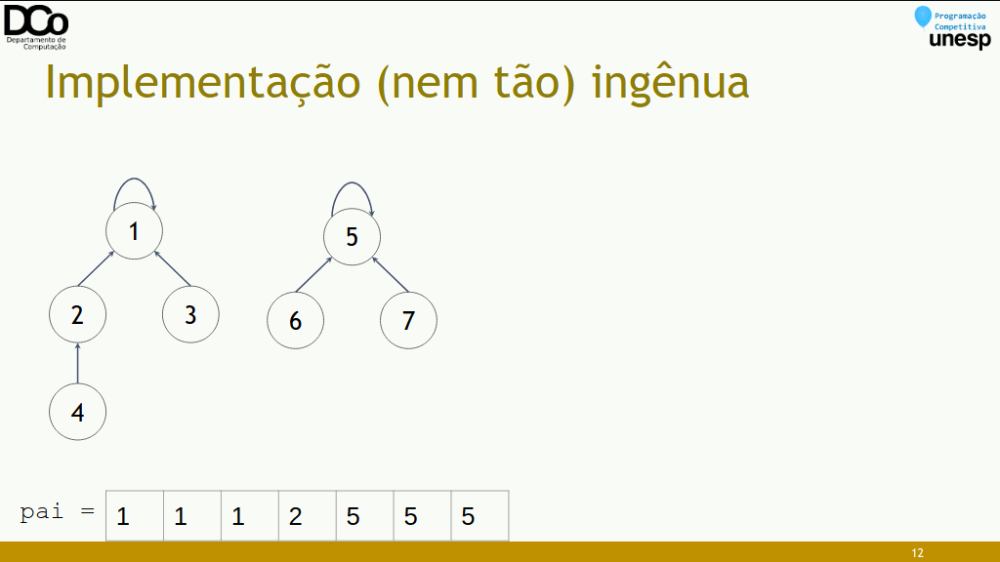
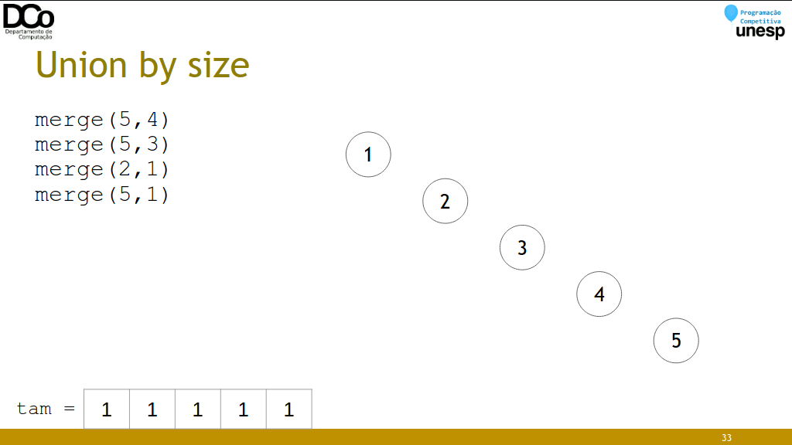
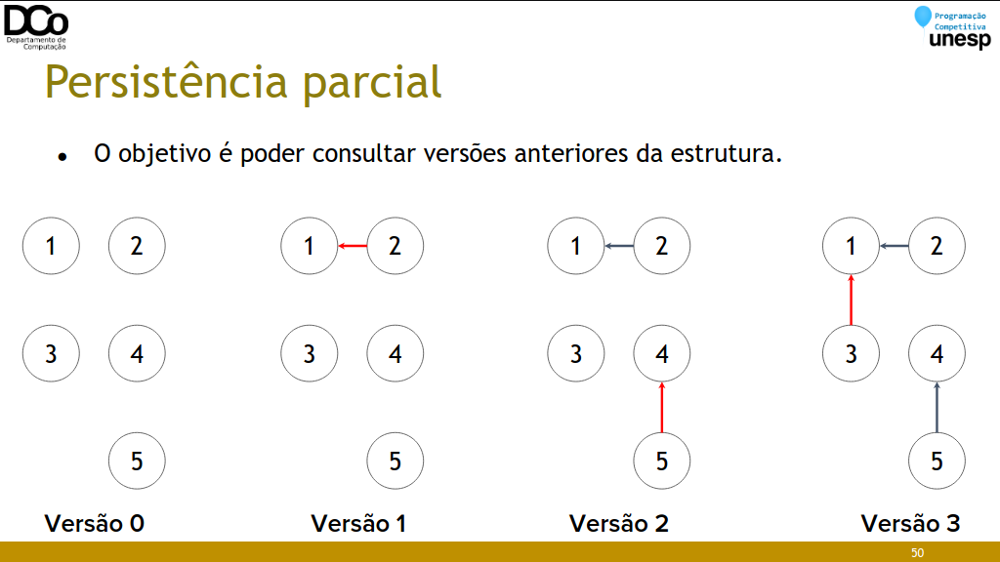

## Introdução
● Disjoint Set Union (DSU), também chamada de Union-find, devido as
operações que esta estrutura de dados permite
● Esta estrutura armazena vários conjuntos disjuntos de elementos
○ Inicialmente, cada conjunto contém precisamente um elemento
● Permite a realização de duas operações:
○ merge(a, b): une os conjuntos aos quais a e b pertencem.
○ find(a): determina a qual conjunto o elemento a pertence.
● A partir do find, normalmente define-se a função same:
○ same(a, b): determina se a e b pertencem ao mesmo conjunto.

img1 - img5 (montar gif)


### Estruturando a solução
● Para implementar uma DSU, cada conjunto será representado por uma
árvore, onde a raiz da árvore será o representante/líder do conjunto.


### Implementação (nem tão) ingênua
● find(x): retorna o líder do conjunto a que x pertence
● merge(x, y): conecta os líderes. Supondo que X seja líder de x e Y líder de
y, vamos “eleger” Y como líder de X.
``` C++
int pai[MAX_N + 1];
void init(){
    for(int i = 1; i <= MAX_N; i++)
        pai[i] = i;
}
int find(int x){
    if (pai[x] == x)
        return x;
    return find(pai[x]);
}
bool same(int x, int y){
    return find(x) == find(y);
}
void merge(int u, int v){
    int a = find(u);
    int b = find(v);
    pai[a] = b;
}
```

img7 - img9 (montar gif)


img10 - img14
 amortizado
``` C++
int pai[MAX_N + 1];
void init(){
    for(int i = 1; i <= MAX_N; i++)
        pai[i] = i;
}
int find(int x){
    if (pai[x] == x)
    return x;
    return pai[x] = find(pai[x]);
}
void merge(int u, int v){
    int a = find(u);
    int b = find(v);
    pai[a] = b;
}
```

img15 - img23


### Union by size
● Ideia: unir os conjuntos do menor para o maior, minimizando a
profundidade dos conjuntos.
● Estratégia “small-to-large”
● Tempo por operação: O(log n)
``` C++
int pai[MAX_N + 1];
int tam[MAX_N + 1];

void init()
{
    for(int i = 1; i <= MAX_N; i++)
    {
        pai[i] = i;
        tam[i] = 1;
    }
}

int find(int x)
{
    if (pai[x] == x)
        return x;
    return find(pai[x]);
}
void merge(int u, int v)
{
    int a = find(u);
    int b = find(v);
    if (tam[a] > tam[b])
        swap(a,b);
    pai[a] = b;
    tam[b] += tam[a];
}
```

img24 - img28 (montar gif)


### Path Compression + Union by size
● Unindo ambas as técnicas garante-se complexidade quase constante, sendo
a implementação mais recomendada.
● Outras técnicas de melhorias (na união dos conjuntos)
○ Union by rank
○ Linking by index
○ Coin-flip linking

### Problema: WAR (UVa - 10158)
● Conjunto n de pessoas de diferentes países.
● Duas pessoas são consideradas amigas se são do mesmo país, ou inimigas se
são diferentes países.
● Neste problema, podem ser feitas 4 tipos de operações:
○ setFriends(x, y)
○ setEnemies(x, y)
○ areFriends(x, y)
○ areEnemies(x,y)
● Se uma operação contradizer alguma anterior, ela não é realizada e
imprimimos -1 na tela

● Propriedades da amizade ~:
○ Se 𝑥 ~ 𝑦 e 𝑦 ~ 𝑧, então 𝑥 ~ 𝑧
○ Se 𝑥 ~ 𝑦 então 𝑦 ~ 𝑥
○ 𝑥 ~ 𝑥

● Propriedades da inimizade ∗:
○ Se 𝑥 ∗ 𝑦 então 𝑦 ∗ 𝑥
○ Não acontece 𝑥 ∗ 𝑥

● E também
○ Se 𝑥 ∗ 𝑦 e 𝑦 ∗ 𝑧, então 𝑥 ~ 𝑧 (o inimigo do meu inimigo é meu amigo)
○ Se 𝑥 ~ 𝑦 e 𝑦 ∗ 𝑧, então 𝑥 ∗ 𝑧 (o inimigo do meu amigo é meu inimigo)

● A partir dessas propriedades, podemos modelar o problema utilizando
disjoint-sets. Cada pessoa 𝑥 possui dois conjuntos associados, o conjunto
𝑎𝑚𝑖𝑔𝑜𝑠(𝑥) e o conjunto 𝑖𝑛𝑖𝑚𝑖𝑔𝑜𝑠(𝑥). E estes conjuntos devem satisfazer as
propriedades anteriores.

● Detalhe de implementação: nos exemplos que vimos até agora, criamos um
vetor 𝑝𝑎𝑖 de tamanho N, de forma que cada elemento começa associado a
um conjunto. Neste exercício vamos criar um vetor de tamanho 2*N, onde a
primeira metade são os conjuntos de amigos e a segunda de inimigos

● Inicializando os conjuntos:
○ Toda pessoa é amiga dela mesma (𝑥 ~ 𝑥)
■ pai[amigos(x)] = x;
○ Ninguém é inimigo de si mesmo (Não 𝑥 ∗ 𝑥)
■ pai[inimigos(x)] = 0; //Considerando as pessoas numeradas de 1 a n

● setFriends(x, y)
○ Primeiro, precisamos verificar se x e y não são inimigos, o que iria
gerar uma contradição
○ Caso não, então fazemos
■ merge(amigos(x), amigos(y))
■ merge(inimigos(x), inimigos(y))

● setEnemies(x, y)
○ Primeiro, precisamos verificar se x e y não são amigos, o que iria gerar
uma contradição
○ Caso não, então fazemos
■ merge(amigos(x), inimigos(y))
■ merge(inimigos(x), amigos(y))

● areFriends(x, y)
○ same(amigos(x), amigos(y))
● areEnemies(x, y)
○ same(amigos(x), inimigos(y))

Rollback
● Em alguns problemas, pode ser necessário realizar um rollback, desfazendo
uniões imediatamente anteriores.


● A cada operação merge, são feitas duas atribuições:
○ pai[i] = x;
○ tam[j] = y;
● Sendo assim, basta salvar os valores antigos em uma pilha, para restaurar se
for necessário.
○ Uma pilha para o vetor pai: < 𝑖, 𝑝𝑎𝑖[𝑖] >
○ Uma pilha para o vetor tam: < 𝑗, 𝑡𝑎𝑚[𝑗] >
● Não permite usar path compression.
``` C++
int pai[MAX_N + 1];
int tam[MAX_N + 1];
stack<pair<int, int> > old_pai;
stack<pair<int, int> > old_tam;
void init()
{
    for(int i = 1; i <= MAX_N; i++)
    {
        pai[i] = i;
        tam[i] = 1;
    }
}
int find(int x)
{
    if (pai[x] == x)
    return x;
    return find(pai[x]);
}
void merge(int u, int v)
{
    int a = find(u);
    int b = find(v);
    if (tam[a] > tam[b])
        swap(a,b);
    old_pai.emplace(a, pai[a]);
    old_tam.emplace(b, tam[b]);
    pai[a] = b;
    tam[b] += tam[a];
}
void rollback()
{
    auto paiAnt = old_pai.top();
    auto tamAnt = old_tam.top();
    pai[paiAnt.first] = paiAnt.second();
    tam[tamAnt.first] = tamAnt.second();
    old_pai.pop();
    old_tam.pop();
}
```

### Persistência parcial




● Operações básicas:
○ merge(x, y): conecta os conjuntos de x e y (criando uma nova
“versão”)
○ find(x, t): retorna a qual conjunto x pertence no momento t
○ same(x, y, t): verifica se x e y pertencem ao mesmo conjunto no momento t

``` C++
int pai[MAX_N + 1];
int tam[MAX_N + 1];
int his[MAX_N + 1];
int tempo;
void init()
{
    tempo = 0;
    for(int i = 1; i <= MAX_N; i++)
    {
        pai[i] = i;
        tam[i] = 1;
        his[i] = 0;
    }
}
int find(int x, int t)
{
    if (pai[x] == x) return x;
    if (his[x] > t) return x;
    return find(pai[x]);
}
void merge(int u, int v)
{
    tempo++;
    int a = find(u, tempo);
    int b = find(v, tempo);
    if (tam[a] > tam[b])
        swap(a,b);
    pai[a] = b;
    his[a] = tempo;
    tam[b] += tam[a];
}
```

### Pictionary (Gym - 102078A)
● Neste problema, temos um conjunto de N cidades, inicialmente todas
desconectadas.
● Rodovias são construídas entre a cidades em M dias. Em um dia i, é
construída uma estrada entre 𝑎 e 𝑏 se 𝑔𝑐𝑑(𝑎, 𝑏) = 𝑀 − 𝑖 + 1.
● São feitas Q queries, constituídas por pares de cidades. O resultado de cada
query é o número mínimo de dias necessários para conectar o par de
cidades (direta ou indiretamente)
● Usaremos disjoint-sets com persistência parcial para unir as cidades
marcando o momento em que as uniões foram feitas.
○ Para cada dia 𝑑, vamos conectar as cidades com gcd(𝑎, 𝑏) = 𝑀 − 𝑑 + 1, que vamos
chamar de 𝑥. Iterando sobre 𝑑, vamos realizar um merge de 𝑥 com todos os seus
múltiplos (até n).
○ Mas e se duas cidades (𝑥, 𝑘. 𝑥) já tiverem sido conectadas indiretamente antes? Sem
problemas, o merge vai verificar que as cidades já foram unidas em um momento
anterior e não vai fazer nada.
● Para realizar as queries, executaremos uma busca binária para descobrir o
número mínimo de dias necessários para conectar as cidades 𝑎 e 𝑏.

### Solução Offline
● Quando lidamos com problemas em que a entrada consiste em uma
sequência de queries, temos dois tipos de soluções possíveis:
○ Online: cada query é processada no momento em que é lida, antes da
leitura da próxima.
○ Offline: todas as queries são lidas para só depois serem processadas. E
este processamento pode ser realizado em uma ordem conveniente,
não necessariamente na ordem de entrada.
■ Ajuda a resolver certos problemas de forma mais eficiente

### Consecutive Letters (SPOJ – CONSEC)
● Problema: considere uma string S apenas com letras maiúsculas. São dadas
Q queries, e cada query pode ser de dois tipos:
○ 1 i: encontre o tamanho máximo do segmento [b, e] em que a substring
S[b...e] contenha apenas a letra S[i].
○ 2 i: Troque o caractere no índice i por ‘#’
● |𝑆| ≤ 200000
● 𝑄 ≤ 100000
● Uma forma de modelar este problema é utilizando uma DSU, de forma que
uma sequência contígua de caracteres iguais estejam em um mesmo
conjunto.
● O problema é que a segunda query representa uma possível cisão de um
destes conjuntos, e a DSU permite realizar uniões de conjuntos, mas não
separações.
● Porém, uma solução offline pode resolver este problema.
● Basta ler todas as queries e processá-las na ordem inversa. Dessa forma
iniciamos com a string já alterada, com todas as substituições por ‘#’ já
realizadas, e vamos realizando as operações de trás para frente.
○ 1 i: imprimimos o tamanho do conjunto a qual a posição i faz parte
○ 2 i: voltamos o caractere original da posição i, e então:
■ S[i] == S[i-1] → merge(i, i-1)
■ S[i] == S[i+1] → merge(i, i+1)

### Referências
https://files.johnjq.com/slides/summer/union-find.pdf
https://github.com/icmcgema/gema/blob/master/XX-Union_Find.md
https://cp-algorithms.com/data_structures/disjoint_set_union.html
https://www.youtube.com/watch?v=E33jZUw2l9Q
