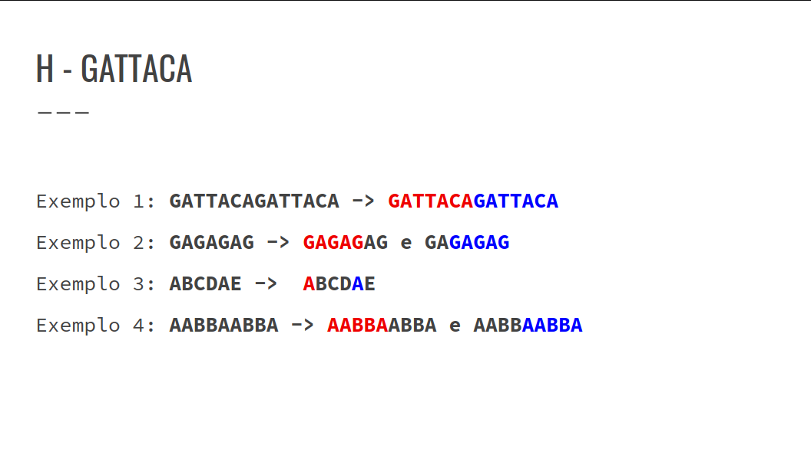

## Resolução Exercícios Strings
### Exercício E, F, G e H

### E - Maximum repetition substring
- Solução:
    - Suffix Array
    - Range Minimum Query

### F - Clock Pictures
- São apresentadas duas fotos de um mesmo relógio com N ponteiros. Cada ponteiro i está posicionado em um ângulo ai em milésimos de grau (1º = 1000).
- Determinar se é possível que as fotos tenham sido tiradas no mesmo horário do dia, considerando que a câmera pode ter sido rotacionada, deixando as fotos em ângulos diferentes.
- Como saber se o relógio marca o mesmo horário?
    - A sequência de abertura do ângulo entre dois ponteiros tem que ser a mesma para todos os pares de ponteiros em ambos os relógios, partindo de um par e passando por todos os outros no sentido horário.

- Confira a GIF abaixo:


``` cpp
i clock1(n), clock2(n);
for (int i = 0; i < n; i++)
    cin >> clock1[i];
for (int i = 0; i < n; i++)
    cin >> clock2[i];
sort(begin(clock1), end(clock1));
sort(begin(clock2), end(clock2));
string angles1, angles2;
for (int i = 0; i < n; i++) {
    int diff1 = ((clock1[(i + 1) % n] - clock1[i]) + 360000) % 360000;
    int diff2 = ((clock2[(i + 1) % n] - clock2[i]) + 360000) % 360000;
    angles1 += to_string(diff1) + " ";
    angles2 += to_string(diff2) + " ";
}
angles2 += angles2;
n = angles1.size();
m = angles2.size();
str_hash hs1(angles1), hs2(angles2);
bint hash1 = hs1.sub_hash(0, n);
for (int i = 0; i <= m - n; i++) {
    if (hs2.sub_hash(i, i + n) == hash1) {
        cout << "possible\n";
        return 0;
    }
}
cout << "impossible\n";
return 0;
```

### G - Ada and Spring Cleaning
- Ada precisa fazer uma limpeza de primavera e, para tal, possui uma lista de afazeres.
- Ela mantém as atividades dessa lista como uma única string S. Cada atividade contida em S possui comprimento K.
- Temos que contar quantas atividades diferentes ela fez.


``` cpp
Hash hs(s); //Transformando a String em Hash
map<ll,bool>mp;
for(int i=0;i<n;i++){
    if(i+k-1>=n)break;
    //Obtendo o Hash da substrinng pela sua posição/intervalo
    mp[hs.get(i,i+k)]=true;
}
cout << int(mp.size()) << "\n";
```

### H - GATTACA
- Uma sequência genética é uma string S de tamanho N, composta pelos caracteres ‘A’, ‘C’, ‘G’ e ‘T’.
- Normalmente, um fio de DNA possui um segmento (substring) que se repete duas ou mais vezes, chamados repetições.
- Encontrar a repetição de maior tamanho em S.




- Utilizar uma busca binária pra encontrar o tamanho da substring.
- Para cada novo tamanho, pode-se percorrer a string toda e verificar a partir de uma posição inicial, salvar a substring daquele tamanho em um map.


``` cpp
ll ini = 1, fim = n, tam = 0;
while (ini <= fim){
    ll mid =(fim + ini) / 2;
    map<ll, ll> mp; bool f = false;
    for (int i = 0; i + mid - 1 < n; i++){
        mp[hs.sub_hash(i, i + mid - 1)]++;
        if (mp[hs.sub_hash(i, i + mid - 1)] >= 2)
            f = true;
    }
if (f){
    tam = mid; ini = mid + 1;
} else fim = mid - 1;}
``` 
