### Definição
• Um grafo é uma abstração matemática que representa situações reais
através de um diagrama, buscando representar a relação entre pares de
elementos.
• Formalmente, um grafo 𝑮 é um par 𝑽, 𝑨 em que:
• 𝑽 é um conjunto de vértices (nós);
• 𝑨 é um conjunto de arestas do tipo (𝑢, 𝑣) com 𝒖 e 𝒗 ∈ 𝑽.
• Vértice: representa um elemento em si.
• Aresta: representa o relacionamento entre um par de elementos.

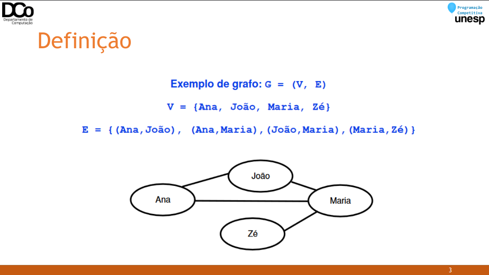

### Grafo orientado
• Um grafo orientado 𝑮 , também chamado de grafo direcionado ou
dígrafo, é aquele em que o conjunto de arestas 𝑨 é uma relação binária
em 𝑽, isto é, um conjunto finito de pares ordenados de vértices.
• Uma aresta (𝑢, 𝑣) “sai” do vértice 𝑢 e “entra” no vértice 𝑣. Nesse caso,
dizemos que 𝑣 é adjacente à 𝑢.
• Podem existir arestas de um vértice para ele mesmo (self-loop ou laço)

img2
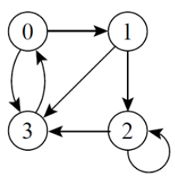

𝐺 = (𝑉, 𝐴)
V = {1, 2, 3, 4, 5}
A = {(1,2), (1,3), (2, 1), (2, 4), (3,5),
(4, 3), (4, 5), (5, 5)}

1 é adjacente à 2 e 2 é adjacente à 1
3 é adjacente à 1, mas 1 não é adjacente à 3
5 é adjacente a ele mesmo (laço)

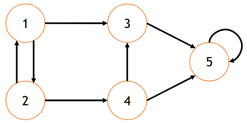

### Grafo não orientado
• Um grafo não orientado G, ou não direcionado, é aquele em que o
conjunto de arestas 𝑨 é um conjunto finito de pares não ordenados de
vértices.
• (𝑢, 𝑣) e (𝑣, 𝑢) representam uma única aresta.
• Laços não são permitidos.

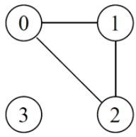

𝐺 = (𝑉, 𝐴)
V = {1, 2, 3, 4, 5}
A = {(1,2), (1,3), (2,4), (3,4), (4,5)}

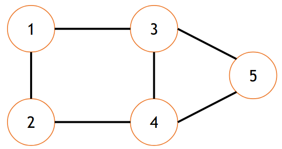

### Grafo ponderado
• Um grafo ponderado é um grafo que possui pesos associados às arestas;
• Pode ser direcionado ou não;
• Os pesos podem representar, por exemplo, custos ou distâncias.

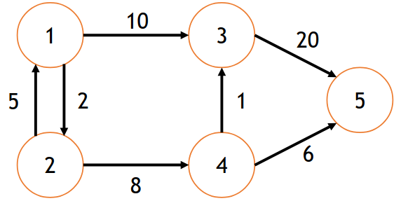

### Grau de um vértice

• Em um grafo não direcionado:
𝑔𝑟𝑎𝑢 𝑣 =número de arestas que incidem em 𝑣

• Em um grafo direcionado:
𝑔𝑟𝑎𝑢 𝑣 = 𝑔𝑟𝑎𝑢_𝑒𝑛𝑡𝑟𝑎𝑑𝑎 𝑣 + 𝑔𝑟𝑎𝑢_𝑠𝑎í𝑑𝑎(𝑣)

em que

𝑔𝑟𝑎𝑢_𝑒𝑛𝑡𝑟𝑎𝑑𝑎 𝑣 = número de arestas que entram em 𝑣
𝑔𝑟𝑎𝑢_𝑠𝑎í𝑑𝑎 𝑣 = número de arestas que saem em 𝑣

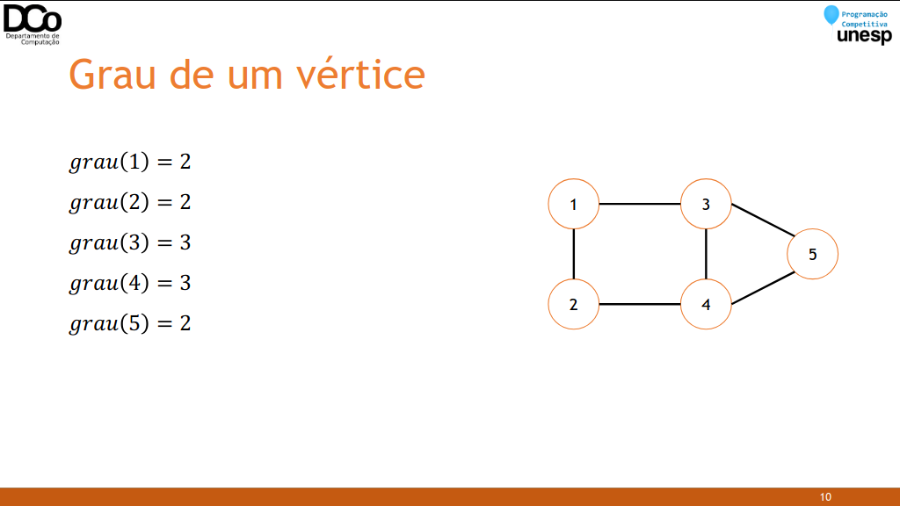

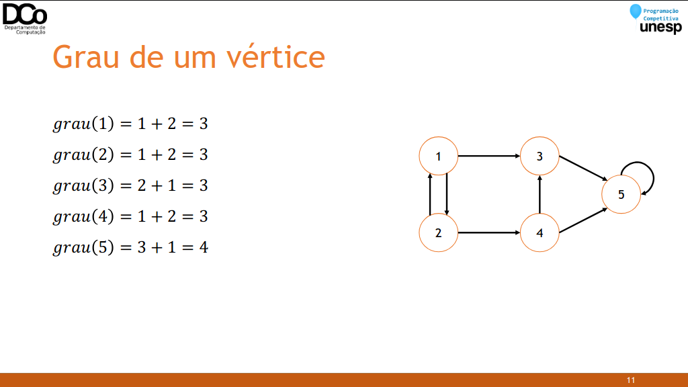

### Caminho entre vértices
• Um caminho é uma sequência de vértices conectados por arestas.
• De um vértice 𝑥 a um vértice 𝑦, por exemplo, podemos ter um caminho
(𝑣0, 𝑣1, … , 𝑣𝑘) em que 𝑥 = 𝑣0 e 𝑦 = 𝑣𝑘;
• O comprimento do caminho é a quantidade de arestas que o formam.
• Exemplos de caminhos:
(1, 3, 5)
2, 4, 3
1, 2, 4, 3, 5
1, 2, 4, 5
• Perceba que de um vértice a outro pode existir mais de um caminho
possível.

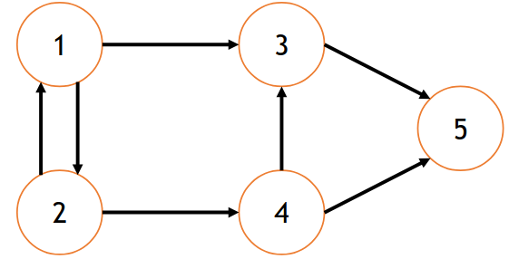
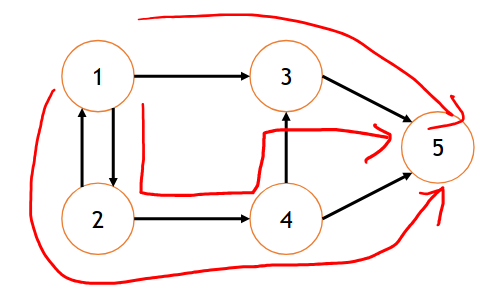

• Um caminho é simples se todos os vértices do caminho são distintos.
• Um caminho (𝑣0, 𝑣1, … , 𝑣𝑘) forma um ciclo se 𝑣0 = 𝑣𝑘.
• Exemplo:
(1, 2, 4, 3, 1)
• Um grafo sem ciclos é chamado acíclico.

### Implementação
• Principal preocupação: como representar o conjunto de arestas 𝐴?
• Duas formas usuais:
• Matriz de adjacência
• Lista de adjacência

### Matriz de Adjacência
• Para um grafo de 𝑛 vértices, podemos utilizar uma matriz 𝑀𝑛×𝑛.
• 𝑀𝑖,𝑗 = 1 ↔ 𝑗 é adjacente a 𝑖.
• 𝑀[i][i] = 1 se há uma aresta do nó 𝑖 ao nó 𝑗.
• 𝑀[i][i] = 0 se não há uma aresta do nó 𝑖 ao nó 𝑗.
• Quando o grafo é não direcionado, a matriz é simétrica.
• Para grafos ponderados, a matriz de adjacência pode ser utilizada para
armazenar os pesos das arestas (desde que não haja peso nulo).

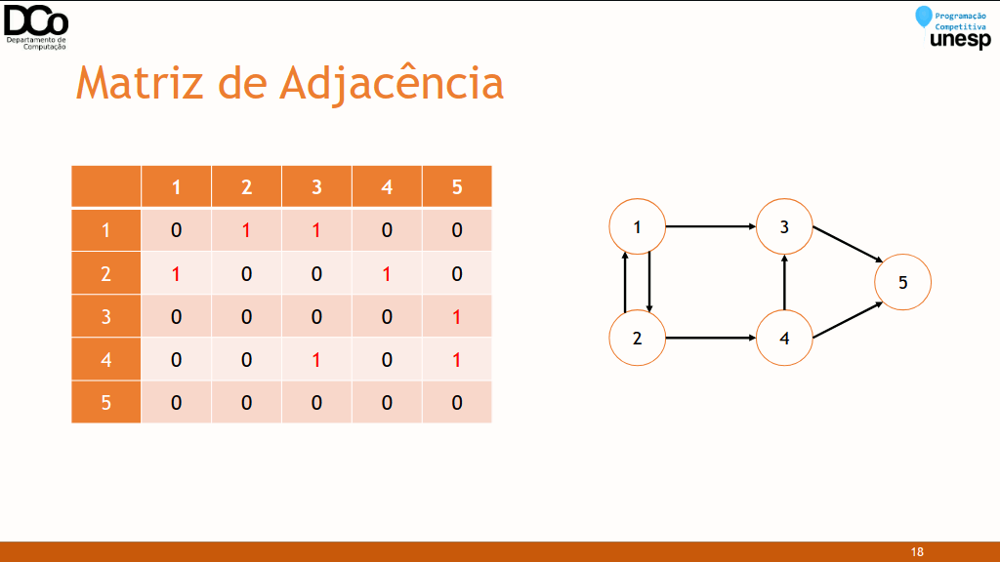

• Vantagens:
• Implementação simples;
• Verificar se existe uma aresta 𝑖, 𝑗 pode ser feito em tempo constante.
• Inserção ou remoção de arestas também podem ser realizadas com custo constante.
• Desvantagens:
• Espaço necessário: 𝑂(𝑉 2)
• Tempo para acessar todos os nós adjacentes à um vértice 𝑣 qualquer: 𝑂( 𝑉 )
• Maneira mais comum de se representar um grafo;
• Para cada vértice é armazenada uma lista de vértices adjacentes.

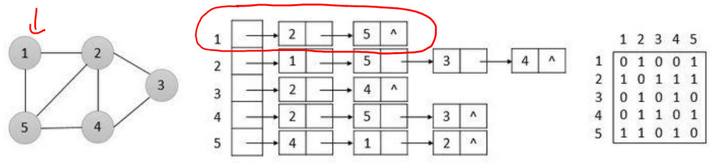

img16 - img18

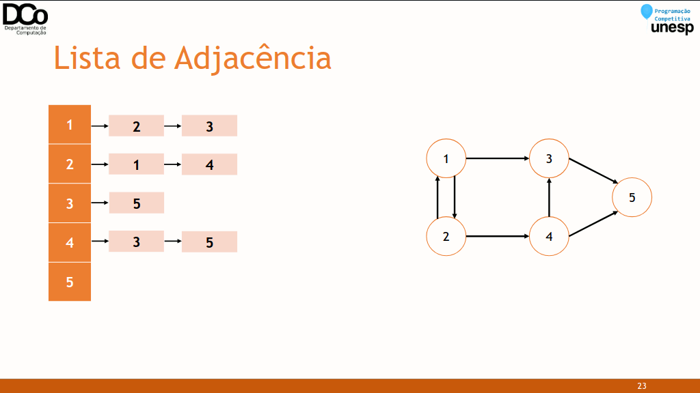

``` C++
typedef struct{
    int v; //vértice adjacente
    int w; //peso
} TAdj;
vector<TAdj> adj[MAX_V]; //Lista de adjacência
int grau[MAX_V]; //número de arestas do vértice
void initGrafo(int qtdeVertices){
    memset(grau, 0, sizeof(grau));
    for(int i = 0; i < qtdeVertices; i++)
    adj[i].clear();
}
//Cria aresta de a para b, com peso w
void aresta(int a, int b, int w){
    TAdj aux;
    aux.v = b;
    aux.w = w;
    grau[a]++;
    adj[a].push_back(aux);
    //Se o grafo for não orientado, também adicionamos a aresta (b, a) co
    m peso w
}
```

• Vantagens:
• É possível iterar pelos nós adjacentes facilmente;
• Os algoritmos de grafos, no geral, se tornam mais eficientes;
• Economia de espaço, em relação a matriz de adjacência.
• Desvantagens:
• Implementação mais complexa;
• Verificar de um vértice 𝑣 é adjacente a outro vértice 𝑢 não pode mais ser realizado
em tempo constante.

### Busca em Profundidade (DFS)
• Generalização da busca em profundidade em árvores.
• Dado um grafo 𝐺 e um nó inicial 𝑠, a estratégia é explorar o grafo em
profundidade, visitando as arestas do vértice mais recentemente
descoberto que levam a vértices ainda inexplorados.
• Implementação: recursiva ou iterativa com auxílio de pilha.
• Complexidade: 𝑂(𝑉 + 𝐴) para lista de adjacência e 𝑂(𝑉2) para matriz de
adjacência.
• Possíveis usos: encontrar caminhos, contagem de componentes conexas e
detecção de ciclos.

• Pseudo-código:
```
DFS(𝑣)
• Marcar 𝑣 como visitado
• Para cada vértice 𝑢 adjacente à 𝑣
	• Se 𝑢 não foi visitado
		• DFS(𝑢)

``` C++
int visitado[MAX_V];
int p[MAX_V];
int ordemVis;
void initDfs(){
    memset(visitado, 0, sizeof(visitado));
    memset(p, -1, sizeof(p));
    ordemVis = 0;
}
void dfs(int s){
    visitado[s] = ++ordemVis;
    for(auto t : adj[s]){
        if (visitado[t.v] == 0){
        p[t.v] = s;
        dfs(t.v);
        }
    }
}
```

img19 - img29 (montar gif)
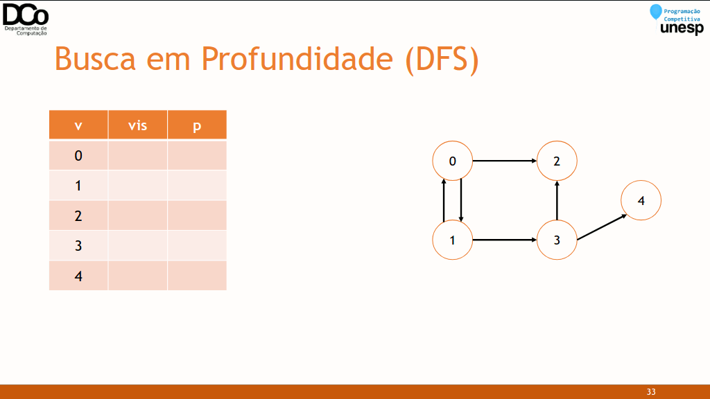

### Busca em Largura (BFS)
• Generalização da busca em largura em árvores.
• Dado um grafo 𝐺 e um nó inicial 𝑠, a estratégia é explorar o grafo por
“nível”. Vamos definir nível de 𝑣 como sendo o comprimento do menor
caminho do vértice inicial até 𝑣.
• Implementação: iterativa com auxílio de fila.
• Complexidade: 𝑂(𝑉 + 𝐴) para lista de adjacência e 𝑂(𝑉2) para matriz de
adjacência.
• Possíveis usos: encontrar o menor caminho (em número de arestas) entre
vértices.

• Pseudo-código:
```
BFS(𝑣)
• Enfileirar 𝑣 na fila 𝑄
• Enquanto 𝑄 não estiver vazia
	• Desenfileirar o vértice 𝑢 de 𝑄
		• Marcar 𝑢 como visitado
		• Para cada vértice 𝑤 adjacente à 𝑢
			• Se 𝑤 ainda não foi visitado
				• Enfileirar 𝑤 na fila Q
```
``` C++
int d[MAX_V]; //armazena a distância do nó inicial até cada nó i
void bfs(int inicio)
{
    int s, t;
    queue<int> Q;
    memset(visitado, 0, sizeof(visitado));
    memset(p, -1, sizeof(p));
    d[inicio] = 0;
    visitado[inicio] = ++ordemVis;
    Q.push(inicio);
    while(!Q.empty()){
        s = Q.front();
        Q.pop();
        for(auto t : adj[s]){
            if (visitado[t] == 0){
                visitado[t] = ++ordemVis;
                d[t] = d[s] + 1;
                p[t] = s;
                Q.push(t);
            }
        }
    }
}
```

![img30][img30.png]

### Conexidade
• Um grafo não direcionado 𝐺 = (𝑉, 𝐴) é conexo sse existe um caminho em
𝐺 entre todos os pares de vértices.

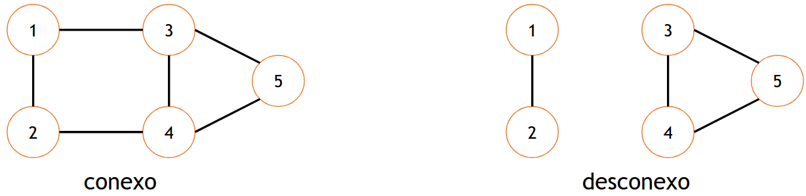

• Um grafo 𝐺′ = (𝑉′, 𝐴′) é um subgrafo de 𝐺 = (𝑉, 𝐴) sse 𝑉′ ⊆ 𝑉 e 𝐴′ ⊆ 𝐴.
• Um subgrafo conexo de G é chamado de componente conexa de G.
• O grafo a seguir, por exemplo, possui duas componentes conexas.

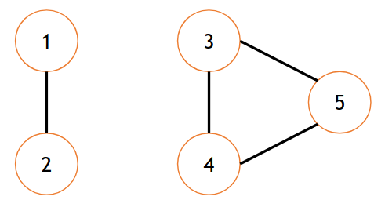

• Para grafos direcionados, definimos dois tipos de conexidade: forte e
fraca.
• Um grafo direcionado é fortemente conexo se existir um caminho entre
todos os pares de vértices do grafo.
• Um grafo direcionado é fracamente conexo se o seu grafo não
direcionado subjacente (retirando a orientação das arestas) é conexo.

### Caminho entre vértices

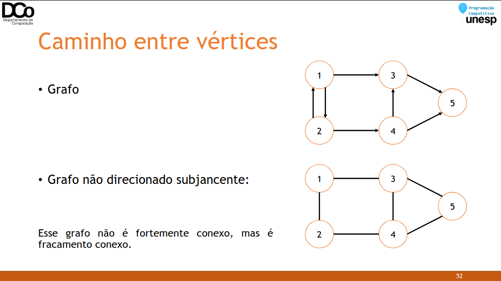

Conexidade
• Como determinar se um grafo não direcionado é conexo?
• Basta fazer um percurso no grafo (em profundidade ou em largura), a partir de
qualquer nó.
• Se neste percurso todos os vértices foram visitados, então ele é conexo.
• Caso contrário, não é, e os vértices visitados formam uma componente conexa.
• Como determinar se um grafo direcionado é fortemente conexo?
• Deve-se fazer um percurso no grafo para cada vértice, e cada um desses percursos
deve conseguir visitar todos os vértices do grafo.

### A Bug’s Life (Spoj BUGLIFE)
• Problema: estudando uma espécie de inseto, o professor Hopper criou a
hipótese que insetos de um determinado gênero interagem apenas com o
gênero oposto.
• Objetivo: dada diversas interações entre os insetos (numerados),
determinar se a hipótese do professor é falsa ou não há nenhuma
evidência que o contrarie.
• Solução: primeiramente, vamos modelar este problema na forma de um
grafo, em que os vértices representam os insetos e as arestas as
interações lidas na entrada.
• Exemplo:
1 2
1 3
4 5
5 6
4 6


• Solução: agora uma forma de solucionar este problema é tentar colorir o
grafo com duas cores, de forma que dois nós adjacentes não possuam a
mesma cor. Neste caso, cada cor representa um determinado gênero.
• Se durante a busca encontrarmos um nó adjacente já visitado com a mesma cor que o atual, então a hipótese do professor é falsa.
• Caso contrário, se conseguirmos pintar todo o grafo sem nenhum problema, então não encontramos nada que o contradiga.

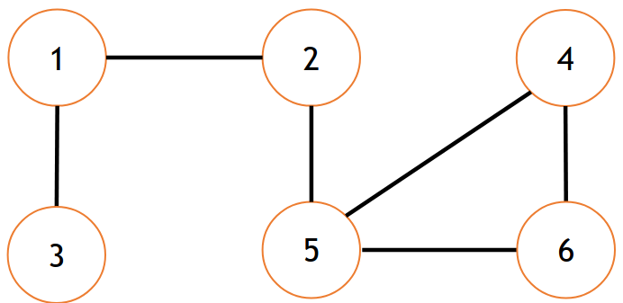

img36 - img42 (montar gif)
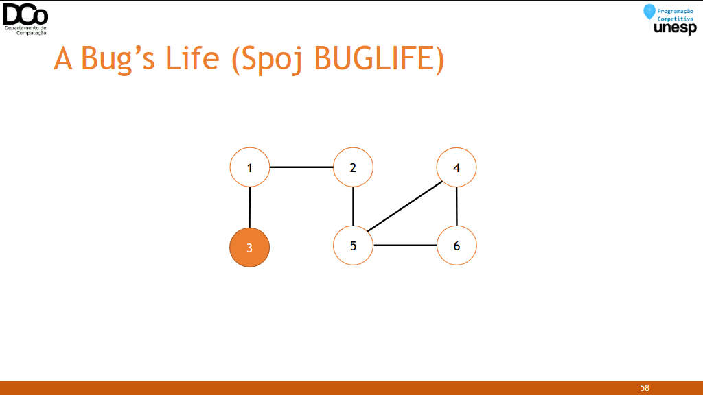

Sugestões
• Gravações de LPC I e II – 2020:
	• [Introdução à Teoria dos Grafos](https://www.youtube.com/watch?v=-4ad172W6H4)
	• [Seminário: Teoria dos Grafos (Amigos do Davizaum)](https://youtu.be/gw92MGRcJ6E)
	• [Pontes e Bellman-Ford](https://youtu.be/XhM8WfXAiLY)
	• [Problema do Fluxo Máximo](https://youtu.be/Zx7Qr9WuIs8)
	• [Ordenação Topológica](https://youtu.be/iMVBH2ak_DY)
	• [Emparelhamento máximo em grafos bipartidos](https://youtu.be/okEnDZDC35A)
	• [Menor Ancestral Comum (LCA)](https://youtu.be/bs1ohR0Kdyw)
• [Material do GEMA (ICMC) - Vídeo](https://github.com/icmcgema/gema/blob/master/10-Grafos_DFS_BFS.md)
• [Material do UnBallon (UnB)](https://github.com/UnBalloon/programacao-competitiva/tree/master/Grafos)
• [Vídeo: Busca em Grafos (MaratonUSP) – Giovana Delfino](https://www.youtube.com/watch?v=87QyIpNV-Y0)

### Referências
Aulas de Estrutura de Dados II da Profª Drª Marcia Aparecida Zanoli Meira e Silva.
Matemática Discreta e Suas Aplicações. Kenneth H. Rosen.
Seminário sobre Introdução a Teoria dos Grafos. Davi Neves, Giovani Candido, Luis Morelli
e Luiz Sementille.
Biblioteca de códigos de Thiago Alexandre Domingues de Souza.
http://www.lcad.icmc.usp.br/~jbatista/scc210/Aula_Grafos1.pdf
http://www.lcad.icmc.usp.br/~jbatista/scc210/Aula_Grafos2.pdf
http://www4.pucsp.br/~jarakaki/grafos/Aula2.pdf
https://miltonborba.org/Algf/Grafos.htm
https://www.ime.usp.br/~pf/algoritmos_para_grafos/aulas/graphs.html
https://www.obm.org.br/content/uploads/2017/01/Nivel1_grafos_bruno.pdf
http://www.inf.ufsc.br/grafos/definicoes/definicao.html
