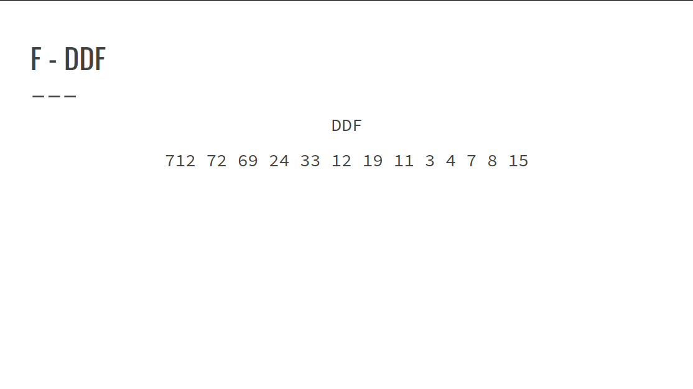

# Resolução Exercícios Teoria dos Números
## Exercício B, E e F

### B - T-Primes
● T-Primes são números positivos que tem exatamente 3
divisores distintos.
● Dado n inteiros, determine quando os mesmo são ou não
T-primes.
Entrada:

n (1 ≤ n ≤ 10^5 )
xi (1 ≤ xi ≤ 10^12 )

● Como encontrar os T-Primes ?
Pela definição, conseguimos assumir que um número x é um
T-prime, se seus divisores forem apenas:
1, (algum_numero_primo), x
Por exemplo, um número primo, não é um T-prime, pois ele
é divisível apenas por ele mesmo e 1.

● Mas qual número primo se encaixa nessa configuração?
1 < (algum_numero_primo) < x
O único número que se encaixa nessa configuração seria um
número primo multiplicado por ele mesmo que gerasse x,
exemplo:
Para x = 9,
1 < 3 < 9

● Solução: Dado um número n:
``` C++
if (n == 1) cout << “NO”;
else if (quadrado_perfeito(n) && ehPrimo[sqrt(n)])
    cout << “YES”;
else
    cout << “NO”;
```

Para x = 16,
16 é um quadrado perfeito, mas como sqrt(16) = 4 e 4 não
é um número primo, ficamos no final com mais de 3 divisores:
1,2,4,8,16
``` C++
vector<bool> ehPrimo;
ll MAXN = 1000000;
void crivo()
{
    ehPrimo = vector<bool>(MAXN + 1, true);
    ehPrimo[0] = ehPrimo[1] = false;
    for (ll i = 2; i * i <= MAXN; i++)
    {
        if (!ehPrimo[i])continue;
        for (ll m = i * i; m <= MAXN; m += i)
        ehPrimo[m] = false;
    }
}
```

### E - RSA Attack
● O enunciado nos apresenta o seguinte problema
○ Achar um inteiro m que satisfaça a equação:
m^e (mod n) = c (mod n)
○ Onde:
○ n é o produto de dois números primos ímpares, p e q
○ gcd(e, (p - 1)(q - 1)) = 1
○ e < (p - 1)(q - 1)
○ e, n, c <= 32000

● 1ª ETAPA: manipular a equação
○ Precisamos encontrar o valor de m, mas, no estado atual de nossa
equação, temos apenas o valor de me, logo, queremos eliminar essa potência.

me (mod n) = c (mod n)
elevar ambos os lados da equação por x
(me)x (mod n) = (c)x (mod n)
mex (mod n) = cx (mod n)

○ Podemos, então, supor que ex = 1, pois, assim, mex = m1.
○ Assim, temos:
m (mod n) = cx (mod n)
○ Agora, sabemos que o valor de m é o resultado da potência cx.
○ Contudo, não sabemos o valor de x, portanto precisamos encontrá-lo.

● 2ª ETAPA: encontrar o valor de x
○ Para tal, vamos utilizar as seguintes afirmações do exercício:
1. ex = 1
2. gcd(e, (p - 1)(q - 1)) = 1
3. e < (p - 1)(q - 1)
4. 
○ Podemos perceber, pelas afirmações 1 e 2, que:
ex = gcd(e, (p - 1)(q - 1)) = 1

○ Uma equação diofantina tem o formato:
ax + by = c
○ E sabemos que podemos resolver através do algoritmo estendido de
Euclides equações diofantinas com a seguinte configuração;
ax + by = gcd(a, b) = c

○ Comparando nossa equação atual com a equação diofantina geral:
ex = gcd(e, (p - 1)(q - 1)) = 1 (I)
ax + by = gcd(a, b) = c (II)
○ Percebemos que:
■ a = e
■ b = (p - 1)(q - 1)
■ c = 1

○ Portanto, podemos escrever nossa equação como:
ex + (p - 1)(q - 1)y = gcd(e, (p - 1)(q - 1)) = 1
○ E descobrimos os valores de x e de y aplicando o algoritmo estendido
de Euclides.
○ O exercício nos garante que encontraremos uma solução para o
problema, então não precisamos nos preocupar com isso.

● 3ª Etapa: definir os valores para p e q
○ Os valores de p e q não estão definidos para aplicarmos na equação
que obtemos, porém sabemos que n = p * q.
○ Assim, testamos valores de p e q da seguinte maneira:
1. Dado um número p, verificamos se p é primo.
2. Se p é primo, verificamos se a divisão n / p é inteira por meio
da expressão n % p == 0.
3. Se a divisão for inteira, verificamos se o valor q = n / p também
é primo.
4. Se todos os itens anteriores forem verdadeiros, encontramos p e
q.

● Cuidados:
○ x pode ser um valor negativo na resolução da equação diofantina, pois
se uma solução é possível, elas admitem infinitas soluções.
○ Porém, temos que:
e < (p - 1)(q - 1) (I)
ex = 1 -> e = 1 / x (II)
○ Para garantir I, podemos reescrever II como:
e (mod (p - 1)(q - 1)) * x = 1

○ Aplicando propriedades da álgebra modular, obtemos:
ex (mod (p - 1)(q - 1)) = 1 (mod (p - 1)(q - 1))
○ Assim, e levando em consideração que x é a multiplicativa inversa de
e, podemos concluir que:
e, x < (p - 1)(q - 1) = mod
Se x < 0, x = (x % mod + mod) % mod
Senão, x = x % mod
``` C++
vector<bool> is_prime;
vector<int> primes;
void crivo(const int &n) {
    is_prime = vector<bool>(n + 1, true);
    is_prime[0] = is_prime[1] = false;
    for (int i = 2; i * i <= n; i++) {
        if (is_prime[i]) {
            for (int j = i * i; j <= n; j += i) {
                is_prime[j] = false;
            }
        }
    }
    for (int i = 2; i <= n; i++) {
        if (is_prime[i])
            primes.push_back(i);
    }
}

crivo(32000);
while (k--) {
    int e, n, c, p, q;
    cin >> e >> n >> c;
    for (int i = 0; i < m; i++) {
        p = primes[i];
        if (n % p == 0 && is_prime[n / p]) {
            q = n / p;
            break;
        }
    }
    int x, y, mod = (p - 1) * (q - 1);
    extended_gcd(e, mod, x, y);
    x = (x % mod + mod) % mod;
    cout << pow_mod(c, x, n) << "\n";
}

ll pow_mod(ll b, ll x, ll mod) {
    ll m = 1LL;
    while (x) {
        if (x & 1) {
            m = (m * b) % mod;
        }
        b = (b * b) % mod;
        x >>= 1;
    }
    return m;
}
```

### F - DDF
● É dado o início e o fim de um intervalo
● O objetivo é saber qual o número com a maior sequência
DDF nesse intervalo.
● DDF -> Decimal Digit Factor Sequence

img1 - img4


Objetivo: Encontrar a maior DDF no intervalo dado.
● Como o intervalo vai de 1 a 3000 no máximo e o tamanho de
uma DDF é no máximo 1000, pode-se calcular todas as DDFs,
de maneira offline, e pegar a maior.
``` C++
ll soma_digitos(ll num){
    ll sum = 0;
    while(num){
        sum += num%10;
        num/=10;
    }
        return sum;
}
ll fatorar(ll n){
    vector<ll> fator;
    ll soma = 0;
    for (ll i = 1; i * i <= n; i++){
        if(n%i == 0){
            if(n != i*i)soma += soma_digitos(n/i);
            soma += soma_digitos(i);
        }
    }
    return soma;
}
vector<ll> ddf [3001];
for(int i = 1; i <= 3000; i++){
    ll ant = i, res = i;
    ddf[i].push_back(i);
    while(1){
        res = fatorar(res);
        if(ant == res)break;
        ddf[i].push_back(res);
        ant = res;
    }
}
```
