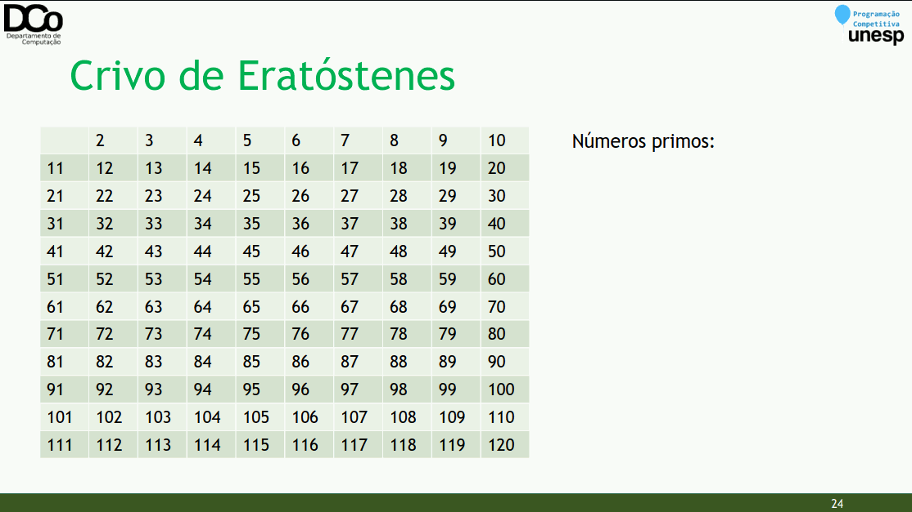
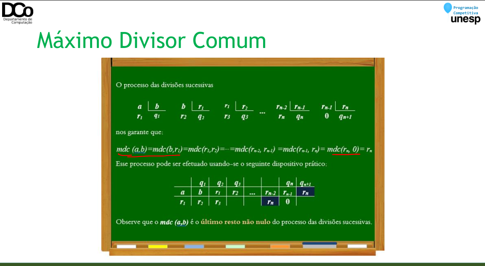
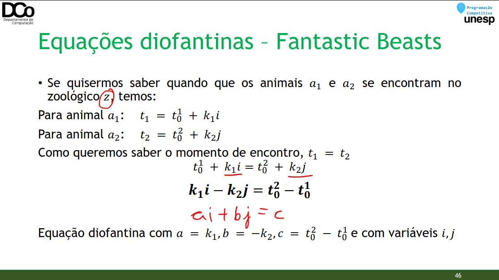

### BigInteger
- Certos problemas da Maratona de Programação recebem como entrada números inteiros que extrapolam o limite de variáveis do tipo long long int
- Tamanho de uma variável long long int: 8 bytes
- Intervalo de números que podem ser armazenados em uma variável desse tipo:
- -9.223.372.036.854.775.808 à 9.223.372.036.854.775.807
- 0 à 18.446.744.073.709.551.615 (unsigned long long int)

- Certos problemas da Maratona de Programação recebem como entrada números inteiros que extrapolam o limite de variáveis do tipo long long int
- Exemplo: 2667 - Jogo de Boca
    - Entrada: 𝑁 (3 ≤ 𝑁 ≤ 10¹⁰⁰)

- 1ª Situação: dependendo das operações necessárias de se fazer com o número, podemos ler o número como sendo uma string e trabalhar com essa string.
- Exemplos:
    - Operações simples com dígitos
    - Uso de Aritmética Modular

- 2ª Situação: se precisarmos fazer operações com esse número como soma, subtração, multiplicação e divisão, o problema se torna mais complexo.
- Nesses casos, não recomendamos usar a linguagem C++. É possível trabalhar com BigInteger em C++ (a biblioteca do Thiago traz códigos para isso), porém a quantidade de código necessária é relativamente grande.
- Sugestões: Java ou Python

- Em Java podemos usar a classe BigInteger da biblioteca java.math
``` Java
String Num;
BigInteger NumGrande;
Scanner S = new Scanner(System.in);
Num = S.nextLine();
NumGrande = new BigInteger(Num);
NumGrande = NumGrande.mod(new BigInteger("3"));
System.out.println(NumGrande);
```

- Em Python, não precisamos nos preocupar muito com o tamanho de um inteiro, a memória é alocada conforme o necessário para comportar o tamanho do número.
- [Entrada e Saída em Python](https://www.geeksforgeeks.org/python-input-methods-competitive-programming/)
- [Python em Programação Competitiva](https://www.geeksforgeeks.org/python-input-methods-competitive-programming/)
- [Muita coisa sobre Python](https://www.geeksforgeeks.org/python-input-methods-competitive-programming/)

- Em Python, não precisamos nos preocupar muito com o tamanho de um inteiro, a memória é alocada conforme o necessário para comportar o tamanho do número.
``` Python
U = int(input())
print(U % 3)
```

### Teoria dos Números
- A Teoria dos Números é o ramo da matemática que se preocupa com as propriedades dos números inteiros.
- Existe uma coleção de algoritmos interessantes derivados de estudos da Teoria dos Números que solucionam problemas de forma inteligente e eficiente.
- Aqui faremos uma breve introdução à alguns tópicos relativos à Teoria dos Números.

#### Números primos
- Diversos problemas envolvem o uso de números primos.
- Dessa forma, precisamos, inicialmente, de uma forma de testar se um número é primo ou não.
- Recordando: números primos são números naturais que têm apenas dois divisores: 1 e ele mesmo.

- Algoritmo ingênuo 𝑂(𝑛)
``` C++
bool ehPrimo(int n)
{
    for(int i = 2; i < n; i++)
    if (n % i == 0)
        return false;
    return true;
}
```

- Porém, na verdade só precisamos testar até 𝒏
- Demonstração:
    - Suponha que não, nesse caso existe 𝒏 tal que o menor fator primo 𝒑 de 𝒏 é maior que sqrt(𝒏).
    - Se 𝒑 divide 𝒏, então 𝒏/𝒑 também divide 𝒏, e 𝒏/𝒑 deve ser maior que sqrt(n).
    - Mas se 𝒑 > sqrt(n) e 𝒏/𝒑 > sqrt(n) , então 𝒑 . 𝒏/𝒑 > 𝒏, o que é um absurdo!

- Algoritmo 𝑂( sqrt(𝑛))
``` C++
bool ehPrimo(int n)
{
    for(int i = 2; i*i <= n; i++)
        if (n % i == 0)
            return false;
    return true;
}
```

### Crivo de Eratóstenes
- O Crivo de Eratóstenes é um método de encontrar os números primos até um certo valor limite.
- Útil em casos que faremos vários testes de primalidade e na fatoração de números.
- Ideia geral: dado que um número 𝒑 é primo, marcamos os múltiplos de 𝒑 como não sendo números primos.

- Algoritmo:
```
Cria-se uma lista de 2 a MAX, marcando todos como primos
Para cada número i de 2 até sqrt(MAX)
Se i está marcado como primo
Marcar todos os números múltiplos de i a partir de i . i 
como compostos (não primos)
```

### Por que podemos marcar só a partir de 𝑖. 𝑖?
- Antes de 𝒊. 𝒊 temos: 𝑖. 2, 𝑖. 3, 𝑖. 4, … 𝑖. (𝑖 − 1). Ou ainda, 𝒊. 𝒋 | 𝟐 ≤ 𝒋 < 𝒊
- Seja 𝒙 = 𝒊. 𝒋, 𝒙 é múltiplo de 𝒊 e também é múltiplo de 𝒋
- Todo 𝒋 ou é primo, ou é múltiplo de um número primo menor que 𝒊, ou seja, um primo já “descoberto” pelo algoritmo
- Se 𝒋 é primo
    - Todos os seus múltiplos foram marcados como não primo, inclusive 𝒊. 𝒋
- Se 𝒋 é múltiplo de um primo 𝒑 < 𝒊
    - Então ele já foi marcado como composto, por ser múltiplo de 𝒑, assim como todos os seus múltiplos
- Logo, todos os números 𝒊. 𝒋 | 𝟐 ≤ 𝒋 < 𝒊 já foram marcados

``` C++
bool ehPrimo[MAX];
vector<int> primos;
void crivo(int n){
    memset(ehPrimo, true, sizeof(ehPrimo));
    for(int p = 2; p * p <= n; p++){
        if (ehPrimo[p]){
            primos.push_back(p); //Lista incompleta, primos até sqrt(n)
            for(int i = p*p; i <= n; i += p)
            ehPrimo[i] = false;
        }
    }
}
```

- Confira a GIF abaixo:



- Este algoritmo possui complexidade 𝑂(𝑛 log log 𝑛)
- Esta demonstração não é muito simples. Caso queira conferir, veja o artigo do [CP-Algorithms](https://cp-algorithms.com/algebra/sieve-of-eratosthenes.html#toc-tgt-1).
- Com certas otimizações ainda é possível obter um [algoritmo de complexidade linear](https://cp-algorithms-brasil.com/Algebra/Crivo2.html).

### Fatoração
- Fatoração em 𝑂(sqrt(𝑛))

``` C++
vector<int> fatorar(int n) {
    vector<int> fator;
    for (int i = 2; i*i <= n; i++){
        while (n % i == 0){
            fator.push_back(i);
            n /= i;
        }
    }
    if (n > 1)
    fator.push_back(n);
    return fator;
}
```
- Também é possível obter um algoritmo de fatoração com complexidade 𝑂(log 𝑛), baseando-se no Crivo de Eratóstenes.
- Primeiramente, ao invés de utilizarmos o crivo para descobrirmos todos os primos, faremos uma pequena alteração para computar para cada número o seu Menor Fator Primo (Shortest Prime Factor - SPF).

- Crivo para Fatoração
``` C++
int spf[MAXN];
void crivo(){
    for(int i=2; i < MAXN; i++){
        if(spf[i] == 0){
            spf[i] = i;
            for(int j=i*i; j<MAXN; j+=i){
                if(spf[j] == 0) spf[j] = i;
            }
        }
    }
}
```

- A partir do vetor SPF pré-calculado, podemos realizar a fatoração de um número qualquer seguindo o seguinte algoritmo:
```
fatores = []
enquanto n > 1
Inserir spf[n] em fatores
n = n/spf[n]
```

#### Fatoração em 𝑂(log 𝑛)
``` C++
vector<int> fatorar(int n){
    vector<int> fator;
    while(n > 1){
        fator.push_back(spf[n]);
        n /= spf[n];
    }
    return fator;
}
```

### Look-up tables
- Existem casos onde podemos gerar um vetor ou matriz de consulta manualmente (ou previamente por outro programa), e inseri-los prontos no nosso código. Dessa forma, economiza-se o tempo de gerar tal vetor/matriz.
- Por exemplo, se para resolver um problema precisamos de todos os primos até 𝑁, podemos embutir um vetor de primos já dentro do código.
``` C++
int primos[] = {2, 3, 5, 7, 11, 13, … }
```

- Isso também pode ser gerado por um programa auxiliar.

*“The judge can’t look into your heart or your program to see your intentions - it only checks the results.”*
(Skiena & Revilla, 2003; p. 129)

### Máximo Divisor Comum
- Problema: encontrar o maior divisor comum de um par de números.
- Algoritmo de Euclides
- OBS: se 𝑚𝑑𝑐(𝑥, 𝑦) = 1, então dizemos que 𝑥 e 𝑦 são coprimos ou primos entre si.



#### MDC/GCD em 𝑂(log(𝑎 + 𝑏))
``` C++
int gcd(int a, int b){
    if (a == 0)
        return b;
    return gcd(b % a, a);
}
```
- Problema: encontrar o menor múltiplo comum entre um par de inteiros.
- Para encontrar o mmc(x, y), podemos calcular o mdc(x, y) e utilizar a seguinte fórmula:

𝑚𝑚𝑐(𝑥, 𝑦) ∗ 𝑚𝑑𝑐(𝑥, 𝑦) = 𝑥 ∗ 𝑦

Ou seja:

𝑚𝑚𝑐(𝑥, 𝑦) = 𝑥 ∗ 𝑦 / 𝑚𝑑𝑐(𝑥, 𝑦)

#### MMC/LCM em 𝑂(log(𝑎 + 𝑏))
``` C++
int lcm(int a, int b){
    return a * (b / gcd(a, b));
}
```
#### Equações diofantinas
- Podemos definir uma equação diofantina linear como uma equação da forma

𝒂𝟏𝒙𝟏 + 𝒂𝟐𝒙𝟐 + ⋯ + 𝒂𝒏 𝒙𝒏 = 𝒄

- sendo 𝒂𝟏, … , 𝒂𝒏 coeficientes inteiros não nulos, 𝒙𝟏 … , 𝒙𝒏 as variáveis inteiras a serem determinadas e 𝒄 uma constante inteira.
- Diversos problemas podem ser modelados usando equações diofantinas.
- Em especial, vamos nos preocupar com equações diofantinas de duas variáveis

𝒂𝒙 + 𝒃𝒚 = 𝒄


#### Equações diofantinas – Fantastic Beasts
- Exemplo de Problema: Fantastic Beasts (Final da Maratona SBC de Programação - 2018)
- Resumindo: considere um grafo direcionado em que os vértices representam zoológicos, e cada zoológico aponta para apenas para um outro zoológico (grau de saída = 1). Temos animais espalhados por esses zoológicos, e a cada unidade de tempo todos os animais avançam para o próximo zoológico.
- Objetivo: determinar onde e quando TODOS os animais se encontrarão, no mesmo zoológico ao mesmo tempo (se isso puder ocorrer em diversos momentos e locais, determinar o primeiro deles)
- Supondo que já estamos em uma fase um pouco mais avançada no problema, onde conseguimos modelar para cada zoológico z uma equação que determina os momentos em que um animal a passa por lá (os animais vão acabar presos em ciclos).

𝑡 = 𝑡0 + 𝑘. 𝑖



- Proposição 1: 𝒂𝒙 + 𝒃𝒚 = 𝒄 admite solução sse 𝒈𝒄𝒅(𝒂, 𝒃) | 𝒄
==>
- Sendo (𝑥0, 𝑦0) uma solução da equação
- Seja 𝑑 = gcd(𝑎, 𝑏), então 𝑑|𝑎 e 𝑑|𝑏. Logo podemos reescrever 𝑎 = 𝐴𝑑 e 𝑏 = 𝐵𝑑

𝑐 = 𝑎𝑥0 + 𝑏𝑦0 = 𝐴𝑑 𝑥0 + 𝐵𝑑 𝑦0

𝑐 = 𝑑(𝐴𝑥0 + 𝐵𝑦0)

Denotando 𝑞 = 𝐴𝑥0 + 𝐵𝑦0

𝑐 = 𝑑𝑞 Portanto, 𝑑|𝑐

- Proposição 1: 𝒂𝒙 + 𝒃𝒚 = 𝒄 admite solução sse 𝒈𝒄𝒅(𝒂, 𝒃) | 𝒄
<==
- Seja 𝑑 = gcd(𝑎, 𝑏)
- Pelo Teorema de Bézout, existe solução (𝑥0, 𝑦0) para 𝑎𝑥 + 𝑏𝑦 = 𝑑
•- Por hipótese, 𝑑|𝑐 ⇒ ∃𝑡 / 𝑐 = 𝑑𝑡

𝑐 = 𝑑𝑡

𝑐 = (𝑎𝑥0 + 𝑏𝑦0)𝑡

𝑐 = 𝑎(𝑥0𝑡) + 𝑏(𝑦0𝑡)

- Portanto, se 𝑑 | 𝑐, então a equação 𝑎𝑥 + 𝑏𝑦 = 𝑐 admite solução

- Como determinar uma solução?

1. Obter uma solução (𝑥0, 𝑦0) para 𝑎𝑥 + 𝑏𝑦 = gcd(𝑎, 𝑏)
2. Para 𝑎𝑥 + 𝑏𝑦 = 𝑐:
    a) 𝑡 = 𝑐/𝑑 em que 𝑑 = gcd(𝑎, 𝑏)
    b) 𝑥 = 𝑥0𝑡
    c) 𝑦 = 𝑦0𝑡
3. Se uma equação diofantina tem uma solução, então ela tem infinitas:

- Solução para 𝑎𝑥 + 𝑏𝑦 = gcd(𝑎, 𝑏)

1. Caso base (𝑎 = 0):
    - Se 𝑎 = 0 então temos 𝑏𝑦 = gcd(0, 𝑏)
    - Sabemos que gcd 0, 𝑏 = 𝑏
    - Então 𝑏𝑦 = 𝑏, logo 𝑦 = 1
    - Nesse caso 𝑥 pode assumir qualquer valor. Como queremos uma solução qualquer, por motivos de simplificação, faremos 𝑥 = 0
- Solução base: (0, 1)

- Solução para 𝑎𝑥 + 𝑏𝑦 = gcd(𝑎, 𝑏)

2. Passo da indução:
- Temos 𝑎𝑥 + 𝑏𝑦 = gcd(𝑎, 𝑏)
- Pelo Algoritmo de Euclides, sabemos que gcd 𝑎, 𝑏 = gcd 𝑏%𝑎, 𝑎 = 𝑑
- Logo, podemos obter outra equação diofantina: 𝑏%𝑎 𝑥1 + 𝑎𝑦1 = 𝑑 (∗)

- Solução para 𝑎𝑥 + 𝑏𝑦 = gcd(𝑎, 𝑏)
- Considerando o resultado da divisão inteira, podemos dizer que:

𝑏 = 𝑏

𝑎 𝑎 + 𝑏%𝑎

𝑏%𝑎 = 𝑏 − 𝑏

𝑎 𝑎

- Substituindo em (∗)

𝑏 − 𝑏

𝑎 𝑎 𝑥1 + 𝑎𝑦1 = 𝑑

𝑏𝑥1 − 𝑏

𝑎 𝑎𝑥1 + 𝑎𝑦1 = 𝑑

𝑎 𝑦1 − 𝑏

𝑎 𝑥1 + 𝑏𝑥1 = 𝑑

𝒂𝒙 + 𝒃𝒚 = 𝒅

#### Implementação
``` C++
int gcd(int a, int b, int &x, int &y){
    if (a == 0){
        x = 0;
        y = 1;
        return b;
    }
    int x1, y1;
    int d = gcd(a, b % a, x1, y1);
    x = y1 - x1 * (b/a);
    y = x1;
    return d;
}

bool solve(int a, int b, int c, int &x0, int &y0, int &g) {
    g = gcd(abs(a), abs(b), x0, y0);
    if (c % g) {
        return false;
    }
    x0 *= c / g;
    y0 *= c / g;
    if (a < 0) x0 = -x0;
    if (b < 0) y0 = -y0;
    return true;
}
```

### Aritmética Modular
- Em vários problemas precisamos operar com os restos de divisões de inteiros.
- A aritmética modular permite fazer cálculos com restos de divisões de modo eficiente, e é especialmente útil quando estamos trabalhando com números grandes (BigInteger).
- Na verdade, a Aritmética Modular pode nos ajudar a evitar ter que trabalhar com números muito grandes.

- A aritmética modular se baseia nas seguintes propriedades:

(𝑥 + 𝑦) % 𝑛 = ((𝑥 % 𝑛) + (𝑦 % 𝑛)) % 𝑛

(𝑥 − 𝑦) % 𝑛 = ((𝑥 % 𝑛) − (𝑦 % 𝑛)) % 𝑛

(𝑥 ∗ 𝑦) % 𝑛 = ((𝑥 % 𝑛) ∗ (𝑦 % 𝑛)) % 𝑛

(𝑥 ^ 𝑦) % 𝑛 = ((𝑥 % 𝑛) ^ 𝑦) % 𝑛

- UVa 374 - Big Mod
- Calcule 𝑅 = 𝐵𝑃 𝑚𝑜𝑑 𝑀
- 0 ≤ 𝐵, 𝑃 ≤ 2147483647 e 1 ≤ 𝑀 ≤ 46340

- Parte da solução do problema UVA 374 – Big Mod
``` C++
long long pow(long long x, long long y, long long mod) {
    if (y == 0)
        return 1;
    long long p = pow(x, y/2, mod);
    if (y % 2 == 0)
        return (p * p) % mod;
    else
        return (((p * p) % mod) * (x % mod)) % mod;
}
```

### Inverso Modular
- A aritmética modular não se aplica a divisão. Porém, temos o conceito de inverso multiplicativo modular.
- Lembre-se que um número multiplicado pelo seu inverso é igual a 1
- Da aritmética básica, sabemos que:
- O inverso de um número 𝐴 é 1

𝐴

- Todos os reais diferentes de 0 têm um inverso
- Multiplicar um número pelo inverso de 𝐴 é o mesmo que dividir por 𝐴

𝑋 ∗ 𝐴−1 = 𝑋 ∗ 1

𝐴 = 𝑋

𝐴

- O inverso modular de 𝐴 (𝑚𝑜𝑑 𝐶) é 𝐴−1.
- 𝐴 ∗ 𝐴−1 ≡ 1 (𝑚𝑜𝑑 𝐶) ou de modo equivalente 𝐴 ∗ 𝐴−1 𝑚𝑜𝑑 𝐶 = 1
- OBS: Apenas os números coprimos de C têm um inverso modular (mod C)o

- Exemplo: A=3 e C=7

3 ∗ 5 𝑚𝑜𝑑 7 = 15 𝑚𝑜𝑑 7 = 1

∴ 3 ∗ 5 ≡ 1 (𝑚𝑜𝑑 7)

- Logo, 5 é o inverso modular de 3 (mod 7) .

- Como encontrar um inverso multiplicativo?
- Determinar um 𝑥 ∈ ℤ tal que 𝐴𝑥 ≡ 1 𝑚𝑜𝑑 𝐶 ⇒ 𝑥 = 𝐴−1
- Da congruência, temos que
- C | (𝐴𝑥 − 1)
- Logo, ∃y ∈ ℤ| 𝐴𝑥 − 1 = 𝐶𝑦

𝐴𝑥 − 𝐶𝑦 = 1

- Equação diofantina!

### Referências
Biblioteca de códigos de Thiago Alexandre Domingues de Souza.

Matemática Discreta e Suas Aplicações. Kenneth H. Rosen.

Programming Challenges: The Programming Contest Training Manual. Stevem S. Skiena e

Miguel A. Revilla.

https://www.geeksforgeeks.org/sieve-of-eratosthenes/

http://www.lcad.icmc.usp.br/~jbatista/scc210/AulaTeoriadosNumeros1.pdf

http://www.lcad.icmc.usp.br/~jbatista/scc210/AulaTeoriadosNumeros2.pdf

https://www.ufsj.edu.br/portal2-repositorio/File/comat/tcc_Ricardo.pdf

https://cp-algorithms.com/algebra/linear-diophantine-equation.html

https://noic.com.br/materiais-informatica/curso/math-02/

https://noic.com.br/materiais-informatica/curso/math-03/

https://pt.khanacademy.org/computing/computer-

science/cryptography/modarithmetic/pi/fast-modular-exponentiation

https://www.cin.ufpe.br/~gdcc/matdis/aulas/aritmeticaModular_parte2.pdf
