### Análise Combinatória
- Combinatória, o estudo dos arranjos dos objetos, é uma parte importante da matemática discreta. É o ramo da matemática que se dedica à contagem de elementos ou eventos discretos e de suas possíveis combinações.
- Diversos problemas de programação competitiva envolvem análise combinatória.
- Diversos problemas de contagem e de combinação possuem soluções fechadas, ou seja, existem fórmulas matemáticas resultantes da análise combinatória que podem ser aplicadas.
- Este é um dos motivos da importância da análise combinatória para a Computação, pois permite substituir um algoritmo com complexidade alto (busca por backtracking, por exemplo), por uma única chamada a uma simples fórmula.
- Em Programação Competitiva, isto é particularmente importante, permitindo resolver problemas aparentemente complexos de forma bastante simples, e sem estourar o tempo limite.
- Em alguns casos, também é possível a obtenção de look-up tables para soluções off-line.

- Bases da contagem:
- Regra do Produto: Suponha que um procedimento possa ser dividido em uma sequência de duas tarefas. Se houver 𝒏 formas de fazer a primeira tarefa e, para cada uma dessas formas, há 𝒎 formas de fazer a segunda, então há 𝒏. 𝒎 formas de concluir o procedimento. Exemplo: Quantidade de números de 3 dígitos que podem ser formados apenas com os algarismos 1, 2, 5 e 7. Devemos preencher 3 dígitos escolhendo dentro de 4 algarismos: 4 ∗ 4 ∗ 4 = 64 possibilidades Se não pudesse haver repetição de algarismos: 4 ∗ 3 ∗ 2 = 24 possibilidades

### Bases da contagem:
- Regra do Soma: Se uma tarefa puder ser realizada em uma de 𝒏 formas ou em uma das 𝒎 formas, em que nenhuma das 𝒏 formas seja igual a alguma das 𝒎 formas, então há 𝒏 + 𝒎 formas de realizar a tarefa.
- Caso mais geral: quando há intersecção entre os conjuntos de “formas”, devemos subtraí-la da soma:

|𝐴1 ∪ 𝐴2| = |𝐴1| + |𝐴2| − |𝐴1 ∩ 𝐴2|

- Uma associação é um arranjo de 𝒏 itens, onde cada item pode ser escolhido de uma lista de 𝒎 valores, com repetição.
- Por exemplo, quantas formas diferentes existem de se pintar 4 casas utilizando 3 cores.
- Utilizando a regra do produto:

𝑆 (𝑛, 𝑚) = 𝑚^𝑛

- Existem 𝑆(4,3) = 3⁴ = 81 associações possíveis entre 4 casas e 3 cores

- Caso específico: subconjuntos
- Quantos subconjuntos podemos formar a partir de um conjunto de 𝒏 elementos? Trata-se de um problema de seleção sem reposição.
- A seleção ou não de cada um dos 𝒏 elementos pode ser representada de forma binária (selecionar ou não selecionar): arranjo binário de 𝒏 posições.
- Logo, o número de possíveis subconjuntos é 𝑺(𝒏, 𝟐) = 𝟐^𝒏

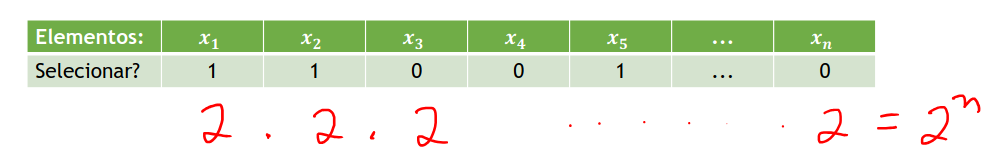

- Exemplo 1:
    - Um computador de 32 bits é capaz de endereçar quantos gigabytes de memória?

𝑆 (32,2) = 2³² = 2². 2³⁰ = 4𝐺𝐵

- Exemplo 2:
    - Quantas senhas diferentes é possível criar utilizando de 8 a 10 letras ou dígitos, considerando letras minúsculas e maiúsculas.

    𝑆(8, 62) + 𝑆(9,62) + 𝑆(10,62) = 853.054.792.520.188.672

### Permutação
- Permutação é um arranjo de 𝒏 itens, onde cada item aparece exatamente uma única vez.
- O 1º elemento do arranjo pode assumir qualquer um dos 𝒏 itens, o 2º pode assumir 𝒏 − 𝟏 itens (qualquer um, exceto o já assumido pelo 1º) e assim por diante.
- Logo, pela regra do produto:

𝑃(𝑛) = 𝑛(𝑛 − 1)(𝑛 − 2) … 1 = 𝑛!

𝑃(𝑛) = 𝑛!

- Exemplo: anagramas
    - Quantos anagramas existem da palavra MESA
    - Conjunto de elementos: 𝑀, 𝐸, 𝑆, 𝐴
    - 𝑃(4) = 4! = 24 anagramas

- Permutação com elementos repetidos
- Exemplo: anagrama da palavra CASA
    - A letra “A” aparece duas vezes, se aplicássemos a fórmula da permutação, o anagrama ACSA, por exemplo, seria contado duas vezes, como se cada letra A fosse uma letra diferente. CASA => ACSA, ACSA
    - Considerando um conjunto de elementos, e que o elemento 1 se repete 𝑛1 vezes, o 2 se repete 𝑛2 vezes, e assim por diante, chegamos em:

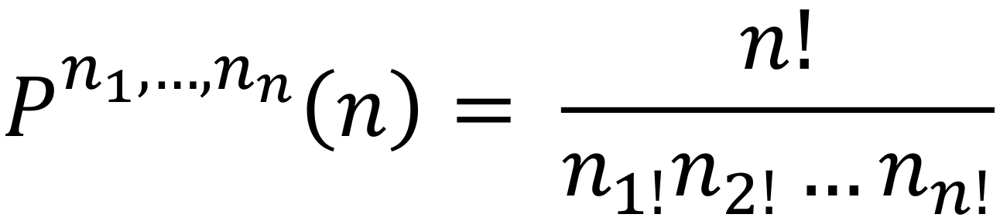

### Arranjo
- Arranjo: quantas possibilidades há de escolher 𝒓 elementos de um conjunto de 𝒏 elementos, em que a ordem de escolha é relevante?
- É uma generalização da permutação. Uma permutação pode ser considerada como um arranjo em que 𝒓 = 𝒏

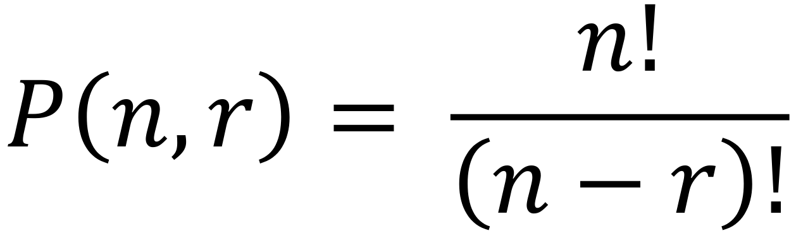

``` cpp
int PermutationCoeff(int n, int k)
{
    int Fn = 1, Fk;
    for (int i = 1; i <= n; i++)
    {
        Fn *= i;
        if (i == n - k)
        Fk = Fn;
    }
    int coeff = Fn / Fk;
    return coeff;
}
```

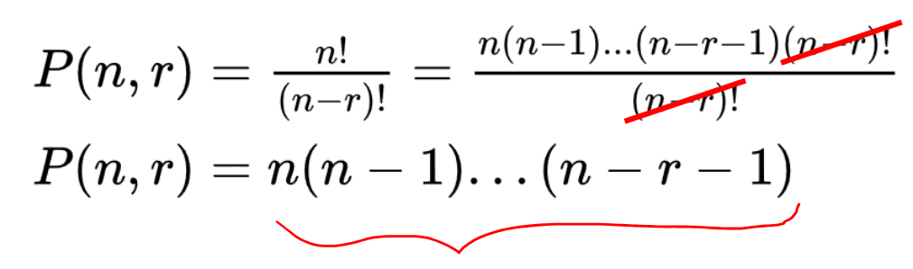

``` cpp
int PermutationCoeff(int n, int k)
{
    int coeff = 1;
    for (int i = n; i > (n - k); i--)
        coeff *= i;
    return coeff;
}
```
### Combinação
- Combinação: quantas possibilidades há de escolher 𝑟 elementos de um conjunto de 𝑛 elementos, em que a ordem de escolha não é relevante?

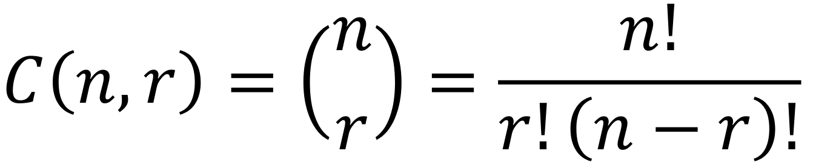

- Tanto no caso da permutação como da combinação, temos que tomar um pouco de cuidado com nossa implementação (estamos usando muito fatorial), tanto em relação ao tempo quanto ao limite de nossas variáveis.
- Para a combinação, pode-se calcular qualquer coeficiente binomial baseado na seguinte recorrência (que deriva o conhecido Triângulo de Pascal):

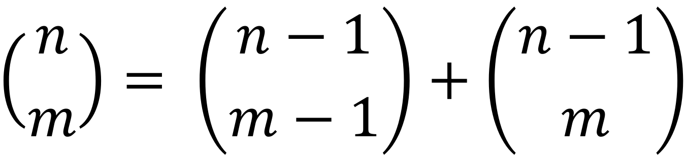

``` cpp
long long bin[MAXN][MAXR];
void calcularCoefBin(int n, int k){ //Pré-calculando em O(n*k)
    int i, j;
    for (i = 0; i <= n; i++){
        for (j = 0; j <= min(i, k); j++){
        if (j == 0 || j == i)
            bin[i][j] = 1;
        else
            bin[i][j] = bin[i - 1][j - 1] + bin[i - 1][j];
        }
    }
}
```

### Exemplo: caminho através de uma grade
- Quantas formas temos de caminhar em uma grade 𝑛 𝑥 𝑚 a partir do canto superior esquerdo e alcançar o canto inferior direito caminhando apenas para baixo e para a direita?

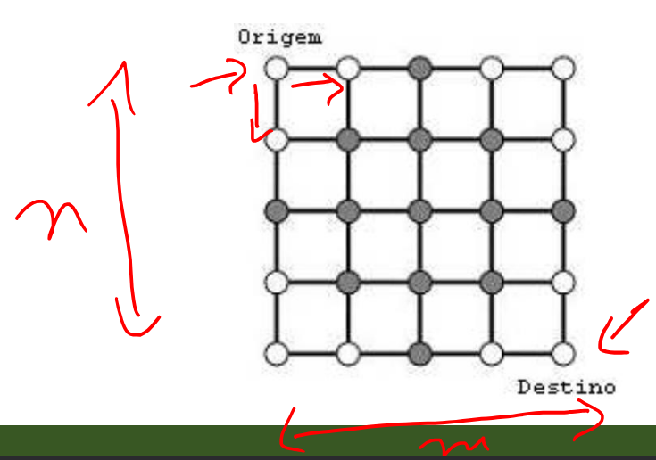

- Exemplo: caminho através de uma grade
- 1ª forma de analisar: note que cada caminho é necessariamente constituído de um conjunto de 𝑛 + 𝑚 passos, 𝑛 para baixo e 𝑚 para a direita.
- Sendo assim, um caminho nada mais é do que uma permutação de passos para baixo e para a direita. Podemos considerar como se fosse um anagrama (com “letras” repetidas). Ex: BBDDB. Logo, pela fórmula da permutação com elementos repetidos:

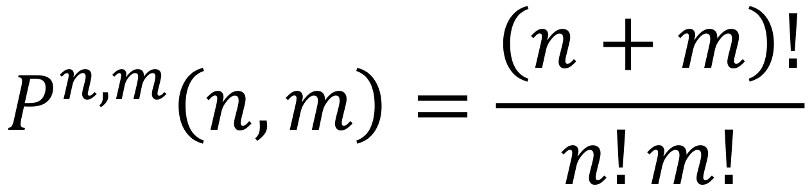

- 2ª forma de analisar: novamente, considerando que um caminho é constituído de 𝑛 + 𝑚 passos, 𝑛 para baixo e 𝑚 para a direita.
- Necessariamente, dois caminhos distintos diferem na ordem de um ou mais dos 𝑛 passos para baixo, dentro dos 𝑛 + 𝑚 passos totais.
- Exemplo, considerando uma grade 2x2:
    - **baixo** - direita - **baixo** - direita (ordens 1 e 3)
    - **baixo** - **baixo** - direita - direita (ordens 1 e 2)
- 2ª forma de analisar: novamente, considerando que um caminho é constituído de 𝑛 + 𝑚 passos, 𝑛 para baixo e 𝑚 para a direita.
- Dessa forma, podemos escolher 𝑛 posições dentro das 𝑛 + 𝑚 possíveis como sendo passos para baixo. Se tratando de um problema de combinação, já que a ordem de escolha das posições não importam, as combinações (1,3) e (3,1) representam o mesmo caminho (pensando no exemplo anterior)

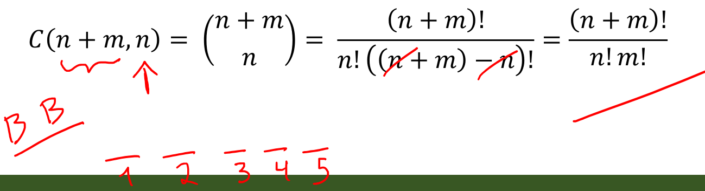

### Esperança matemática
- A Esperança Matemática, o valor esperado ou a expectância de uma variável aleatória nada mais é do que a média aritmética de uma variável aleatória.
- Para uma variável aleatória discreta 𝑋 com valores possíveis 𝑥1, 𝑥2, 𝑥3, … e com as probabilidades representadas pela função 𝑝(𝑥𝑖), o valor esperado calcula-se pela série:

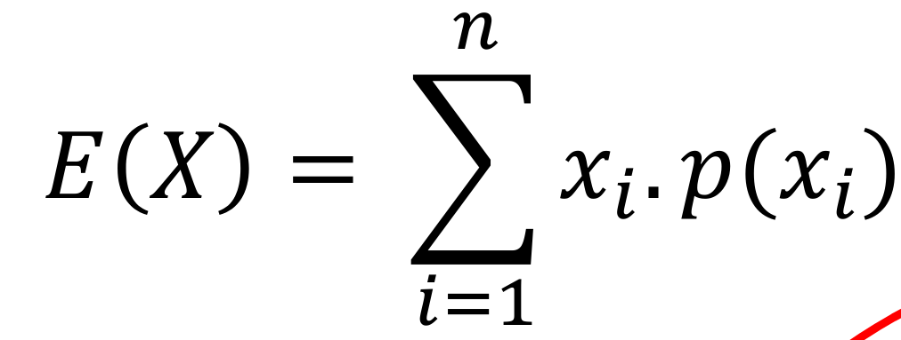

- Sendo que 𝑛 pode tender ao ∞ se a série for convergente.

- Exemplo: uma pequena cirurgia dentária pode ser realizada por um método cujo tempo de recuperação (em dias) é modelado pela variável aleatória X. Determine a Esperança Matemática da variável X da função discreta de probabilidade abaixo

| X | 5 | 10 | 15 | 20 |
| - | - | - | - | - |
| 𝒑𝒊 | 0,3 | 0,2  |0,4 |0,1|

𝐸(𝑋) = 5 ∗ 0,3 + 10 ∗ 0,2 + 15 ∗ 0,4 + 20 ∗ 0,1

𝐸(𝑋) = 11,5

- Espera-se que o tempo médio de recuperação seja de 11,5 dias

### Relação de Recorrência
- Uma relação de recorrência é uma equação definida em termos de si mesma.
- Trata-se de um conceito matemático intimamente ligado ao conceito de recursão em computação.
- Por exemplo, qualquer polinômio

𝑝𝑛(𝑥) = 𝑐0 + 𝑐1𝑥 + … + 𝑐𝑛𝑥𝑛

pode ser escrito recorrentemente pela regra de Horn como:

𝑝0(𝑥) = 𝑐𝑛

𝑝𝑖(𝑥) = 𝑐𝑛−𝑖 + 𝑥. 𝑝𝑖−1(𝑥)

- Algo muito importante, especialmente em PC, é que muitas recorrências podem ser expressas simplificadamente através de funções:
- Isso permite o cálculo analítico de qualquer termo de sequências numéricas recorrentes, independente da quantidade de termos precedentes.
- Exemplo: i-ésimo termo de uma Progressão Aritmética
- Relação de recorrência

𝑎1 = 𝑋

𝑎𝑛 = 𝑎𝑛−1 + 𝑟

- Termo geral

𝑎𝑛 = 𝑎1 + ( 𝑛 − 1)𝑟

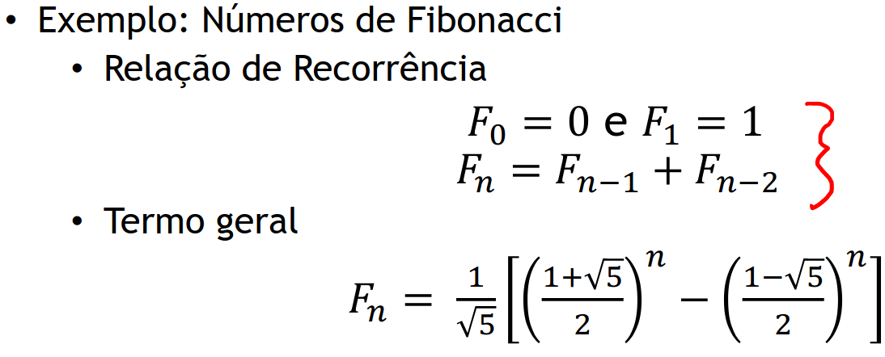

### Indução Matemática
- Dada uma sequência ou relação de recorrência e valor(es) base conhecido(s), como obter uma expressão fechada para o 𝑛-ésimo termo?
- Uma das metodologias matemáticas para solucionar esse tipo de problema é a indução.
- Essa metodologia requer uma hipótese, usualmente obtida a partir da observação de um conjunto de valores iniciais conhecidos e, possivelmente, ajustes por tentativa-e-erro.

- Exemplo:
    
    𝑇0 = 0

    𝑇𝑛 = 2𝑇𝑛−1 + 1

𝒏 0 1 2 3 4 5 6

𝑻𝒏 0 1 3 7 15 31 63

| 𝒏 | 0 | 1 | 2 | 3 | 4 | 5 | 6 |
| - | - | - | - | - | - | - | - |
| 𝑻𝒏 | 0 |1 | 3 | 7 | 15 | 31 | 63 |

- Neste exemplo, uma hipótese fácil de obter é 𝑇𝑛 = 2^𝑛 − 1

- Três passos da Prova por Indução:

1. Mostre que a hipótese satisfaz o valor base:

- 𝑇0 = 2⁰ − 1 = 0

2. Assuma que a hipótese é válida para qualquer 𝑛:

- 𝑇𝑛 = 2^𝑛 − 1

3. Use esta hipótese para generalizar para os elementos seguintes:

- 𝑇𝑛+1 = 2𝑇𝑛 + 1 = 2(2𝑛 − 1) + 1 = 2^𝑛+1^ − 2 + 1 = 2^𝑛+1^ − 1

- As razões da validade deste tipo de prova estão intimamente ligadas às razões do funcionamento de programas recursivos:
- Garante-se o funcionamento para caso(s) base (boundary conditions)
- Obtém-se o caso geral (general conditions) garantindo que este funciona como uma função do caso imediatamente anterior.

### Eggfruit Cake (SBC - Nacional 2019)
- Neste problema temos um bolo coberto por frutas, onde cada fruta pode ser uma eggfruit (E) ou um persimmon (P).
- Objetivo: determinar quantas formas há de cortar o bolo em fatias que possuam até S frutas em que pelo menos uma delas é uma fruta do tipo E?

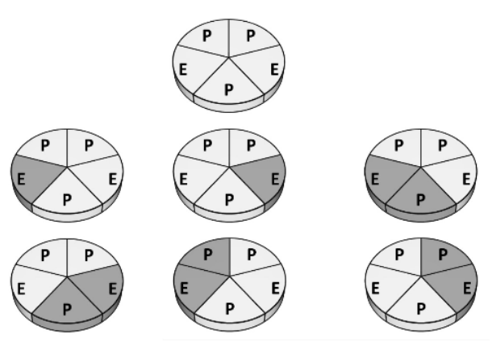

- Primeiramente, já que cada fatia precisa ter pelo menos uma fruta do tipo E, vamos olhar para cada fruta E e ver quantas possibilidades de corte temos que incluam esta posição.
- Exemplo: 𝑆 = 3

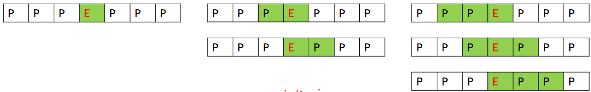

- Sendo 𝑞𝐸 a quantidade de frutas do tipo E, temos que:

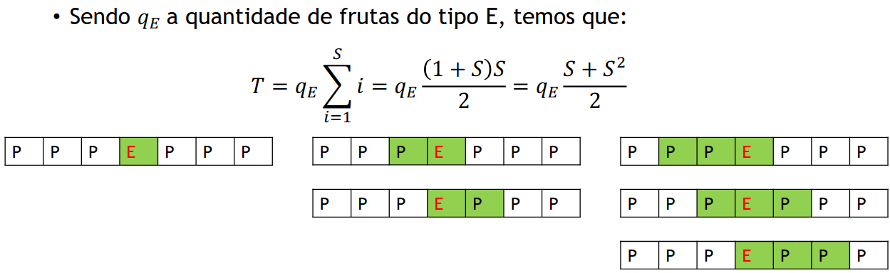

- Mas isso gera um problema: fatias que possuem mais de uma fruta E serão contadas mais de uma vez (1 vez para cada fruta E).

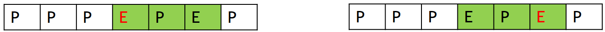

- Solução: para cada fruta E, vamos olhar a sua distância até a fruta anterior (D). Toda fatia de tamanho maior ou igual a D+1 que contenha a fruta anterior deve ser descontada.

- Análise:

| Tamanho da fatia | Possibilidades | # de possibilidades |
| - | - | - |
| 𝐷 + 1  | E...E |1 |
| 𝐷 + 2 | XE...E, E...EX  | 2|
| 𝐷 + 3 | XXE...E, XE...EX, E...EXX | 3|
| ... | ... | |
| S |  ... | S-D |

- Valores para subtrair (quantidade de fatias repetidas):

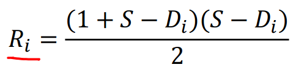

- Total:

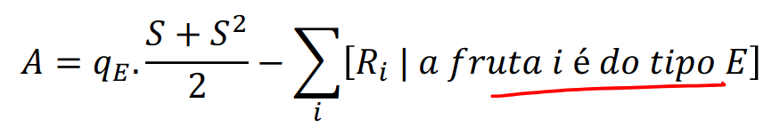

### Desafio: SBC - Regional 2020 – Problema A
- Problema: Considere um álbum de figurinha onde todas as figurinhas são iguais. Sendo assim, para completar o álbum basta coletar 𝑁 figurinhas.
- Porém, quando se compra um pacote de figurinhas, ele contém um número aleatório de figurinhas.
- Objetivo: determinar, em média, quantos pacotes são necessários para completar um álbum?
- https://vjudge.net/problem/Gym-102428M

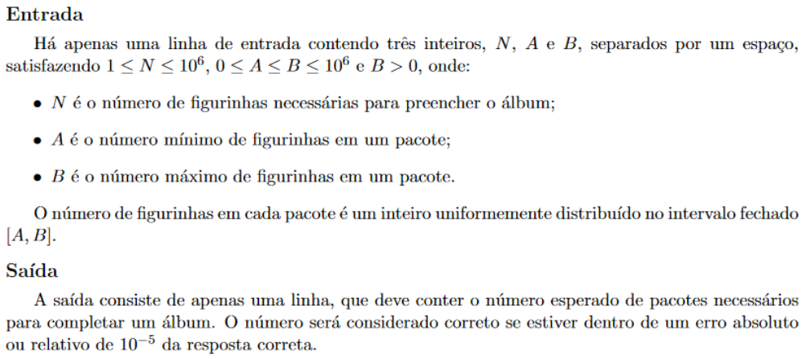

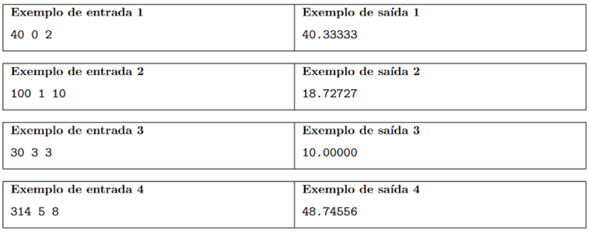

- Dicas:
    - Pode-se perceber com certa facilidade que este exercício envolve o conceito de esperança matemática. Porém, a aplicação não é tão direta quanto no exemplo que foi dado anteriormente.
    - Um passo importante é buscar determinar uma relação de recorrência 𝑥𝑖 tal que 𝑥𝑖 = quantidade de pacotes esperado para conseguir ≥ 𝑖 figurinhas.
    - Uma vez determinada essa relação de recorrência, pode ser necessário alguma técnica específica para que ela possa ser calculada de forma eficiente, sem gerar TLE.
    - Caso específico a se considerar: 𝐴 = 0. Não é um caso muito mais complicado que o caso geral, mas é necessário um tratamento especial.
    - Resolução: https://www.youtube.com/watch?v=icXLy96-yGI&t=6537s

### Referências
Biblioteca de códigos de Thiago Alexandre Domingues de Souza.

Matemática Discreta e Suas Aplicações. Kenneth H. Rosen.

Programming Challenges: The Programming Contest Training Manual. Stevem S. Skiena e Miguel A. Revilla.

https://www.geeksforgeeks.org/permutation-coefficient/

http://wiki.icmc.usp.br/images/a/ac/SCC211Cap6A.pdf

https://mundoeducacao.uol.com.br/matematica/permutacao-envolvendo-elementos-repetidos.htm

https://brasilescola.uol.com.br/matematica/permutacao-com-elementos-repetidos.htm

https://sites.google.com/site/estatisticabasicacc/conteudo/probabilidade/variaveis-aleatorias-discretas/esperanca-matematica
