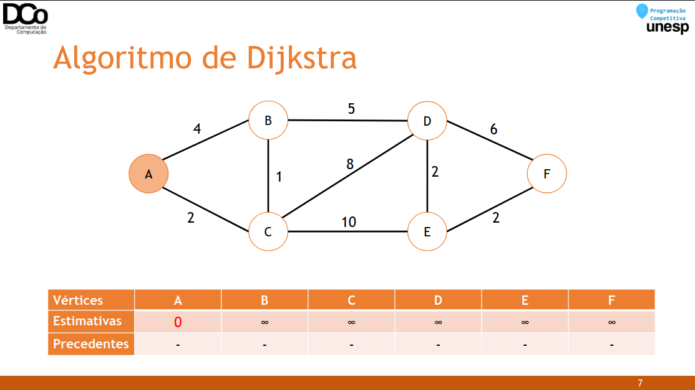
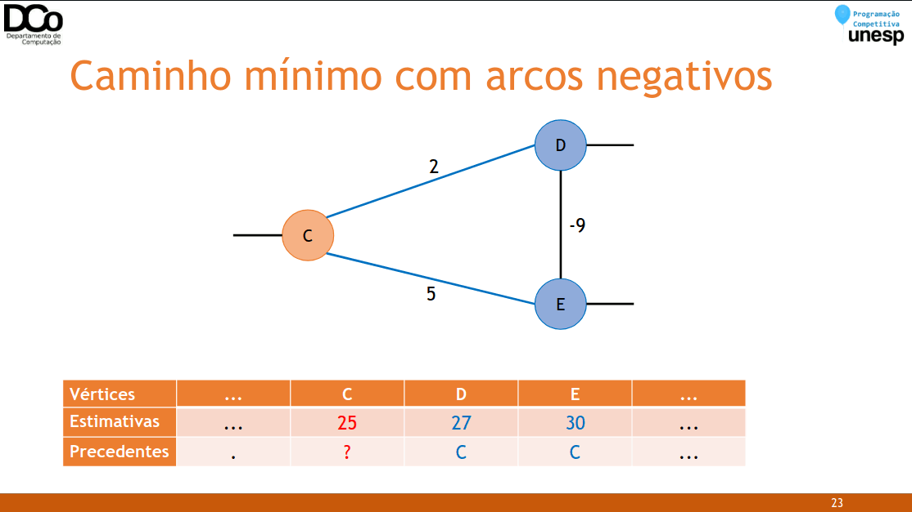
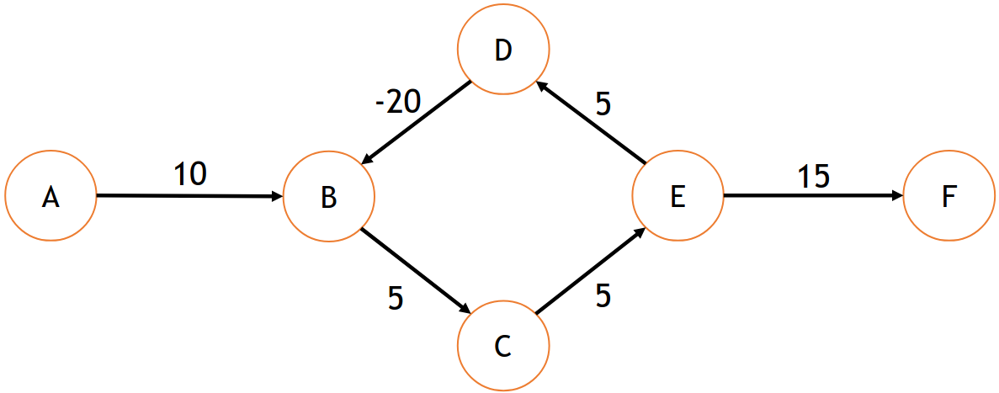
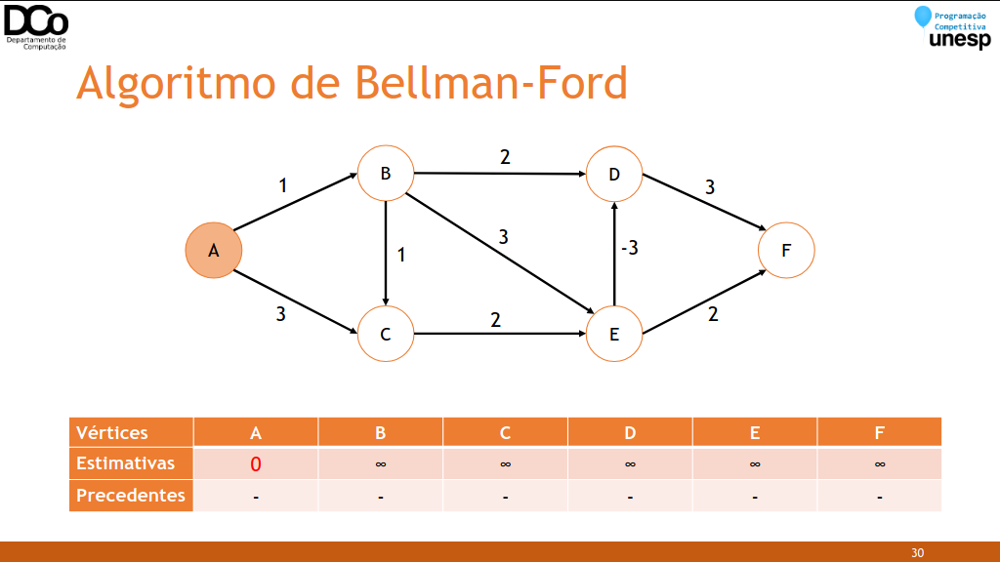
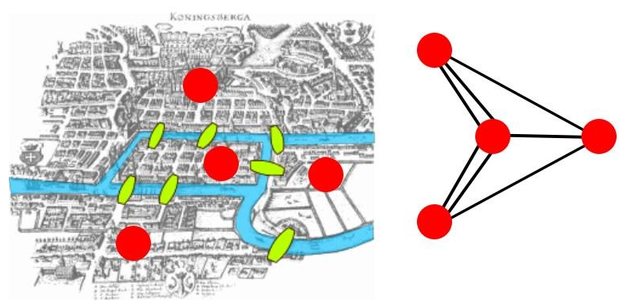
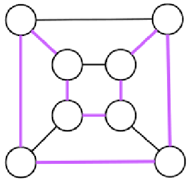

### Problema do Caminho Mínimo
• Imagine o seguinte problema: dado um mapa de cidades, contendo o
comprimento das estradas entre as cidades, qual o menor caminho entre
quaisquer cidades A e B?
• Esse problema pode ser modelado através de um grafo:
• Cidades: vértices;
• Estradas entre cidades: arestas ponderadas com peso que indicam a distância entre as cidades.
• Generalizando, o nosso problema é encontrar o caminho de menor custo
em um grafo de um vértice A até um vértice B.
• Chamamos de custo de um caminho a soma dos pesos das arestas
pertencentes a esse caminho.

• Existem alguns algoritmos clássicos que resolvem tal problema:
• Dijkstra
• Para pesos não negativos
• Complexidade: 𝑂( 𝑉 + 𝐴 log 𝑉)
• Bellman-Ford
• Permite lidar com pesos negativos
• Complexidade: 𝑂(𝑉. 𝐴)
• Floyd-Warshall
• Permite lidar com pesos negativos
• Encontra o menor caminho entre todo os pares de vértices (𝑢, 𝑣)
• Complexidade: 𝑂(𝑉3)

### Algoritmo de Dijkstra
• Este algoritmo parte de uma estimativa inicial para o custo mínimo e vai,
iterativamente, ajustando esta estimativa.
• A busca se inicia a partir de um vértice, a qual denominamos origem.
• Ele considera que um vértice estará fechado quando já tiver sido obtido
um caminho de custo mínimo da origem até ele. Caso contrário, ele é
dito aberto.

• Pseudocódigo: seja 𝐺(𝑉, 𝐴) um grafo e 𝑠 um vértice de 𝐺 (origem):
```
1. Atribua valor zero à estimativa de custo mínimo do vértice 𝑠 e ∞ às demais.
2. Enquanto houver vértice aberto:
	A. Seja 𝑘 um vértice ainda aberto cuja estimativa seja a menor entre todos os
vértices abertos: fechar o vértice 𝑘
	B. Para todo o vértice 𝑗 ainda aberto que seja adjacente à 𝑘 faça:
		i. Soma a estimativa do vértice 𝑘 com o custo da aresta 𝑘, 𝑗
		ii. Caso essa estimativa seja melhor que a anterior para 𝑗, substitua e anote 𝑘 como precedente (“pai”) de 𝑗
```
img1 - img12


``` C++
int d[MAX_V]; //d[i] armazena a distância até o vértice i, e as
//estimativas durante as iterações
int p[MAX_V]; //armazena o predecessor de cada vértice
void dijkstra(int inicial, int vertices){
    priority_queue< pair<int, int> > heap; //distância, vértice
    int s, t, peso;
    for(int i = 0; i < vertices; i++)
    d[i] = INT_MAX;
    memset(p, -1, sizeof(p));
    heap.push(make_pair(d[inicial] = 0, inicial));
    while(!heap.empty()){
        s = heap.top().second;
        heap.pop();
        for(int i = 0; i < grau[s]; i++){
            t = adj[s][i].v;
            peso = adj[s][i].w;
            if (d[s] + peso < d[t]){
            d[t] = d[s] + peso;
            p[t] = s;
            heap.push(make_pair(-d[t], t));
            }
        }
    }
}
```

 Analisando a complexidade desse algoritmo de forma intuitiva, temos
que (pensando no pior caso):
• Todos os vértices são fechados: |𝑉| operações
• Cada vez que um vértice é fechado, é porque ele foi extraído de uma heap: custo
𝑂 1 ⇒ 𝑂(|𝑉|)
• Para cada vértice, todas as suas arestas são acessadas. No total, acessaremos |𝐴| arestas ⇒ 𝑂(|𝑉| + |𝐴|)
• Cada vez que uma aresta é acessada, podemos inserir um elemento na heap: custo 𝑂(log |𝑉|) ⇒ 𝑂((|𝑉| + |𝐴|) ∗ log |𝑉|)
• Complexidade: 𝑂( (|𝑉| + |𝐴|) . log |𝑉|)

### Caminho mínimo com arcos negativos
• O algoritmo de Dijkstra se baseia em uma estratégia gulosa, e esta falha
quando temos arestas com pesos negativos.
• Quando fechamos o vértice aberto com menor distância até ele,
estamos supondo que nenhum outro caminho até ele é menor.
• Quando os pesos são não negativos, isso é verdade porque qualquer
outro caminho irá utilizar arestas com peso maior ou igual a zero.
• Porém, se existem arcos negativos, podemos ter caminhos que no
momento apresentam um custo maior, mas posteriormente terão este
custo reduzido pela adição de um arco negativo.

img13 - img15


• Quando pode aparecer arcos negativos em problemas de caminho
mínimo?
• Parece não fazer muito sentido falar em “distância” com arcos negativos, mas
podemos ter diversos tipos de outros problemas em que esta situação se apresente.
• Por exemplo: problemas envolvendo dinheiro, onde arcos positivos representam
gastos e arcos negativos representam lucro. Nesse caso, um caminho mínimo
maximiza o lucro.
• Situação análoga: jogo em que os vértices representam estados, arcos positivos
são transições que diminuem a pontuação do jogador, e arcos negativos são
transições que aumentam a pontuação.
• Caso insolúvel: presença de ciclos negativos
• “Dar uma volta” em um ciclo de custo negativo sempre diminui o
custo final.



### Algoritmo de Bellman-Ford
• Para encontrar um caminho mínimo em um grafo com a presença de
arcos negativos, podemos utilizar o algoritmo de Bellman-Ford.
• Se houver ciclos negativos, ele irá detectar.
• O algoritmo de Bellman-Ford é dividido em três etapas:
• Inicialização: padronização das distâncias
• Relaxamento: cálculo efetivo dos caminhos mínimos
• Verificação de ciclos negativos
• Inicialização: como no Dijkstra, a distância até a origem é inicializada
com 0 e as outras como infinito.



• Relaxamento: a técnica do relaxamento consiste em verificar se pode
ser encontrado um caminho mais curto para 𝑣 passando por um certo
vértice 𝑢:
se d[u] + peso(u, v) < d[v] então
d[v] = d[u] + peso(u,v)
p[v] = u
• De forma semelhante ao Dijkstra, isso será feito 𝑉 − 1 vezes, porém
considerando TODAS as arestas, e não apenas as incidentes no último
vértice “fechado”.

img18 - img35


• Checagem de ciclos negativos: o relaxamento é aplicado mais uma vez.
• Se houver alguma situação em que se encontre caminho melhor, é por
que temos a presença de um ciclo negativo.
• Caso em que sempre pode-se encontrar um caminho menor, ao “andar” mais uma
vez pelo ciclo.
```
BellmanFord(G, origem)
    d[v] = infinito, para todo v
    p[v] = -1, para todo v
    d[origem] = 0
    para i de 1 até |V(G)| - 1 faça
        para cada aresta (u,v) de G faça
            relax(u, v, w)
    para cada aresta (u,v) de G faça
        se d[v] > d[u] + peso(u,v)
            retorna FALSE
    retorna TRUE
```
``` C++
bool bellmanFord(int inicial, int n){
    memset(p, -1, sizeof(p));
    for(int i=0; i<n; i++)
        d[i] = INF;
    d[inicial] = 0;
    for(int i = 0; i < n-1; i++){ //|V|-1 passos
        for(int j = 0; j < n; j++){ //para todas as
            if (d[j] == INF)
                continue;
            for(int k = 0; k < grau[j]; k++){ //arestas (j, k)
                if(d[j] + adj[j][k].w < d[adj[j][k].v])
                {
                    d[adj[j][k].v] = d[j] + adj[j][k].w;
                    p[adj[j][k].v] = j;
                }
            }
        }
    }
    //Verificando se há ciclo negativo
    for(int i=0; i<n; i++){
        if (d[i] == INF)
            continue;
        for(int j = 0; j < grau[i]; j++){
            if (d[adj[i][j].v] > d[i] + adj[i][j].w)
                return false;
        }
    }
    return true;
}
```

### Caminho Euleriano
• Um caminho euleriano é um caminho que percorre cada aresta de um
grafo exatamente uma vez.
• Um circuito ou ciclo euleriano é um caminho euleriano que começa e
termina no mesmo vértice.
• As sete pontes de Königsberg



• Ao resolver o problema das sete pontes de Königsberg, Euler descobriu
que existem critérios simples para determinar se um multigrafo tem um
caminho ou ciclo euleriano:
• Um multigrafo conexo com, pelo menos, dois vértices tem um ciclo euleriano se, e
somente se, cada um de seus vértices tiver grau par.
• Um multigrafo conexo tem um caminho euleriano (que não seja um ciclo) se, e somente se, tiver exatamente dois vértices de grau ímpar.
• Aplicações em problemas práticos:
• Problema do carteiro chinês: encontrar um caminho de menor custo que visite cada aresta do grafo ao menos uma vez.
• Desenho de circuitos.
• Redes de computadores de distribuição múltipla de dados.
• Sequenciamento de DNA.
• Problemas:
• CodeForces 508D - Tanya and Password
• URI 1671 - Código
• URI 1053 - Desenho Contínuo

### Caminho Hamiltoniano
• Um caminho hamiltoniano de um grafo 𝐺 é um caminho que passa por
todos os vértices de 𝐺 exatamente uma vez.
• Um ciclo hamiltoniano é um caminho hamiltoniano que começa e
termina no mesmo vértice.



• A solução desse problema é mais complexa do que o problema do
caminho euleriano. Já foram encontradas algumas condições suficientes
para dizer se um grafo possui um caminho hamiltoniano, mas nenhuma
condição necessária e suficiente.
• O melhor algoritmo conhecido para encontrar um ciclo hamiltoniano (ou
determinar se existe) tem complexidade exponencial.
• Problema do Caixeiro Viajante: encontrar a menor rota que um caixeiro-
viajante deveria tomar para visitar um conjunto de cidades.
• Esse problema se reduz a encontrar um ciclo hamiltoniano em um grafo
com o menor custo possível (custo = soma dos pesos das arestas do
caminho).

### Referências
Aulas de Estrutura de Dados II da Profª Drª Marcia Aparecida Zanoli Meira e Silva.
Matemática Discreta e Suas Aplicações. Kenneth H. Rosen.
Seminário sobre Introdução a Teoria dos Grafos. Davi Neves, Giovani Candido, Luis Morelli
e Luiz Sementille.
Biblioteca de códigos de Thiago Alexandre Domingues de Souza.
https://www.ime.usp.br/~pf/algoritmos_para_grafos/aulas/graphs.html
http://www.inf.ufsc.br/grafos/definicoes/definicao.html
https://www.ime.usp.br/~pf/algoritmos_para_grafos/aulas/shortestpaths.html
https://www.ime.usp.br/~pf/algoritmos_para_grafos/aulas/cheapestpaths.html
http://professor.ufabc.edu.br/~leticia.bueno/classes/aa/materiais/caminhominimo.pdf
http://www.inf.ufsc.br/grafos/temas/custo-minimo/dijkstra.html
https://www.ime.usp.br/~pf/algoritmos_para_grafos/aulas/dijkstra.html
http://www.deinf.ufma.br/~portela/ed211_Dijkstra.pdf
http://www.facom.ufu.br/~madriana/ED2/6-AlgDijkstra.pdf
https://www.ime.usp.br/~pf/algoritmos_para_grafos/aulas/bellman-ford.html
https://www.ic.unicamp.br/~rezende/ensino/mo417/2010s2/Slides/Aula23.pdf
http://www.dt.fee.unicamp.br/~ricfow/IA881/caminhoMinimo.pdf
https://pt.slideshare.net/jackocap/anlise-de-algoritmos-problemas-em-grafos-caminho-mnimo-algoritmo-de-bellmanford
