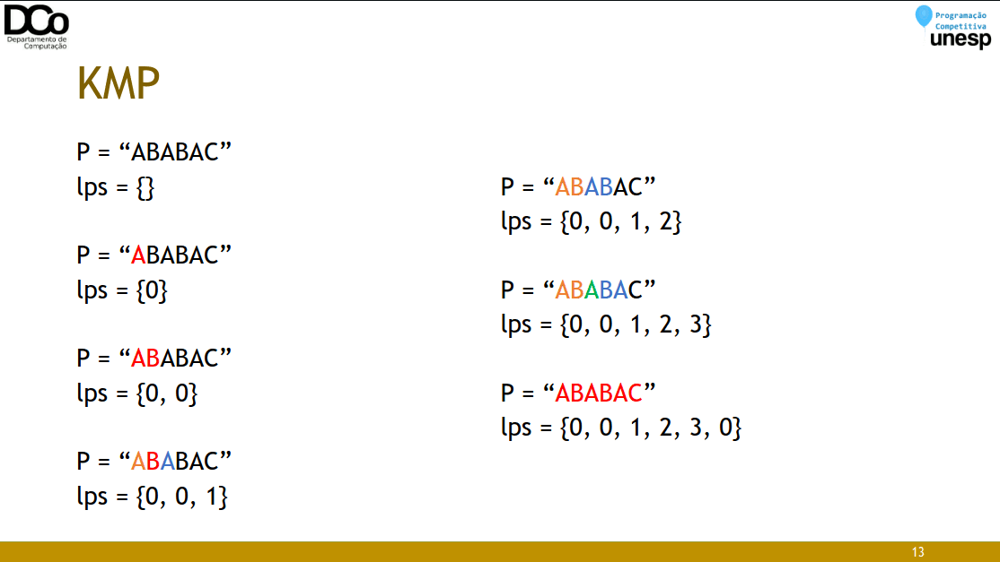
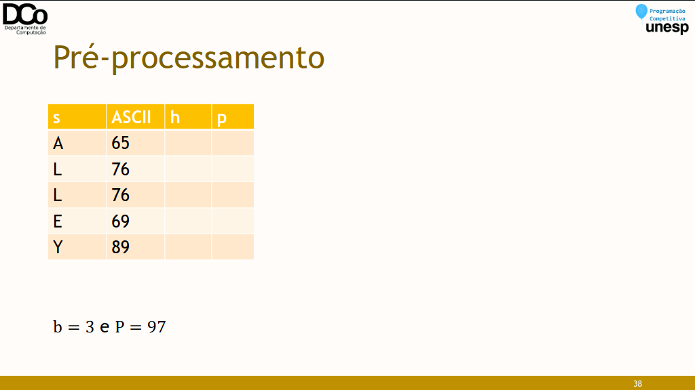
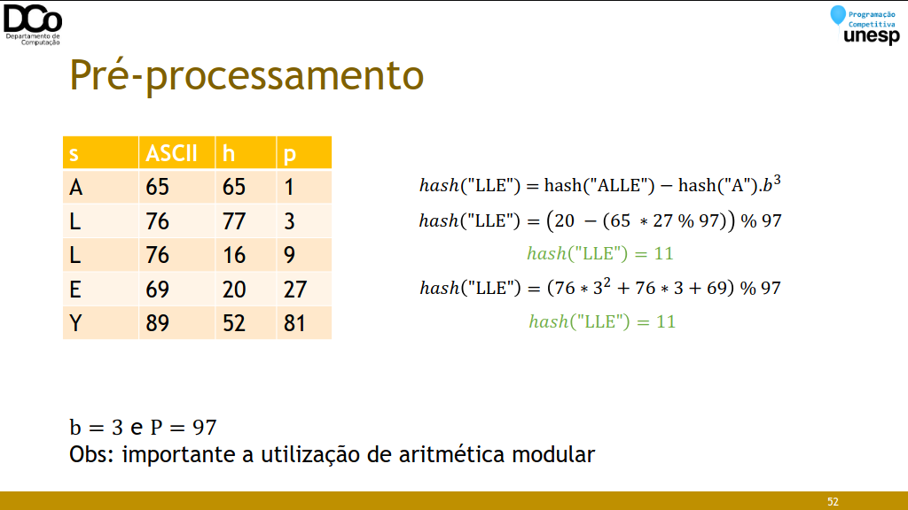

### Strings em Programação Competitiva
• Existem diversos problemas clássicos associados a Strings. Nesta aula
trataremos sobre dois problemas específicos:
• Busca em Strings / String matching
• Substrings palindrômicas

### Busca em strings
• O problema substring search/pattern search/string matching consiste
em encontrar uma dada string dentro de outra.
• Exemplo:
S = “Que a Força esteja com você”
P = “Força”
• O problema substring search ou pattern search consiste em encontrar
uma dada string dentro de outra.
• Exemplo:
S = “Que a **Força** esteja com você”
P = “Força”
Ocorrências: 6 (posição)

• O problema substring search ou pattern search consiste em encontrar
uma dada string dentro de outra.
• Exemplo:
S = “**aaba**acaadaabaaba”
S = “aabaacaad**aaba**aba”
S = “aabaacaadaab**aaba**”
P = “aaba”
Ocorrências: 0, 9 e 12

### Busca em strings
• O problema substring search ou pattern search consiste em encontrar
uma dada string dentro de outra.
• Exemplo:
S = “aabaacaadaab**aaba**”
P = “aaba”
Ocorrências: 0, 9 e 12
• Algoritmo ingênuo
``` C++
int search(string S, string P) {
    int i, j;
    for(i = 0; i <= S.size() - P.size(); i++) {
        for(j = 0; j < P.size(); j++)
            if (S[i+j] != P[j])
                break;
        if (j == P.size())
            return i;
    }
    return -1;
}
```

• Esse algoritmo, no pior caso, tem complexidade 𝑂(𝑚. 𝑛), fazendo 𝑚. 𝑛
comparações. Porém, em geral, ele não chega a realizar tantas
comparações.
• Usar esse algoritmo é bastante razoável para vários casos,
principalmente quando as strings não são muito grandes.
• Mas, existem algoritmos de busca de substrings mais eficientes, que
podem ser necessários em algumas situações, como exemplo temos o KMP

### Alguns conceitos
• Prefixo de uma string S é a string obtida após a remoção de 0 ou mais
caracteres do fim de S.
• “a”, “adc”, “adcbaa” são prefixos de “adcbaa”
• Sufixo de uma string S é a string obtida após a remoção de 0 ou mais
carateres do início de S.
• “a”, “baa”, “adcbaa” são sufixos de “adcbaa”
• Prefixo/sufixo próprio de S é um prefixo/sufixo de S que é diferente de
S.
• Substring de uma string S é uma string obtida após a remoção de 0 ou
mais caracteres no início ou no fim de S.
• “a”, “cba”, “adc”, “dcba”, “adcbaa” são substrings de “adcbaa”

### KMP
• Knuth Morrit Pratt
• Complexidade: 𝑂(𝑛 + 𝑚) no pior caso
• No algoritmo ingênuo, sempre que detectamos caracteres diferentes,
avançávamos um caracter na string principal (i++) e testamos toda a
substring, desde o começo (começando sempre com j = 0).
• O KMP, porém, aproveita as comparações que foram feitas antes de
encontrar dois caracteres diferentes, evitando comparar novamente
caracteres que já sabemos que são compatíveis.
• A principal ideia deste algoritmo é pré-processar o padrão P, de modo a
obter um vetor de inteiros lps, que conta o número de caracteres que
podem ser “ignorados” em uma nova comparação.
• O nome lps refere-se à “longest proper prefix and suffix”, ou seja, o
maior prefixo próprio (não pode ser a própria palavra) que também é
sufixo.
• Conhecido também como função de prefixo.

img1 - img11


``` C++
int a[MAX], n, m;
char S[MAX], P[MAX];
void calculatePrefix(){
    int i = 0, j = -1;
    a[0] = -1;
    while(i < m){
        while(j >= 0 && P[i] != P[j])
            j = a[j];
        i++; j++;
        a[i] = j;
    }
}

vector<int> KMP2(){ //retorna todas as ocorrências da substring
    vector<int> resp;
    int i = 0, j = 0;
    calculatePrefix();
    while(i < n){
        while(j >= 0 && S[i] != P[j])
            j = a[j];
        i++; j++;
        if (j == m){
            resp.push_back(i - m);
            j = a[j];
        }
    }
    return resp;
}
```

• Sugestão para entender mais sobre o KMP e suas aplicações:
• [Algoritmo de KMP | Vídeo do Bruno Monteiro](https://www.youtube.com/watch?v=RXISWaGmYW8)

### String Hashing
• Uma técnica bastante interessante e relativamente simples de se utilizar
é a de String Hashing.
• Primeiramente, vamos revisar, de forma muito intuitiva, o conceito de
Hashing.

### Hashing
• Podemos pensar em uma problema de busca da seguinte forma:
• Considere um conjunto de chaves 𝐾 e um conjunto de valores 𝑉, de
forma que cada chave 𝑘 está associada a um único valor 𝑣 (𝑚𝑎𝑝[𝑘] =
𝑣).
• Dado um valor 𝑐 qualquer, encontrar a chave 𝑘 a qual ele está
associado (pensando em um vetor, encontrar a posição em que ele se
encontra)
• O Hashing (tabela de dispersão) consiste em um método de cálculo de
endereço (de chave) a partir do valor, de forma que, no caso médio, a
chave pode ser encontrada em tempo constante.
• Exemplo: encontrar a posição em que um certo nome está armazenado.
• Complexidade:
• 𝑂(𝑛), se o vetor não estiver ordenado
• 𝑂(log 𝑛), usando busca binária em vetor ordenado


• Agora, suponha que tivéssemos uma “função mágica” que, dado um
nome, calcule em tempo constante exatamente a posição que ele
deveria ocupar nesse vetor.
• Essa é a ideia da função hash. Claro que na prática isto não é tão
simples, mas o nosso foco aqui é mais específico.


• De forma muito simplista, uma função hash nos gera um número que
identifica um dado qualquer (outro número, uma string, uma struct...)
• Idealmente, identifica unicamente, de forma que cada chave está
associada a apenas um valor. Na prática, podemos ter problema de
colisões.
• E o que isto nos ajuda com strings?
• Comparar duas substrings tem complexidade 𝑂(𝑛), sendo n o número
de caracteres.
• Mas, se calcularmos um hash dessas substrings, obteremos seus
“números de identificação”, que podem ser comparados em 𝑂(1).


• Na prática:
• Dada a(s) string(s) de entrada, realizaremos um pré-processamento
para o cálculo do hash (𝑂(𝑛)).
• A partir deste pré-processamento, podemos obter o hash de qualquer
substring em 𝑂(1).
• Com isso, a resolução de uma série de problemas terá uma grande
queda de complexidade, comparada com a solução por força bruta.
• Para calcular o hash de uma string qualquer, utilizaremos a técnica de
polynomial rolling. De forma que, dada uma string 𝑠 , o ℎ𝑎𝑠ℎ(𝑠) é
calculado da seguinte forma:


• em que 𝑃 é um número primo muito grande e 𝑏 uma constante aleatória
(normalmente um primo de valor próximo ao tamanho do alfabeto)
• A ideia é evitar colisões, mas não entraremos a fundo na fundamentação
probabilística deste problema.

• Exemplo: seja 𝑠 = “𝐴𝐿𝐿𝐸𝑌”, b = 3 e P = 97:


(65 × 3^4 + 76 × 3^3 + 76 × 3^2 + 69 × 3^1 + 89 ∗ 3^0) 𝑚𝑜𝑑 97 = 52
ℎ𝑎𝑠ℎ("ALLEY") = 52

### Pré-processamento
• Durante o pré-processamento de nossa substring, construiremos dois
vetores que serão importantes para o cálculo do hash de qualquer
substring:
• ℎ[𝑖] = armazena o hash do prefixo s[0...i]
• ℎ[0] = 𝑠[0]
• ℎ[𝑖] = (ℎ[𝑖 − 1] ∗ 𝑏 + 𝑠[𝑖]) 𝑚𝑜𝑑 𝑃
• 𝑝[𝑖] = armazena o coeficiente polinomial 𝑏𝑖 𝑚𝑜𝑑 𝑃
• 𝑝[0] = 1
• 𝑝[𝑖] = (𝑝[𝑖 − 1] ∗ 𝑏) 𝑚𝑜𝑑 𝑃

img17 - img29


• A partir das estruturas criadas no pré-processamento podemos obter o
hash de qualquer substring em tempo constante.
• Por exemplo, suponha que queremos o hash de “LLE” da substring
anterior, dado por ℎ𝑎𝑠ℎ “𝐿𝐿𝐸” = 𝐿. 𝑏2 + 𝐿. 𝑏 + 𝐸.
• Nós já temos calculados os seguintes hashs:
• ℎ 3 = ℎ𝑎𝑠ℎ “𝐴𝐿𝐿𝐸” = 𝐴. 𝑏3 + 𝐿. 𝑏2 + 𝐿. 𝑏 + 𝐸
• ℎ 0 = ℎ𝑎𝑠ℎ “𝐴” = 𝐴
• A partir destes podemos fazer a seguinte operação:
• ℎ𝑎𝑠ℎ("LLE") = hash("ALLE") − hash("A").𝑏3
= 𝐴. 𝑏3 + 𝐿. 𝑏2 + 𝐿. 𝑏 + 𝐸 − 𝐴.𝑏3



### Hash de substring
• A partir das estruturas criadas no pré-processamento podemos obter o
hash de qualquer substring em tempo constante.
• Generalizando:
ℎ𝑎𝑠ℎ 𝑆 [𝑙 … 𝑟] = (ℎ [𝑟] − ℎ [𝑙 − 1] ∗ 𝑝 [𝑟 − 𝑙 + 1] ) 𝑚𝑜𝑑 𝑃

#Complexidade do String Hashing
• Pré-processamento: 𝑂(𝑛)
• Consulta: 𝑂(1)

### Implementação
``` C++
mt19937 rng((int) chrono::steady_clock::now().time_since_epoch().count());
const ll P = 1e18+9;
const ll b = uniform_int_distribution<ll>(0, P-1)(rng);
inline ll mult(ll a, ll b, ll mod){
    return (a*b-(ll)((long double)a/mod*b)*mod + mod)%mod;
}

struct hash_str
{
    vector<ll> h, p;
    hash_str(string s) : h(s.size()), p(s.size()) {
        int n = s.size();
        h[0] = s[0] + 128;
        p[0] = 1;
        for(int i = 1; i < n; i++){
            h[i] = (mult(h[i-1],b,P) + s[i] + 128) % P;
            p[i] = mult(p[i-1],b,P);
        }
    }

    ll sub_hash(int l, int r){
        if (l == 0)
            return h[r];
        ll ans = (h[r] - mult(h[l-1], p[r-l+1],P)) % P;
        if (ans < 0)
            ans += P;
        return ans;
    }
};
```

### Busca em strings com String Hashing
• Dada uma string 𝑆, de tamanho 𝑛, como determinados se a string 𝑃, de
tamanho 𝑚, está presente em 𝑆?
• Calculamos o hash das duas strings, e então comparamos 𝑃 com todas as
substrings de tamanho 𝑚 de 𝑆. A ideia é semelhante a força bruta,
porém se torna eficiente devido ao uso do hashing.
• Algoritmo de Rabin-Karp

``` C++
hash_str hs(s), hp(p);
int ans = 0;
vector<int> pos;
int n = s.size(), m = p.size();
for(int i = 0; i <= n-m; i++){
    if (hs.sub_hash(i, i+m-1) == hp.sub_hash(0, m-1))
    {
        ans++;
        pos.push_back(i);
    }
}
```

• Complexidades:
• Força bruta: 𝑂(𝑛. 𝑚)
• KMP: 𝑂(𝑛 + 𝑚)
• String Hashing:
• Pré-processamento: 𝑂(𝑛 + 𝑚)
• Consulta: 𝑂(𝑛 − 𝑚)

### Exemplos de outros problemas
• Determinar a maior substring de 𝑃 que ocorre em 𝑆
• Busca binária no tamanho da substring. Procura todas as substrings de tamanho 𝑥 de 𝑃 em 𝑆.
• 𝑂(𝑛²log 𝑛)
• Determinar a quantidade de diferentes substrings de S.
• Para cada possível tamanho de substring cria um set e o povoe com o hash de todas
as substrings possíveis. Somando o tamanho dos sets teremos a quantidade de
diferentes substrings de 𝑆.
• 𝑂(𝑛²log 𝑛)
• Determinar a maior substring palindrômica de S.
• Backward hash: calcular o hash para a string invertida também.
• 𝑂(𝑛²)
• Utilizando algoritmo de Manacher (sem String Hashing): 𝑂(𝑛)

Cuidados
• O maior problema da técnica de String Hashing é a possibilidade da
ocorrência de colisões: quando duas strings diferentes resultam no
mesmo hash.
• Formas de diminuir a probabilidade de ocorrência:
• Utilização de valores adequados para os parâmetros 𝑏 e 𝑃.
• Duplo hashing.

Outras técnicas para lidar com Strings
• Existem diversas outras técnicas e estruturas que ajudam a lidar com
problemas de Strings, por exemplo:
• Para lidar com palíndromos:
• Algoritmo de Manacher
• Palindromic Tree
• Z-function
• String matching utilizando autômato finito
• Algoritmo de Aho-Corasick
• Trie
• Suffix Array
• Suffix Tree
• Autômato de Sufixos
• Fatorização de Lyndon / Algoritmo de Duval

### Referências
S. Halim e F. Halim. Competitive Programming 2.
Fábio L. Usberti. Processamento de Cadeias de Caracteres. Summer School 2019.
Rafael Grandsire. String Hashing. Summer School 2022.
https://www.youtube.com/watch?v=RXISWaGmYW8
https://cp-algorithms-brasil.com/strings/prefixo.html
https://www.geeksforgeeks.org/kmp-algorithm-for-pattern-searching/
https://www.ime.usp.br/~pf/estruturas-de-dados/aulas/kmp.html
http://www2.ic.uff.br/~boeres/slides_ed/ed_TabelaHash.pdf
https://usaco.guide/CPH.pdf
https://cp-algorithms.com/string/string-hashing.html
https://www.geeksforgeeks.org/string-hashing-using-polynomial-rolling-hash-function/
https://usaco.guide/gold/string-hashing?lang=cpp
