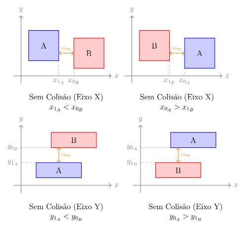
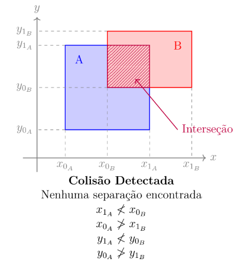
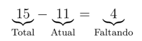
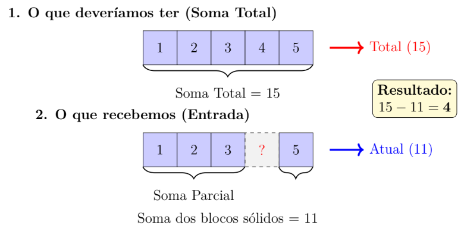
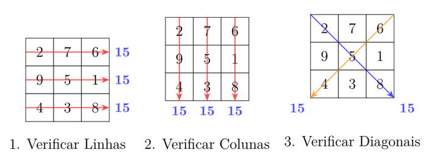

1 Detectando Colisões
Detecção de colisão é uma das operações mais comuns (e importantes) em jogos eletrônicos. O
objetivo, basicamente, é verificar se dois objetos quaisquer colidiram, ou seja, se a interseção entre
eles é diferente de vazio. Isso pode ser usado para saber se duas naves colidiram, se um monstro
bateu numa parede, se um personagem pegou um item, etc. Para facilitar as coisas, muitas vezes os
objetos são aproximados por figuras geométricas simples (esferas, paralelepípedos, triângulos etc).
Neste problema, os objetos são aproximados por retângulos num plano 2D.
Tarefa
Escreva um programa que, dados dois retângulos, determine se eles se interceptam ou não.
Entrada
A entrada contém um único conjunto de testes, que deve ser lido do dispositivo de entrada padrão
(normalmente o teclado). Cada caso de teste contém duas linhas. Cada linha contém quatro inteiros
(x0, y0, x1, y1, sendo 0 ≤ x0 < x1 ≤ 1.000.000 e 0 ≤ y0 < y1 ≤ 1.000.000) separados por um espaço
em branco representando um retângulo. Os lados do retângulo são sempre paralelos aos eixos x e y.
Saída
Seu programa deve imprimir, na saída padrão, uma única linha para cada caso de teste, contendo o
número 0 (zero) caso não haja interseção ou o número 1 (um) caso haja.

Entrada
0 0 1 1
0 0 1 1

Saída
1

Entrada
0 0 2 2
1 1 3 3

Saída
1

Entrada
0 0 1 1
2 2 3 3

Saída
0

Solução
O Conceito: A Lógica da “Não-Colisão”

Para resolver esse problema de forma eficiente, em vez de tentarmos calcular a área exata da inter-
seção, utilizamos uma técnica chamada AABB (Axis-Aligned Bounding Box).

A maneira mais fácil de saber se dois retângulos colidem é verificar se eles NÃO colidem. Se

conseguirmos provar que eles estão separados, então não há colisão. Caso contrário, eles obrigatori-
amente estão se tocando ou sobrepostos.

Imagine o Retângulo A e o Retângulo B. Eles não colidem apenas se uma das quatro condições
abaixo for verdadeira:
1. A está totalmente à esquerda de B.
2. A está totalmente à direita de B.
3. A está totalmente acima de B.
4. A está totalmente abaixo de B.
Se nenhuma dessas 4 afirmações for verdade, então os retângulos se interceptam.





Implementação em C

```c
#include <stdio.h>
#include <stdbool.h>

int main() {
// Variáveis para o primeiro retângulo (A)
int x0_A, y0_A, x1_A, y1_A;
// Variáveis para o segundo retângulo (B)
int x0_B, y0_B, x1_B, y1_B;

// Leitura do primeiro retângulo
scanf("%d %d %d %d", &x0_A, &y0_A, &x1_A, &y1_A);

// Leitura do segundo retângulo
scanf("%d %d %d %d", &x0_B, &y0_B, &x1_B, &y1_B);

bool esquerda = (x1_A < x0_B);
bool direita = (x0_A > x1_B);
bool abaixo = (y1_A < y0_B);
bool acima = (y0_A > y1_B);

if (esquerda || direita || abaixo || acima) {
// Se qualquer uma das condições acima for verdade, eles NÃO se tocam.
printf("0\n");
} else {
// Se eles não estão separados, então há colisão.
printf("1\n");
}

return 0;
}

```

2 Peça Perdida
Joãozinho adora quebra-cabeças, essa é sua brincadeira favorita. O grande problema, porém, é
que às vezes o jogo vem com uma peça faltando. Isso irrita bastante o pobre menino, que tem de
descobrir qual peça está faltando e solicitar uma peça de reposição ao fabricante do jogo. Sabendo
que o quebra-cabeças tem N peças, numeradas de 1 a N e que exatamente uma está faltando, ajude
Joãozinho a saber qual peça ele tem de pedir.
Tarefa
Escreva um programa que, dado um inteiro N e N − 1 inteiros numerados de 1 a N, descubra qual
inteiro está faltando.
Entrada
A entrada contém um único conjunto de testes, que deve ser lido do dispositivo de entrada padrão
(normalmente o teclado). A entrada contém 2 linhas. A primeira linha contém um inteiro N
(2 ≤ N ≤ 1.000). A segunda linha contém N − 1 inteiros numerados de 1 a N (sem repetições).
Saída
Seu programa deve imprimir, na saída padrão, uma única linha, contendo o número que está faltando
na sequência dada.

Entrada
3
3 1

Saída
2

Entrada
5
1 2 3 5

Saída
4

Entrada
4
2 4 3

Saída
1

Solução
O Conceito: Diferença de Somas
Para resolver esse problema, usamos o conceito de Diferença de Somas.
Imagine que você tem um quebra-cabeça de 5 peças (numeradas de 1 a 5). Se você somar o valor
de todas as etiquetas dessas peças, você terá:

1 + 2 + 3 + 4 + 5 = 15

Agora, digamos que o problema te dê as peças: 1, 3, 5, 2. Se somarmos o que temos na mão:

1 + 3 + 5 + 2 = 11

Para descobrir qual falta, não precisamos procurar uma por uma. Basta subtrair o total que
deveríamos ter pelo total que temos:



Logo, a peça que falta é a número 4.



Vantagens dessa abordagem:
1. Memória: Não precisamos armazenar os números em um vetor (array). Apenas somamos
conforme lemos. Isso economiza muita memória.
2. Velocidade: Fazemos o cálculo em uma única passada pelos dados (O(N)).

Implementação em C

```c
#include <stdio.h>

int main() {
int N;

// Leitura do número total de peças
if (scanf("%d", &N) != 1) return 0;

/ 1. Cálculo da Soma Esperada (Soma de PA)
// A soma de todos os números de 1 até N é dada pela fórmula: (N * (N + 1)) / 2
// Exemplo: se N=5, soma = (5*6)/2 = 15 (1+2+3+4+5)
int soma_total = (N * (N + 1)) / 2;

// 2. Cálculo da Soma Real (lendo a entrada)
int soma_atual = 0;
int peca;

// O problema diz que são fornecidos N-1 números
for (int i = 0; i < N - 1; i++) {
scanf("%d", &peca);
soma_atual += peca;
}

// 3. A peça que falta é a diferença
int peca_faltante = soma_total - soma_atual;

printf("%d\n", peca_faltante);

return 0;
}
```

3 Quadrado Mágico
Chama-se de quadrado mágico um arranjo, na forma de um quadrado, de N × N números inteiros
tal que todas as linhas, colunas e diagonais têm a mesma soma. Por exemplo, o quadrado abaixo

2 7 6
9 5 1
4 3 8

é um quadrado mágico de soma 15, pois todas as linhas (2 + 7 + 6 = 15, 9 + 5 + 1 = 15 e
4 + 3 + 8 = 15), colunas (2 + 9 + 4 = 15, 7 + 5 + 3 = 15 e 6 + 1 + 8 = 15) e diagonais (2 + 5 + 8 = 15
e 6 + 5 + 4 = 15) têm a mesma soma (15).
Tarefa
Escreva um programa que, dado um quadrado, determine se ele é mágico ou não e qual a soma dele
(caso seja mágico).
Entrada
A entrada contém um único conjunto de testes, que deve ser lido do dispositivo de entrada padrão
(normalmente o teclado). A primeira linha da entrada de cada caso de teste contém um inteiro N
(2 < N < 10). As N linhas seguintes contêm N inteiros cada, separados por exatamente um espaço
em branco. Os inteiros dentro do quadrado são todos maiores que 0 (zero) e menores que 1.000.
Saída
Seu programa deve imprimir, na saída padrão, uma única linha com um inteiro representando a soma
do quadrado mágico ou −1 caso o quadrado não seja mágico.

Entrada
3
2 7 6
9 5 1
4 3 8

Saída
15

Entrada
3
1 2 3
4 5 6
7 8 9

Saída
-1

Entrada
4
16 3 2 13
5 10 11 8
9 6 7 12
4 15 14 1

Saída
34

Solução
O Conceito: Manipulação de Matrizes
Esta é uma tarefa clássica de manipulação de matrizes (arrays bidimensionais). O segredo aqui não
é apenas somar, mas ter uma estratégia de comparação eficiente.
A Estratégia
Para determinar se um quadrado é mágico, precisamos seguir um roteiro estrito:
1. Definir a Referência: Calculamos a soma da primeira linha. Esse valor será nossa "Soma Mágica
Alvo" (S).
2. Validar Linhas: Verificamos se todas as outras linhas também somam S.
3. Validar Colunas: Verificamos se todas as colunas somam S.
4. Validar Diagonais: Verificamos se a diagonal principal e a diagonal secundária somam S.

Se qualquer uma dessas verificações falhar, imprimimos -1 e encerramos o programa imediata-
mente. Se o programa chegar ao final sem falhar, imprimimos o valor de S.



Implementação em C

```c
#include <stdio.h>

int main() {
int N;

// Leitura do tamanho do quadrado
if (scanf("%d", &N) != 1) return 0;

// Declaração da matriz
// Como N < 10, podemos declarar um tamanho estático seguro (10x10)
int mat[10][10];
Leitura dos dados da matriz
for (int i = 0; i < N; i++) {
for (int j = 0; j < N; j++) {
scanf("%d", &mat[i][j]);
}
}

// PASSO 1: Calcular a soma de referência (usando a primeira linha)
int soma_referencia = 0;
for (int j = 0; j < N; j++) {
soma_referencia += mat[0][j];
}

// PASSO 2: Verificar as Linhas
// Nota: podemos começar do i=1, pois a linha 0 já é a referência,
// mas checar i=0 de novo não tem custo alto e simplifica o código.
for (int i = 0; i < N; i++) {
int soma_atual = 0;
for (int j = 0; j < N; j++) {
soma_atual += mat[i][j];
}
if (soma_atual != soma_referencia) {
printf("-1\n");
return 0; // Encerra imediatamente
}
}

// PASSO 3: Verificar as Colunas
// Aqui invertemos os laços: fixamos a coluna (j) e variamos a linha (i)
for (int j = 0; j < N; j++) {
int soma_atual = 0;
for (int i = 0; i < N; i++) {
soma_atual += mat[i][j];
}
if (soma_atual != soma_referencia) {
printf("-1\n");
return 0;
}
}

// PASSO 4: Verificar Diagonal Principal
// Elementos onde linha == coluna (0,0), (1,1), (2,2)...
int soma_diag_princ = 0;
 (int i = 0; i < N; i++) {
soma_diag_princ += mat[i][i];
}
if (soma_diag_princ != soma_referencia) {
printf("-1\n");
return 0;
}

// PASSO 5: Verificar Diagonal Secundária
// Elementos onde a soma dos índices é N-1: (0, N-1), (1, N-2)...
int soma_diag_sec = 0;
for (int i = 0; i < N; i++) {
soma_diag_sec += mat[i][N - 1 - i];
}
if (soma_diag_sec != soma_referencia) {
printf("-1\n");
return 0;
}

// Se chegamos até aqui, o quadrado é mágico!
printf("%d\n", soma_referencia);

return 0;
}
```
