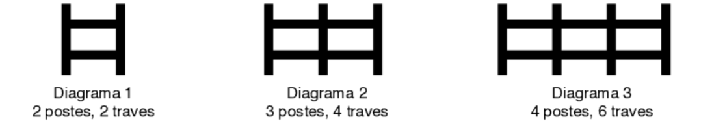
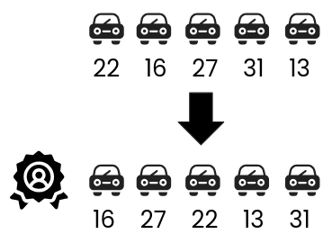
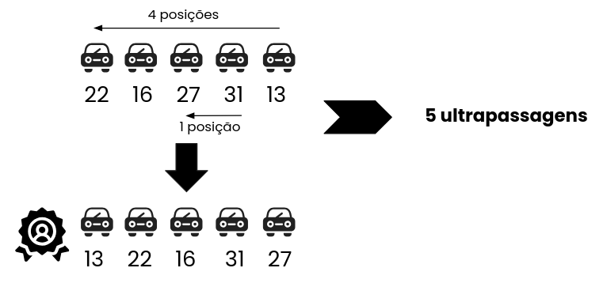
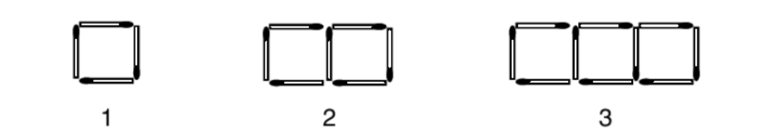
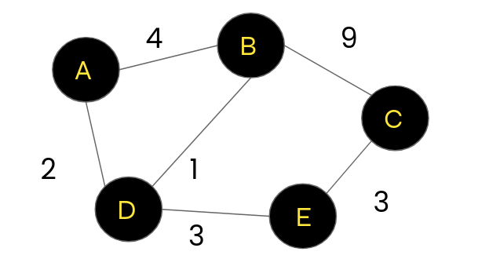

### 1 - Cerca de Madeira

Maria está construindo uma cerca com postes e traves de madeira, como nos diagramas abaixo. Cada trave tem um metro de comprimento. Vamos desconsiderar a largura dos postes, e dessa forma a cerca do diagrama 1 tem um metro de comprimento, a cerca do diagrama 2 tem dois metros de comprimento e a cerca do diagrama 3 tem três metros de comprimento. 

- Quantas traves terá uma cerca com seis postes?

Observe a seguinte figura que ilustra nosso problema:

Temos 5 espaços entre os postes para preencher, logo: 

5 espaços X 2 traves = 10 traves.

REDOBRE A ATENÇÃO!

O número de espaços disponíveis para adição de travas não é igual ao de postes.

- Se Maria tem exatamente 27 traves e 17 postes, quantos metros de comprimento tem a maior cerca ela pode construir? 

Observe que o número de traves limita o comprimento máximo da cerca:

Se 17 postes, teríamos que ter 32 traves.
Se 16 postes, teríamos que ter 30 traves.
Se 15 postes, teríamos que ter 28 traves.

Como temos 27 traves, a maior cerca que Maria pode ter é tem 14 postes, 26 traves, com 13 espaços e mede: 

13 postes x 1 metro = 13 metros

- Cada poste custa R$ 10,00 e cada trave custa R$ 5,00. Qual o custo de uma cerca com onze metros de comprimento? 

Se a cerca tem 11 metros, 11 espaços e é composta por 12 postes.

11 espaços x 2 travas x 5 = 110 
12 postes x 10 = 120

O custo de uma cerca com essas especificações é de R$ 230,00.

### 2 - Corrida Robótica

Uma nova modalidade de corrida de carros foi inaugurada, chamada de Fórmula R, para carros autônomos (carros sem motorista, dirigidos por robótica). Na primeira corrida participaram cinco carros, identificados por números, que iniciaram a corrida na seguinte ordem: 22 (primeiro colocado nos treinos), 16, 27, 31 e 13 (último colocado nos treinos). Uma ultrapassagem ocorre quando um carro passa na frente de um outro carro.

- A seguinte ordem de ultrapassagens ocorreu durante a primeira corrida: o carro 27 ultrapassou o carro 16; o carro 13 ultrapassou o carro 31; o carro 16 ultrapassou o carro 27; o carro 16 ultrapassou o carro 22; o carro 27 ultrapassou o carro 22, e então a corrida terminou. Apenas essas ultrapassagens aconteceram. Qual a ordem de chegada dos carros, do primeiro ao último colocado? 

- Na segunda corrida, os carros iniciaram na mesma ordem da primeira corrida (ou seja, 22, 16, 27, 31 e 13). Qual o menor número possível de ultrapassagens durante a segunda corrida, sabendo que os carros terminaram na ordem 13 (vencedor), 22, 16, 31 e 27 (último colocado)? 

### 3 - Quadrados

Observa-se um padrão: N x 4 lados - (N - 1) = P

- Quantos palitos são necessários para construir a linha que tem cinco quadrados?

Resolvendo a equação, temos 16 palitos.

- Quantos palitos são necessários para construir a linha com 21 quadrados? 

Resolvendo a equação, temos 64 palitos.

- Quantos quadrados tem a linha com o maior número de quadrados que é possível construir com uma caixa de palitos de fósforo que contém 42 palitos?

Substituindo P por 42, obtém-se 13 quadrados. 

N = nº de quadrados | P = Nº de palitos | N - 1 = lados comuns a dois quadrados

### 4 - Sessão de Cinema

Cinco amigas, Ana, Bia, Cris, Duda e Eva querem ir ao cinema, mas a sessão já está quase lotada. Sobraram apenas as cadeiras 1, 2, 3, 4 e 5, todas na primeira fila da platéia. Elas compraram os ingressos e agora vão decidir quem senta vizinho a quem. As seguintes restrições devem ser obedecidas:

- Ana não quer sentar-se numa cadeira vizinha à cadeira de Bia.
- Eva quer sentar-se numa cadeira vizinha à cadeira de Cris.
- Cris quer sentar-se ou na cadeira 1 ou na cadeira 5.

- Qual das seguintes alternativas é uma distribuição correta das amigas no cinema, da cadeira 1 à cadeira 5? 

A) Cris, Ana, Bia, Duda, Eva (Ana não senta ao lado de Bia)
B) Duda, Bia, Ana, Eva, Cris (Ana não senta ao lado de Bia)
C) Bia, Duda, Ana, Cris, Eva (Cris não está nas extremidades)
**D) Cris, Eva, Ana, Duda, Bia **
E) Eva, Cris, Ana, Duda, Bia (Cris não está nas extremidades)

- Qual das seguintes alternativas é sempre verdadeira?

**A) Ana ocupa uma cadeira vizinha à de Duda.**
B) Bia ocupa uma cadeira vizinha à de Eva.
C) Duda ocupa uma cadeira vizinha à de Eva.
D) Eva ocupa a cadeira 1.
E) Bia ocupa a cadeira 3. 

Cris e Eva sempre sentam nas extremidades e Ana não senta ao lado de Bia, logo sentará ao lado de Duda.

Se Bia ocupa a cadeira 5, qual das seguintes alternativas é sempre falsa? 

A) Eva ocupa a cadeira 2.
B) Ana ocupa uma cadeira vizinha à cadeira de Eva.
**C) Duda ocupa a cadeira 3.**
D) Ana ocupa a cadeira 3.
E) Bia ocupa uma cadeira vizinha à cadeira de Duda.

Nesse caso, obrigatoriamente, a ordem seria:

**Cris, Eva, Ana, Duda e Bia. **

Isso, porque Ana não se senta ao lado de Bia.

### 5 - Troco

No Brasil há notas de R$ 100, R$ 50, R$ 20, R$ 10, R$ 5 e R$ 2.

- Qual o menor número de notas que um comerciante pode dar como troco, usando apenas notas, para um cliente que deu três notas de R$ 100 para pagar uma mercadoria que custa R$ 201?

Troco = 300 - 201 = 99

99 - 50 = 49
49 - 20 = 29
29 - 20 = 9
9 - 5 = 4
4 - 2 = 2
2 - 2 = 0

Logo, é necessário 6 notas

- Qual o menor número de notas que um cliente pode usar para pagar uma mercadoria que custa R$ 201, usando apenas notas? 

201 - 100 = 101
101 - 50 = 51
51 - 20 = 31
31 - 20 = 11
11 - 2 = 9
9 - 2 = 7
7 - 2 = 5
5 - 5 = 0

Logo, é necessário 8 notas

### 6 - Viagens de Ônibus

Uma cidade tem exatamente cinco bairros: Areias, Brejo, Centro, Delta e Embu. Existem exatamente seis linhas de ônibus ligando os bairros, com os seguintes preços de passagens (o preço é o mesmo para a ida ou a volta): 

Centro – Brejo: R$ 9,00
Centro – Embu: R$ 3,00
Centro – Delta: R$ 1,00

Delta – Embu: R$ 3,00
Areias – Brejo: R$ 4,00
Areias – Delta: R$ 2,00z

- Qual o menor valor total em passagens para ir de ônibus de Embu para Brejo?

E – D – A – B = **R$ 9,00**

- Aos domingos o preço da passagem Centro – Brejo é promocional e custa metade do preço normal. Nesse caso, qual o menor valor em passagens para ir de ônibus de Brejo para Delta?

B - C - D = **R$ 5,50**
