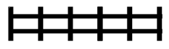

### 1 - Cerca de Madeira

Maria está construindo uma cerca com postes e traves de madeira, como nos diagramas abaixo. Cada trave tem um metro de comprimento. Vamos desconsiderar a largura dos postes, e dessa forma a cerca do diagrama 1 tem um metro de comprimento, a cerca do diagrama 2 tem dois metros de comprimento e a cerca do diagrama 3 tem três metros de comprimento. 


- Quantas traves terá uma cerca com seis postes?

Observe a seguinte figura que ilustra nosso problema:



Temos 5 espaços entre os postes para preencher, logo: 

5 espaços X 2 traves = 10 traves.

REDOBRE A ATENÇÃO!

O número de espaços disponíveis para adição de travas não é igual ao de postes.

- Se Maria tem exatamente 27 traves e 17 postes, quantos metros de comprimento tem a maior cerca ela pode construir? 

Observe que o número de traves limita o comprimento máximo da cerca:

Se 17 postes, teríamos que ter 32 traves.

Se 16 postes, teríamos que ter 30 traves.

Se 15 postes, teríamos que ter 28 traves.

Como temos 27 traves, a maior cerca que Maria pode ter é tem 14 postes, 26 traves, com 13 espaços e mede: 

13 postes x 1 metro = 13 metros

- Cada poste custa R$ 10,00 e cada trave custa R$ 5,00. Qual o custo de uma cerca com onze metros de comprimento? 

Se a cerca tem 11 metros, 11 espaços e é composta por 12 postes.

11 espaços x 2 travas x 5 = 110 

12 postes x 10 = 120

O custo de uma cerca com essas especificações é de R$ 230,00.

### 2 - Corrida Robótica

Uma nova modalidade de corrida de carros foi inaugurada, chamada de Fórmula R, para carros autônomos (carros sem motorista, dirigidos por robótica). Na primeira corrida participaram cinco carros, identificados por números, que iniciaram a corrida na seguinte ordem: 22 (primeiro colocado nos treinos), 16, 27, 31 e 13 (último colocado nos treinos). Uma ultrapassagem ocorre quando um carro passa na frente de um outro carro.

- A seguinte ordem de ultrapassagens ocorreu durante a primeira corrida: o carro 27 ultrapassou o carro 16; o carro 13 ultrapassou o carro 31; o carro 16 ultrapassou o carro 27; o carro 16 ultrapassou o carro 22; o carro 27 ultrapassou o carro 22, e então a corrida terminou. Apenas essas ultrapassagens aconteceram. Qual a ordem de chegada dos carros, do primeiro ao último colocado? 


- Na segunda corrida, os carros iniciaram na mesma ordem da primeira corrida (ou seja, 22, 16, 27, 31 e 13). Qual o menor número possível de ultrapassagens durante a segunda corrida, sabendo que os carros terminaram na ordem 13 (vencedor), 22, 16, 31 e 27 (último colocado)? 


### 3 - Quadrados


Observa-se um padrão: N x 4 lados - (N - 1) = P

- Quantos palitos são necessários para construir a linha que tem cinco quadrados?

Resolvendo a equação, temos 16 palitos.

- Quantos palitos são necessários para construir a linha com 21 quadrados? 

Resolvendo a equação, temos 64 palitos.

- Quantos quadrados tem a linha com o maior número de quadrados que é possível construir com uma caixa de palitos de fósforo que contém 42 palitos?

Substituindo P por 42, obtém-se 13 quadrados. 

N = nº de quadrados | P = Nº de palitos | N - 1 = lados comuns a dois quadrados

### 4 - Sessão de Cinema

Cinco amigas, Ana, Bia, Cris, Duda e Eva querem ir ao cinema, mas a sessão já está quase lotada. Sobraram apenas as cadeiras 1, 2, 3, 4 e 5, todas na primeira fila da platéia. Elas compraram os ingressos e agora vão decidir quem senta vizinho a quem. As seguintes restrições devem ser obedecidas:

- Ana não quer sentar-se numa cadeira vizinha à cadeira de Bia.
- Eva quer sentar-se numa cadeira vizinha à cadeira de Cris.
- Cris quer sentar-se ou na cadeira 1 ou na cadeira 5.

- Qual das seguintes alternativas é uma distribuição correta das amigas no cinema, da cadeira 1 à cadeira 5? 

A) Cris, Ana, Bia, Duda, Eva (Ana não senta ao lado de Bia)

B) Duda, Bia, Ana, Eva, Cris (Ana não senta ao lado de Bia)

C) Bia, Duda, Ana, Cris, Eva (Cris não está nas extremidades)

**D) Cris, Eva, Ana, Duda, Bia **

E) Eva, Cris, Ana, Duda, Bia (Cris não está nas extremidades)

- Qual das seguintes alternativas é sempre verdadeira?

**A) Ana ocupa uma cadeira vizinha à de Duda.**

B) Bia ocupa uma cadeira vizinha à de Eva.

C) Duda ocupa uma cadeira vizinha à de Eva.

D) Eva ocupa a cadeira 1.

E) Bia ocupa a cadeira 3. 

Cris e Eva sempre sentam nas extremidades e Ana não senta ao lado de Bia, logo sentará ao lado de Duda.

Se Bia ocupa a cadeira 5, qual das seguintes alternativas é sempre falsa? 

A) Eva ocupa a cadeira 2.

B) Ana ocupa uma cadeira vizinha à cadeira de Eva.

**C) Duda ocupa a cadeira 3.**

D) Ana ocupa a cadeira 3.

E) Bia ocupa uma cadeira vizinha à cadeira de Duda.

Nesse caso, obrigatoriamente, a ordem seria:

**Cris, Eva, Ana, Duda e Bia. **

Isso, porque Ana não se senta ao lado de Bia.

### 5 - Troco

No Brasil há notas de R$ 100, R$ 50, R$ 20, R$ 10, R$ 5 e R$ 2.

- Qual o menor número de notas que um comerciante pode dar como troco, usando apenas notas, para um cliente que deu três notas de R$ 100 para pagar uma mercadoria que custa R$ 201?

Troco = 300 - 201 = 99

99 - 50 = 49

49 - 20 = 29

29 - 20 = 9

9 - 5 = 4

4 - 2 = 2

2 - 2 = 0

Logo, é necessário 6 notas

- Qual o menor número de notas que um cliente pode usar para pagar uma mercadoria que custa R$ 201, usando apenas notas? 

201 - 100 = 101

101 - 50 = 51

51 - 20 = 31

31 - 20 = 11

11 - 2 = 9

9 - 2 = 7

7 - 2 = 5

5 - 5 = 0

Logo, é necessário 8 notas

### 6 - Viagens de Ônibus

Uma cidade tem exatamente cinco bairros: Areias, Brejo, Centro, Delta e Embu. Existem exatamente seis linhas de ônibus ligando os bairros, com os seguintes preços de passagens (o preço é o mesmo para a ida ou a volta): 

Centro – Brejo: R$ 9,00

Centro – Embu: R$ 3,00

Centro – Delta: R$ 1,00

Delta – Embu: R$ 3,00

Areias – Brejo: R$ 4,00

Areias – Delta: R$ 2,00z


- Qual o menor valor total em passagens para ir de ônibus de Embu para Brejo?

E – D – A – B = **R$ 9,00**

- Aos domingos o preço da passagem Centro – Brejo é promocional e custa metade do preço normal. Nesse caso, qual o menor valor em passagens para ir de ônibus de Brejo para Delta?

B - C - D = **R$ 5,50**

### Pirâmide
No dep ́osito da f ́abrica, existe uma matriz de N × N caixas, cada uma com um peso. O inspetor
precisa retirar caixas para deixar uma pirˆamide que satisfa ̧ca:

1. Se uma caixa est ́a na pirˆamide, a caixa imediatamente abaixo dela tamb ́em deve estar (gravi-
dade).

2. A linha i (contando de cima para baixo, come ̧cando em 1) deve ter exatamente i caixas con-
secutivas.

Isso implica que a pirˆamide tem largura 1 na primeira linha, largura 2 na segunda, ..., e largura
N na  ́ultima linha. Al ́em disso, o intervalo de caixas na linha i deve estar ”apoiado” sobre o intervalo
da linha i + 1. Ou, visto de outra forma, o intervalo da linha i deve conter o intervalo da linha i − 1.

O objetivo  ́e encontrar o **peso total m ́ınimo** de tal pirˆamide.

### Entrada
A primeira linha cont ́em um inteiro N (1 ≤ N ≤ 100). As N linhas seguintes contˆem N inteiros
cada, representando os pesos.

### Sa ́ıda
Um inteiro indicando o peso total m ́ınimo.

#### Restri ̧c ̃oes

- 1 ≤ N ≤ 100
- Pesos entre 1 e 100.

### Entrada
3
5 2 4
3 6 7
10 5 10

### Saída
36

### Entrada
4
45 8 3 1
1 10 5 67
4 4 3 18
10 4 7 12

### Saída
62

### Solu ̧c ̃ao
Para resolver este problema de forma otimizada e evitar o ”Time Limit Exceeded” (TLE), utilizamos
Programa ̧c ̃ao Dinˆamica com otimiza ̧c ̃ao de mem ́oria e ”Sliding Window” (Janela Deslizante).

Defini ̧c ̃ao da DP: Seja DP[j] o menor custo para construir uma pirˆamide cuja base est ́a na
linha atual e come ̧ca na coluna j. Para calcular a linha i (que tem largura i + 1), usamos os valores
da linha anterior (i − 1, que tinha largura i).

A recorrˆencia  ́e:

- DPatual[j] = SomaIntervalo(i, j) + min(DPanterior[j], DPanterior[j + 1])

Isso porque a base na linha i (intervalo [j, j + i]) deve sustentar a pirˆamide de cima, que pode
estar deslocada para a esquerda ([j, j + i − 1]) ou direita ([j + 1, j + i]).

Otimiza ̧c ̃oes de Performance:

1. Janela Deslizante: N ̃ao recalculamos a soma do intervalo do zero. Ao mover de j para j + 1,
subtra ́ımos o elemento que saiu da janela (M[i][j − 1]) e somamos o que entrou (M[i][j +
largura − 1]).

2. Arrays Planos: Usamos Int32Array unidimensionais para evitar o overhead de objetos Array
do JavaScript.

### C ́odigo em JavaScript (Ultra Otimizado):
```js
const fs = require (’fs ’) ;

// Leitura otimizada do buffer
const buffer = fs . readFileSync (0) ;
let bufferIdx = 0;

function readInt () {
    let res = 0;
    // Pula espacos
    while ( bufferIdx < buffer . length && buffer [ bufferIdx ] <= 32) bufferIdx ++;
    if ( bufferIdx >= buffer . length ) return null ;
    // Le numero
    while ( bufferIdx < buffer . length && buffer [ bufferIdx ] > 32) {
        res = res * 10 + ( buffer [ bufferIdx ++] - 48) ;
    }
    return res ;
}

function solve () {
    const valN = readInt () ;
    if ( valN === null ) return ;
    const N = valN ;
    
    // 1. Armazenar a matriz em um array plano ( flat )
    // Acesso : matrix [row * N + col ]
    const matrix = new Int32Array ( N * N ) ;
    for ( let k = 0; k < N * N ; k ++) {
        matrix [ k ] = readInt () ;
    }

    // 2. Arrays para DP
    // Precisamos apenas da linha anterior e da atual
    let prevDP = new Int32Array ( N ) ;
    let currDP = new Int32Array ( N ) ;

    // Caso base : Linha 0 ( Topo da piramide )
    // Na linha 0 , a largura eh 1. O custo eh o proprio valor .
    // Copiamos a primeira linha da matriz para o prevDP
    for ( let j = 0; j < N ; j ++) {
        prevDP [ j ] = matrix [ j ]; // matrix [0 * N + j]
    }

    // 3. Iteracao de baixo para cima (ou melhor , crescendo a piramide descendo
    linhas )
    // i = indice da linha atual ( comecando da 1 ate N -1)
    // width = largura da piramide nessa linha (i + 1)
    for ( let i = 1; i < N ; i ++) {
        const width = i + 1;
        const rowOffset = i * N ;
        const limit = N - width ; // Ate onde o ’j’ pode ir
        
        // Inicializa a soma da primeira janela deslizante (j=0)
        // Intervalo [0 , width -1] na linha atual
        let currentSum = 0;
        for ( let k = 0; k < width ; k ++) {
            currentSum += matrix [ rowOffset + k ];
        }

        // Calcula DP para j=0
        // min( prevDP [0] , prevDP [1])
        const minTopFirst = ( prevDP [0] < prevDP [1]) ? prevDP [0] : prevDP [1];
        currDP [0] = currentSum + minTopFirst ;

        // Desliza a janela para os proximos j
        for ( let j = 1; j <= limit ; j ++) {
            // Atualiza soma : Tira o elemento anterior (j -1) , poe o novo (j +
            th - 1)
            const valOut = matrix [ rowOffset + ( j - 1) ];
            const valIn = matrix [ rowOffset + ( j + width - 1) ];
            currentSum = currentSum - valOut + valIn ;
            
            // Encontra o minimo da linha anterior
            // O topo pode estar em ’j’ ou ’j+1 ’
            const p1 = prevDP [ j ];
            const p2 = prevDP [ j +1];
            const minTop = ( p1 < p2 ) ? p1 : p2 ;
            
            currDP [ j ] = currentSum + minTop ;
        }

        // Troca os arrays ( prev vira curr ) para a proxima iteracao
        // Em vez de criar novo array , apenas trocamos as referencias e
        tilizamos
        const temp = prevDP ;
        prevDP = currDP ;
        currDP = temp ;
    }

    // O resultado final eh a unica posicao possivel na ultima linha
    // Na ultima linha (N -1) , width = N, entao so cabe em j=0.
    // O valor esta em prevDP [0] ( pois trocamos no final do loop )
    console . log ( prevDP [0]) ;
}

solve();
```
