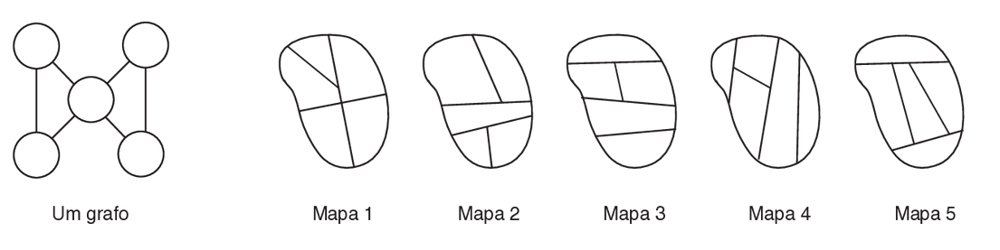

### Academia de Cachorros

A Academia de Polícia acabou de receber cinco novos cachorrinhos para treinar, que ganharam os nomes Bolinha, Careta, Dengoso, Pipoca e Xereta. A Academia de Polícia tem cinco treinadores de cachorros disponíveis, todos muito experientes: os Tenentes Guto, Heitor, Ida, Júlia e Kevin. Cada treinador vai ser responsável por exatamente um novo cachorrinho, e as seguintes condições devem ser obedecidas.

- Ida pode treinar somente Dengoso ou Careta.
- Júlia não pode treinar Dengoso.
- Guto pode treinar somente Careta ou Xereta.
- Kevin pode treinar qualquer cachorrinho, mas se Heitor treinar Bolinha, Kevin treinará Careta.

- Qual das opções abaixo é uma atribuição válida de cachorrinhos a treinadores?

A) Bolinha: Guto, Careta: Júlia, Dengoso: Kevin, Pipoca: Ida, Xereta: Heitor.

**B) Bolinha: Kevin, Careta: Guto, Dengoso: Ida, Pipoca: Heitor, Xereta: Júlia.**

C) Bolinha: Heitor, Careta: Kevin, Dengoso: Guto, Pipoca: Ida, Xereta: Júlia

D) Bolinha: Heitor, Careta: Kevin, Dengoso: Ida, Pipoca: Guto, Xereta: Júlia

E) Bolinha: Heitor, Careta: Ida, Dengoso: Guto, Pipoca: Júlia, Xereta: Kevin 

Se Guto treina Careta, Ida tem que treinar Dengoso, que não pode ser treinado por Júlia. O restante dos treinadores não têm nenhuma restrição logo a distribuição se encontra correta.

- Se Heitor treinar Bolinha, então qual das alternativas abaixo são cachorrinhos que Ida pode escolher para treinar?

A) Careta e Xereta

B) Somente Careta

C) Dengoso e Pipoca

**D) Somente Dengoso**

E) Careta e Pipoca

Se Heitor treina Bolinha, Kevin treina Careta o que deixa Ida com apenas uma de suas duas opções: Dengoso.

- Se Kevin treinar Bolinha, então qual das alternativas abaixo são cachorrinhos que Ida pode escolher para treinar

**A) Careta e Dengoso**

B) Somente Dengoso

C) Careta e Xereta

D) Careta, Pipoca e Xereta

E) Careta, Dengoso e Pipoca

- Se Heitor treinar Dengoso, então qual das alternativas abaixo são cachorrinhos que Kevin pode escolher para treinar?

**A) Bolinha e Pipoca**

B) Somente Xereta

C) Careta e Xereta

D) Somente Careta

E) Bolinha, Careta, Pipoca e Xereta

- Se Kevin treinar Xereta, quem treinará Bolinha?

A) Guto

B) Heitor

C) Ida

**D) Júlia**

E) Kevin

### 2 - Grafos

Em computação um grafo é uma estrutura composta de vértices (mostrados como círculos na figura abaixo) e arestas (mostradas como linhas que conectam os círculos). Grafos são utilizados para modelar uma infinidade de situações na vida real como rodovias que existem entre cidades ou pessoas que se conhecem. Grafos podem também ser usados para modelar as divisas entre estados de um país, usando vértices para representar os estados e arestas para indicar se um determinado estado tem divisa geográfica com outro estado: se um estado A tem divisa com outro estado B ligamos os dois vértices que representam os estados A e B com uma aresta.

- A figura abaixo à esquerda mostra um grafo que representa as divisas entre estados de um país que tem cinco estados; a figura abaixo à direita mostra cinco mapas. 

Na figura acima, o grafo à esquerda representa as divisas entre estados de qual dos mapas? 

- O mapa correspondente deve ter um estado que tenha divisa com outros 4 estados e outros que tenham exatamente 2 vizinhos. Isso está representado em: Mapa 2

- No grafo da figura abaixo os vértices representam os bairros de uma cidade (bairros são identificados por letras). Cada aresta indica que o par de bairros ligados pela aresta são vizinhos geográficos (ou seja, fazem divisa um com o outro). Como o povo da cidade é fanático por voleibol, a prefeitura decidiu construir ginásios de voleibol em alguns bairros, mas com a seguinte restrição: se um ginásio de voleibol é construído em um determinado bairro, em nenhum bairro que seja vizinho (que tenha divisa) com esse bairro um outro ginásio de voleibol será construído. Por exemplo, se um ginásio for construído na cidade A, nenhum ginásio será construído nas cidades B, E ou C.

Qual das alternativas seguintes é uma lista correta de cidades em que um ginásio de voleibol pode ser construído, considerando em cada cidade da lista será construído um ginásio de voleibol?

A) A, F, H 

B) A, C, E, H 

**C) B, C, E, H (Não existem vizinhos)**

D) B, C, F, G

E) B, C, G 

### 03 - Montanha Russa

Seis amigas – Alice, Bela, Cláudia, Dora, Eda e Flora – estão na fila da montanha-russa de um parque de diversões. O carrinho do brinquedo tem seis lugares, com três filas (frente, meio e trás) de duas cadeiras cada, com os lugares numerados como indicado na figura abaixo.

Para sentar no carrinho as amigas irão obedecer às seguintes restrições.

- Cláudia quer sentar na fila da frente.
- Eda não quer sentar na mesma fila que Cláudia, nem na mesma fila que Bela.
- Alice não quer sentar na mesma fila que Bela.
- Bela quer sentar na fila do meio.

- Qual das seguintes alternativas é um arranjo correto de lugares para as amigas, da cadeira 1 à cadeira 6?

A) Eda, Dora, Bela, Flora, Cláudia, Alice

B) Cláudia, Eda, Bela, Dora, Flora, Alice

**C) Cláudia, Dora, Bela, Flora, Eda, Alice**

D) Dora, Cláudia, Eda, Alice, Bela, Flora

E) Flora, Cláudia, Bela, Alice, Eda, Dora

-  Qual das seguintes alternativas não pode ser verdadeira?

A) Flora senta na cadeira 6

B) Alice senta na cadeira 6.

**C) Alice senta na fila do meio.**

D) Alice senta na fila da frente.

E) Alice senta na cadeira 2.

- Se Flora senta na cadeira 2, qual das seguintes alternativas é sempre verdadeira?

A) Alice senta na cadeira 5.

B) Alice senta na cadeira 4.

C) Alice senta na fila do meio.

**D) Dora senta na fila do meio.**

E) Dora senta na fila de trás.

- Se Bia ocupa a cadeira 5, qual das seguintes alternativas é sempre falsa? 

A) Eva ocupa a cadeira 2.

B) Ana ocupa uma cadeira vizinha à cadeira de Eva.

**C) Duda ocupa a cadeira 3.**

D) Ana ocupa a cadeira 3.

E) Bia ocupa uma cadeira vizinha à cadeira de Duda.

Nesse caso, obrigatoriamente, a ordem seria:

**Cris, Eva, Ana, Duda e Bia.**

Isso, porque Ana não se senta ao lado de Bia.

### 4 - Números em Bitlândia

No reino de Bitlândia os números são representados por símbolos. Cada símbolo é um quadrado dividido em quatro partes, em que cada parte pode ser branca ou preta, e cada parte representa uma quantidade que depende de sua posição no quadrado, como ilustra a figura abaixo. O valor do símbolo é a soma do valor de suas quatro partes. 

- Qual o maior valor que um símbolo pode representar?
O maior número é representado quando todos os quadrados são pretos, logo 15. 

- Qual o valor que o símbolo abaixo representa?

Representa 4 + 2 = 6.

Qual das seguintes expressões NÃO está correta? 

A) 

B) 

C) 

**D)** 

E) 

### 5 - Números Triangulares 

Números triangulares são definidos da seguinte forma:

- Qual é o próximo número triangular?

Seguindo a lógica e adicionando um círculo a cada linha, o próximo número triangular é o 10.

### 6 - Pilha de Latas

João trabalha no supermercado, e seu gerente pediu que ele empilhasse latas de ervilhas como na figura ao lado.

Quantas latas são necessárias para construir uma pilha de latas no formato acima que tenha a altura de seis latas? 

1 + 2 + 3 + 4 + 5 + 6 = **21**

Se cada lata de ervilha custa R$ 3,00, qual o valor que um cliente deve pagar para comprar todas as latas em uma pilha de latas no formato acima cuja primeira fileira tenha 10 latas?

21 + 7 + 8 + 9 + 10 = 55 x 3 = **R$165,00**

### 7 - Quadrado Mágico

Em um Quadrado Mágico, a soma de qualquer coluna, linha ou diagonal tem sempre o mesmo valor.

- A figura abaixo mostra um Quadrado Mágico preenchido com exatamente um número errado. O que devemos fazer para consertar o Quadrado Mágico?

**A) Colocar o valor 4 no lugar do valor 3. →**

B) Colocar o valor 9 no lugar do valor 8.

C) Colocar o valor 10 no lugar do valor 8.

D) Colocar o valor 12 no lugar do valor 11.

E) Colocar o valor 13 no lugar do valor 12. 

**Coluna e linha somavam 23, com essa mudança somam 24 como as outras.**

### 8 - Rodoviária

Da nova rodoviária irão partir, diariamente, exatamente sete ônibus, identificados como A, B, C, D, E, F e G. Para não incomodar os moradores da vizinhança, os ônibus devem partir com um intervalo de uma hora, nos horários 6:00, 7:00, 8:00, 9:00, 10:00, 11:00 e 12:00. Adicionalmente, as seguintes restrições devem ser obedecidas:

- O ônibus A deve partir às 6:00.
- O ônibus E deve partir após o ônibus C e também após o ônibus B.
- Os ônibus D, F e G devem partir em horários consecutivos (ou seja, em sequência), nessa ordem.

- Se o ônibus G partir às 9:00, a partida do ônibus E deve ser:

A) 7:00

B) 8:00

C) 10:00

D) 11:00

E) 12:00

- Se os ônibus C e D partirem respectivamente às 8:00 e 9:00, a partida do ônibus B deve ser:

A) 6:00

B) 7:00

C) 10:00

D) 11:00

E) 12:00

- Qual das seguintes alternativas lista três ônibus que podem ter suas partidas em horários consecutivos (ou seja, em sequência), na ordem dada?

A) A, D, C

B) B, C, F

C) D, E, F

D) F, G, C

E) F, G, D

- Se o ônibus F partir às 11:00, o ônibus E deve partir às:

A) 7:00

B) 8:00

C) 9:00

D) 10:00

E) 11:00

- Qual das seguintes afirmações é necessariamente verdadeira

A) o ônibus C parte após o ônibus B.

B) o ônibus D parte após o ônibus C.

C) o ônibus E parte após o ônibus D.

D) o ônibus F parte após o ônibus E.

E) o ônibus G parte após o ônibus F. 

- Qual das seguintes alternativas lista três ônibus que podem ter suas partidas em horários consecutivos (ou seja, em sequência), na ordem dada?

A) 7:00

B) 8:00

C) 9:00

D) 10:00

E) 11:00

### 9 - Sequência comum

- Observe estas duas sequências de números:

8, 11, 14, 17, 20, … Continuando:  23, 26, **29**

1, 5, 9, 13, 17, … Continuando:  21, 25, **29**

O primeiro número que aparece nas duas sequências é 17. Qual é o segundo número que aparece nas duas sequências?

A) 28

**B) 29**

C) 30

D) 31

E) 32
