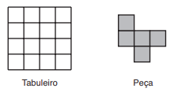
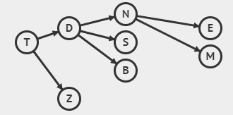
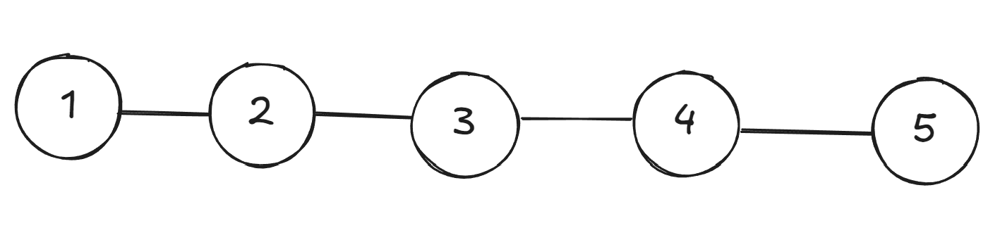
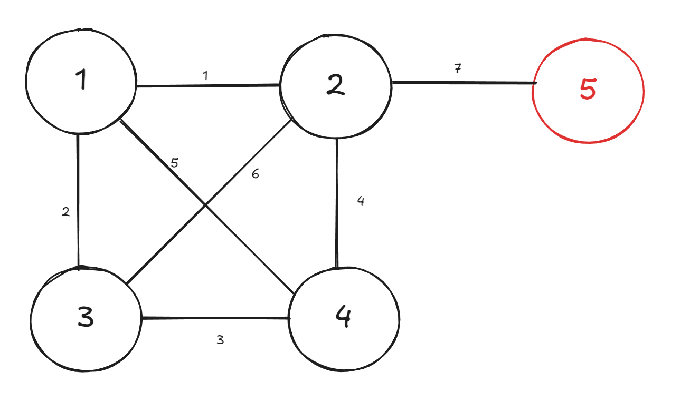

## Questões

### Cobrindo o tabuleiro
Considere o tabuleiro de 4 × 4 posições e a peça mostrada na figura ao lado. Você deve cobrir todo o tabuleiro com cópias da peça, que pode ser girada. Você pode cobrir uma posição do tabuleiro com mais de uma peça (sobreposição de peças), e um pedaço da peça pode não cobrir qualquer posição (pedaço de peça para fora do tabuleiro), mas cada posição do tabuleiro deve ser coberta por pelo menos uma peça.

**Questão 1:** Qual o menor número de peças necessárias para cobrir todo o tabuleiro, nas condições acima?

( A ) 3

( B ) 4

( C ) 5

( D ) 6

( E ) 7

### Paciente Zero
Numa epidemia por um novo tipo de vírus, uma das tarefas mais importantes dos médicos infectologistas é determinar quem foi o Paciente Zero, ou seja, a pessoa que foi infectada primeiro pelo novo vírus. O Paciente Zero geralmente é infectado por um animal (morcego, por exemplo). Dizemos que a pessoa X foi infectada diretamente pela pessoa Y quando X teve contato com Y. Dizemos que X foi infectada indiretamente por Y quando X não teve contato com Y, mas teve contato com uma pessoa que Y infectou, direta ou indiretamente. Numa recente epidemia no reino da Nlogônia, os médicos determinaram que:

- Duda infectou diretamente Neco e Sula
- Elba foi infectada diretamente por Neco
- Teco infectou diretamente Zico e Duda
- Bia foi infectada diretamente por Duda
- Neco infectou diretamente Mano

**Questão 2:** Qual das alternativas seguintes é apessoa que foi o Paciente Zero?

( A ) Duda

( B ) Elba

( C ) Teco

( D ) Zico

( E ) Neco

**Questão 3:** Qual das alternativas seguintes é a pessoa que infectou diretamente o maior número pessoas?

( A ) Teco

( B ) Bia

( C ) Neco

( D ) Mano

( E ) Duda

### Novas Estradas
O rei na Nlgônia decidiu povoar uma ilha inabitada do reino, construindo na ilha cinco novas cidades. O rei quer construir estradas entre as cinco cidades. Duas cidades são consideradas desconectadas se não houver caminho formado por estradas entre elas. Por exemplo, se houver uma estrada ligando a cidade A à cidade B e outra estrada ligando a cidade B à cidade C, então a cidade A está conectada à cidade C, pois é possível ir de A para C passando pela cidade B. O rei tem o seguinte plano: enquanto houver um par de cidades desconectadas, serão sorteadas duas cidades da ilha; se já não houver uma estrada entre as duas cidades sorteadas, uma nova estrada será construída entre essas duas cidades.

**Questão 4:** Qual é o número mínimo de estradas que podem ser construídas seguindo o plano
do rei?

( A ) 3

( B ) 4

( C ) 5

( D ) 8

( E ) 10

**Questão 5:** Qual é o número máximo de estradas que podem ser construídas seguindo o plano do rei?

( A ) 5

( B ) 6

( C ) 7

( D ) 9

( E ) 10

### Meu primeiro computador

Daniel ganhou seu primeiro computador pessoal e está aprendendo a trabalhar com ele. Seu computador possui uma tela de exibição de resultados e um peculiar teclado composto de cinco teclas nomeadas A, B, C, D e E. Existe ainda uma memória interna, chamada NUM, que armazena apenas um número inteiro e possui inicialmente o valor zero. Qualquer sequência de teclas pode ser pressionada e o efeito resultante dependerá da sequência digitada. As ações associadas a cada uma são:

- item Se A é pressionada: NUM é inicializado com o valor dez, independente do que tinha antes.
- item Se B é pressionada: é armazenado em NUM o valor que ele possuía subtraído um.
- item Se C é pressionada: é armazenado em NUM o valor que ele possuía subtraído dois.
- item Se D é pressionada: é armazenado em NUM o valor que ele possuía somado um.
- item Se E é pressionada: é impresso na tela o valor contido em NUM.

**Questão 6:** O que é exibido na tela se for digitada a sequência: B D D A E E D E A B E ?

( A ) 10 11 10 9

( B ) 10 10 10 8

( C ) 10 11 9

( D ) 10 10 11 9

( E ) 10 8 7 9

**Questão 7:** Qual ordem de digitação entre as
seguintes exibe na tela a sequência 10 9 8 7?

( A ) E B E B E B E

( B ) A E D E D E

( C ) A E B E B E B E

( D ) A E C E C E

( E ) A E B E B E

**Questão 8:** Se a tecla B tiver um problema e não puder ser usada, qual das ordens seguintes pode ser usada para produzir na tela a sequência 10 9 8 7?

( A ) E E D C E D C E D C E

( B ) A E D D E D D E D D E

( C ) A E D C A D C A C D E

( D ) A E D C E D C E C D E

( E ) A E C C E C C E C C E

**Questão 9:** Qual o menor número de teclas que devem ser pressionadas para que a tela exiba o número 5

( A ) 2

( B ) 3

( C ) 4

( D ) 5

( E ) 6

**Questão 10:** Qual das ordens de digitação seguintes exibe na tela a sequência 1 3 5?

( A ) D E D D E D D E

( B ) C E C C E C C E

( C ) A C C C C E D D E D E

( D ) D E D E D E

( E ) A D E D D E D D E

### Medalhas
Brasil, Canadá, Dinamarca, Espanha, Finlândia, Grécia, Holanda e India são os únicos países participantes de uma competição internacional de programação de computadores. Os três países com a maior pontuação receberão medalhas. Não há empates na classificação dos países e as seguintes condições são obedecidas:

1. Finlândia tem pontuação maior do que Espanha mas menor do que Holanda.

2. Índia tem pontuação maior do que Espanha mas menor do que Grécia.

3. Tanto Brasil como Canadá têm pontuação maior do que Holanda.

4. Se Dinamarca recebe medalha, então Índia não recebe medalha.

5. Se Brasil recebe medalha, então Holanda também recebe medalha

**Questão 11:** Qual das alternativas a seguir pode ser a lista dos três países que recebem medalhas?

( A ) Brasil, Holanda, Grécia

( B ) Espanha, Dinamarca, Índia

( C ) Grécia, Índia, Canadá

( D ) Finlândia, Holanda, Brasil

( E ) Dinamarca, Índia, Grécia

**Questão 12:** Se Holanda não recebe medalha, então qual dos seguintes são dois países que certamente recebem medalhas?

( A ) Brasil e Grécia

( B ) Canadá e Grécia

( C ) Canadá e Finlândia

( D ) Dinamarca e Grécia

( E ) Espanha e Índia

**Questão 13:** Se Grécia tem pontuação menor do que Brasil, então cada uma das alternativas abaixo é sempre verdadeira EXCETO:

( A ) Canadá recebe medalha.

( B ) Dinamarca tem pontuação maior do que Brasil.

( C ) Grécia tem pontuação menor do que Holanda.

( D ) Holanda recebe medalha.

( E ) Índia não recebe medalha.

**Questão 14:** Qual dos seguintes é um país que não recebe medalha?\\

( A ) Brasil

( B ) Índia

( C ) Holanda

( D ) Dinamarca

( E ) Finlândia

**Questão 15:** Se Finlândia tem pontuação menor do que exatamente quatro outros países, então qual das seguintes alternativas é sempre verdadeira?

( A ) Dinamarca tem pontuação maior do que Espanha.

( B ) Grécia tem pontuação menor do que Finlândia.

( C ) Índia recebe medalha.

( D ) Holanda e Brasil recebem medalhas.

( E ) Ou Grécia ou Dinamarca recebe medalha.

## Soluções

### Cobrindo o Tabuleiro
Considere o tabuleiro de 4 × 4 posições e a peça mostrada na figura ao lado. Você deve cobrir todo o tabuleiro com cópias da peça, que pode ser girada. Você pode cobrir uma posição do tabuleiro com mais de uma peça (sobreposição de peças), e um pedaço da peça pode não cobrir qualquer posição (pedaço de peça para fora do tabuleiro), mas cada posição do tabuleiro deve ser coberta por pelo menos uma peça.

**Questão 1:** Qual o menor número de peças necessárias para cobrir todo o tabuleiro, nas condições acima?

( A ) 3

**( B ) 4**

( C ) 5

( D ) 6

( E ) 7

**Solução:** Sabemos que o tabuleiro tem 16 quadrados e as peças ocupam 5 quadrados. Dessa forma, podemos dividir o nº de quadrados do tabuleiro pelos quadrados ocupados por uma peça:
$\frac{16}{5}=3.2$.
No entanto, não podemos colocar 3,2 peças, então arredondamos para cima. **Ou seja, precisamos de 4 peças.**

### Paciente Zero
Numa epidemia por um novo tipo de vírus, uma das tarefas mais importantes dos médicos infectologistas é determinar quem foi o Paciente Zero, ou seja, a pessoa que foi infectada primeiro pelo novo vírus. O Paciente Zero geralmente é infectado por um animal (morcego, por exemplo). Dizemos que a pessoa X foi infectada diretamente pela pessoa Y quando X teve contato com Y. Dizemos que X foi infectada indiretamente por Y quando X não teve contato com Y, mas teve contato com uma pessoa que Y infectou, direta ou indiretamente. Numa recente epidemia no reino da Nlogônia, os médicos determinaram que:

- Duda infectou diretamente Neco e Sula
- Elba foi infectada diretamente por Neco
- Teco infectou diretamente Zico e Duda
- Bia foi infectada diretamente por Duda
- Neco infectou diretamente Mano

**Questão 2:** Qual das alternativas seguintes é a pessoa que foi o Paciente Zero?

( A ) Duda

( B ) Elba

**( C ) Teco**

( D ) Zico

( E ) Neco

**Solução:**

Observando o grafo, percebemos que **TECO foi o primeiro infectado**

**Questão 3:** Qual das alternativas seguintes é a pessoa que infectou diretamente o maior número pessoas?

( A ) Teco

( B ) Bia

( C ) Neco

( D ) Mano

**( E ) Duda**

**Solução:**
Observando o grafo acima e contando as infecções diretas (quantas setas saem de cada pessoa), percebemos que **DUDA FOI A QUE MAIS INFECTOU DIRETAMENTE (3 pessoas)**
    
### Novas Estradas
O rei na Nlgônia decidiu povoar uma ilha inabitada do reino, construindo na ilha cinco novas cidades. O rei quer construir estradas entre as cinco cidades. Duas cidades são consideradas desconectadas se não houver caminho formado por estradas entre elas. Por exemplo, se houver uma estrada ligando a cidade A à cidade B e outra estrada ligando a cidade B à cidade C, então a cidade A está conectada à cidade C, pois é possível ir de A para C passando pela cidade B. O rei tem o seguinte plano: enquanto houver um par de cidades desconectadas, serão sorteadas duas cidades da ilha; se já não houver uma estrada entre as duas cidades sorteadas, uma nova estrada será construída entre essas duas cidades.

**Questão 4:** Qual é o número mínimo de estradas que podem ser construídas seguindo o plano do rei?

( A ) 3

**( B ) 4**

( C ) 5

( D ) 8

( E ) 10

**Solução:** Podemos chegar no número mínimo de estradas imaginando o arranjo mais simples possível. Ele ocorreria se em todos os sorteios realizados, pelo menos uma cidade desconectada estivesse entre as sorteadas. Aqui está um exemplo:

Percebe-se que em um grafo conexo (pode-se chegar a qualquer vértice a partir de qualquer outro vértice), o menor número de arestas possível é igual a n-1, sendo n o número de vértices.

**Questão 5:** Qual é o número máximo de estradas que podem ser construídas seguindo o plano do rei?\\

( A ) 5

( B ) 6

**( C ) 7**

( D ) 9

( E ) 10

**Solução:** As cinco cidades estão sendo sorteadas em pares e pararão de ser sorteadas quando todas tiverem AO MENOS uma conexão. Assim, para obter o máximo de estradas, devemos fazer todas as conexões possíveis entre 4 cidades, e por fim, ligar uma estrada à quinta cidade.**ISSO TOTALIZA 7 ESTRADAS**

### Meu primeiro computador
Daniel ganhou seu primeiro computador pessoal e está aprendendo a trabalhar com ele. Seu computador possui uma tela de exibição de resultados e um peculiar teclado composto de cinco teclas nomeadas A, B, C, D e E. Existe ainda uma memória interna, chamada NUM, que armazena apenas um

número inteiro e possui inicialmente o valor zero. Qualquer sequência de teclas pode ser pressionada e o efeito resultante dependerá da sequência digitada. As ações associadas a cada uma são:

- item Se A é pressionada: NUM é inicializado com o valor dez, independente do que tinha antes.
- item Se B é pressionada: é armazenado em NUM o valor que ele possuía subtraído um.
- item Se C é pressionada: é armazenado em NUM o valor que ele possuía subtraído dois.
- item Se D é pressionada: é armazenado em NUM o valor que ele possuía somado um.
- item Se E é pressionada: é impresso na tela o valor contido em NUM.

**Questão 6:** O que é exibido na tela se for digitada a sequência: B D D A E E D E A B E ?

( A ) 10 11 10 9

( B ) 10 10 10 8

**( C ) 10 11 9**

( D ) 10 10 11 9

( E ) 10 8 7 9

**Solução:**
Basta simular a sequência para chegar ao resultado:

|TECLA |NUM |
| -- | -- |
|Nenhuma| 0|
|B |-1|
|D| 0|
|D| 1|
|A |10|
|E| Imprime 10|
|E |Imprime 10|
|D| 11|
|E| Imprime 11|
|A |10|
|B |9|
|E |Imprime 9|

**Resultado: 10 10 11 9**

**Questão 7:** Qual ordem de digitação entre as seguintes exibe na tela a sequência 10 9 8 7?

( A ) E B E B E B E

( B ) A E D E D E

**( C ) A E B E B E B E**

( D ) A E C E C E

( E ) A E B E B E

**Solução:** Basta simular cada uma das alternativas, como feito na solução anterior, até encontrar a saída desejada.

**Questão 8:** Se a tecla B tiver um problema e não puder ser usada, qual das ordens seguintes pode ser usada para produzir na tela a sequência 10 9 8 7?

( A ) E E D C E D C E D C E

( B ) A E D D E D D E D D E

( C ) A E D C A D C A C D E

**( D ) A E D C E D C E C D E**

( E ) A E C C E C C E C C E

**Solução:** Basta simular cada uma das alternativas, como feito na solução anterior, até encontrar a saída desejada.

**Questão 9:** Qual o menor número de teclas que devem ser pressionadas para que a tela exiba o número 5

( A ) 2

( B ) 3

( C ) 4

**( D ) 5**

( E ) 6

Sabemos que usaremos uma tecla para imprimir o número. A tecla D soma 1 em NUM, porém, C subtrai 2 em NUM, causando uma variação maior em NUM. No entanto, Só podemos atribuir um valor (10) a NUM, usando a tecla A. Se decrementarmos de 2 em 2 a partir de 10, chegaremos em 6 e em 4, mas não em 5.Portanto, quando NUM=6, teclaremos B para diminuir NUM em 1. Assim o seguinte deve ser feito:

|TECLA |NUM |
| -- | -- |
|Nenhuma| 0|
|A |10|
|C| 8|
|C| 6|
|B |5|
|e |Imprime 5|

**Questão 10:** Qual das ordens de digitação seguintes exibe na tela a sequência 1 3 5?

**( A ) D E D D E D D E**

( B ) C E C C E C C E

( C ) A C C C C E D D E D E

( D ) D E D E D E

( E ) A D E D D E D D E

**Solução:** Novamente, deve-se fazer a simulação das alternativas, tal como mostrado antes.

### Medalhas
Brasil, Canadá, Dinamarca, Espanha, Finlândia, Grécia, Holanda e India são os únicos países participantes de uma competição internacional de programação de computadores. Os três países com a maior pontuação receberão medalhas. Não há empates na classificação dos países e as seguintes condições são obedecidas:

1. Finlândia tem pontuação maior do que Espanha mas menor do que Holanda.

2. Índia tem pontuação maior do que Espanha mas menor do que Grécia.

3. Tanto Brasil como Canadá têm pontuação maior do que Holanda.

4. Se Dinamarca recebe medalha, então Índia não recebe medalha.

5. Se Brasil recebe medalha, então Holanda também recebe medalha

**Questão 11:** Qual das alternativas a seguir pode ser a lista dos três países que recebem medalhas?

( A ) Brasil, Holanda, Grécia

( B ) Espanha, Dinamarca, Índia

**( C ) Grécia, Índia, Canadá**

( D ) Finlândia, Holanda, Brasil

( E ) Dinamarca, Índia, Grécia

**Solução:** 
Devemos analisar cada alternativa:
- item A. Canadá devia estar no lugar da Grécia (Frase 3 e 5)
- item B. Dinamarca e Índia não ganham medalhas juntas (Frase 4)
- item D. Canadá devia estar no lugar da Finlândia (Frase 3)
- item E. Dinamarca e Índia não ganham medalhas juntas (Frase 4)

Assim, sobra a ( C ).

**Questão 12:** Se Holanda não recebe medalha, então qual dos seguintes são dois países que certamente recebem medalhas?

( A ) Brasil e Grécia

**( B ) Canadá e Grécia**

( C ) Canadá e Finlândia

( D ) Dinamarca e Grécia

( E ) Espanha e Índia

**Solução:**

- Da Frase 1, temos que Finlândia nem Espanha recebem medalha.
- Da Frase 2, Índia e Grécia são candidatos.
- Da Frase 3, Brasil e Canadá seriam candidatos, mas se o Brasil ganhasse medalha, a Holanda também ganharia. Então sobra apenas o Canadá.
Assim, os países candidatos ao pódio são: Canadá, Dinamarca ou Índia e Grécia.  Só temos certeza, portanto, de que Canadá e Grécia ganham medalha.

**Questão 13:** Se Grécia tem pontuação menor do que Brasil, então cada uma das alternativas abaixo é sempre verdadeira EXCETO:

( A ) Canadá recebe medalha.

**( B ) Dinamarca tem pontuação maior do que Brasil.**

( C ) Grécia tem pontuação menor do que Holanda.

( D ) Holanda recebe medalha.

( E ) Índia não recebe medalha.

**Solução:**
Se três países recebem medalhas, o Brasil precisa, obrigatoriamente, ser um dos premiados. No entanto, de acordo com a restrição 4, se o Brasil recebe uma medalha, a Holanda também deve ser premiada. Como o Canadá tem uma pontuação maior que a da Holanda, ele também precisa ganhar uma medalha. Isso implica que, nesse cenário, a Dinamarca não pode receber uma medalha.\\

**Questão 14:** Qual dos seguintes é um país que não recebe medalha?\\

( A ) Brasil

( B ) Índia

( C ) Holanda

( D ) Dinamarca

**( E ) Finlândia**

**Solução:**

Das alternativas, a Finlândia é a única que certamente não ganha. Finlândia tem menos pontos que Holanda, e é sabido que Brasil e Canadá tem mais pontos que Holanda.Logo, há no mínimo 3 países a frente da Finlândia.\\

**Questão 15:** Se Finlândia tem pontuação menor do que exatamente quatro outros países, então qual das seguintes alternativas é sempre verdadeira?

( A ) Dinamarca tem pontuação maior do que Espanha.

( B ) Grécia tem pontuação menor do que Finlândia.

( C ) Índia recebe medalha.

**( D ) Holanda e Brasil recebem medalhas.**

( E ) Ou Grécia ou Dinamarca recebe medalha.

**Solução:**

Sabemos que Finlândia tem menos pontos que Holanda, Brasil e Canadá. Se a Finlândia tem uma pontuação inferior à de quatro países, isso significa que apenas um país além desses três pode estar entre os quatro primeiros. Como há espaço para apenas um país, o Brasil precisa estar entre os três primeiros, pois tem uma pontuação maior do que a Holanda. Consequentemente, o Brasil ganha uma medalha, o que, por sua vez, faz com que a Holanda também ganhe uma. Isso implica que o Canadá, que tem pontuação maior que a Holanda, também ganha uma medalha. Portanto, os três países que recebem medalhas são Brasil, Canadá e Holanda.
