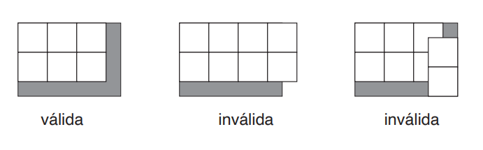

## Questões
### Coleção de Selos
Joana encontrou uma mala com a coleção de selos de correio de seu avô. Todos os selos são quadrados, com dimensões 2cm × 2cm. Ela quer organizar a coleção usando folhas retangulares de papel para colar os selos, distribuídos de forma que fiquem um ao lado do outro, com os lados dos selos paralelos aos lados da folha. Uma distribuição de selos na folha de papel é válida se não há selos sobrepostos e todos os selos estão completamente dentro da folha. Como exemplo, a figura abaixo ilustra uma distribuição válida e duas distribuições inválidas de selos.

**Questão 1:** Quantos selos é possível colar numa folha de papel de dimensões 9cm × 12cm, usando uma distribuição válida de selos?

( A ) 108

( B ) 22

( C ) 24

( D ) 30

( E ) 32

**Questão 2:** Qual das seguintes cinco folhas de papel é a folha de menor área que Joana pode usar para colar 70 selos, usando uma distribuição válida de selos?

( A ) 7cm × 10cm

( B ) 7cm × 20cm

( C ) 20cm × 8cm

( D ) 30cm × 20cm

( E ) 20cm × 15cm

### Jantar
Cinco estudantes – Ana, Bia, Carla, Diego e Eva – estão jantando numa mesa redonda de exatamente
cinco lugares. As seguintes restrições são obedecidas quanto aos lugares que ocupam na mesa:

1. Há exatamente um estudante entre Ana e Eva.
2. Bia senta-se ao lado de Diego.
3. Diego não se senta ao lado de Eva.

**Questão 3:** Qual das seguintes alternativas é uma ordem correta em que os estudantes podem sentar-se à mesa?

( A ) Ana, Bia, Diego, Carla, Eva

( B ) Ana, Diego, Bia, Eva, Carla

( C ) Ana, Diego, Carla, Eva, Bia

( D ) Ana, Carla, Eva, Diego, Bia

( E ) Ana, Bia, Carla, Diego, Eva

**Questão 4:** Qual das seguintes alternativas é sempre verdadeira?

( A ) Diego senta-se ao lado de Eva.

( B ) Carla senta-se ao lado de Bia.

( C ) Carla senta-se ao lado de Ana.

( D ) Bia senta-se ao lado de Ana.

( E ) Eva não se senta ao lado de Carla.

### Não-amigos independentes
Uma rede social permite que duas pessoas se declarem amigas. Vamos representar cada pessoa por um círculo e a relação de amizade entre duas pessoas como uma linha ligando os dois círculos que representam as pessoas.
Um conjunto independente de membros da rede social é formado por pessoas que não têm relação de amizade. A figura abaixo à esquerda mostra os membros de uma rede social. A figura abaixo ao centro mostra, com círculos pintados de preto, um possível conjunto independente, com dois membros. A figura abaixo à direita mostra um outro possível conjunto independente para a mesma rede, com três membros.

**Questão 5:** Na rede social da figura abaixo, qual o maior número de pessoas num conjunto independente?

( A ) 1

( B ) 3

( C ) 4

( D ) 6

( E ) 7

**Questão 6:** Na rede social da figura abaixo, qual o maior número de pessoas num conjunto independente?

 (A ) 4
 
( B ) 5

( C ) 6

( D ) 7

( E ) 8

### Flores
Uma floricultura está vendendo arranjos de rosas para o dia das Mães. Há cinco arranjos, um de cada uma das seguintes cores: laranja, rosa, vermelha, branca e amarela. Os arranjos são vendidos um por vez, de acordo com as seguintes restrições:

- O arranjo rosa é o primeiro, o terceiro ou o quinto a ser vendido.
- Pelo menos dois arranjos são vendidos após arranjo branco ser vendido.
- O arranjo amarelo é vendido após o arranjo laranja, com exatamente um arranjo sendo vendido entre o laranja e o amarelo.

**Questão 7:** Qual das seguintes alternativas é uma ordem correta em que os arranjos foram vendidos, do primeiro ao último?

( A ) rosa, amarela, laranja, vermelha, branca

( B ) branca, amarela, rosa, laranja, vermelha

( C ) branca, rosa, amarela, laranja, vermelha

( D ) vermelha, laranja, branca, amarela, rosa

( E ) rosa, laranja, vermelha, amarela, branca

**Questão 8:** Se o arranjo branco é o terceiro
a ser vendido, qual das seguintes alternativas é
sempre verdadeira?

( A ) O arranjo laranja é o segundo a ser vendido.

( B ) O arranjo rosa é o primeiro a ser vendido.

( C ) O arranjo rosa é o quinto a ser vendido.

( D ) O arranjo laranja é o primeiro a ser vendido.

( E ) O arranjo amarelo é o último a ser vendido.

**Questão 9:** Se o arranjo vermelho é vendido
imediatamente depois do arranjo amarelo, qual
das seguintes alternativas é sempre falsa?

( A ) O arranjo laranja é o primeiro a ser vendido.

( B ) O arranjo branco é o segundo a ser vendido.

( C ) O arranjo laranja é o terceiro a ser vendido.

( D ) O arranjo vermelho é o quinto a ser vendido.

( E ) O arranjo vermelho é o quarto a ser vendido.

**Questão 10:** Se o arranjo vermelho é o primeiro
a ser vendido, em quantas ordens diferentes os
arranjos podem ser vendidos?

( A ) 1

( B ) 2

( C ) 4

( D ) 5

( E ) 6

### Rua do Parque
Em uma rua em frente a um parque há exatamente sete casas. Cada casa é ocupada por exatamente uma de sete famílias: K, L, M, N, O, P e R. Todas as casas são do mesmo lado da rua, que tem a direção leste – oeste.
- A família R não mora na primeira ou na última casa da rua.
- A família K mora na quarta casa a partir do oeste.
- A família M é vizinha da família K.
- A família P mora numa casa ao leste das casas das famílias K e M, mas ao oeste da casa da família L.

**Questão 11:** Qual das seguintes famílias poderia ser a família que vive na casa mais ao leste?

( A )  K

( B ) M

( C ) N

( D ) P

( E ) R

**Questão 12:** Qual das seguintes famílias não
pode ser vizinha da família K?

( A ) L

( B ) N

( C ) O

( D ) P

( E ) R

**Questão 13:** Se a família M mora a oeste da família K, então as duas famílias vizinhas da família R não podem ser:

( A ) K e P

( B ) L e P

( C ) M e P

( D ) M e O

( E ) M e N

**Questão 14:** Se a família N é vizinha do ladooeste da família K, então qual das seguintes afirmações é sempre falsa?

( A ) A família O é vizinha da família N.

( B ) A família O é vizinha da família R.

( C ) A família P é vizinha da família L.

( D ) A família P é vizinha da família M.

( E ) A família R é vizinha da família N.

**Questão 15:** Se a família O mora numa casa ao leste da casa da família M, então qual das seguintes afirmações é sempre verdadeira?

( A ) A família K mora numa casa ao leste da casa da família M.

( B ) A família K mora numa casa ao oeste da casa da família R.

( C ) A família O mora numa casa ao oeste da casa da família L.

( D ) A família O mora numa casa ao leste da casa da família P.

( E ) A família O mora numa casa ao oeste da casa da família P.

## Soluções
### Coleção de Selos
Joana encontrou uma mala com a coleção de selos de correio de seu avô. Todos os selos são quadrados, com dimensões 2cm × 2cm. Ela quer organizar a coleção usando folhas retangulares de papel para colar os selos, distribuídos de forma que fiquem um ao lado do outro, com os lados dos selos paralelos aos lados da folha. Uma distribuição de selos na folha de papel é válida se não há selos sobrepostos e todos os selos estão completamente dentro da folha. Como exemplo, a figura abaixo ilustra uma distribuição válida e duas distribuições inválidas de selos.

**Questão 1:** Quantos selos é possível colar numa folha de papel de dimensões 9cm × 12cm, usando uma distribuição válida de selos?

( A ) 108

( B ) 22

**( C ) 24**

( D ) 30

( E ) 32

**Solução:**

Para esse exercício, podemos imaginar quantos selos caberiam em uma coluna na folha

Percebemos que cabem 4 selos em uma coluna (5 selos seriam 10 cm, o que ultrapassaria os limites da folha). Assim. podemos reproduzir essa coluna mais 5 vezes (6 colunas = 12cm):

**Questão 2:** Qual das seguintes cinco folhas de papel é a folha de menor área que Joana pode usar para colar 70 selos, usando uma distribuição válida de selos?

( A ) 7cm × 10cm

( B ) 7cm × 20cm

( C ) 20cm × 8cm

( D ) 30cm × 20cm

**( E ) 20cm × 15cm**

**Solução:**
Podemos repetir o raciocínio anterior para cada alternativa. Caso encontrarmos mais de uma alternativa na qual é possível distribuir os selos como pedido, devemos calcular as áreas das folhas para "desempate", escolhendo a folha de menor área.

### Jantar
Cinco estudantes – Ana, Bia, Carla, Diego e Eva – estão jantando numa mesa redonda de exatamente
cinco lugares. As seguintes restrições são obedecidas quanto aos lugares que ocupam na mesa:

1. Há exatamente um estudante entre Ana e Eva.
2. Bia senta-se ao lado de Diego.
3. Diego não se senta ao lado de Eva.

**Questão 3:** Qual das seguintes alternativas é uma ordem correta em que os estudantes podem sentar-se à mesa?

( A ) Ana, Bia, Diego, Carla, Eva

**( B ) Ana, Diego, Bia, Eva, Carla**

( C ) Ana, Diego, Carla, Eva, Bia

( D ) Ana, Carla, Eva, Diego, Bia

( E ) Ana, Bia, Carla, Diego, Eva

**Solução:**

Basta seguir as restrições do enunciado, fazendo um desenho enquanto se lê cada frase. Segue uma representação gráfica:

**Questão 4:** Qual das seguintes alternativas é sempre verdadeira?

( A ) Diego senta-se ao lado de Eva.

( B ) Carla senta-se ao lado de Bia.

**( C ) Carla senta-se ao lado de Ana.**

( D ) Bia senta-se ao lado de Ana.

( E ) Eva não se senta ao lado de Carla.

**Solução:**

No exercício anterior, temos uma sequência correta. Lendo cada alternativa, percebe-se que apenas uma acontece na sequência anterior (C).

### Não-amigos independentes
Uma rede social permite que duas pessoas se declarem amigas. Vamos representar cada pessoa por um círculo e a relação de amizade entre duas pessoas como uma linha ligando os dois círculos que representam as pessoas.
Um conjunto independente de membros da rede social é formado por pessoas que não têm relação de amizade. A figura abaixo à esquerda mostra os membros de uma rede social. A figura abaixo ao centro mostra, com círculos pintados de preto, um possível conjunto independente, com dois membros. A figura abaixo à direita mostra um outro possível conjunto independente para a mesma rede, com três membros.

**Questão 5:** Na rede social da figura abaixo, qual o maior número de pessoas num conjunto independente?

( A ) 1

( B ) 3

( C ) 4

**( D ) 6**

( E ) 7

**Solução:**
Percebe-se que temos uma pessoa centralizada, com várias outras isoladas ligadas a ela. Escolhendo qualquer uma das extremidades para começar o conjunto independente, apenas a pessoa do meio não participará (é a única diretamente ligada), totalizando 6 pessoas.

**Questão 6:** Na rede social da figura abaixo, qual o maior número de pessoas num conjunto independente?

 (A ) 4
 
( B ) 5

**( C ) 6**

( D ) 7

( E ) 8

**Solução:**
Devemos testar começar um conjunto independente com todas as pessoas. Segue um exemplo do maior conjunto independente que pode ser encontrado:

### Flores
Uma floricultura está vendendo arranjos de rosas para o dia das Mães. Há cinco arranjos, um de cada uma das seguintes cores: laranja, rosa, vermelha, branca e amarela. Os arranjos são vendidos um por vez, de acordo com as seguintes restrições:

- O arranjo rosa é o primeiro, o terceiro ou o quinto a ser vendido.
- Pelo menos dois arranjos são vendidos após arranjo branco ser vendido.
- O arranjo amarelo é vendido após o arranjo laranja, com exatamente um arranjo sendo vendido entre o laranja e o amarelo.

**Questão 7:** Qual das seguintes alternativas é uma ordem correta em que os arranjos foram vendidos, do primeiro ao último?

( A ) rosa, amarela, laranja, vermelha, branca

( B ) branca, amarela, rosa, laranja, vermelha

( C ) branca, rosa, amarela, laranja, vermelha

**( D ) vermelha, laranja, branca, amarela, rosa**

( E ) rosa, laranja, vermelha, amarela, branca

**Solução:**

Por exclusão, a D é a correta, pois:

- Na A), B), C), a amarela o arranjo amarelo é vendido antes do laranja.
- Pela segunda afirmação, a branca só pode ser a primeira, segunda ou terceira vendida (pois senão não pode-se vender dois arranjos após o branco). Logo, a E) está errada.

**Questão 8:** Se o arranjo branco é o terceiro
a ser vendido, qual das seguintes alternativas é
sempre verdadeira?

( A ) O arranjo laranja é o segundo a ser vendido.

( B ) O arranjo rosa é o primeiro a ser vendido.

( C ) O arranjo rosa é o quinto a ser vendido.

( D ) O arranjo laranja é o primeiro a ser vendido.

( E ) O arranjo amarelo é o último a ser vendido.

**Solução:**

   Se o branco é o terceiro a ser vendido:
    
- O arranjo rosa pode ser tanto o primeiro quanto o quinto. Logo, B) e C) não são sempre verdadeiras.
    
- O amarelo não pode ser o último a ser vendido, pois o laranja teria que ser o terceiro.
    
- O laranja não pode ser o primeiro, pois o amarelo teria de ser o terceiro.

Assim, sobra a A).

**Questão 9:** Se o arranjo vermelho é vendido
imediatamente depois do arranjo amarelo, qual
das seguintes alternativas é sempre falsa?

( A ) O arranjo laranja é o primeiro a ser vendido.

( B ) O arranjo branco é o segundo a ser vendido.

( C ) O arranjo laranja é o terceiro a ser vendido.

( D ) O arranjo vermelho é o quinto a ser vendido.

( E ) O arranjo vermelho é o quarto a ser vendido.

**Solução:**
O amarelo sempre é vendido duas posições a frente do laranja. Logo, o laranja deve ser o primeiro (amarelo terceiro e vermelho quarto), segundo (laranja quarto e vermelho quinto) ou terceiro arranjo (laranja quinto e vermelho sexto - IMPOSSÍVEL).
Logo, a alternativa C) é sempre falsa, pois configura uma situação impossível.

**Questão 10:** Se o arranjo vermelho é o primeiro
a ser vendido, em quantas ordens diferentes os
arranjos podem ser vendidos?

**( A ) 1**

( B ) 2

( C ) 4

( D ) 5

( E ) 6

**Solução:**
Apenas um: Vermelho, Laranja, Branco, Amarelo, Rosa.
Pode-se verificar isso tentando simular os arranjos fixando o vermelho em primeiro e o rosa em terceiro ou quinto.

### Rua do Parque
Em uma rua em frente a um parque há exatamente sete casas. Cada casa é ocupada por exatamente uma de sete famílias: K, L, M, N, O, P e R. Todas as casas são do mesmo lado da rua, que tem a direção leste – oeste.
- A família R não mora na primeira ou na última casa da rua.
- A família K mora na quarta casa a partir do oeste.
- A família M é vizinha da família K.
- A família P mora numa casa ao leste das casas das famílias K e M, mas ao oeste da casa da família L.

**Questão 11:** Qual das seguintes famílias poderia ser a família que vive na casa mais ao leste?

( A )  K

( B ) M

**( C ) N**

( D ) P

( E ) R

**Solução:**
Seguindo as afirmações para formar um possível arranjo, temos que das alternativas, N é a única que poderia ser a primeira a leste. As outras alternativas seriam O e L.

**Questão 12:** Qual das seguintes famílias não
pode ser vizinha da família K?

**( A ) L**

( B ) N

( C ) O

( D ) P

( E ) R

**Solução:**
L, pois a oeste de L, há a família P, que por sua vez, fica ao leste de M e K.\\

**Questão 13:** Se a família M mora a oeste da família K, então as duas famílias vizinhas da família R não podem ser:

( A ) K e P

( B ) L e P

**( C ) M e P**

( D ) M e O

( E ) M e N

**Solução:**
Se R estiver a oeste de M, é impossivel ter P como sua outra vizinha, e se tiver a oeste de K, é impossível ter M como sua vizinha. Assim, não podemos ter M e P simultaneamente como vizinhas de R.

**Questão 14:** Se a família N é vizinha do ladooeste da família K, então qual das seguintes afirmações é sempre falsa?

**( A ) A família O é vizinha da família N.**

( B ) A família O é vizinha da família R.

( C ) A família P é vizinha da família L.

( D ) A família P é vizinha da família M.

( E ) A família R é vizinha da família N.

**Solução:**
 Com essa configuração, só há um arranjo possível(mais à esquerda = mais a oeste/ mais à direita = mais a leste):
 
- O R N K M P L

Logo, a A) sempre é falsa.

**Questão 15:** Se a família O mora numa casa ao leste da casa da família M, então qual das seguintes afirmações é sempre verdadeira?

**( A ) A família K mora numa casa ao leste da casa da família M.**

( B ) A família K mora numa casa ao oeste da casa da família R.

( C ) A família O mora numa casa ao oeste da casa da família L.

( D ) A família O mora numa casa ao leste da casa da família P.

( E ) A família O mora numa casa ao oeste da casa da família P.

**Solução:**
 Com essa configuração, temos algumas famílias das quais temos certeza das posições(mais à esquerda = mais a oeste/ mais à direita = mais a leste): N R M K . . .
Os pontos são as posições restantes. No entanto, elas não importam. Lendo as alternativas, percebe-se que a A) é verdadeira.
