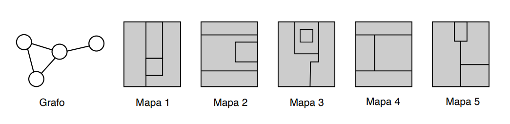
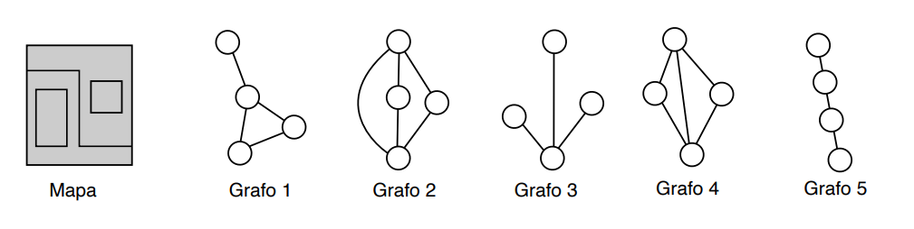
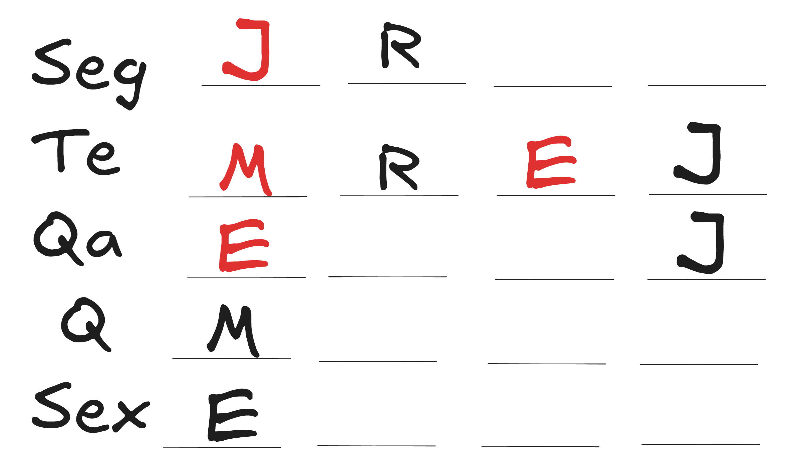

## Questões
### Corrida na Floresta
A lebre, a raposa, o sapo e a tartaruga disputaram uma corrida na floresta. A lebre cruzou a linha de chegada duas posições à frete do sapo, a tartaruga não foi a primeira nem a última a cruzar a linha de chegada e a raposa não foi a segunda a cruzar a linha de chegada.

**Questão 1:** Qual das alternativas abaixo é uma possível ordem de chegada, do primeiro ao último participante a cruzar a linha de chegada?

( A ) sapo, tartaruga, raposa, lebre

( B ) lebre, tartaruga, sapo, raposa

( C ) tartaruga, lebre, raposa, sapo

( D ) lebre, raposa, sapo, tartaruga

( E ) raposa, sapo, tartaruga, lebre

### Família Silva
Paulo e Beatriz Silva são músicos e têm vários filhos, que também estudam música. Cinco filhos tocam piano, quatro filhos tocam violão e três filhos tocam flauta.

**Questão 2:** Se cada filho toca exatamente dois instrumentos, qual o número de filhos de Paulo e
Beatriz?

( A ) 5

( B ) 6

( C ) 7

( D ) 8

( E ) 9

### Grafos

Em computação um grafo é uma estrutura composta de vértices (mostrados como círculos nas figuras abaixo) e arestas (mostradas como linhas que conectam os círculos). Grafos são utilizados para modelar uma infinidade de situações na vida real, como rodovias que existem entre cidades ou pessoas que se conhecem. Grafos podem também ser usados para modelar as divisas entre países, usando vértices para representar os países e arestas para indicar se um determinado país tem divisa com outro país: se um país A tem divisa com outro país B ligamos os dois vértices que representam
os países A e B com uma aresta.

**Questão 3:** A figura abaixo mostra um grafo e cinco mapas. O grafo
representa as divisas entrepaíses de qual dos mapas?

( A ) Mapa 1

( B ) Mapa 2

( C ) Mapa 3

( D ) Mapa 4

( E ) Mapa 5

**Questão 4:** A figura abaixo mostra um mapa e cinco grafos. Qual o grafo que representa as divisas entre países do mapa?

( A ) Grafo 1

( B ) Grafo 2

( C ) Grafo 3

( D ) Grafo 4

( E ) Grafo 5

### Os times mais queridos
Uma pesquisa foi feita na internet para saber os times de futebol preferidos dos internautas. Seis times foram incluídos na pesquisa, A, B, C, D, E e F. O resultado da pesquisa ainda não foi revelado, mas foram divulgadas as seguintes informações:

- teve menos votos do que B.
- teve mais votos do que B e menos votos do que E.
- teve mais votos do que F.
- Não houve empates nos votos dos times.

**Questão 5:** Qual das seguintes alternativas poderia ser o resultado da pesquisa, do time menos votado para o time mais votado?

( A ) D, A, F, B, C, E

( B ) F, B, E, A, C, D

( C ) D, F, B, C, A, E

( D ) D, B, F, C, A, E

( E ) F, D, C, A, B, E

**Questão 6:** Qual das seguintes alternativas é a lista de todos os times que podem ser o quarto time mais votado?

( A ) B, C

( B ) B, C, F

( C ) A, B, D

( D ) A, B, C, D

( E ) A, B, C, D, F

**Questão 7:** Se A e D estão em posições sucessivas (um imediatamente após o outro, em qualquer ordem) no resultado da pesquisa, qual das seguintes alternativas é sempre falsa?

( A ) B é o quinto mais votado.

( B ) C é o segundo mais votado.

( C ) F é o menos votado.

( D ) A é o terceiro mais votado.

( E ) E é o segundo mais votado.

**Questão 8:** Se D é o time menos votado, qual
das seguintes alternativas é sempre verdadeira?

( A ) A é o mais votado.

( B ) E é o mais votado.

( C ) C é o mais votado.

( D ) F é o quinto mais votado.

( E ) B é o terceiro mais votado.

### Show de Mágica

Um mágico está preparando um show que vai apresentar na festa de final de ano da escola. Seis mágicas diferentes, A, B, C, D, E e F, serão apresentadas no show. Cada mágica vai ser apresentada uma única vez, e as seguintes condições serão obedecidas:

\begin{itemize}
- Pelo menos duas mágicas são apresentadas após F ser apresentada, mas antes de D ser apresentada (ou seja, pelo menos duas mágicas são apresentadas entre a apresentação de F e a apresentação de D).
- Exatamente um mágica é apresentada após A, mas antes de E ser apresentada (ou seja, exatamente um mágica é apresentada entre a apresentação de A e a apresentação de E).
- B é a primeira, a terceira ou a quinta mágica a ser apresentada.

**Questão 9:** Qual das seguintes alternativas é uma possível lista das mágicas apresentadas, da primeira para a última?

( A ) A, F, E, D, B, C

( B ) B, F, C, D, A, E

( C ) E, F, A, B, C, D

( D ) D, E, C, A, B, F

( E ) C, F, B, A, D, E

**Questão 10:** Se o mágico apresentar C como a quinta mágica, qual das seguintes alternativas é sempre verdadeira?

( A ) A sexta mágica a ser apresentada é D.

( B ) A terceira mágica a ser apresentada é B.

( C ) A segunda mágica a ser apresentada é E.

( D ) A primeira mágica a ser apresentada é A.

( E ) A primeira mágica a ser apresentada é F.

**Questão 11:** Se E é apresentada imediatamente após F, qual poderia ser a segunda mágica apresentada?

( A ) C

( B ) A

( C ) B

( D ) D

( E ) E

**Questão 12:** Se F é a segunda mágica a ser apresentada, qual das seguintes afirmativas é necessariamente falsa?

( A ) C é a primeira a ser apresentada.

( B ) C é a quinta a ser apresentada.

( C ) B é a terceira a ser apresentada.

( D ) E é a quinta a ser apresentada.

( E ) D é a sexta a ser apresentada.

**Questão 13:** Cada uma das seguintes mágicas poderia ser apresentada imediatamente após B exceto:

( A ) A

( B ) C

( C ) D

( D ) F

( E ) E

### Cantinas

A escola é enorme e tem quatro cantinas, A, B, C e D, onde os alunos podem almoçar. Numa certa semana, de segunda-feira a sexta-feira, quatro estudantes, Edu, Jéssica, Marisa e Rui, vão almoçar em uma das quatro cantinas. Nenhum par desses quatro estudantes almoça na mesma cantina no
mesmo dia e as seguintes restrições devem ser obedecidas: 

- Nenhum estudante pode almoçar na mesma cantina mais do que duas vezes durante a semana.
- Marisa é a única estudante que almoça na cantina A em dois dias da semana, e um dos dias
em que ela almoça na cantina A é quinta-feira. 
- Rui almoça na cantina B na segunda-feira e na terça-feira.
- Jéssica almoça na cantina D na terça-feira e na quarta-feira.
- Edu almoça na cantina A na sexta-feira.

**Questão 14:** Qual das alternativas seguintes poderia ser a lista das cantinas em que Jéssica almoça?

( A ) Segunda: C; Terça: D; Quarta: D; Quinta: A; Sexta: B

( B ) Segunda: A; Terça: D; Quarta: D; Quinta: C; Sexta: C

( C ) Segunda: C; Terça: D; Quarta: D; Quinta: B; Sexta: C

( D ) Segunda: A; Terça: D; Quarta: D; Quinta: A; Sexta: C

( E ) Segunda: C; Terça: D; Quarta: D; Quinta: B; Sexta: B

**Questão 15:** Qual das seguintes alternativas é
sempre verdadeira?

( A ) Rui não almoça na cantina C.

( B ) Marisa almoça apenas nas cantinas A, C e D.

( C ) Todos os estudantes almoçam na cantina D.

( D ) Todos os estudantes almoçam na cantina C.

( E ) Todos os estudantes almoçam na cantina A.

**Questão 16:** Se Marisa almoça na cantina D
segunda-feira, qual das seguintes alternativas é
sempre verdadeira?

( A ) Rui almoça na cantina D na quinta-feira.

( B ) Marisa almoça na cantina B na quarta-feira.

( C ) Jéssica almoça na cantina B na sexta-feira.

( D ) Marisa almoça na cantina C na quarta-feira.

( E ) Edu almoça na cantina C na quarta-feira.

**Questão 17:** Qual das seguintes alternativas é a lista de todas as cantinas em que Rui poderia almoçar sexta-feira?

( A ) C

( B ) A

( C ) C, D

( D ) A, C

( E ) A, C, D

**Questão 18:** Se Edu almoça na cantina B duas vezes durante a semana, qual das seguintes afirmativas não pode ser verdadeira?

( A ) Edu almoça na cantina D na segunda-feira.

( B ) Marisa almoça na cantina B na quarta-feira.

( C ) Jéssica almoça na cantina C na quinta-feira.

( D ) Rui almoça na cantina D na quinta-feira.

( E ) Rui almoça na cantina D na sexta-feira.

**Questão 19:** Qual dos seguintes é o dia em que
Jéssica almoça na cantina A?

( A ) segunda-feira

( B ) terça-feira

( C ) quarta-feira

( D ) quinta-feira

( E ) sexta-feira

**Questão 20:** Se Rui almoça na cantina C na quinta-feira e Edu almoça na cantina C na segunda-feira, qual das seguintes alternativas é sempre verdadeira?

( A ) Edu almoça na cantina B na quinta-feira.

( B ) Jéssica almoça na cantina C na sexta-feira.

( C ) Marisa almoça na cantina C na quarta-feira.

( D ) Rui almoça na cantina C na sexta-feira.

( E ) Rui almoça na cantina D na sexta-feira.

## Soluções
### Corrida na Floresta
A lebre, a raposa, o sapo e a tartaruga disputaram uma corrida na floresta. A lebre cruzou a linha de chegada duas posições à frete do sapo, a tartaruga não foi a primeira nem a última a cruzar a linha de chegada e a raposa não foi a segunda a cruzar a linha de chegada.

**Questão 1:** Qual das alternativas abaixo é uma possível ordem de chegada, do primeiro ao último participante a cruzar a linha de chegada?

( A ) sapo, tartaruga, raposa, lebre

**( B ) lebre, tartaruga, sapo, raposa**

( C ) tartaruga, lebre, raposa, sapo

( D ) lebre, raposa, sapo, tartaruga

( E ) raposa, sapo, tartaruga, lebre

**Solução:**

Nesse tipo de exercício, simular as possibilidades de arranjo é o ideal. Chamamos cada um dos quatro animais pelas suas iniciais e ao ler as afirmações, podemos montar os arranjos. O primeiro, diz que a lebre cruzou a linha duas posições a frente do sapo. Assim, se o sapo foi o quarto, a lebre foi a segunda, e se o sapo foi o terceiro, a lebre foi a primeira. O sapo não pode ser o segundo nem o primeiro, pois assim, a lebre não poderia ficar em uma posição existente. Seguindo o restante das afirmações chegamos nas seguintes possibilidades(do primeiro ao último):

R L T S
ou
L T S R

A sequência prevista na alternativa B é igual à segunda póssibilidade
### Família Silva
Paulo e Beatriz Silva são músicos e têm vários filhos, que também estudam música. Cinco filhos tocam piano, quatro filhos tocam violão e três filhos tocam flauta.

**Questão 2:** Se cada filho toca exatamente dois instrumentos, qual o número de filhos de Paulo e
Beatriz?

( A ) 5

**( B ) 6**

( C ) 7

( D ) 8

( E ) 9

**Solução:**

Cada filho toca exatamente dois instrumentos. Assim, cada criança é contada duas vezes entre os grupos de instrumentos. Depois, dividimos o resultado por dois, para corrigir a contagem dupla.

5+4+3=12
12/2 = 6

A alternativa correta é a B.
### Grafos
Em computação um grafo é uma estrutura composta de vértices (mostrados como círculos nas figuras abaixo) e arestas (mostradas como linhas que conectam os círculos). Grafos são utilizados para modelar uma infinidade de situações na vida real, como rodovias que existem entre cidades ou pessoas que se conhecem. Grafos podem também ser usados para modelar as divisas entre países, usando vértices para representar os países e arestas para indicar se um determinado país tem divisa com outro país: se um país A tem divisa com outro país B ligamos os dois vértices que representam
os países A e B com uma aresta.

**Questão 3:** A figura abaixo mostra um grafo e cinco mapas. O grafo
representa as divisas entrepaíses de qual dos mapas?

Captura de tela 2024-10-10 192243.png

( A ) Mapa 1

( B ) Mapa 2

**( C ) Mapa 3**

( D ) Mapa 4

( E ) Mapa 5

**Solução:**

Observando o grafo sabemos que dois países fazem fronteira entre si e com um outro país em comum, que por sua vez, faz divisa com um último país. Esse último país só tem uma fronteira.

Analisando os mapas, percebemos que o mapa 3 corresponde a esse grafo.

**Questão 4:** A figura abaixo mostra um mapa e cinco grafos. Qual o grafo que representa as divisas entre países do mapa?

Captura de tela 2024-10-10 192430.png

( A ) Grafo 1

( B ) Grafo 2

( C ) Grafo 3

( D ) Grafo 4

**( E ) Grafo 5**

**Solução:**
Ao desenhar as fronteiras representadas no mapa, chegamos no Grafo 5.

### Os times mais queridos
Uma pesquisa foi feita na internet para saber os times de futebol preferidos dos internautas. Seis times foram incluídos na pesquisa, A, B, C, D, E e F. O resultado da pesquisa ainda não foi revelado, mas foram divulgadas as seguintes informações:

- teve menos votos do que B.
- teve mais votos do que B e menos votos do que E.
- teve mais votos do que F.
- Não houve empates nos votos dos times.

**Questão 5:** Qual das seguintes alternativas poderia ser o resultado da pesquisa, do time menos votado para o time mais votado?

( A ) D, A, F, B, C, E

( B ) F, B, E, A, C, D

**( C ) D, F, B, C, A, E**

( D ) D, B, F, C, A, E

( E ) F, D, C, A, B, E

**Solução:**

Podemos analisar as alternativas e ver qual delas segue todas as afirmações do enunciado. A única que cumpre os requisitos é a C.

**Questão 6:** Qual das seguintes alternativas é a lista de todos os times que podem ser o quarto time mais votado?

( A ) B, C

( B ) B, C, F

( C ) A, B, D

**( D ) A, B, C, D**

( E ) A, B, C, D, F

**Solução:**

F teve menos votos que B, logo F não pode ser o quarto.
C teve mais votos que B e menos votos que E, então C pode ser o quarto.
A pode estar em várias posições, inclusive a quarta.
B pode ser o quarto.
D não tem restrições claras que impeçam que seja o quarto.

Logo, D é a correta.

**Questão 7:** Se A e D estão em posições sucessivas (um imediatamente após o outro, em qualquer ordem) no resultado da pesquisa, qual das seguintes alternativas é sempre falsa?

( A ) B é o quinto mais votado.

( B ) C é o segundo mais votado.

( C ) F é o menos votado.

( D ) A é o terceiro mais votado.

**( E ) E é o segundo mais votado.**

**Solução:**

Se E é o segundo mais votado, fica impossível que A e D estejam em posições sucessivas. Logo, a alternativa E) é impossível.

**Questão 8:** Se D é o time menos votado, qual
das seguintes alternativas é sempre verdadeira?

( A ) A é o mais votado.

( B ) E é o mais votado.

( C ) C é o mais votado.

**( D ) F é o quinto mais votado.**

( E ) B é o terceiro mais votado.

**Solução:**

Tirando D, sabemos que todos os outros estão à frente de F. Logo, D) é a correta.

### Show de Mágica

Um mágico está preparando um show que vai apresentar na festa de final de ano da escola. Seis mágicas diferentes, A, B, C, D, E e F, serão apresentadas no show. Cada mágica vai ser apresentada uma única vez, e as seguintes condições serão obedecidas:

- Pelo menos duas mágicas são apresentadas após F ser apresentada, mas antes de D ser apresentada (ou seja, pelo menos duas mágicas são apresentadas entre a apresentação de F e a apresentação de D).
- Exatamente um mágica é apresentada após A, mas antes de E ser apresentada (ou seja, exatamente um mágica é apresentada entre a apresentação de A e a apresentação de E).
- B é a primeira, a terceira ou a quinta mágica a ser apresentada.

**Questão 9:** Qual das seguintes alternativas é uma possível lista das mágicas apresentadas, da primeira para a última?

( A ) A, F, E, D, B, C

( B ) B, F, C, D, A, E

( C ) E, F, A, B, C, D

( D ) D, E, C, A, B, F

**( E ) C, F, B, A, D, E**

**Solução:**
Devemos seguir as afirmações e buscar simular as possibilidades de listas. Pela primeira afirmação. Sabemos que:

F _ _ D _ _  ou
 _ F _ _ D_ ou
 _ _ F _ _ D

Pela segunda, existe o possível arranjo:
\begin{center}

_ F _ A D E

Por fim, pela última, temos:

C F B A D E
B F C A D E

Uma dessas combinações está relacionada na alternativa E). Apesar disso, não é a única possível.

**Questão 10:** Se o mágico apresentar C como a quinta mágica, qual das seguintes alternativas é sempre verdadeira?

**( A ) A sexta mágica a ser apresentada é D.**

( B ) A terceira mágica a ser apresentada é B.

( C ) A segunda mágica a ser apresentada é E.

( D ) A primeira mágica a ser apresentada é A.

( E ) A primeira mágica a ser apresentada é F.

**Solução:**
Considerando as afirmações anteriores e a nova condição, temos:

F _ _ D C _ (descartamos, pois torna a segunda afirmação do enunciado impossível) ou
_ _ F _ C D

A partir da segunda possibilidade podemos desenvolver o restante, obtendo: B A F E C D.
Logo, a alternativa correta é a A.

**Questão 11:** Se E é apresentada imediatamente após F, qual poderia ser a segunda mágica apresentada?

( A ) C

**( B ) A**

( C ) B

( D ) D

( E ) E

**Solução:**
Seguindo as afirmações e a condição dessa questão, só há uma possibilidade: B A F E C D. Todas as outras descumprem as regras. Assim, a correta é a alternativa B).

**Questão 12:** Se F é a segunda mágica a ser apresentada, qual das seguintes afirmativas é necessariamente falsa?

( A ) C é a primeira a ser apresentada.

**( B ) C é a quinta a ser apresentada.**

( C ) B é a terceira a ser apresentada.

**( D ) E é a quinta a ser apresentada.**

**( E ) D é a sexta a ser apresentada.**

**Solução:**
Simulando as possibilidades como nas questões anteriores, obtemos duas possibilidades:

B F C A D E
C F B A D E

Assim, há três alternativas possíveis: B), D), E).

**Questão 13:** Cada uma das seguintes mágicas poderia ser apresentada imediatamente após B exceto:

( A ) A

**( B ) C**

( C ) D

( D ) F

**( E ) E**

**Solução:**
Se simularmos todas as possibilidades, temos que as letras que nunca sucedem B são: C e E. Alternativas B) e E).

### Cantinas
A escola é enorme e tem quatro cantinas, A, B, C e D, onde os alunos podem almoçar. Numa certa semana, de segunda-feira a sexta-feira, quatro estudantes, Edu, Jéssica, Marisa e Rui, vão almoçar em uma das quatro cantinas. Nenhum par desses quatro estudantes almoça na mesma cantina no
mesmo dia e as seguintes restrições devem ser obedecidas: 

- Nenhum estudante pode almoçar na mesma cantina mais do que duas vezes durante a semana.
- Marisa é a única estudante que almoça na cantina A em dois dias da semana, e um dos dias
em que ela almoça na cantina A é quinta-feira. 
- Rui almoça na cantina B na segunda-feira e na terça-feira.
- Jéssica almoça na cantina D na terça-feira e na quarta-feira.
- Edu almoça na cantina A na sexta-feira.

**Questão 14:** Qual das alternativas seguintes poderia ser a lista das cantinas em que Jéssica almoça?

( A ) Segunda: C; Terça: D; Quarta: D; Quinta: A; Sexta: B

**( B ) Segunda: A; Terça: D; Quarta: D; Quinta: C; Sexta: C**

( C ) Segunda: C; Terça: D; Quarta: D; Quinta: B; Sexta: C

( D ) Segunda: A; Terça: D; Quarta: D; Quinta: A; Sexta: C

( E ) Segunda: C; Terça: D; Quarta: D; Quinta: B; Sexta: B

**Solução:**
Para todas as questões nessa tarefa, precisaremos das seguintes deduções (a escrita em preto vieram a partir das regras iniciais e a vermelha são deduções)

**Questão 15:** Qual das seguintes alternativas é
sempre verdadeira?

( A ) Rui não almoça na cantina C.

( B ) Marisa almoça apenas nas cantinas A, C e D.

( C ) Todos os estudantes almoçam na cantina D.

( D ) Todos os estudantes almoçam na cantina C.

**( E ) Todos os estudantes almoçam na cantina A.**

**Solução:**

Seguindo as restrições, deduzimos que na cantina A:

- Jéssica come na segunda;
- Marisa come na terça;
- Rui come na quarta;
- Marisa come na quinta;
- Edu come na sexta.

Logo, todos os alunos comem na cantina A.

**Questão 16:** Se Marisa almoça na cantina D
segunda-feira, qual das seguintes alternativas é
sempre verdadeira?

( A ) Rui almoça na cantina D na quinta-feira.

( B ) Marisa almoça na cantina B na quarta-feira.

( C ) Jéssica almoça na cantina B na sexta-feira.

**( D ) Marisa almoça na cantina C na quarta-feira.**

( E ) Edu almoça na cantina C na quarta-feira.

**Solução:**
Podemos pensar em todas as combinações possíveis e analisá-las.Perceberemos que Marisa sempre almoça na cantina C na quarta.

**Questão 17:** Qual das seguintes alternativas é a lista de todas as cantinas em que Rui poderia almoçar sexta-feira?

( A ) C

( B ) A

**( C ) C, D**

( D ) A, C

( E ) A, C, D

**Solução:**

Apenas com as deduções iniciais a partir das afirmações, podemos chegar na alternativa C

**Questão 18:** Se Edu almoça na cantina B duas vezes durante a semana, qual das seguintes afirmativas não pode ser verdadeira?

( A ) Edu almoça na cantina D na segunda-feira.

**( B ) Marisa almoça na cantina B na quarta-feira.**

( C ) Jéssica almoça na cantina C na quinta-feira.

( D ) Rui almoça na cantina D na quinta-feira.

( E ) Rui almoça na cantina D na sexta-feira.

**Solução:**

As depois das deduções iniciais e da informação de que Edu come na cantina B duas vezes na semana, chegamos à conclusão de que esses dias são quarta e quinta. Logo, é impossível Marisa almoçar na cantina B na quarta.

**Questão 19:** Qual dos seguintes é o dia em que
Jéssica almoça na cantina A?

**( A ) segunda-feira**

( B ) terça-feira

( C ) quarta-feira

( D ) quinta-feira

( E ) sexta-feira

**Solução:**
Ao olhar a imagem no início da tarefa, obtemos a resposta.

**Questão 20:** Se Rui almoça na cantina C na quinta-feira e Edu almoça na cantina C na segunda-feira, qual das seguintes alternativas é sempre verdadeira?

( A ) Edu almoça na cantina B na quinta-feira.

( B ) Jéssica almoça na cantina C na sexta-feira.

**( C ) Marisa almoça na cantina C na quarta-feira.**

( D ) Rui almoça na cantina C na sexta-feira.

( E ) Rui almoça na cantina D na sexta-feira.

**Solução:**

Resolução similar à da questão 16.
