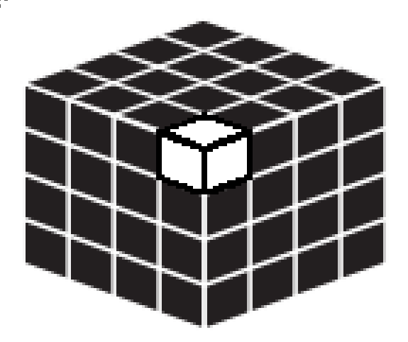

## Questões

### Grafos
Em computação um grafo é uma estrutura composta de vértices que podem ser conectados por arestas. As figuras (a) e (b) abaixo mostram exemplos de grafos, onde círculos representam vértices e as linhas que conectam os círculos representam arestas. Grafos são utilizados para modelar uma infinidade de situações na vida real, como estradas que existem entre cidades (cidades são vértices e estradas são arestas) ou pessoas que se conhecem (pessoas são vértices e uma aresta entre duas pessoas indica elas se conhecem).

Na figura (c) abaixo, um grafo é utilizado para representar cidades (vértices, de A a F) e as estradas que ligam essas cidades (arestas). Não há outras estradas além das mostradas. Cada estrada tem exatamente uma ponte, com o peso máximo permitido para utilizá-la mostrado na figura, em toneladas. Um caminhão com peso x somente pode utilizar estradas que tenham pontes com o peso máximo permitido igual ou superior a x.

**Questão 1.** Qual o número mínimo de pontesque um caminhão com peso de 12 toneladas deve atravessar para ir de D a C?
( A ) 2

( B ) 3

( C ) 4

( D ) 5

( E ) 6

**Questão 2.** Se a estrada entre D e E estiver interrompida e não puder ser usada, qual o peso máximo, em toneladas, de um caminhão que precise ir de F para D?

( A ) 10

( B ) 11

( C ) 12

( D ) 25

( E ) 20

### Independente

Em grafos (veja a tarefa anterior), se existe uma aresta entre um par de vértices A e B, dizemos que A e B são vizinhos. Um conjunto de vértices V de um grafo é chamado de **conjunto independente** se, para todo par de vértices (A, B) de V, os vértices A e B não são vizinhos. Note que um conjunto com apenas um vértice é um conjunto independente. Nas figuras (b), (c) e (d) abaixo, os vértices pretos mostram possíveis conjuntos independentes do grafo mostrado na figura (a).

Considere o grafo abaixo:

**Questão 3.** Qual das alternativas seguintes **não** é um conjunto independente de vértices do grafo da figura acima?

( A ) A  

( B ) A, B, H  

( C ) A, D, H  

( D ) A, D, G  

( E ) A, E, F  

---

**Questão 4.** Qual o número de vértices do maior conjunto independente do grafo da figura acima?

( A ) 2  

( B ) 3  

( C ) 4  

( D ) 5  

( E ) 6  

### Cubo Preto

Um cubo de madeira de 4 cm (ou seja, dimensões 4 × 4 × 4 centímetros) é todo pintado de preto e então cortado em cubinhos de tamanho 1 cm (ou seja, dimensões 1 × 1 × 1 centímetro). Após o corte, alguns cubinhos terão exatamente três faces pintadas de preto, alguns terão exatamente duas faces pintadas de preto, alguns terão exatamente uma face pintada de preto e alguns não terão qualquer face pintada de preto.

**Questão 5.** Qual o número de cubinhos que terão três faces pintadas de preto?

( A ) 2  

( B ) 4  

( C ) 6  

( D ) 8  

( E ) 16  

**Questão 6.** Qual o número de cubinhos que não terão qualquer face pintada de preto?

( A ) 4  

( B ) 8  

( C ) 16  

( D ) 20  

( E ) 24  

### Entregas de Queijo

Um fabricante de queijos faz exatamente uma entrega para cada um de cinco restaurantes, cujos nomes vamos abreviar por **F, G, H, K, L**. As entregas são feitas uma por vez, uma após a outra, em alguma ordem, obedecendo às seguintes condições:

- A entrega para **G** é feita em algum momento antes da entrega para **K**.
- A entrega para **L** é feita em algum momento antes da entrega para **H**.
- A entrega para **F** é feita em algum momento antes da entrega para **G**.

### Questão 7  

Qual das seguintes alternativas é uma ordem em que as entregas poderiam ser feitas, da primeira para a última?

( A ) L, F, K, H, G  

( B ) L, H, F, G, K

( C ) F, G, K, H, L  

( D ) F, K, H, G, L  

( E ) G, F, K, H, L  

### Questão 8  

Se a quarta entrega é para **H**, então qual das seguintes alternativas é sempre verdadeira?

( A ) A primeira entrega é para F.  

( B ) A segunda entrega é para G.  

( C ) A terceira entrega é para G.  

( D ) A quarta entrega é para K.

( E ) A quinta entrega é para K.

### Questão 9  

Se a entrega para **L** é feita após a entrega para **G**, então qual das alternativas poderia ser verdadeira?

( A ) A primeira entrega é para K.  

( B ) A segunda entrega é para F.  

( C ) A terceira entrega é para K.

( D ) A quarta entrega é para G.  

( E ) A última entrega é para L.  

### Questão 10  

Qual das seguintes alternativas é sempre falsa?

( A ) A primeira entrega é para F.

( B ) A segunda entrega é para G.

( C ) A quarta entrega é para L.

( D ) A quinta entrega é para L..

( E ) A quinta entrega é para K.

### Bolo da Vó

Vó Zinha faz um delicioso bolo gelado com exatamente seis camadas de sabores: abacaxi, baunilha, coco, limão, morango e nozes. Há exatamente uma camada inicial (a primeira), abaixo de todas as outras, e cada uma das camadas seguintes (da segunda à sexta) cobre completamente a camada imediatamente abaixo. Ao montar o bolo, Vó Zinha obedece às seguintes condições:

- A camada de limão não é colocada imediatamente acima nem imediatamente abaixo da camada de morango.
- A camada de baunilha é colocada imediatamente acima da camada de abacaxi.
- A camada de coco é colocada em alguma posição acima da camada de baunilha.
- A camada de morango é colocada em alguma posição acima da camada de coco.

**Questão 11.** Qual das seguintes alternativas poderia ser a lista das camadas do bolo, de baixo para cima?

( A ) abacaxi, baunilha, coco, morango, nozes, limão

( B ) abacaxi, baunilha, coco, morango, limão, nozes

( C ) baunilha, abacaxi, limão, nozes, coco, morango

( D ) limão, abacaxi, baunilha, nozes, morango, coco

( E ) limão, coco, abacaxi, baunilha, morango, nozes

**Questão 12.** Se a camada de morango não é colocada imediatamente acima da camada de coco, então qual das alternativas seguintes poderia ser verdadeira?

( A ) A camada de limão é imediatamente acima da camada de nozes.

( B ) A camada de limão é imediatamente acima da camada de coco.

( C ) A camada de limão é imediatamente abaixo da camada de baunilha.

( D ) A segunda camada é de limão.

( E ) A sexta camada é de limão.

**Questão 13.** Se a sexta camada não é morango, então qual das alternativas seguintes é a lista completa das camadas que poderiam ser nozes?

( A ) primeira, segunda, terceira, quarta, quinta, sexta

( B ) segunda, terceira, quarta, quinta, sexta

( C ) terceira, quarta, quinta, sexta

( D ) quarta, quinta, sexta

( E ) quinta, sexta

**Questão 14.** Se a terceira camada é de abacaxi, então qual das alternativas seguintes poderia ser verdadeira?

( A ) A quinta camada é de nozes.

( B ) A camada de nozes é imediatamente acima da camada de limão.

( C ) A camada de coco não é imediatamente acima da camada de baunilha.

( D ) A camada de limão é imediatamente acima da camada de baunilha.

( E ) A sexta camada não é de morango.

**Questão 15.** Qual das seguintes alternativas poderia ser a primeira e a segunda camada, de baixo para cima, respectivamente?

( A ) abacaxi, limão

( B ) nozes, limão

( C ) baunilha, limão

( D ) limão, baunilha

( E ) limão, morango

## Solução

### Grafos - 2023

Em computação, um grafo é uma estrutura composta de vértices que podem ser conectados por arestas. As figuras (a) e (b) abaixo mostram exemplos de grafos, onde círculos representam vértices e as linhas que conectam os círculos representam arestas. Grafos são utilizados para modelar uma infinidade de situações na vida real, como estradas que existem entre cidades (cidades são vértices e estradas são arestas) ou pessoas que se conhecem (pessoas são vértices e uma aresta entre duas pessoas indica que elas se conhecem).

Na figura (c) abaixo, um grafo é utilizado para representar cidades (vértices, de A a F) e as estradas que ligam essas cidades (arestas). Não há outras estradas além das mostradas. Cada estrada tem exatamente uma ponte, com o peso máximo permitido para utilizá-la mostrado na figura, em toneladas. Um caminhão com peso x somente pode utilizar estradas que tenham pontes com o peso máximo permitido igual ou superior a x.

**Questão 1.** Qual o número mínimo de pontes que um caminhão com peso de 12 toneladas deve atravessar para ir de D a C?

- (A) 2
- (B) 3
- **(C) 4**
- (D) 5
- (E) 6

**Solução:** Como o peso do caminhão é de 12 toneladas, ele não consegue atravessar a ponte de A para C, e nem de B para C. Ao fazer o menor caminho, a ordem deveria ser de D → E → B → C, atravessando apenas 3 pontes. Porém, como foi comentado antes, a ponte de B para C não é permitido atravessar. Dessa forma, o caminho que deve ser utilizado é de D → E → B → F → C, **utilizando 4 pontes**.

**Questão 2.** Se a estrada entre D e E estiver interrompida e não puder ser usada, qual o peso máximo, em toneladas, de um caminhão que precise ir de F para D?

- (A) 10
- (B) 11
- **(C) 12**
- (D) 25
- (E) 20

**Solução:** Tendo em mente que a estrada entre D e E está interrompida, ao montar um novo caminho de F para D, vamos seguir o caminho F → B → A → D, evitando a cidade E. Desse caminho, o menor peso máximo permitido é de 12 toneladas (do vértice B ao A). Então, para que o caminhão consiga atravessar esse caminho, seu peso deve ser de no máximo 12 toneladas.

### Independente

Em grafos (veja a tarefa anterior), se existe uma aresta entre um par de vértices A e B, dizemos que A e B são vizinhos. Um conjunto de vértices V de um grafo é chamado de conjunto independente se, para todo par de vértices (A, B) de V, os vértices A e B não são vizinhos. Note que um conjunto com apenas um vértice é um conjunto independente. Nas figuras (b), (c) e (d) abaixo, os vértices pretos mostram possíveis conjuntos independentes do grafo mostrado na figura (a).

Considere o grafo abaixo:

**Questão 3:** Qual das alternativas seguintes não é um conjunto independente de vértices do grafo da figura acima?

- (A) A
- (B) A, B, H
- (C) A, D, H
- **(D) A, D, G**
- (E) A, E, F

**Solução:** Como visto no enunciado, para um conjunto de vértices ser independente, eles não podem ser vizinhos, ou seja, estarem conectados por uma aresta. Ao analisar todas as alternativas, os vértices D e G são vizinhos, fazendo então que o conjunto (A, D, G) da alternativa D não seja um conjunto independente.

**Questão 4:** Qual o número de vértices do maior conjunto independente do grafo da figura acima?

- (A) 2
- (B) 3
- (C) 4
- (D) 5
- **(E) 6**

**Solução:** Para solucionar essa questão, é possível se basear nos exemplos da questão anterior e também perceber que o melhor jeito de pegar vértices independentes são os das extremidades, onde possuem apenas um vizinho. Dessa forma, podemos fazer o seguinte desenho com 6 vértices do conjunto independente do grafo.

### Cubo Preto

Um cubo de madeira de 4 cm (ou seja, dimensões 4 x 4 x 4 centímetros) é todo pintado de preto e então cortado em cubinhos de tamanho 1 cm (ou seja, dimensões 1 x 1 x 1 centímetro). Após o corte, alguns cubinhos terão exatamente três faces pintadas de preto, alguns terão exatamente duas faces pintadas de preto, alguns terão exatamente uma face pintada de preto e alguns não terão qualquer face pintada de preto.

**Questão 5:** Qual o número de cubinhos que terão três faces pintadas de preto?

- (A) 2
- (B) 4
- (C) 6
- **(D) 8**
- (E) 16

**Solução:** Analisando o cubo 4x4x4, podemos ver que os únicos cubinhos que mostram três faces são os vértices do cubo, sendo assim 8 cubinhos que possuem três faces pintadas de preto.

**Questão 6:** Qual o número de cubinhos que não terão qualquer face pintada de preto?

- (A) 4
- **(B) 8**
- (C) 16
- (D) 20
- (E) 24

**Solução:** Os únicos cubinhos que não foram pintados de preto são os que não estão expostos, ou seja, estão no meio do cubo. Nessa questão, para desconsiderarmos a parte exposta, vamos subtrair 2 da formação do cubo. Então, 4x4x4 vai virar 2x2x2. Realizando a multiplicação, temos 8 cubinhos que não tiveram qualquer face pintada de preto.

### Entregas de Queijo

Um fabricante de queijos faz exatamente uma entrega para cada um de cinco restaurantes, cujos nomes vamos abreviar por F, G, H, K, L. As entregas são feitas uma por vez, uma após a outra, em alguma ordem, obedecendo às seguintes condições:

- A entrega para G é feita em algum momento antes da entrega para K.
- A entrega para L é feita em algum momento antes da entrega para H.
- A entrega para F é feita em algum momento antes da entrega para G.

**Questão 7.** Qual das seguintes alternativas é uma ordem em que as entregas poderiam ser feitas, da primeira para a última?

- (A) L, F, K, H, G
- **(B) L, H, F, G, K**
- (C) F, G, K, H, L
- (D) F, K, H, G, L
- (E) G, F, K, H, L

**Solução:**
Ao escrevermos as condições de maneira simples e otimizando-as, chegamos na seguinte tabela:

Aplicando essas condições nas alternativas dadas, chegamos ao resultado **(B) L, H, F, G, K**, que se comporta exatamente como desenhamos.

**Questão 8.** Se a quarta entrega é para H, então qual das seguintes alternativas é sempre verdadeira?

- (A) A primeira entrega é para F.
- (B) A segunda entrega é para G.
- (C) A terceira entrega é para G.
- (D) A quarta entrega é para K.
- **(E) A quinta entrega é para K.**

**Solução:**
Seguindo as condições que desenhamos na questão anterior, sabendo que H foi a quarta entrega, pelo menos L já foi entregue, sobrando duas entregas que não sabemos de quem foram. Se analisarmos novamente, F nem G podem ter sido entregues antes de H, pois isso quebraria a condição e a ordem de entrega, sobrando apenas que K é a quinta e última entrega.

**Questão 9.** Se a entrega para L é feita após a entrega para G, então qual das alternativas poderia ser verdadeira?

- (A) A primeira entrega é para K.
- (B) A segunda entrega é para F.
- **(C) A terceira entrega é para K.**
- (D) A quarta entrega é para G.
- (E) A última entrega é para L.

**Solução:**
Se a entrega de L foi feita apenas após a entrega de G, pelas condições significa que F e G já foram entregues nessa ordem, eliminando as duas primeiras alternativas. Analisando outras opções, as últimas duas alternativas também estão erradas, já que se G for a quarta entrega, vai faltar a entrega de K, L e H ainda, e L não pode ser a última entrega por precisar ser entregue antes de H, sobrando apenas a alternativa **(C)** como uma possível alternativa verdadeira.

**Questão 10.** Qual das seguintes alternativas é sempre falsa?

- (A) A primeira entrega é para F.
- (B) A segunda entrega é para G.
- (C) A quarta entrega é para L.
- **(D) A quinta entrega é para L.**
- (E) A quinta entrega é para K.

**Solução:**
Essa questão continua seguindo o mesmo padrão das outras, então novamente analisamos as condições que desenhamos. Sabendo que a quinta entrega é a última, o H não pode ser entregue antes do L, então o L nunca pode ser a quinta entrega, sendo assim a alternativa **(D) A quinta entrega é para L** é sempre falsa.

### Bolo da Vó

Vó Zinha faz um delicioso bolo gelado com exatamente seis camadas de sabores: abacaxi, baunilha, coco, limão, morango e nozes. Há exatamente uma camada inicial (a primeira), abaixo de todas as outras, e cada uma das camadas seguintes (da segunda à sexta) cobre completamente a camada imediatamente abaixo. Ao montar o bolo, Vó Zinha obedece às seguintes condições:

- A camada de limão não é colocada imediatamente acima nem imediatamente abaixo da camada de morango.
- A camada de baunilha é colocada imediatamente acima da camada de abacaxi.
- A camada de coco é colocada em alguma posição acima da camada de baunilha.
- A camada de morango é colocada em alguma posição acima da camada de coco.

**Questão 11.** Qual das seguintes alternativas poderia ser a lista das camadas do bolo, de baixo para cima?

- **(A) abacaxi, baunilha, coco, morango, nozes, limão**
- (B) abacaxi, baunilha, coco, morango, limão, nozes
- (C) baunilha, abacaxi, limão, nozes, coco, morango
- (D) limão, abacaxi, baunilha, nozes, morango, coco
- (E) limão, coco, abacaxi, baunilha, morango, nozes

**Solução:**
Desenhando as ordens das camadas que nos foi dado, podemos desenhar da seguinte maneira, com os "..." significando que podem haver ou não outras camadas entre as duas desenhadas, e deixando claro que limão não pode encostar no morango:

Seguindo essa ordem e colocando a camada de nozes que sobrou entre o morango e o limão para eles não encostarem, chegamos na alternativa **(A) abacaxi, baunilha, coco, morango, nozes, limão**.

**Questão 12.** Se a camada de morango não é colocada imediatamente acima da camada de coco, então qual das alternativas seguintes poderia ser verdadeira?

- (A) A camada de limão é imediatamente acima da camada de nozes.
- **(B) A camada de limão é imediatamente acima da camada de coco.**
- (C) A camada de limão é imediatamente abaixo da camada de baunilha.
- (D) A segunda camada é de limão.
- (E) A sexta camada é de limão.

**Solução:**
Se a ordem de camadas não for igual a da alternativa correta da questão anterior, podemos analisar outros casos. Limão não pode ser imediatamente acima das nozes se não vai encostar com o morango, e baunilha e abacaxi não podem se separar, tornando as alternativas (A), (C) e (D) falsas. Se o limão for a sexta camada, as ordens não vão ter sido trocadas e morango vai continuar imediatamente acima do coco. Dessa forma, a alternativa **(B) A camada de limão é imediatamente acima da camada de coco.** é a única que poderia ser verdadeira.

**Questão 13.** Se a sexta camada não é morango, então qual das alternativas seguintes é a lista completa das camadas que poderiam ser nozes?

- (A) primeira, segunda, terceira, quarta, quinta, sexta
- (B) segunda, terceira, quarta, quinta, sexta
- (C) terceira, quarta, quinta, sexta
- (D) quarta, quinta, sexta
- **(E) quinta, sexta**

**Solução:**
Se a sexta camada não é de morango, para respeitar a condição de que ele e o limão não podem se tocar, ele pode estar na quarta posição com o limão na sexta posição, ou na quinta posição com o limão abaixo do coco. Imaginando essas situações com base no desenho da questão anterior, as nozes podem estar na quinta posição se o limão for a sexta ou as nozes podem estar na sexta posição se o limão estiver abaixo do coco.

**Questão 14.** Se a terceira camada é de abacaxi, então qual das alternativas seguintes poderia ser verdadeira?

- (A) A quinta camada é de nozes.
- **(B) A camada de nozes é imediatamente acima da camada de limão.**
- (C) A camada de coco não é imediatamente acima da camada de baunilha.
- (D) A camada de limão é imediatamente acima da camada de baunilha.
- (E) A sexta camada não é de morango.

**Solução:**
A partir da camada de abacaxi, as outras camadas seguem uma espécie de escada, onde a baunilha é logo depois do abacaxi, o coco deve estar acima da baunilha e o morango acima do coco. A questão falou que a terceira camada é de abacaxi, então seguindo essa escada só sobrou as duas primeiras camadas para limão e nozes. Analisando as alternativas, a única que se encaixa é a **(B)**.

**Questão 15.** Qual das seguintes alternativas poderia ser a primeira e a segunda camada, de baixo para cima, respectivamente?

- (A) abacaxi, limão
- **(B) nozes, limão**
- (C) baunilha, limão
- (D) limão, baunilha
- (E) limão, morango

**Solução:**
Reutilizando as condições relembradas da questão anterior, onde a partir da camada de abacaxi, as outras camadas seguem uma espécie de escada, onde a baunilha é logo depois do abacaxi, o coco deve estar acima da baunilha e o morango acima do coco. Com isso em mente, é possível eliminar as alternativas (A), (C) e (D). Com a condição de que limão e morango não podem ficar juntos, elimina-se também a (E), sobrando a alternativa **(B)** como correta.

### Whatsapp

Durante as férias, Sílvia recebe várias mensagens de Whatsapp, cada mensagem de um de três colegas de escola: Heitor, Júlia e Lia. Sílvia recebe ao menos uma e no máximo duas mensagens de cada colega. No máximo uma mensagem é enviada por dia. Sílvia recebe cada mensagem no mesmo dia em que foi enviada. As mensagens são recebidas de maneira consistente com as seguintes condições:

- A primeira mensagem não é de Lia.
- A primeira e a última mensagem são ambas da mesma pessoa.
- Exatamente uma vez Sílvia recebe uma mensagem de Júlia no dia seguinte ao dia em que recebe uma mensagem de Heitor.
- Das três primeiras mensagens, exatamente uma é de Júlia.

**Questão 16.** Qual das seguintes alternativas poderia ser a lista das mensagens que Sílvia recebe, identificada pela pessoa que envia a mensagem e listada na ordem em que são recebidas?

- (A) Lia, Heitor, Júlia, Heitor, Júlia, Lia
- (B) Júlia, Lia, Heitor, Lia, Júlia
- (C) Júlia, Lia, Heitor, Júlia, Heitor
- **(D) Júlia, Lia, Heitor, Heitor, Júlia**
- (E) Heitor, Lia, Lia, Júlia, Júlia, Heitor

**Solução:**
O exercício nos conta que uma vez por dia a Sílvia recebe uma mensagem de seus colegas. Analisando as condições, podemos eliminar as alternativas (A) e (C), já que Lia não pode ser a primeira mandando mensagem e as primeiras e as últimas mensagens devem ser da mesma pessoa. Podemos eliminar as alternativas restantes pela condição "Uma vez quando Sílvia recebe uma mensagem de Heitor, a próxima é de Júlia", fazendo com que a única que cumpra isso seja a letra **(D)**.

**Questão 17.** Qual é o número máximo de mensagens que Sílvia recebe após a primeira mensagem de Júlia mas antes da primeira mensagem de Heitor?

- (A) zero
- (B) uma
- **(C) duas**
- (D) três
- (E) quatro

**Solução:**
Vamos começar com a Júlia para conseguir ver o número máximo antes que chegue o Heitor, e podemos colocar a Lia duas vezes já que nos foi dito que o máximo de mensagens é dois. Dessa forma, poderíamos colocar Júlia novamente antes do Heitor, mas a condição nos obriga a colocá-la como a última mensagem, já que também foi a primeira, deixando a ordem da seguinte maneira:

- Júlia, Lia, Lia, Heitor, Júlia

Então a alternativa correta é a **(C)**, com duas mensagens entre a Júlia e o Heitor.

**Questão 18.** Se Sílvia recebe exatamente quatro mensagens, então qual das seguintes alternativas é sempre verdadeira?

- **(A) Exatamente uma mensagem é de Lia.**
- (B) Exatamente duas mensagens são de Júlia.
- (C) A segunda mensagem é de Lia.
- (D) A terceira mensagem é de Heitor.
- (E) A quarta mensagem é de Júlia.

**Solução:**
Para solucionar essa questão, podemos construir dois possíveis caminhos com Júlia e Heitor sendo os primeiros a mandar mensagem, já que a Lia nunca é a primeira.

- Júlia, *, *, Júlia
- Heitor, Júlia, *, Heitor

Com * são possíveis mensagens, por enquanto obedecendo às condições de começar e terminar com a mesma pessoa e a Júlia mandar mensagem após o Heitor. Lembrando da condição que cada amigo deve mandar pelo menos uma mensagem, então as possíveis listas ficam da seguinte forma:

- Júlia, Lia, Heitor, Júlia
- Heitor, Júlia, Lia, Heitor

Analisando as alternativas dadas, a única que é verdadeira em ambas as listas é a alternativa **(A)**.

**Questão 19.** Se Sílvia recebe seis mensagens, sendo a quinta de Lia, então qual das seguintes alternativas é sempre verdadeira?

- (A) A primeira mensagem é de Júlia.
- (B) A segunda mensagem é de Lia.
- (C) A terceira mensagem é de Heitor.
- **(D) A quarta mensagem é de Júlia.**
- (E) A sexta mensagem é de Lia.

**Solução:**
Novamente vamos criar possíveis listas com as informações que temos, que nesse caso são seis mensagens no total e a quinta deve ser a Lia, logo:

- Júlia, *, *, *, Lia, Júlia
- Heitor, Júlia, *, *, Lia, Heitor

O único problema é que a primeira lista está violando uma das condições, que é de pelo menos uma vez a Júlia vir logo depois do Heitor, então ele quem deveria estar na quinta posição em vez da Lia, tornando a primeira lista falsa. Então, vamos usar a segunda para analisar as alternativas. Lembrando da condição que das primeiras três mensagens, apenas uma é de Júlia, forçando Lia a ser a terceira mensagem, sobrando a Júlia a ser a quarta, resultando na alternativa **(D)**.

**Questão 20.** Se Sílvia recebe duas mensagens de Lia, qual é o maior número de mensagens que ela recebe após a primeira mensagem de Lia mas antes da última mensagem de Lia?

- (A) zero
- **(B) uma**
- (C) duas
- (D) três
- (E) quatro

**Solução:**
Como Lia não pode começar as listas, elas vão ser:

- Júlia, Lia, Heitor, Lia, Heitor, Júlia
- Heitor, Júlia, Lia, Júlia, Lia, Heitor

As listas foram feitas baseadas nas respostas anteriores, nas condições estabelecidas e tentando fazer com que as duas mensagens de Lia sejam o mais longe possível uma da outra. Nas duas listas, o maior número de mensagens entre as duas de Lia é apenas um, então a resposta **(B)** está correta.

